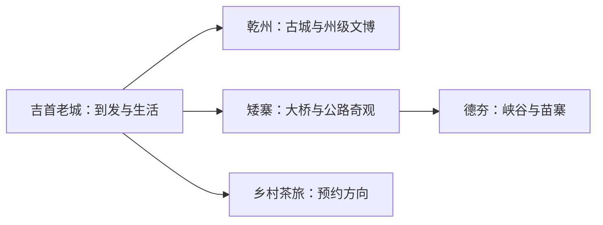
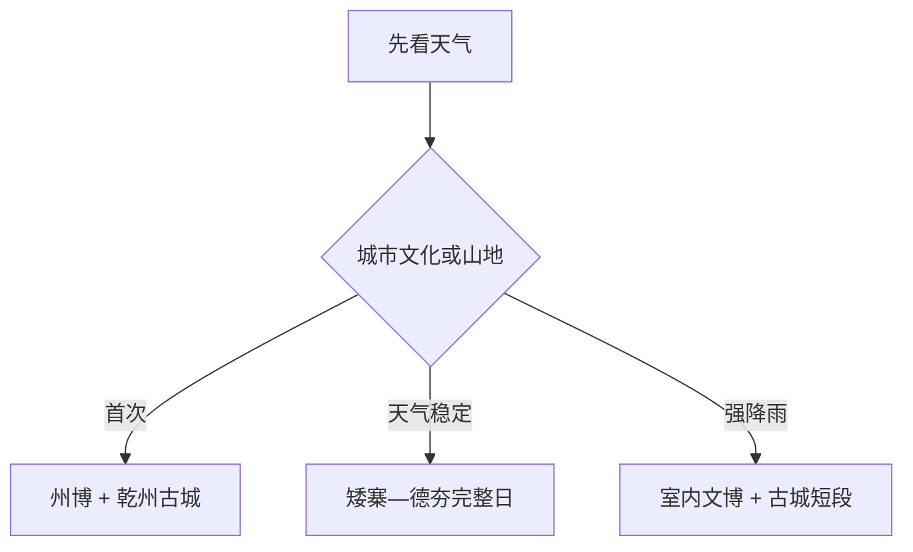

# 吉首旅行指南

吉首把湘西州府生活与峡谷山地放在同一座县级市里：乾州古城适合夜间慢游，矮寨—德夯方向需要完整一天，州级博物馆和公共文化则帮助理解湘西多民族历史。把乾州、主城与矮寨分日，既能减少转场，也能给峡谷天气留出余地。

> 建议停留：2–3 天 
> 旅行关键词：乾州古城、矮寨大桥、德夯大峡谷、湘西非遗、峒河、黄金茶 
> 主要体力：中等；峡谷步道较高 
> 最近研究：2026-08-13

## 城市速览

| 项目 | 旅行信息 |
|---|---|
| 主要旅行价值 | 州府文博、乾州古城与矮寨峡谷共同呈现湘西城市和山地文化 |
| 建议停留 | 2 天覆盖古城和矮寨；3 天增加主城文博或乡村 |
| 较舒适季节 | 春秋适合古城和峡谷；雨季重点看山洪与道路 |
| 预算特点 | 主城中低；矮寨景区票务、接驳和车辆增加成本 |
| 步行强度 | 古城中等，峡谷中至高 |
| 主要天气风险 | 强降雨、山洪、落石、雷暴、高温和冬季结冰 |
| 独行旅行 | 主城方便；峡谷日先锁定返程 |
| 亲子旅行 | 博物馆、古城和景区适龄项目可选 |
| 长者与低体力旅行 | 乾州和桥梁观景短线更易减量 |
| 无障碍信息 | 现代场馆可咨询；古城、苗寨和峡谷设施连续性需向官方确认 |

## 城市格局与游览区域

吉首市是湘西土家族苗族自治州首府、法定县级市，代码 `433101`。固定 GeoNames `1805270` 是主城居民点，Wikidata `Q1344702` 代表法定吉首市并以 `P1566=1805269` 连接另一条记录。乾州承担州级行政与古城旅游，吉首老城沿峒河展开，矮寨镇和德夯大峡谷位于西部山地；花垣县十八洞村与凤凰县古城属于其他县域。

| 区域 | 主要内容 | 怎么安排 | 与其他区域的关系 |
|---|---|---|---|
| 吉首老城—峒河 | 到发、餐饮和城市生活 | 抵离日或半日 | 与乾州短途连接 |
| 乾州 | 古城、文庙、非遗与州级公共文化 | 半日至一天 | 适合住宿或夜游 |
| 矮寨 | 大桥、盘山公路和山地观景 | 半日至一天 | 与德夯同方向但各有入口 |
| 德夯大峡谷 | 峡谷、瀑布、苗寨与步道 | 半日至一天 | 天气稳定时完整游览 |
| 茶旅与乡村 | 黄金茶、村落和正式研学 | 有接待时一天 | 与峡谷线分日更稳 |

## 主要景点

### 主城与乾州

| 景点 | 区域 | 类型 | 主要看点 | 建议用时 | 室内外 | 体力 | 预约风险 | 天气影响 | 优先级 |
|---|---|---|---|---:|---|---|---|---|---|
| 乾州古城景区 | 乾州 | 古城与夜游 | 古街、城河、文庙与夜间消费场景 | 3–5 小时 | 混合 | 中 | 中 | 中 | A |
| 湘西州博物馆及公共文化场馆 | 乾州新区 | 博物馆 | 州域历史、民族文化与当期展览 | 2–3 小时 | 室内 | 低 | 高 | 低 | A |
| 峒河国家湿地公园开放区 | 吉首老城 | 城市湿地 | 河谷、公共绿地和城市生活 | 1–2 小时 | 室外 | 低 | 低 | 高 | B |

### 矮寨与德夯

| 景点 | 区域 | 类型 | 主要看点 | 建议用时 | 室内外 | 体力 | 预约风险 | 天气影响 | 优先级 |
|---|---|---|---|---:|---|---|---|---|---|
| 矮寨奇观旅游区吉首段 | 矮寨镇 | 桥梁、公路与山地 | 矮寨大桥、盘山公路与观景设施 | 3–5 小时 | 室外 | 中 | 高 | 很高 | A |
| 德夯大峡谷吉首段 | 矮寨镇 | 峡谷与苗寨 | 峡谷、瀑布、步道与苗族村落 | 4–6 小时 | 室外 | 中至高 | 高 | 很高 | A |
| 矮寨国家森林公园公开区域 | 西部山地 | 森林与峡谷 | 山地森林、溪谷和观景 | 半日至一天 | 室外 | 中至高 | 很高 | 很高 | B |
| 湘西黄金茶正式展陈或茶旅项目 | 市域乡村 | 茶文化与农业 | 茶园、制作与品牌文化 | 半日 | 混合 | 中 | 很高 | 高 | B |

矮寨大桥、盘山公路、德夯苗寨与峡谷属于同一广域旅游方向，但入口、票务和步行负担不同，先选核心体验再加补充。桥梁运维空间、公路边坡、河道、茶园和村民生活区遵循交通、保护与生产边界。

## 美食与餐饮

| 菜品或餐饮类型 | 常见区域 | 一个人用餐与常见份量 | 风味、过敏原与饮食限制 | 排队风险与替代方法 |
|---|---|---|---|---|
| 湘西米粉 | 主城、乾州 | 一碗一人份 | 汤底可能含猪牛肉、花生和豆制品 | 早餐午间容易找同类店 |
| 腊味与酸辣菜 | 主城、古城 | 多为共享份量 | 腌制、烟熏、辣椒和酒类需留意 | 一人问小份或拼盘 |
| 湘西小吃与糍粑 | 乾州古城 | 小份易组合 | 糯米、糖、花生、芝麻和蛋奶常见 | 夜间热门时段可错峰 |
| 黄金茶 | 主城、茶旅点 | 单杯或茶席 | 咖啡因敏感者控制饮量 | 选择明码标价、来源清楚的产品 |

## 经典行程

### 一日经典路线

**路线**：湘西州博物馆 → 午餐与休息 → 乾州古城 → 古城晚餐

- **串联逻辑**：州域历史与古城空间相邻，适合第一次到访。
- **预约锚点**：先确认博物馆开放与古城演出。
- **休息安排**：午间与夜游前各安排一次室内休息。
- **时间不足时**：保留博物馆和古城核心街区。

### 两日城市路线

**第 1 天**：州博物馆与乾州古城 
**第 2 天**：矮寨大桥观景 → 午休 → 德夯峡谷或苗寨短线

- **串联逻辑**：城市与山地分日，第二天在同方向选择核心体验。
- **预约锚点**：景区票务、接驳、步道与返程。
- **休息安排**：连续住吉首或乾州，景区游客中心午休。
- **时间不足时**：第二天在矮寨与德夯之间二选一。

### 三日深度路线

**第 1 天**：吉首老城与峒河 
**第 2 天**：乾州文博与古城 
**第 3 天**：矮寨—德夯完整日

- **串联逻辑**：城市生活、历史文化与山地体验逐层展开。
- **预约锚点**：第三天优先锁定交通与景区。
- **休息安排**：主城日低强度，山地日午间长休。
- **时间不足时**：删第一天补充，保留乾州与矮寨。

### 雨天路线

**路线**：湘西州博物馆 → 午餐 → 公共文化场馆 → 乾州古城有遮蔽短段

- **适用条件**：普通降雨可行；山洪、雷暴和地灾预警时留在城区。
- **预约锚点**：场馆、演出和道路状态。
- **休息安排**：全程以乾州室内空间衔接。
- **时间不足时**：只保留州博物馆。

### 亲子或低体力路线

**亲子路线**：州博物馆 → 午餐 → 乾州古城适龄非遗体验 
**低体力路线**：车辆到州博物馆 → 长休 → 乾州古城平缓短段

- **减负方式**：亲子线控制夜游和演出时长；低体力线减少峡谷、坡道和古城石板路。
- **预约锚点**：体验年龄、电梯、观光车和入口距离。
- **休息安排**：午间至少一小时室内休息。
- **时间不足时**：两类路线都保留州博物馆。

### 远郊一日路线

**路线**：吉首 → 矮寨大桥观景 → 午餐与休息 → 德夯大峡谷一条正式步道 → 返回

- **适用条件**：天气稳定、步道开放、体力和返程车辆已确认。
- **预约锚点**：门票、接驳、演出和步道状态。
- **休息安排**：游客中心午休，步道中按正规休息点补给。
- **时间不足时**：在矮寨与德夯之间二选一。

## 住宿区域

| 区域 | 优点 | 缺点 | 适合人群 | 交通特点 |
|---|---|---|---|---|
| 吉首老城 | 到发、餐饮和生活便利 | 去乾州和矮寨需转场 | 铁路到达、预算型和独行旅行 | 便于连接吉首站及公路 |
| 乾州新区与古城 | 靠近州博和夜游 | 与老城交通枢纽有距离 | 首访、文化和亲子旅行 | 适合连续两晚作为基地 |
| 矮寨或德夯正式住宿 | 靠近峡谷清晨与夜间活动 | 供应、价格和交通波动 | 山地摄影与深度旅行 | 先确认景区入口和返程 |

## 市内交通

吉首东站、吉首站和公路客运分别服务高铁、普速铁路与道路交通，住宿前先按到达门户选择片区。老城与乾州可用公交或短途车辆，矮寨—德夯方向适合景区接驳、旅游专线、自驾或合规预约车。

| 场景 | 建议与取舍 | 行前需要重查的内容 |
|---|---|---|
| 高铁或普速抵达 | 看清吉首东站与吉首站 | 车次、公交和夜间到达 |
| 老城—乾州 | 公交或短途车辆 | 首末班和活动管制 |
| 矮寨—德夯 | 景区接驳或预约车辆 | 集合点、票务、返程和山路 |
| 自驾 | 适合西部山地 | 山雾、落石、停车和驾驶疲劳 |

## 不同旅行者须知

| 旅行维度 | 可行条件 | 主要取舍 | 需额外核对 |
|---|---|---|---|
| 独行旅行 | 住主城或乾州 | 山地日选择有明确接驳的一条 | 末班、通信和夜间上客点 |
| 亲子旅行 | 文博与古城体验规则清楚 | 峡谷只选适龄短线 | 身高、护栏、救援和卫生间 |
| 长者或低体力旅行 | 车辆连接乾州与观景入口 | 德夯长步道改为桥梁观景 | 电梯、观光车、台阶和座椅 |
| 无障碍需求 | 现代州级场馆可咨询 | 古城与峡谷连续动线有限 | 设施连续性需向官方确认 |
| 摄影旅行 | 古城、桥梁、峡谷与节庆题材丰富 | 尊重村落生活与交通管理 | 无人机、三脚架和商业拍摄 |
| 雨季旅行 | 城区文博可替换 | 山洪和地灾预警时调整峡谷 | 预警、闭园和道路管制 |

## 行前核对

| 核对事项 | 为什么需要重查 | 建议核对时间 | 官方入口 |
|---|---|---|---|
| 乾州古城 | 演出、夜游和场馆会调整 | 到访前一周及当天 | [吉首市人民政府](https://www.jishou.gov.cn/) |
| 矮寨与德夯 | 票务、接驳、步道和天气变化快 | 购票前及当天 | [吉首市人民政府](https://www.jishou.gov.cn/) |
| 州博与公共文化 | 闭馆日和展览会变化 | 到访前一日 | [湘西州人民政府](https://www.xxz.gov.cn/) |
| 铁路、公路与天气 | 班次、山雾和地灾影响转场 | 出发前三日及当天 | [中国铁路12306](https://www.12306.cn/)；[湖南省气象局](http://hn.cma.gov.cn/) |

## 来源与更新记录

### 主要来源

| 来源 | 类型 | 支持内容 | 核验日期 |
|---|---|---|---|
| [吉首市概况](https://www.jishou.gov.cn/jsgk_0/202106/t20210615_1799302.html) | 市政府 | 行政身份、乾州、矮寨、德夯与峒河 | 2026-08-13 |
| [湖南省政府：吉首文旅](https://www.hunan.gov.cn/hnszf/hnyw/szdt/202501/t20250129_33577550.html) | 省政府 | 乾州、矮寨、研学、民宿和非遗 | 2026-08-13 |
| [吉首市文旅融合资料](https://www.jishou.gov.cn/zwgk/xzfxxgkml/gzdt/202410/t20241024_2189954.html) | 市政府 | 矮寨—德夯、节庆和旅游线路 | 2026-08-13 |
| [吉首市国土空间规划](https://www.jishou.gov.cn/zwgk/xzfxxgkml/zcwjjjd/zcwj/202502/t20250227_2229561.html) | 市政府规划 | 城市组团、乾州和旅游服务格局 | 2026-08-13 |
| [吉首市农业发展资料](https://www.jishou.gov.cn/zwgk/xzfxxgkml/zcwjjjd/zcwj/ny/202503/t20250305_2232036.html) | 市政府 | 黄金茶与乡村生产空间 | 2026-08-13 |
| [GeoNames 1805270](https://www.geonames.org/1805270/jishou.html) | 开放地名数据 | 固定主城点 | 2026-08-13 |
| [Wikidata Q1344702](https://www.wikidata.org/wiki/Q1344702) | 开放结构化数据 | 法定吉首市实体与P1566粒度 | 2026-08-13 |

### 更新记录

| 日期 | 更新内容 |
|---|---|
| 2026-08-13 | 首次完成吉首主城、乾州、矮寨—德夯、交通、非遗与保护生产边界研究 |
