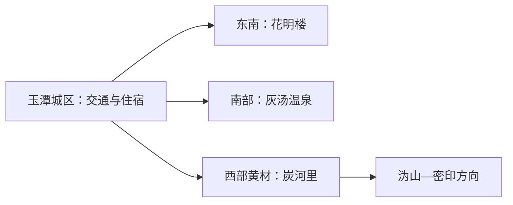
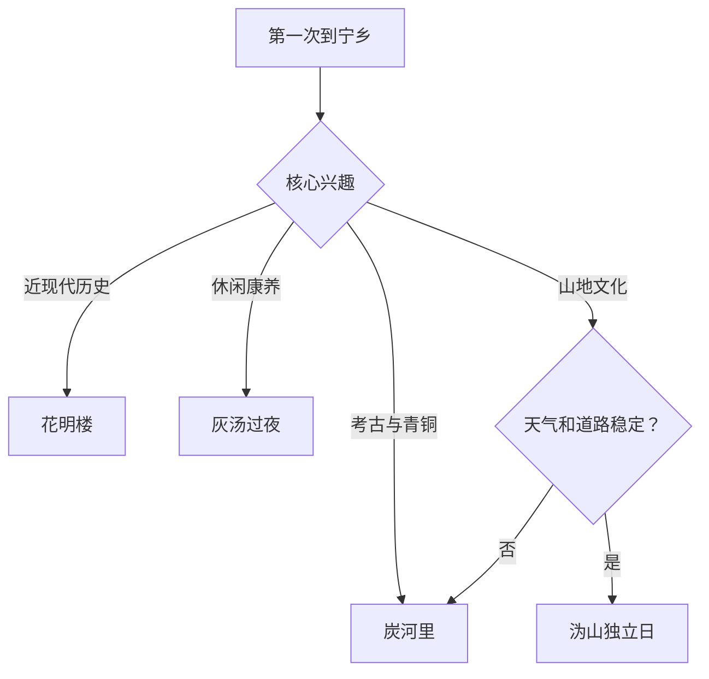

# 宁乡旅行指南

宁乡的旅行价值分布在四条相距较远的主线：花明楼的近现代历史、黄材炭河里的商周青铜文明、灰汤温泉度假区，以及沩山的山地与宗教文化。首访应先选主题，再决定住宿和车辆，而不是从长沙当天拼接所有远点。

## 城市速览

| 项目 | 信息 |
|---|---|
| 旅行主线 | 花明楼、炭河里考古与青铜博物馆、灰汤温泉、沩山—密印方向 |
| 建议停留 | 1 天选一条主题；2 天组合历史与度假；西部山地再加 1 天 |
| 住宿基地 | 宁乡城区适合交通统筹；灰汤适合度假；黄材或沩山适合西部慢游 |
| 步行强度 | 纪念馆低至中；遗址中等；温泉低；山地中至高 |
| 主要天气 | 高温、暴雨、山洪地质风险、河流水情和冬季湿冷 |
| 预约核心 | 纪念馆、青铜博物馆、演出、温泉产品、县域车辆与返程 |
| 边界重点 | 考古区、宗教场所、林地、水库和温泉设施按公开范围使用 |
| 无障碍 | 场馆较易减步行；遗址、古建和山地需先问接驳与坡道 |

## 城市格局与游览区域

宁乡是长沙市代管的县级市，法定代码 `430182`。固定 GeoNames `1799352` 名为 Yutan，对应玉潭主城；Wikidata `Q1374884` 对应宁乡市。花明楼在东南，灰汤在南部，炭河里和沩山在西部，跨线通常需要公路交通。

| 区域 | 旅行价值 | 怎么安排 |
|---|---|---|
| 玉潭城区 | 到达、住宿、餐饮和城市服务 | 作为分线基地 |
| 花明楼方向 | 刘少奇故里及纪念场馆 | 半日至一日 |
| 黄材—沩山方向 | 青铜文明、考古遗址、山地与宗教文化 | 一至两日 |
| 灰汤方向 | 温泉、康养与度假住宿 | 半日至一日，适合过夜 |

## 主要景点

| 景点 | 所在区域 | 类型 | 核心看点 | 建议用时 | 室内/室外 | 体力 | 预约难度 | 天气敏感度 | 适合旅程 |
|---|---|---|---|---|---|---|---|---|---|
| 花明楼景区 | 花明楼镇 | 纪念地与博物馆 | 刘少奇故居、生平展陈与近现代历史 | 3–5 小时 | 混合 | 低至中 | 中高 | 中 | A |
| 炭河里国家考古遗址公园与青铜博物馆 | 黄材镇 | 考古与博物馆 | 商周城址、青铜文化与出土文物体系 | 4–6 小时 | 混合 | 中 | 高 | 高 | A |
| 炭河古城当期演艺区 | 黄材镇 | 主题演艺 | 以西周文化为主题的演出和体验项目 | 3–5 小时 | 混合 | 中 | 高 | 中 | B |
| 灰汤温泉旅游度假区 | 灰汤镇 | 温泉与度假 | 温泉产品、康养住宿与休闲活动 | 半日至 1 天 | 混合 | 低 | 高 | 中 | A |
| 沩山—密印正式开放区 | 沩山方向 | 山地与宗教文化 | 山林、寺院文化与沩仰宗历史 | 5–8 小时 | 混合 | 中至高 | 中高 | 极高 | B |
| 千佛洞等正式景区 | 西部山地 | 溶洞与自然 | 喀斯特洞穴和地质景观 | 3–5 小时 | 混合 | 中 | 高 | 高 | B |

炭河里考古遗址公园、青铜博物馆和炭河古城是相邻但性质不同的项目，安排时分别核对开放与票务。温泉项目按个人健康状况和经营方规则使用；宗教场所保持礼仪，林区、水库及考古工作区按管理边界进入。

## 美食与餐饮

| 类型 | 适合场景 | 份量 | 过敏与饮食提示 | 怎么选 |
|---|---|---|---|---|
| 宁乡花猪菜 | 城区或乡镇正餐 | 多为共享 | 猪肉、辣椒、酱油和较高油盐 | 先问部位、做法、重量与小份 |
| 沩山擂茶 | 西部路线休息 | 一人或共享 | 芝麻、花生、茶和谷物 | 先说明坚果过敏与甜咸偏好 |
| 灰汤鸭与家常菜 | 灰汤住宿日 | 适合共享 | 禽肉、辣椒和共锅 | 两人选择小份组合 |
| 道林酸枣糕等地方小食 | 途中补给 | 小份 | 糖、果核与添加成分 | 选包装完整、标识清楚的产品 |

## 经典行程

### 一日青铜文明路线

**路线**：炭河里青铜博物馆 → 遗址公园公开游线 → 午休 → 炭河古城当期项目

- **串联逻辑**：先用考古证据建立背景，再选择商业演艺延伸。
- **预约锚点**：博物馆闭馆日、遗址开放和演出场次。
- **休息安排**：午餐后再进入演艺区。
- **时间不足时**：保留博物馆与遗址，删除演艺。

### 两日历史与度假路线

**第 1 天**：花明楼—宁乡城区 
**第 2 天**：炭河里考古线或灰汤温泉线

- **串联逻辑**：近现代历史与青铜文明或度假体验分日处理。
- **预约锚点**：纪念馆、博物馆、温泉产品和跨区车辆。
- **休息安排**：每天只走一个长方向。
- **时间不足时**：按兴趣保留花明楼或炭河里。

### 花明楼半日路线

**路线**：景区入口 → 纪念馆核心展线 → 故居 → 午餐或返程

- **适用条件**：场馆开放和实名预约已确认。
- **预约锚点**：闭馆日、入场时段与讲解。
- **休息安排**：室内外展线交替。
- **时间不足时**：保留生平展陈与故居。

### 雨天路线

**路线**：炭河里青铜博物馆 → 午餐 → 灰汤正规室内温泉产品

- **适用条件**：普通降雨且公路稳定；暴雨预警时减少长距离移动。
- **预约锚点**：博物馆、温泉、道路和退改。
- **休息安排**：两项目之间预留完整转场。
- **时间不足时**：只保留博物馆。

### 亲子路线

**路线**：炭河里青铜博物馆 → 午休 → 遗址公园短线

- **串联逻辑**：室内文物与户外考古空间形成清晰学习线。
- **预约锚点**：儿童讲解、推车路线和卫生间。
- **休息安排**：正午留在室内。
- **时间不足时**：保留博物馆核心展线。

### 低体力路线

**路线**：车辆到达花明楼 → 核心场馆 → 午餐长休 → 灰汤住宿

- **适用条件**：门到门交通和温泉健康条件已确认。
- **预约锚点**：轮椅、落客、温泉禁忌与客房无障碍。
- **休息安排**：下午以休息为主。
- **时间不足时**：只保留花明楼。

### 沩山延伸路线

**路线**：城区或黄材早出发 → 沩山正式开放区 → 服务点午休 → 原路返回

- **适用条件**：天气、道路、宗教场所开放和防火稳定。
- **预约锚点**：准确入口、车辆、最晚返程与预警。
- **休息安排**：使用正式服务点，降低连续爬升。
- **时间不足时**：整段删除，改走炭河里线。

## 住宿区域

| 区域 | 优点 | 取舍 | 适合人群 | 核对项 |
|---|---|---|---|---|
| 宁乡城区 | 交通、餐饮与综合服务方便 | 去西部景点仍需长途公路 | 首访、公共交通旅行 | 枢纽接驳、停车、早餐与夜间入住 |
| 灰汤度假区 | 温泉产品和住宿集中 | 去花明楼、炭河里仍需转场 | 度假、低体力 | 温泉权益、健康规则、退改和消防 |
| 黄材或沩山正规住宿 | 接近西部景点 | 选择较少且天气敏感 | 考古深度游、自驾 | 合法经营、供餐、道路、通信和退改 |

## 市内交通

| 场景 | 怎么做 | 行前核对 |
|---|---|---|
| 铁路到达 | 按票面选择宁乡相关站点，再转住宿或目标片区 | 车次、完整站名和站前接驳 |
| 跨片区 | 使用客运、出租或正规包车，每日一个主要方向 | 班次、上下客点、等候和返程 |
| 长沙联游 | 给宁乡留完整一天，西部线更适合过夜 | 长沙到发站、路况与末班 |
| 山地自驾 | 白天抵达正式入口并原路返回 | 暴雨、落石、停车、燃油和通信 |

## 不同旅行者须知

| 旅行者 | 推荐做法 | 重点核对 |
|---|---|---|
| 独行 | 住城区或灰汤，提前锁定西部返程 | 车辆资质、夜间入住和叫车 |
| 亲子 | 以青铜博物馆为核心 | 儿童预约、推车、防晒和卫生间 |
| 长者与低体力 | 花明楼或灰汤单线慢游 | 场馆距离、温泉健康条件和轮椅 |
| 摄影 | 遗址、山地和纪念地分日 | 文物拍摄、三脚架、无人机与返程 |
| 自驾 | 每日选择花明楼、灰汤或西部一线 | 雨雾、山路、停车和疲劳驾驶 |

## 行前核对

- 宁乡市及湖南文旅渠道：景区、博物馆、演出、温泉和活动。
- 场馆与经营方：实名预约、闭馆日、温泉产品和退改。
- 湖南气象、自然资源、水利与应急信息：高温、暴雨、山洪和道路。
- 中国铁路 12306：完整站名、车次和退改。

## 来源与更新记录

| 来源 | 支持内容 | 核验日期 |
|---|---|---|
| [湖南省文旅厅：宁乡文旅概览](https://whhlyt.hunan.gov.cn/whhlyt/news/mtjj/201910/t20191023_10489167.html) | 花明楼、炭河里、灰汤与宁乡文旅主线 | 2026-09-01 |
| [文旅部：宁乡西部探秘线路](https://zhuanti.mct.gov.cn/xcsshfghlxj/jpxl/detail/9159.html) | 黄材、炭河里、沩山与西部景点关系 | 2026-09-01 |
| [湖南省人民政府：炭河里青铜博物馆](https://www.hunan.gov.cn/hnszf/hnyw/jdt2/202509/t20250928_33815952.html) | 青铜专题馆与文物展陈 | 2026-09-01 |
| [Wikidata Q1374884](https://www.wikidata.org/wiki/Q1374884) | 宁乡市实体对齐 | 2026-09-01 |
| [GeoNames 1799352](https://www.geonames.org/1799352/) | 固定玉潭城市点 | 2026-09-01 |
| [湖南省气象局](http://hn.cma.gov.cn/) | 气象预警 | 2026-09-01 |

| 日期 | 更新 |
|---|---|
| 2026-09-01 | 首次完成花明楼、炭河里、灰汤与沩山研究，并拆分考古、演艺和度假产品。 |
