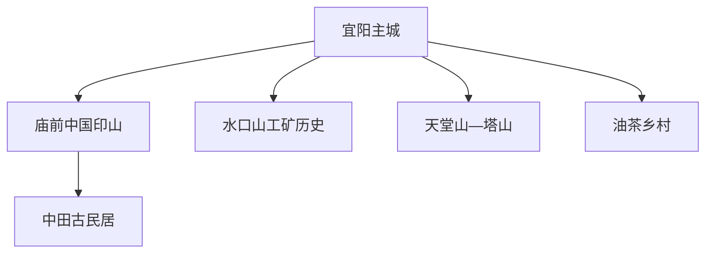
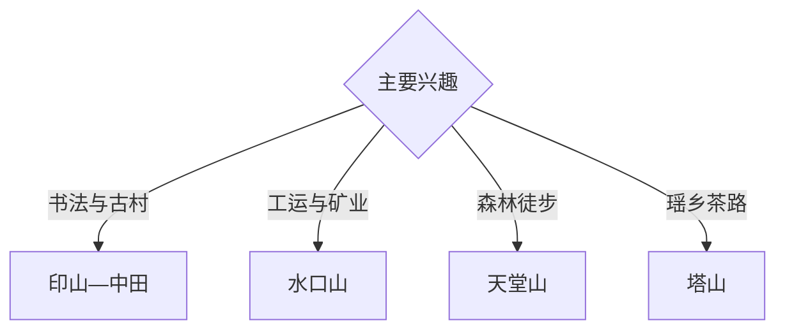

# 常宁旅行指南

常宁位于湘江中游南岸，以中国印山、天堂山、塔山瑶乡、水口山工运与矿业史、中田古民居和油茶产业形成独立旅行体系。固定快照中的 **Yiyang / GeoNames 1815618** 锚定宜阳主城；庙前、天堂山、塔山与水口山分属不同方向。

## 城市速览

| 项目 | 信息 |
|---|---|
| 主线 | 宜阳主城—中国印山—中田古民居—水口山—天堂山与塔山 |
| 停留 | 主城与庙前 2 天；水口山或天堂山方向各另留 1 天 |
| 住宿 | 宜阳主城适合综合接驳；山地正规住宿适合慢游 |
| 交通 | 公路与铁路抵达，远郊宜公交、约车或自驾 |
| 季节 | 春秋适合古村山地；夏季关注雷雨、山洪与高温 |
| 预算 | 主城与古村灵活，山地车辆、景区与住宿增加预算 |

## 城市格局与游览区域

主城承担住宿和交通；庙前方向组合印山与古民居，水口山强调红色工运与矿业，天堂山—塔山强调森林、峡谷与瑶乡。摩崖石刻、古建、矿业生产区、自然保护地与漂流水域按正式开放范围进入。

## 主要景点

| 景点 | 区域 | 类型 | 核心体验 | 用时 | 环境 | 体力 | 研究价值 | 拥挤 | 优先级 |
|---|---|---|---|---:|---|---|---|---|---|
| 中国印山文化旅游区 | 庙前 | 石刻与文化景区 | 印章、书法、摩崖艺术与山水 | 半天 | 室外 | 中 | 很高 | 节假日中高 | A |
| 中田古民居公开区 | 庙前 | 古村与古建 | 湘南民居、巷道与聚落格局 | 半天 | 混合 | 低中 | 很高 | 中 | A |
| 水口山工人运动纪念馆 | 水口山 | 红色与工业史 | 工运历史、矿业城市与工业记忆 | 2–3 小时 | 室内 | 低 | 很高 | 节假日中 | A |
| 水口山正式开放矿冶展陈 | 水口山 | 工业文化 | 有色金属、矿冶技术与城市转型 | 半天 | 混合 | 低 | 高 | 预约制 | B |
| 天堂山依法开放区 | 南部山地 | 森林与山岳 | 南岭余脉、森林、云雾与高山生态 | 1 天 | 室外 | 高 | 高 | 季节性 | A |
| 塔山瑶乡公开文化点 | 塔山 | 民族与茶乡 | 瑶族文化、盐茶古道与高山茶园 | 半天至 1 天 | 混合 | 中 | 高 | 活动时中 | B |
| 西岭油茶正规体验点 | 西岭方向 | 农业体验 | 油茶种植、加工与乡村产业 | 半天 | 混合 | 低 | 中高 | 预约制 | B |

## 美食与餐饮

常宁米粉、白沙烧饼、油茶制品、湘南腊味和山蔬适合分区体验。山地日携带饮水与简餐；矿区周边优先正规餐饮，进入油茶生产空间需取得接待许可。

## 经典行程

### 主城庙前线
**路线**：宜阳主城—中国印山—中田古民居—返城。**逻辑**：把书法石刻与湘南聚落放在同一方向。**预约锚点**：景区和古建开放。**休息**：庙前镇。**删除条件**：高温时缩短印山户外段。

### 印山专题线
**路线**：印山正式入口—核心石刻游线—书法资料整理。**逻辑**：为篆刻与书法细读留足时间。**预约锚点**：讲解。**休息**：游客中心。**删除条件**：雷雨时改室内展陈。

### 水口山工运线
**路线**：纪念馆—正式开放矿冶展陈—镇区公共空间。**逻辑**：同时理解工运史与工业城市。**预约锚点**：纪念馆和企业接待。**休息**：水口山镇。**删除条件**：企业不接待时保留纪念馆。

### 天堂山一日线
**路线**：主城—山地入口—依法开放步道—返程。**逻辑**：独立一天承接山路尺度。**预约锚点**：道路、防火与天气。**休息**：服务点。**删除条件**：雷雨、山洪、地质或封控时顺延。

### 塔山瑶乡线
**路线**：主城—瑶乡公开文化点—盐茶古道开放段—返程。**逻辑**：以社区正式接待理解文化与茶业。**预约锚点**：活动和车辆。**休息**：塔山乡。**删除条件**：无接待时改天堂山外围。

### 亲子低体力线
**路线**：工运纪念馆—午餐—中田古民居短段。**逻辑**：室内外切换且体力可控。**预约锚点**：场馆活动。**休息**：主城。**删除条件**：雨天保留室内馆。

### 三日组合线
**路线**：首日印山与中田；次日水口山；第三日天堂山或塔山。**逻辑**：文化、工业、山地分日。**预约锚点**：第三日天气。**休息**：宜阳主城连续住宿。**删除条件**：两天时删山地日。

## 住宿区域

宜阳主城适合餐饮、交通和多方向出发；庙前、水口山及山地正规住宿适合主题慢游。订房核对夜间接驳、消防、停车、早餐和山地天气退改。

## 市内交通

常宁站等铁路节点与主城、庙前、水口山距离不同，购票后核对接驳。印山、水口山、天堂山和塔山分方向安排；山路自驾按临水、落石与临时管制行驶。

## 不同旅行者须知

书法旅行者给印山半天以上；工业史旅行者优先纪念馆；亲子和长者选择古村低坡段与室内展陈；徒步者按天气选择天堂山。摩崖本体、古建私宅、矿井和冶炼生产线、自然保护区核心区与未开放古道保留明确限制。

## 行前核对

- 核对印山、中田古民居、水口山纪念馆与工业接待。
- 核对天堂山、塔山、古道、漂流与森林防火公告。
- 核对铁路站点、城乡班次、返程和山地住宿。
- 核对暴雨、雷电、山洪、地质灾害与高温预警。

## 来源与更新记录

| 来源 | 支持内容 | 核验日期 |
|---|---|---|
| [常宁市政府：精品线路](https://www.hnchangning.gov.cn/whly/lyzn/lyxl/20250324/i3616737.html) | 印山、中田、水口山、天堂山、塔山与油茶线路 | 2026-09-03 |
| [常宁市政府：旅游概况](https://www.hnchangning.gov.cn/whly/lygk/20200619/i2067167.html) | 山地、瑶乡、矿业和全域旅游格局 | 2026-09-03 |
| [GeoNames 1815618](https://www.geonames.org/1815618/) | Yiyang 固定人口点与常宁主城位置 | 2026-09-03 |
