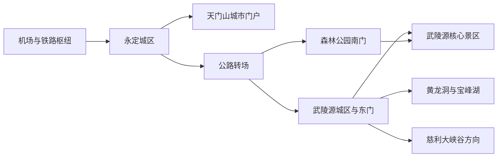

# 张家界旅行指南

张家界的旅行空间由两套彼此独立的游览与住宿交通体系构成：永定城区南侧的天门山以城市索道门户和单日环线见长，武陵源则是一片需要公路转场、再以景区环保车、索道、电梯和步道组合游览的世界自然遗产地。两地之间不是连续步行范围，也不是同一张门票。把永定城区、天门山和武陵源分别安排，才能在峰林、峡谷、洞穴与地方文化之间留出足够的交通和天气余量。

> 建议停留：3–5 天\
> 旅行关键词：石英砂岩峰林、世界自然遗产、天门山、峡谷溪流、土家饮食\
> 主要体力：中高至高强度山地步行；索道和电梯只能减少部分爬升\
> 最近研究：2026-08-11

## 城市速览

| 项目 | 旅行信息 |
|---|---|
| 主要旅行价值 | 在武陵源观看大规模石英砂岩峰柱、峡谷、溪流与森林，在天门山体验城市近旁的高山台地、天门洞与悬崖游道，并以博物馆和地方饮食补足地质、历史与民族文化背景 |
| 建议停留 | 2 天只能在天门山和武陵源之间做明显取舍；3 天可安排天门山 1 天、武陵源 2 天；4–5 天可增加城市文化、黄龙洞、宝峰湖或张家界大峡谷，避免每天跨区折返 |
| 较舒适季节 | 春秋通常更利于山地步行，但多雾和降雨会遮挡远景；夏季湿热、雷暴和旺季客流增加，冬季人流较少但山上可能结冰、降雪或临时调整线路。任何季节都不能保证云海或通透能见度 |
| 预算特点 | 中等至较高；住宿和普通餐饮容易分档，主要增量来自多座独立景区门票、索道、电梯、观光车船、跨区公路交通和旺季房价 |
| 步行强度 | 武陵源和天门山均为中高至高强度；即使乘索道、百龙天梯或环保车，仍会遇到长距离栈道、连续台阶、排队站立和多次换乘 |
| 主要天气风险 | 强降雨、雷电、山洪、崩塌与落石风险、低能见度、大风、冬季结冰及森林火险；峡谷、溪流、游船、索道、电梯、临崖游道和林区线路可能分别调整或关闭 |
| 独行旅行 | 永定城区、天门山和武陵源的正式游览体系适合独立安排；进山前要保存入口、返程和救援信息，不进入未开放山路，也不依赖临时招徕车辆 |
| 亲子旅行 | 市博物馆、武陵源较平缓的溪谷短段和正规游客中心便于调节；临崖栈道、猕猴活动区、拥挤换乘点、游船和连续台阶需要持续看护 |
| 长者与低体力旅行 | 可用环保车、索道、电梯缩短部分垂直移动，但设施之间仍可能有坡道、台阶和长距离步行；宜每天只选一个山地单元并预设折返点 |
| 无障碍信息 | 武陵源已公布从吴家峪、杨家界和森林公园门票站出发的无障碍线路及金鞭溪通道，但不同入口、交通设施和观景点的连续性仍有差异；天门山、洞穴、游船和其他山地景区须逐段向官方确认 |

## 城市格局与游览区域

张家界市法定行政区划代码为 **430800**，辖永定区、武陵源区和慈利县、桑植县。常规抵达与城市服务集中在永定区，武陵源区承担世界自然遗产和国家森林公园的主要游览与住宿功能；慈利、桑植方向则属于需要单独交通计划的县域远线。张家界西站、张家界站和荷花国际机场都不在武陵源景区门口，抵达后仍需先确认当晚住在永定还是武陵源。

天门山可以从永定城区进入，但武陵源必须另行公路转场。武陵源东门与森林公园南门服务同一大范围核心景区的不同方向，选哪一处住宿要看首日预约入口和次日路线，而不是只看“离张家界近不近”。

| 区域 | 主要内容 | 游览特点 | 与其他区域的关系 |
|---|---|---|---|
| 永定中心城区 | 张家界市博物馆、餐饮街区、张家界站、中心汽车站与城市服务 | 最适合抵离日、雨天和山地行程之间的恢复；点位间仍需公交或出租车 | 荷花机场、张家界站和天门山索道城市端相对集中；前往武陵源须公路转场 |
| 张家界西站片区 | 高铁枢纽、城市北部换乘 | 适合高铁抵离和直接转向武陵源；站名中的“张家界”不表示已经进入景区 | 到永定城区、天门山和武陵源是三个不同终点，按住宿地址选择车辆 |
| 天门山 | 天门山索道、天门洞、山顶森林与临崖游道 | 常按指定时段与线路组合索道、接驳车、穿山扶梯和步道；高差、临崖和天气限制明显 | 位于永定区，是独立于武陵源世界遗产的景区，通常单独安排一日 |
| 武陵源城区—吴家峪东门 | 军地坪、标志门、餐饮住宿与核心景区东侧入口 | 服务密度高，适合作为武陵源两日基地；早晚餐和返程较容易安排 | 可衔接天子山、十里画廊、水绕四门等方向，实际入口和内部交通以预约为准 |
| 森林公园南门—锣鼓塔 | 张家界国家森林公园入口、金鞭溪与黄石寨方向 | 更接近溪谷和公园南部线路，环境较安静；餐饮与夜间服务少于武陵源城区 | 与东门不是连续步行关系，异门进出要提前解决行李和返程交通 |
| 武陵源核心景区内部 | 金鞭溪、黄石寨、袁家界、杨家界、天子山、十里画廊，以及水绕四门的世界地质公园博物馆 | 环保车连接部分节点，索道、百龙天梯和观光电车承担局部高差或距离；设施间仍需步行和排队 | 内部点位共同构成一个大型景区，博物馆作为水绕四门路线节点，不另重复安排 |
| 黄龙洞与宝峰湖 | 武陵源区内的独立运营入口 | 洞穴、湖泊和游船可分别补充峰林体验，各有票务、交通和开放条件 | 独立票务不能用来推断世界遗产保护边界；是否与核心景区同日组合取决于预约、交通和体力 |
| 慈利大峡谷方向 | 张家界大峡谷与玻璃桥 | 与武陵源峰林是不同运营单元，预约、路线组合、恐高和天气限制都需单独评估 | 从武陵源或永定均需公路接驳，通常占用大半天至一日 |
| 桑植与市域西北部 | 红色文化、民歌文化与自然保护地 | 县域广、转场长，保护区不等于开放景区 | 不与天门山或武陵源压缩为同一天；具体场馆和开放地应另行核对 |

### 世界遗产与票务边界

- **武陵源世界自然遗产**是依法保护的自然遗产范围。UNESCO 记录的遗产地面积为 26,400 公顷，另有缓冲区；这是一条保护和管理边界，不是一张自动覆盖所有游乐项目的“世界遗产通票”。
- **武陵源核心景区**是旅行者最常进入的大型游览单元。张家界国家森林公园、袁家界、杨家界、天子山、索溪峪等内部区域按一处景区规划；环保车、索道、百龙天梯、观光电车的包含关系和运营状态仍需按当期票务核对。
- **黄龙洞**是法规列明的武陵源世界自然遗产核心要素；黄龙洞和宝峰湖均有独立入口、游览流线和票务。独立票务只说明运营关系，不能据此推定其位于遗产保护范围之外；洞内游船、湖上游船及接驳也不能从“位于武陵源”推定已被核心景区票包含。
- **天门山**位于永定区，是另一座国家森林公园和独立运营景区，不属于武陵源世界自然遗产地。
- **张家界大峡谷与玻璃桥**位于慈利县，是另一套预约和运营体系，也不属于武陵源核心景区内部点位。
- 芙蓉镇位于湘西土家族苗族自治州永顺县，凤凰古城位于湘西州凤凰县，两者可与张家界联程，但不属于张家界市，需按下一目的地单独安排交通和住宿。

## 主要景点

优先级用于安排时间，不代表绝对排名：**A** 为首访核心，**B** 为按兴趣补充，**C** 为远线、天气敏感或通常需要独立半天以上的目的地。车站、索道站和游客中心属于路线节点；同一景区及其内部子景点只视为一个游览单元。

### 永定城区与天门山

| 景点 | 区域 | 类型 | 主要看点 | 建议用时 | 室内外 | 体力 | 预约风险 | 天气影响 | 优先级 |
|---|---|---|---|---:|---|---|---|---|---|
| 张家界市博物馆 | 永定区大庸桥片区 | 综合博物馆 | 地质馆、历史文化馆和城市建设展示，适合在进山前理解张家界地貌、考古与非遗 | 2–3 小时 | 室内 | 低 | 中 | 低 | B |
| 天门山国家森林公园 | 永定区城区南侧 | 山岳与国家森林公园 | 天门洞、高山台地、森林、临崖游道和城市—山地垂直景观；索道、穿山扶梯、公路接驳与山顶线路合并为一个景区 | 0.5–1 天 | 以室外为主 | 中高至高 | 高 | 极高 | A |

天门山的 A、B、C 等线路名称、上下山方向和交通组合可能调整。索道到达高处不等于全程平缓，山顶环线、天门洞台阶和不同交通设施之间仍有步行；恐高、膝关节负担或无法独立转乘者，应在购票前确认可缩短的线路。

### 武陵源峰林与科普场馆

| 景点 | 区域 | 类型 | 主要看点 | 建议用时 | 室内外 | 体力 | 预约风险 | 天气影响 | 优先级 |
|---|---|---|---|---:|---|---|---|---|---|
| 武陵源核心景区（张家界国家森林公园） | 武陵源区 | 世界自然遗产与大型山岳景区 | 石英砂岩峰柱、金鞭溪峡谷、黄石寨、袁家界、杨家界、天子山、十里画廊等；所有内部区域、索道、电梯和环保车按一个大型景区理解 | 1–3 天 | 室外 | 高 | 高 | 极高 | A |

武陵源核心景区不宜用“索道全部乘一遍”代替路线设计。一天通常只处理一条由入口、山下溪谷、上山设施、山顶片区和下山设施组成的闭环；两天则可把金鞭溪—袁家界与天子山—十里画廊拆开。黄石寨、杨家界等支线是否加入，要服从开放状态、体力和返程时间。

### 洞穴、湖泊与独立运营景区

| 景点 | 区域 | 类型 | 主要看点 | 建议用时 | 室内外 | 体力 | 预约风险 | 天气影响 | 优先级 |
|---|---|---|---|---:|---|---|---|---|---|
| 黄龙洞 | 武陵源区索溪峪 | 岩溶洞穴 | 多层洞穴、地下河、石笋与石柱；步行、台阶和洞内游船共同组成完整流线 | 2–3 小时 | 室内为主 | 中 | 中至高 | 中至高 | B |
| 宝峰湖 | 武陵源区 | 峡谷湖泊与游船 | 山间湖面、峡谷与游船视角，是峰林步行之外的水上体验 | 2–3 小时 | 以室外为主 | 中 | 中至高 | 高 | B |
| 张家界大峡谷—玻璃桥 | 慈利县 | 峡谷与桥梁工程 | 玻璃桥、峡谷步道与景区交通；不同票型可能对应不同游览组合 | 0.5–1 天 | 室外 | 中高至高 | 高 | 极高 | C |
| 茅岩河景区 | 永定区及澧水沿线方向 | 峡谷河流与水上活动 | 峡谷河道、合规游船或季节性水上项目；具体产品和开放河段由运营方决定 | 0.5–1 天 | 室外 | 中至高 | 高 | 极高 | C |

黄龙洞、宝峰湖、大峡谷和茅岩河各自都是完整运营单元。洞穴、游船、玻璃桥、漂流或峡谷步道不可仅凭地图距离临时拼接；强降雨、水位、大风、雷电和设备维护可能让其中一处开放、另一处关闭。

## 美食与餐饮

张家界饮食以湘西北和土家风味为主，腊味、豆制品、辣椒、干锅和山地食材常见。永定城区的选择最广，适合抵离日或天门山下山后用餐；武陵源城区更便于景区早出晚归，但热门时段可能集中排队。山中服务点适合补水和简餐，不应承担需要严格过敏原控制的复杂用餐。

| 菜品或餐饮类型 | 常见区域 | 一个人用餐与常见份量 | 风味、过敏原与饮食限制 | 排队风险与替代方法 |
|---|---|---|---|---|
| 土家三下锅 | 永定城区、武陵源城区 | 多种肉类、豆腐和蔬菜同锅，通常适合二至四人共享；独食先问小锅或少选主料 | 常见腊肉、肥肠、猪肚、豆腐、萝卜和辣椒；含猪肉、大豆，酱料可能含小麦、酒料，具体“三样”须点单时确认 | 晚餐和节假日风险高；在同片区选择能明确主料、份量和价格的普通土菜馆，不必等待单一品牌 |
| 土家合渣 | 城区土家菜馆与家常菜馆 | 豆渣或粗磨豆制品配蔬菜，可作共享菜或一人配饭 | 含大豆；酸合渣与普通合渣风味不同，汤底、肉末和辣度需询问，不能只凭豆制品推定为纯素 | 同类家常菜馆较多；缺货时可换清炒蔬菜和明确汤底的豆腐菜 |
| 腊肉、腊肠与腊味合菜 | 永定、武陵源及市域乡土菜馆 | 咸香下饭，通常是共享份量；独食适合小炒或与蔬菜搭配 | 以猪肉为主，烟熏与盐分较高；香肠、血豆腐等加工品配料不同，需核对酒料、淀粉和肠衣 | 旺季不必追逐“农家自制”；选择证照清楚、能说明来源和配料的餐馆 |
| 岩耳炖鸡 | 武陵源及地方菜馆 | 汤锅通常适合二人以上；一个人可问按位汤或小份 | 含禽肉，岩耳及其他菌藻食材可能造成个体不耐受；汤底常含盐、油和酒料 | 热门店等位时改选普通鸡汤或菌菇菜；不购买来源不明的“野生”食材 |
| 鳜鱼等本地鱼菜 | 慈利方向、永定与武陵源餐馆 | 多为整鱼计重，适合共享；点单前确认重量、做法和总价 | 含鱼，刺和辣椒较多；酱料可能含大豆、小麦，厨房可能与甲壳类共用 | 先确认养殖或合规来源；份量过大时改点按份鱼片、其他蛋白质或蔬菜 |
| 张家界凉面、米粉与小碗早餐 | 永定城区、武陵源城区与交通节点 | 一人一碗，适合早出前或下山后快速用餐 | 可辣可酸，卤味、猪耳、花生、香干、芝麻和蒜水常作配料；米粉本身无小麦不代表汤底和操作台无麸质 | 早餐和夜宵高峰周转快；选择现煮、配料可分开添加的店，严重过敏者不依赖口头“不要某料” |

严重食物过敏、纯素、低盐或不能摄入酒料者，宜把限制写成简短中文，让餐厅逐项确认主料、汤底、酱料和共用油锅。山地旅游城市的“土家菜”“农家菜”是宽泛标签，不能代替配料和食品来源核对。

## 经典行程

### 一日经典路线

**路线**：永定城区 → 天门山城市端入口 → 按预约线路完成上下山与山顶环线 → 返回永定城区用餐

- **串联逻辑**：天门山的城市端入口与永定抵达区相对接近，一天只处理一座山，可把交通时段、山顶步行和天气变化放在同一套安排内。
- **预约锚点**：天门山实名门票、入园时段和指定线路；索道、公路接驳、穿山扶梯及天门洞开放情况要视为一组核对。
- **休息安排**：在山顶正式服务点分段休息，下山后回永定城区坐下用餐；不把临崖栈道边缘当作整理器材或长时间停留处。
- **时间不足时**：先删山顶远端支线和额外付费体验，再按官方允许的最短环线完成下山；若错过关键交通或遇大风雷雨，整座山改期，不赶往武陵源补行程。

### 两日城市与峰林路线

**路线**：第 1 天，张家界市博物馆 → 永定城区休息与用餐 → 乘正规车辆前往武陵源 → 入住并核对次日入口与内部交通\
第 2 天，武陵源东门或森林公园南门入园 → 选择一条“山下溪谷—上山设施—山顶片区—下山设施”的闭环 → 返回武陵源住宿区

- **串联逻辑**：第一天先处理城市背景和转场，第二天把完整日照留给武陵源；住宿从永定移到武陵源可减少进山日的早间公路赶路。
- **预约锚点**：市博物馆开放、永定至武陵源的转场与住宿、武陵源入园日期与入口、上下一组索道或电梯，以及异门出园后的返程方式。
- **休息安排**：第一天在博物馆和城区正式餐饮空间；第二天使用游客中心、环保车站和山上官方服务点分段，不依赖野外摊点。
- **时间不足时**：第一天删城市延伸但保留转场；第二天只保留一个山顶片区和一段溪谷，不追加黄龙洞、宝峰湖或大峡谷。

### 三日代表路线

**路线**：第 1 天，天门山一日路线 → 永定城区恢复与用餐 → 前往武陵源住宿\
第 2 天，森林公园南门 → 金鞭溪代表段 → 按开放与体力选择百龙天梯或其他上山方式 → 袁家界 → 环保车与下山设施 → 武陵源住宿区\
第 3 天，武陵源东门 → 天子山方向 → 山顶代表观景段 → 索道下山 → 十里画廊步行或观光车二选一 → 东门出园

- **串联逻辑**：天门山、武陵源西南部溪谷—袁家界和武陵源东部天子山—十里画廊各占一天，避免把两套景区交通混为一张分钟表。两天武陵源路线也可根据预约入口、天气和维护状态对调。
- **预约锚点**：第一天为天门山，后两天为武陵源入园站点和上、下山设施；现行是否允许多日、多次入园及每次预约方式必须再次核对。
- **休息安排**：第 1 天用永定城区恢复，第 2、3 天在武陵源住宿区吃早晚餐，山内以游客中心和交通站点分段。当前核心景区留宿限制须按官方公告执行，不规划核心保护区内露营或过夜。
- **时间不足时**：先删第 2 天杨家界或黄石寨等支线，再删第 3 天十里画廊的额外延伸；若只剩两天，天门山与武陵源二选一作为第二座山，不把全部线路压缩进一日。

### 武陵源两日路线

**路线**：第 1 天，森林公园南门 → 金鞭溪代表段 → 水绕四门方向 → 百龙天梯或当日开放的上山方式 → 袁家界代表段 → 返回武陵源城区\
第 2 天，武陵源东门 → 天子山索道或当日指定交通 → 天子山代表观景段 → 十里画廊 → 东门出园

- **串联逻辑**：第一天把溪谷和袁家界垂直连接，第二天把天子山与十里画廊连接；两天分别选择一个上山和下山结构，避免重复乘车与跨门折返。
- **预约锚点**：每天的入园站点、实名时段、百龙天梯或索道和末班环保车；若异门进出，行李留在住宿地而不是随身穿越景区。
- **休息安排**：金鞭溪、袁家界、天子山和十里画廊之间利用正式服务区分段；午餐选择可确认营业的固定餐饮点并自备基础补给。
- **时间不足时**：第一天把金鞭溪缩为往返短段，第二天在山顶远端支线与十里画廊之间择一；不要为完成地名清单越过封闭线或错过下山交通。

### 雨天路线

**路线**：张家界市博物馆 → 永定城区有固定座位的午餐 → 根据雨势选择城区公共空间短段或回住宿地休息

- **串联逻辑**：博物馆、午餐和可选公共空间都留在永定城区，以短途车辆连接，避免雨天跨往天门山、武陵源或慈利县山地。
- **适用条件**：普通降雨且城市道路正常时，以博物馆承担主体；暴雨、雷电、山洪或地质灾害预警下减少非必要移动。黄龙洞是洞穴景区，也会受水位、道路和运营调整影响，不自动视为恶劣天气替代品。
- **预约锚点**：博物馆闭馆日、临时展览和预约；任何临时增加的演出或室内活动均要确认当日营业与退改规则。
- **休息安排**：博物馆观众区、正式餐厅和住宿地，湿滑天气不把公园台阶或露天街区作为主要休息点。
- **时间不足时**：删全部室外延伸，只保留已确认开放的博物馆和就近用餐；若气象与应急部门提示减少出行，则留在安全住宿地点。

### 亲子或低体力路线

**亲子路线**：森林公园南门游客中心 → 金鞭溪已确认开放的代表段 → 水绕四门与世界地质公园博物馆（开放时） → 按已核对的内部交通与出口返回\
**低体力路线**：张家界市博物馆 → 车辆转场至武陵源住宿区 → 次日按官方无障碍线路选择吴家峪、杨家界或森林公园门票站中的一个入口 → 在确认可达的观景点折返

- **串联逻辑**：亲子路线从南门沿金鞭溪进入核心景区，在水绕四门以博物馆补充地质知识；只有儿童体力、开放线路和返程交通都允许时才走到水绕四门，否则在溪谷中途折返。低体力路线把城市场馆与山地游览拆成两天，不用“有电梯”推定当天能完成山上大环线。
- **减负方式**：亲子路线避开长时间临崖停留，猕猴活动区不喂食、不展示食物，水边和车站持续看护；低体力路线在购票前说明轮椅尺寸、转移能力和陪同情况，逐段确认入口、环保车、索道或电梯、卫生间和折返点。
- **预约锚点**：核心景区入园站点、内部交通、返程出口与世界地质公园博物馆开放情况，以及武陵源具体无障碍线路与所需协助；儿童票、特殊证件和陪同要求也要按当期规则核对。
- **休息安排**：游客中心、博物馆、固定服务点和住宿地；不要把沿途零散座椅当作连续休息保障。
- **时间不足时**：亲子路线删溪谷延伸，低体力路线删山上转乘，只保留博物馆与入口附近已确认平缓区域；疲劳或天气恶化时直接结束。

### 慈利大峡谷一日路线

**路线**：武陵源或永定住宿地 → 合规城景客运或预约车辆 → 张家界大峡谷指定入口 → 按所购票型完成玻璃桥或峡谷线路 → 原入口或指定出口集合 → 返回住宿地

- **串联逻辑**：大峡谷是慈利县内的独立运营单元，往返车辆、指定入口、所购票型和出口共同组成一条闭环；当天不再叠加武陵源核心景区或天门山。
- **适用条件**：适合对峡谷、桥梁工程或高空体验有明确兴趣，并能接受单独公路往返、预约时段和较高天气不确定性的人；恐高、膝关节负担或无法完成峡谷台阶者先确认缩短方案。
- **预约锚点**：大峡谷日期、入园时段、票型对应的实际线路、出口与返程车辆；玻璃桥、滑道、电梯等项目不能凭旧攻略推定全部开放。
- **休息安排**：游客中心和景区正式服务点；返程前留出缓冲，不把末班车辆建立在“全程无排队”的假设上。
- **时间不足时**：先删峡谷附加项目；总行程少于三天时整段删除，优先保留天门山或武陵源核心景区。

## 住宿区域

| 区域 | 优点 | 缺点 | 适合人群 | 交通特点 |
|---|---|---|---|---|
| 永定城区—天门山城市端 | 靠近城市餐饮、张家界站、中心汽车站和天门山入口，适合晚到与天门山日 | 清晨去武陵源仍要公路转场；城市酒店不能解决景区入口预约 | 天门山优先、只住一晚、需要城市服务与雨天备用 | 到荷花机场和张家界站较方便；前往张家界西站及武陵源仍需车辆 |
| 张家界西站周边 | 高铁早晚到发便利，携大件行李换乘直接 | 城市餐饮和步行氛围取决于具体位置，不是天门山或武陵源景区门口 | 早班高铁、晚到、次日直接转景区 | 订房前核对到站口、公交或车辆上客点和前往武陵源的方式 |
| 武陵源城区—吴家峪东门 | 餐饮、住宿、补给和景区服务集中，适合作为武陵源两日基地 | 旺季人多、价格波动，临街房可能嘈杂；进山仍受预约时段影响 | 首访、两日峰林、希望早晚就餐方便 | 便于进入东门和衔接周边独立景区；到森林公园南门需另行交通 |
| 森林公园南门—锣鼓塔 | 接近金鞭溪、黄石寨和南门，清晨进入溪谷方便 | 夜间餐饮和商业服务少于武陵源城区，异门出园可能不便 | 金鞭溪与南门线路优先、偏好安静 | 住宿具体位置到门票站的坡度和步行距离须确认；跨门交通为动态事项 |
| 黄龙洞、宝峰湖外围 | 对单一独立景区的早游有利，环境相对分散 | 不一定方便武陵源核心景区早入园，餐饮和夜间交通依具体点位变化 | 洞穴、湖泊或度假节奏优先 | 预订时按实际入口而不是“武陵源附近”判断，确认晚间车辆和行李 |
| 慈利大峡谷方向 | 可减少大峡谷日的往返，适合次日早场 | 离天门山和武陵源核心景区更远，不适合作为全部行程基地 | 大峡谷为核心、愿意分段换住宿 | 车辆与住宿接送需预先确认，不能依赖现场临时拼车 |

对轮椅、推车和大件行李，住宿预订要逐店确认电梯、无台阶入口、车辆能否停到正门、夜间前台、早餐时间和到景区入口的真实坡度。所谓“核心景区内住宿”还要与法定保护边界及当前禁止留宿、露营的公告相区分；不要仅凭旧地图或旧攻略预订保护区内点位。

## 市内交通

| 场景 | 建议与取舍 | 行前需要重查的内容 |
|---|---|---|
| 荷花国际机场抵达 | 机场位于永定城区方向，适合先住永定或安排天门山；直接去武陵源仍是跨区公路转场 | 当季航线、到达后的公交和出租车、夜间服务、天气延误 |
| 张家界西站抵达 | 是主要高铁门户，可转永定城区、天门山或武陵源；上车前把中文住宿地址和目标入口给司机确认 | 列车停站、公交或城景专线、候乘点、末班与节假日调整 |
| 张家界站与中心汽车站 | 更接近永定老城区和天门山城市端，仍有部分普速铁路与公路客运功能 | 实际列车停站、汽车客运班次、站场调整和行李规定 |
| 永定城区内部 | 公交、出租车和网约车承担博物馆、车站、机场及天门山城市端之间的移动；步行只适合单一街区 | 公交线路、道路施工、景区高峰交通组织和夜间叫车 |
| 永定—武陵源 | 城景客运、客运班车、出租车或合规预约车辆承担跨区移动；至少按一次完整转场安排 | “湘悦行”等平台的当期线路、发车站、票价、行李和末班 |
| 武陵源城区与各门票站 | 东门、森林公园南门、杨家界和天子山等入口方位不同；住宿地到入口可能需要公交或环景巴士 | 预约指定入口、环景巴士线路、道路施工、旺季临时交通组织 |
| 武陵源核心景区内部 | 环保车连接主要站点，索道、百龙天梯和观光电车处理局部高差与距离；内部交通不能覆盖所有步道 | 环保车首末班、排队、索道与电梯检修、山路封闭、票务包含范围 |
| 天门山内部 | 由预约线路决定索道、接驳车、穿山扶梯和步道组合，不能到现场再任意改走全部方向 | 线路字母、上下山方向、天门洞开放、索道与扶梯运行、最晚下山 |
| 大峡谷、黄龙洞、宝峰湖与茅岩河 | 各自有独立入口和交通；一日通常只安排一至两处地理相近且已确认衔接的单元 | 景区专线、合法营运资质、预约时间、游船或水上项目状态 |
| 自驾 | 适合跨区与县域远线，但核心景区仍需停车后换乘；山路、旺季停车和异门出园会降低灵活性 | 停车场、预约入口、临时管制、充电、山区道路、返程取车方式 |

铁路车次和站名以 [中国铁路 12306](https://www.12306.cn/) 为准，航班和机场服务以[湖南机场集团张家界荷花国际机场](https://www.hunanairport.cn/content/zjjAirPort.html)为准。张家界正在使用城景专线、定制客运和智慧平台连接主要景区，但线路与票价属于动态信息，出发前应从交通主管部门或官方平台再次确认。

## 不同旅行者须知

| 旅行维度 | 可行条件 | 主要取舍 | 需额外核对 |
|---|---|---|---|
| 独行旅行 | 永定城区、天门山、武陵源和正规城景交通可独立完成，米粉和小吃便于一人用餐 | 山地信号、末班交通和天气变化会放大独行风险；不跟随陌生人进入未开放山路，不使用无资质车辆 | 每日入口与出口、末班环保车、住宿前台、景区救援与投诉渠道 |
| 亲子旅行 | 博物馆、游客中心和金鞭溪平缓短段便于按年龄减量 | 临崖、玻璃桥、洞穴游船、拥挤换乘、猕猴和湿滑台阶需要持续看护；儿童愿意坐索道不等于能完成山顶步行 | 儿童票与实名证件、身高或年龄规则、推车寄存、卫生间和救援设施 |
| 长者或低体力旅行 | 每日一处景区、车辆接驳、索道或电梯加短步行可以明显减负 | 百龙天梯和索道只跨越局部高差，交通设施之间仍有台阶和排队；天门洞长阶、峡谷全线与多片区横穿不作默认 | 上下车距离、站内电梯、转移协助、座椅密度、最近折返点和医疗点 |
| 无障碍需求 | 2026 年武陵源公布了三条入口型无障碍线路、金鞭溪通道、低位窗口、无障碍卫生间和部分升降设备 | 公布线路不等于所有山顶、洞穴、索道、游船和观景台连续可达；服务可能需要预约与现场协助 | 向景区逐段确认轮椅尺寸、坡度、环保车固定方式、索道或电梯登乘、陪同与可达终点 |
| 摄影旅行 | 峰柱、峡谷溪流、城市索道和云雾提供多种题材，住武陵源可减少早间转场 | 云海、日出和通透能见度不可保证；三脚架和长焦增加台阶负担，热门观景台不宜长期占位 | 日出开放、三脚架、无人机、商业拍摄、保护区和演出版权规则 |
| 预算有限 | 以永定和武陵源各住一段，优先选择天门山或武陵源一个核心，再用博物馆与城区餐饮补充 | 多座景区、索道、电梯和往返包车会快速抬高支出；只买首道门票不足以估算全程 | 当期套票、内部交通、优惠资格、退改、异地还车与行李费用 |
| 晚出发或紧凑行程 | 晚到只入住永定或武陵源，次日从对应入口开始；半天可选市博物馆或已锁定时段的单一景区短线 | 不在午后临时横穿武陵源，也不把天门山、武陵源和大峡谷称作“顺路三景” | 最晚入园、索道和环保车末班、道路拥堵、住宿接送与行李寄存 |
| 雨季、雷暴、森林火险与冬季冰雪 | 普通小雨可调整为博物馆、短溪谷或已确认开放的洞穴；携带防滑鞋、雨衣和保暖层，林区全程禁用明火 | 雾会遮挡远景，暴雨会带来山洪、崩塌、落石和水位风险，大风雷电影响索道与临崖游道，结冰提高跌倒风险；特别防火期可能收紧林区游览 | 湖南与张家界气象预警、武陵源和天门山公告、森林火险、道路、游船、索道、电梯与退改规则 |

### 山地安全与保护边界

- 只走正式开放游道，不越过封闭线进入保护区、峡谷支沟、废弃设施或所谓“野生观景台”。武陵源世界自然遗产的保护要求高于打卡便利。
- 猕猴具有野性，不喂食、不触摸、不挑逗，不把食物和塑料袋暴露在手中；发生抓咬或物品抢夺时联系景区工作人员处理。
- 雨后视野可能短暂改善，也可能伴随湿滑、落石和地质灾害滞后风险。是否进山由官方预警、现场公告和个人能力共同决定，不以社交平台照片判断。
- 使用游船、漂流、索道、电梯和客运车辆时选择正式运营单位，遵守救生衣、安检、身高年龄和载客规则；没有开放公告的河段和洞穴不得自行进入。
- 核心保护区不规划露营、野炊和留宿；特别防火期及设有禁火标志的区域严禁野炊、烟花、孔明灯和其他野外用火，吸烟只在明确指定地点。住宿地址、车辆接送和夜间活动应落在合法经营、可公开核验的区域。

## 行前核对

| 核对事项 | 为什么需要重查 | 建议核对时间 | 官方入口 |
|---|---|---|---|
| 武陵源入园、门票有效期与指定站点 | 分时分站实名预约、再次入园、票种和证件规则会调整，入口选错会改变整日流线 | 确定日期后、出发前一日及每次入园前 | [当前线上票务与入园公告](https://jingdian.juyoufuli.com/app/scenics/55371)；[武陵源通知与旅游资讯](https://www.wlynews.cn/) |
| 武陵源环保车、索道、百龙天梯和观光电车 | 内部设施可能检修、受天气影响或排队；首道门票不代表全部设施自动包含 | 购票前、前一晚及入园当天 | [武陵源通知与旅游资讯](https://www.wlynews.cn/)；各运营设施公告 |
| 核心景区留宿、露营与保护规定 | 当前票务公告明确核心景区禁止留宿、露营及过夜接待，规则和执行范围须与合法住宿地址核对 | 订房前及入园前 | [当前线上票务与入园公告](https://jingdian.juyoufuli.com/app/scenics/55371)；[湖南省武陵源世界自然遗产保护条例](https://hunan.gov.cn/hnszf/szf/hnzb_18/c102939/202402/02222gqgsdsddtcfvurptpusubvvggrfbfffbrhukgepdkfqnfkqs/202401/t20240131_32640162.html) |
| 天门山线路与交通组合 | 预约线路、索道、公路接驳、穿山扶梯、天门洞和山顶支线会因维护、客流和天气调整 | 购票前、前一晚及当天早晨 | [湖南省文旅厅：天门山](https://whhlyt.hunan.gov.cn/whhlyt/wldhjqjd/202208/t20220816_27583771.html)；景区当日公告 |
| 黄龙洞、宝峰湖、大峡谷与茅岩河 | 各自票务、游船、桥梁、峡谷和水上产品互不替代，强降雨或水位会造成不同调整 | 排入路线前、出发前一日及当天 | [黄龙洞官网](https://www.hunanhld.cn/)；[张家界大峡谷官网](https://www.zjjdaxiagu.com/)；[茅岩河官网](https://maoyanhe.cn/) |
| 博物馆与演出 | 闭馆日、临时展览、实名预约、演出日期和退改可能变化 | 排入路线前及到访前一日 | [张家界市博物馆](https://zjjsmuseum.com/)；[湖南省文物局](https://wwj.hunan.gov.cn/) |
| 铁路、公路与城景客运 | 车次、专线、上车点、末班、行李和道路施工会改变永定—武陵源衔接 | 订票前、出发前一周及当天 | [12306](https://www.12306.cn/)；[湖南省交通运输厅](https://jtt.hunan.gov.cn/) |
| 机场航班与地面交通 | 航线、时刻和晚到后的接驳具有季节性，天气可能造成延误 | 订票前、起飞前及到达当天 | [张家界荷花国际机场](https://www.hunanairport.cn/content/zjjAirPort.html) |
| 强降雨、雷电、低能见度、森林火险与冰雪 | 山上与城区天气不同，地质灾害可能滞后；特别防火期或高火险天气会收紧林区活动，多座景区也会分别关闭局部线路 | 出发前三日持续查看，前一晚和当天再次确认 | [湖南省气象局](https://hn.cma.gov.cn/)；[武陵源应急公告](https://www.wlynews.cn/)；[湖南省武陵源世界自然遗产保护条例](https://hunan.gov.cn/hnszf/szf/hnzb_18/c102939/202402/02222gqgsdsddtcfvurptpusubvvggrfbfffbrhukgepdkfqnfkqs/202401/t20240131_32640162.html) |
| 无障碍线路与低体力可达范围 | 已公布的通道可能只覆盖特定入口和路段，跨设施转乘仍需人员协助 | 购票和订房前直接说明移动能力 | [武陵源无障碍线路与设施说明](https://www.wlynews.cn/content/646049/66/15939044.html)；各景区咨询渠道 |
| 具体餐厅、住宿与旅行服务 | 营业、价格、过敏原处理、接送、是否含购物和退改条款都可能变化 | 付款前及入住、点单时 | 经营者官方渠道、书面合同、食品标签及全国旅游监管服务渠道 |

跨境到访者还应按护照签发地、入境方式和后续行程，通过中国驻外使领馆、国家移民管理部门及承运人核对签证、入境、住宿登记和航空规则。张家界存在国际航班不等于任何证件都可直接入境。

## 来源与更新记录

### 主要来源

| 来源 | 类型 | 支持内容 | 核验日期 |
|---|---|---|---|
| [湖南省人民政府：张家界市概况](https://www.hunan.gov.cn/jxxx/szmp/zjjs/szmp.html) | 省级政府 | 张家界城市、武陵源四大景区、天门山、地方文化与气候总体关系 | 2026-08-11 |
| [湖南省统计局：行政区划](https://tjj.hunan.gov.cn/hntj/tjsj/hnsq/xzqh/index.html) | 省级统计部门 | 永定区、武陵源区、慈利县和桑植县的行政构成 | 2026-08-11 |
| [湖南省地方标准：行政区划代码](https://mzt.hunan.gov.cn/xxgk/tzgg/202205/24471200/files/d117be0c66a24f1fb01a56ebf80908f7.pdf) | 省级标准 | 张家界市 `430800` 及所辖区县代码 | 2026-08-11 |
| [UNESCO：Wulingyuan Scenic and Historic Interest Area](https://whc.unesco.org/en/list/640/) | 国际组织 | 世界自然遗产价值、面积、缓冲区、完整性与保护管理要求 | 2026-08-11 |
| [湖南省武陵源世界自然遗产保护条例](https://hunan.gov.cn/hnszf/szf/hnzb_18/c102939/202402/02222gqgsdsddtcfvurptpusubvvggrfbfffbrhukgepdkfqnfkqs/202401/t20240131_32640162.html) | 省级法规 | 遗产地与缓冲区范围、管理责任、规划衔接、建设和保护边界 | 2026-08-11 |
| [湖南省林业局：张家界国家森林公园](https://lyj.hunan.gov.cn/tslm_71206/slly/slgy/201512/t20151227_2587631.html) | 省级林业部门 | 国家森林公园沿革、金鞭溪、黄石寨、袁家界与武陵源规划关系 | 2026-08-11 |
| [湖南省文化和旅游厅：武陵源风景名胜区](https://whhlyt.hunan.gov.cn/whhlyt/wldhjqjd/202208/t20220825_27778600.html) | 省级文旅部门 | 武陵源范围、峰林峡谷地貌、自然保护和世界遗产属性 | 2026-08-11 |
| [张家界国家森林公园线上票务公告](https://jingdian.juyoufuli.com/app/scenics/55371) | 线上票务与景区公告 | 分时分站实名预约、再次入园、野生猕猴、局部关闭和核心景区禁止过夜的现行提示 | 2026-08-11 |
| [湖南省发展改革委：政府定价景区目录](https://fgw.hunan.gov.cn/fgw/xxgk_70899/tzgg/202003/11826436/files/862b351fe38a4880af73f3906d7e7e60.pdf) | 省级价格主管部门 | 黄龙洞、宝峰湖与其他景区分别列项，支持运营和票务边界不混用 | 2026-08-11 |
| [张家界世界地质公园](https://www.zhangjiajieuggp.org.cn/) | 地质公园管理机构 | 石英砂岩峰林、岩溶、生态与地质公园科普入口 | 2026-08-11 |
| [湖南省文化和旅游厅：天门山景区](https://whhlyt.hunan.gov.cn/whhlyt/wldhjqjd/202208/t20220816_27583771.html) | 省级文旅部门 | 天门山位于永定城区南侧、国家森林公园属性与天门洞文化背景 | 2026-08-11 |
| [湖南省林业局：天门山国家森林公园](https://lyj.hunan.gov.cn/lyj/tslm_71206/slly/slgy/201512/t20151227_2587623.html) | 省级林业部门 | 天门山行政位置、森林公园范围和山岳游览特征 | 2026-08-11 |
| [湖南省文化和旅游厅：张家界市博物馆](https://whhlyt.hunan.gov.cn/whhlyt/wldhjqjd/202208/t20220816_27583712.html) | 省级文旅部门 | 市博物馆位置、地质、历史文化和城市展示结构 | 2026-08-11 |
| [张家界市博物馆](https://zjjsmuseum.com/) | 公共场馆 | 当期开放、展览和活动核对入口 | 2026-08-11 |
| [张家界世界地质公园博物馆](https://www.zhangjiajieuggp.org.cn/info_show.php?nt_id=50) | 地质公园场馆 | 场馆展区、地质生态科普与研学功能 | 2026-08-11 |
| [湖南省文化和旅游厅：张家界世界地质公园博物馆](https://whhlyt.hunan.gov.cn/whhlyt/wldhjqjd/202208/t20220816_27584163.html) | 省级文旅部门 | 博物馆位于武陵源核心景区水绕四门，是核心景区内部的科普路线节点 | 2026-08-11 |
| [湖南省文化和旅游厅：黄龙洞](https://whhlyt.hunan.gov.cn/whhlyt/wldhjqjd/202208/t20220816_27583725.html) | 省级文旅部门 | 黄龙洞位置、岩溶地貌、步行与洞内游船流线 | 2026-08-11 |
| [黄龙洞景区官网](https://www.hunanhld.cn/) | 景区运营方 | 景区公告、票务与当前开放信息核对入口 | 2026-08-11 |
| [湖南省文旅厅英文网：宝峰湖](https://whhlyt.hunan.gov.cn/whhlyt/english/TourismInRegions/Zhangjiajie/ZhangjiajieAttractions/202206/t20220601_24797965.html) | 省级文旅部门 | 宝峰湖位于武陵源区及湖泊、峡谷和游览组成 | 2026-08-11 |
| [张家界大峡谷官网](https://www.zjjdaxiagu.com/) | 景区运营方 | 大峡谷、玻璃桥、票型与当期运营核对入口 | 2026-08-11 |
| [茅岩河景区官网](https://maoyanhe.cn/) | 景区运营方 | 峡谷河流、水上产品和当期开放核对入口 | 2026-08-11 |
| [湖南省交通运输厅：张家界交旅融合](https://jtt.hunan.gov.cn/jtt/jjzdgz/gzh2026/jyjl2026gzh/202601/t20260120_33898101.html) | 省级交通部门 | 航空铁路公路结构、城景专线、定制客运与智慧交通平台 | 2026-08-11 |
| [湖南省交通运输厅：武陵源环景巴士](https://jtt.hunan.gov.cn/jtt/xxgk/gzdt/szdt1/202506/t20250610_33706127.html) | 省级交通部门 | 武陵源各入口间存在动态环景交通，异门进出仍需核对 | 2026-08-11 |
| [湖南机场集团：张家界荷花国际机场](https://www.hunanairport.cn/content/zjjAirPort.html) | 机场运营方 | 航空门户、机场服务与动态航班入口 | 2026-08-11 |
| [中国铁路 12306](https://www.12306.cn/) | 铁路运营方 | 张家界西站、张家界站的车次、停站与余票核对 | 2026-08-11 |
| [湖南省气象局](https://hn.cma.gov.cn/) | 气象部门 | 张家界天气预报、预警与旅游景区气象入口 | 2026-08-11 |
| [武陵源区应急和安全生产委员会：防汛响应](https://www.wlynews.cn/content/646049/64/15931109.html) | 区级应急信息 | 强降雨后的地质灾害滞后风险与防汛响应动态 | 2026-08-11 |
| [湖南省文旅厅：张家界崩塌地质灾害监测答复](https://whhlyt.hunan.gov.cn/whhlyt/rdjy/202408/t20240826_33438508.html) | 省级文旅部门 | 山岳景区崩塌监测难度、地质灾害预警与安全边界 | 2026-08-11 |
| [武陵源区：景区无障碍线路与设施](https://www.wlynews.cn/content/646049/66/15939044.html) | 区级官方媒体与景区信息 | 三条无障碍线路、金鞭溪通道、入口设施、服务与尚在推进的区域 | 2026-08-11 |
| [湖南省文化和旅游厅：三下锅](https://whhlyt.hunan.gov.cn/whhlyt/wldh2022ms/202208/t20220817_27585124.html) | 省级文旅部门 | 三下锅的代表性、常见基础原料与地方饮食背景 | 2026-08-11 |
| [湖南省文化和旅游厅：土家合渣](https://whhlyt.hunan.gov.cn/whhlyt/wldhtscp/202209/t20220920_29008090.html) | 省级文旅部门 | 合渣的豆制品基础与地方饮食背景 | 2026-08-11 |
| [湖南省人民政府：张家界地方菜](https://www.hunan.gov.cn/hnszf/hnyw/szdt/202209/t20220909_28729757.html) | 省级政府 | 永定三下锅、武陵源岩耳炖鸡、慈利鳜鱼、凉面与餐饮区域线索 | 2026-08-11 |
| [GeoNames：Zhangjiajie](https://www.geonames.org/1813171/zhangjiajie.html) | 开放地名数据 | 张家界城市点、PPLA2 类型与 GeoNames 标识 `1813171` | 2026-08-11 |
| [Wikidata：张家界市](https://www.wikidata.org/wiki/Q197379) | 开放结构化数据 | 张家界市实体及 GeoNames `1813171` 的对应关系 | 2026-08-11 |

### 更新记录

| 日期 | 更新内容 |
|---|---|
| 2026-08-11 | 首次完成永定城区、天门山与武陵源空间关系，世界遗产和运营边界，景区内部去重，主要景点、美食、路线、住宿、交通、体力、无障碍、天气风险和官方来源研究 |
