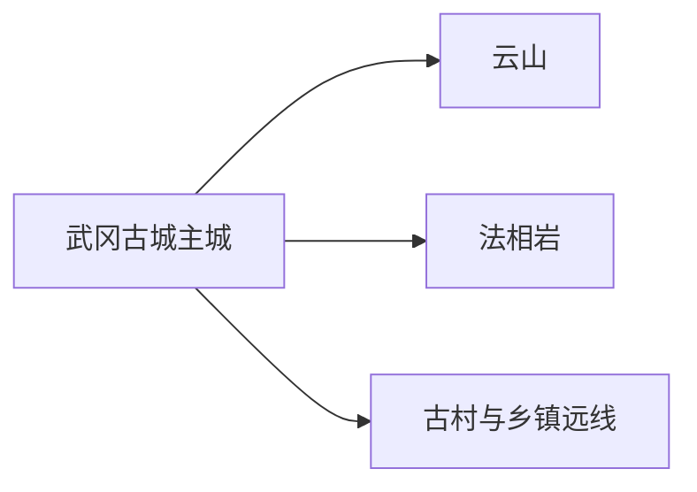
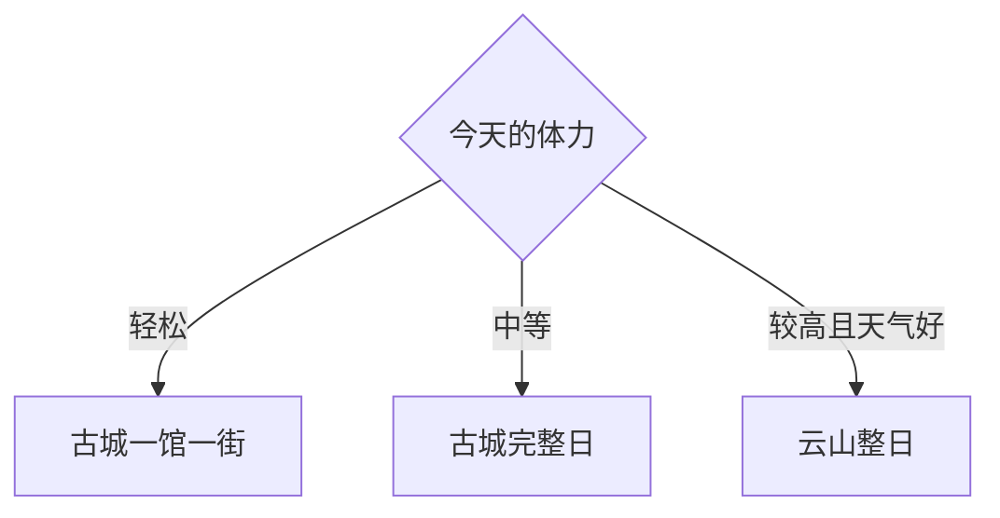

# 武冈旅行指南

武冈是邵阳代管的县级市，适合用“古城—云山—法相岩”三条线认识：主城看城墙、文庙、中山堂和地方饮食，云山留给完整山地日，法相岩与古村按开放和交通择一。这里的优势不是景点密度，而是历史城镇、湘西南山地和卤味饮食能在两三天内形成完整主题。

> 建议停留：2–3 天；云山单列完整 1 天 
> 旅行关键词：武冈古城、云山、法相岩、中山堂、文庙、古城墙、铜鹅、卤菜 
> 主要体力：主城低至中等；云山与洞穴方向较高 
> 最近研究：2026-08-13

## 城市速览

| 项目 | 旅行信息 |
|---|---|
| 主要旅行价值 | 从古城遗存、近现代建筑与地方博物线索理解武冈，再用云山补足湘西南山地自然体验 |
| 建议停留 | 1 天完成古城核心；2 天加入云山；3 天再选法相岩或一处古村远线 |
| 较舒适季节 | 春秋更适合主城与登山；梅雨和盛夏按降雨、高温调整户外时段 |
| 预算特点 | 城区餐饮和普通住宿较易控制；云山门票接驳、远线车辆与专题住宿是主要增量 |
| 步行强度 | 古城可分段步行，云山有持续坡道，洞穴和古村可能有湿滑石阶 |
| 主要天气风险 | 强降雨、雷暴、高温、山洪、雾天与森林火险 |
| 独行旅行 | 城区用餐与叫车较方便；云山和村镇远线先落实返程 |
| 亲子旅行 | 古城场馆或云山游客服务区可择一；洞穴、临水和长台阶按年龄判断 |
| 长者与低体力旅行 | 采用中山堂—文庙外观—城市午餐的一馆短线；云山只选接驳可达核心段 |
| 无障碍信息 | 城区新建公共设施可先询问；古建、城墙、山地和洞穴连续性资料有限，设施连续性需向官方确认 |

## 城市格局与游览区域

武冈市法定行政代码为 `430581`，由邵阳市代管。固定 GeoNames `1791272` 是武冈主城点；Wikidata `Q1344873` 表达法定武冈市，并同时列有城市点 `1791272` 与行政记录 `1791269`。本页保留固定点作为索引，以法定市域为旅行边界。

| 区域 | 主要内容 | 游览特点 | 与其他区域的关系 |
|---|---|---|---|
| 古城—都梁路主城 | 中山堂、文庙、古城墙遗存、凌云塔、地方生活 | 可分段步行，古建开放需逐处确认 | 住宿与餐饮首选基地 |
| 云山方向 | 云山国家森林公园、胜力寺等正式游线 | 山地整日，坡道与天气影响明显 | 从主城往返，宜早出发 |
| 法相岩方向 | 岩溶、洞穴与城市近郊自然 | 湿滑、照明和开放边界决定体验 | 可作半日至一日，不与云山同日 |
| 古村与乡镇 | 浪石等传统村落、茶马与乡村线索 | 接待、道路与开放变化较大 | 先选一个有明确接待的远点 |

古城墙、古桥、祠庙和传统村落具有文保属性时，游览以公开街巷、正式入口和管理方开放范围为准。云山林区执行防火与生态管理；洞穴、河沟和乡村生产道路按天气和现场指引活动。

## 主要景点

### 古城与公共文化

| 景点 | 区域 | 类型 | 主要看点 | 建议用时 | 室内外 | 体力 | 预约风险 | 天气影响 | 优先级 |
|---|---|---|---|---:|---|---|---|---|---|
| 武冈中山堂 | 主城 | 近现代建筑 | 城市公共史与近现代建筑空间 | 1–2 小时 | 混合 | 低 | 中高 | 低 | A |
| 武冈文庙 | 主城 | 文庙与古建 | 地方文教传统、院落和建筑 | 1–2 小时 | 混合 | 低至中 | 高 | 中 | A |
| 武冈古城墙与古城公开段 | 主城 | 城防遗存与街区 | 城市格局、城门和生活街巷 | 2–3 小时 | 室外为主 | 中 | 中 | 高 | A |
| 凌云塔公开观景范围 | 城区 | 古塔与城市地标 | 古塔外观与城市空间关系 | 1–1.5 小时 | 室外 | 低至中 | 中 | 高 | B |

### 山地、岩溶与乡村

| 景点 | 区域 | 类型 | 主要看点 | 建议用时 | 室内外 | 体力 | 预约风险 | 天气影响 | 优先级 |
|---|---|---|---|---:|---|---|---|---|---|
| 云山国家森林公园 | 城南方向 | 山地森林与人文 | 山林、步道、胜力寺及正式观景线 | 1 天 | 室外为主 | 高 | 中高 | 很高 | A |
| 法相岩正式开放区 | 城郊 | 岩溶与洞穴 | 岩溶地貌、洞穴和近郊自然 | 3–5 小时 | 混合 | 中高 | 高 | 高 | B |
| 浪石古村当期开放区 | 市域乡村 | 传统村落 | 古民居、村落格局与乡土文化 | 半日至一日 | 混合 | 中 | 高 | 高 | C |
| 黄埔军校第二分校旧址相关开放点 | 市域 | 近现代史 | 军校史与地方近现代记忆 | 2–3 小时另计往返 | 混合 | 中 | 高 | 中 | C |

## 美食与餐饮

武冈城区适合集中尝试卤味、米粉和铜鹅。卤味按小份拼盘更适合独行；铜鹅多为多人菜，可先问半份或改点以鹅肉入菜的小份菜。

| 菜品或餐饮类型 | 常见区域 | 一个人用餐与常见份量 | 风味、过敏原与饮食限制 | 排队风险与替代方法 |
|---|---|---|---|---|
| 武冈卤菜 | 主城熟食店与餐馆 | 可按重量少量拼配 | 常含酱油、大豆、小麦、糖、香辛料与较高盐分 | 选有标签或明码标价的正规店，先买小份 |
| 武冈铜鹅 | 城区正餐馆 | 通常多人共享 | 骨肉、辣椒、油脂与酱料过敏原按店确认 | 单人改点鹅肉米粉或小份菜 |
| 米粉与早餐 | 主城生活街区 | 一碗适合独行 | 汤底、花生、芝麻、肉臊和辣度可调整 | 早餐高峰换邻近社区店 |
| 血浆鸭等湘西南家常菜 | 城区与镇区 | 共享菜，先问小份 | 禽肉、血制品、辣椒和油盐较高 | 不适应者改点清炒时蔬、蒸菜或面饭 |

## 经典行程

### 一日经典路线

**路线**：中山堂 → 古城公开街巷 → 城区午餐 → 文庙 → 凌云塔外观

- **串联逻辑**：围绕主城历史轴步行与短途乘车，形成近现代—城防—文教线索。
- **预约锚点**：中山堂、文庙内部开放与讲解。
- **休息安排**：午餐放在主城成熟街区，下午在场馆或公园休息。
- **时间不足时**：删除凌云塔，只保留中山堂、古城与文庙。

### 两日城市路线

**第 1 天**：古城完整日 
**第 2 天**：云山游客入口 → 正式主游线 → 原路返回

- **串联逻辑**：一天城市史、一天山地自然，住宿保持主城不变。
- **预约锚点**：云山开放、交通、索道或接驳当期信息。
- **休息安排**：第二天在正式游客服务区休息和补给。
- **时间不足时**：云山只走核心短线；只有一天时保留古城日。

### 三日深度路线

**第 1 天**：古城 
**第 2 天**：云山 
**第 3 天**：法相岩或浪石古村二选一

- **串联逻辑**：第三天按岩溶或乡村兴趣选一，不把分散远点连成赶路环线。
- **预约锚点**：第三日目标的开放、接待与车辆。
- **休息安排**：在主城或目的地所在镇区安排午餐。
- **时间不足时**：整段删除第三天；不压缩云山。

### 雨天路线

**路线**：中山堂 → 城区午餐 → 文庙当期开放室内段或地方公共文化场馆

- **适用条件**：普通降雨；暴雨、雷电和积水时减少移动。
- **预约锚点**：场馆开放与临时闭馆。
- **休息安排**：以城区室内空间为主。
- **时间不足时**：只留一座确认开放的场馆。

### 亲子或低体力路线

**亲子路线**：中山堂或公共文化场馆 → 午休 → 古城短段 
**低体力路线**：车辆到中山堂 → 城区午餐 → 文庙入口核心段

- **减负方式**：亲子减少长讲解和临水点；低体力线用车辆替代跨城步行并避开登山。
- **预约锚点**：场馆儿童规则、无障碍入口和下客点。
- **休息安排**：主城餐馆与场馆座椅。
- **时间不足时**：两线均只留中山堂或文庙一处。

### 远郊一日路线

**路线**：主城出发 → 浪石古村或黄埔军校第二分校相关开放点二选一 → 镇区午餐 → 返回

- **适用条件**：已确认开放接待、道路和返程。
- **预约锚点**：管理方、讲解和车辆。
- **休息安排**：在镇区正规餐馆休息。
- **时间不足时**：整段取消，改为法相岩或主城半日。

## 住宿区域

| 区域 | 优点 | 缺点 | 适合人群 | 交通特点 |
|---|---|---|---|---|
| 武冈主城 | 餐饮、车站、叫车和古城方便 | 到云山与乡村仍需车辆 | 首访、独行、多日往返 | 默认住宿基地 |
| 云山入口周边 | 便于早进山 | 餐饮和夜间服务较少 | 山地专题且已确认运营 | 核对入口、接驳与返程 |
| 乡镇正规住宿 | 减少远线往返 | 品质、消防与夜间交通差异大 | 有明确接待的古村专题 | 预订前确认资质、热水、停车与退改 |

## 市内交通

| 场景 | 建议与取舍 | 行前需要重查的内容 |
|---|---|---|
| 从铁路或机场门户抵达 | 武冈以公路客运为主，可从邵阳等枢纽换乘；机场航班按当期查询 | 到发站、班次、末班与行李接驳 |
| 主城移动 | 步行集中在古城短段，跨点用公交或正规叫车 | 道路施工、上客点、夜间车辆 |
| 前往云山 | 景区交通或正规车辆更稳 | 入口、接驳、停车、防火和返程 |
| 前往古村与乡镇 | 先确定回程再出发 | 城乡班次、道路、通信与接待状态 |
| 自驾 | 对远线更灵活 | 山路、暴雨、停车和疲劳驾驶 |

## 不同旅行者须知

| 旅行维度 | 可行条件 | 主要取舍 | 需额外核对 |
|---|---|---|---|
| 独行旅行 | 主城方便独立组织 | 远线先锁返程 | 末班、夜间叫车、通信 |
| 亲子旅行 | 城区场馆与云山核心段可择一 | 洞穴、临水与长台阶按年龄减量 | 儿童票、照明、护栏与医务点 |
| 长者或低体力旅行 | 一馆一古建加车辆移动 | 云山与洞穴换成短线 | 台阶、接驳、座椅与最近下客点 |
| 无障碍需求 | 主城现代公共设施可询问 | 古建与山地连续性有限 | 设施连续性需向官方确认 |
| 摄影旅行 | 古城与山地题材清楚 | 文保、宗教和商业拍摄有规则 | 三脚架、无人机、闪光灯 |
| 预算有限 | 主城日易控费 | 远线车辆与景区是增量 | 门票、接驳、拼车资质和退改 |
| 特殊天气 | 雨天转主城场馆 | 云山、洞穴与河谷受影响大 | 气象预警、山洪、防火与闭园 |

## 行前核对

| 核对事项 | 为什么需要重查 | 建议核对时间 | 官方入口 |
|---|---|---|---|
| 云山开放与交通 | 防火、雷雨、维护和接驳会调整 | 出发前三日及当天 | [武冈市政府](https://www.wugang.gov.cn/) |
| 古城场馆 | 古建内部开放、修缮与讲解会变化 | 出发前一周 | [武冈市政府市情](https://www.wugang.gov.cn/wugang/nsqjs/list_ttnew.shtml) |
| 远线村落与旧址 | 接待和道路并非常态固定 | 排入路线前 | [武冈市政府](https://www.wugang.gov.cn/) |
| 城际交通 | 客运与铁路换乘班次变化 | 订票时及当天 | [中国铁路 12306](https://www.12306.cn/) |
| 天气与自然风险 | 山地、洞穴和乡村道路对强降雨敏感 | 出发前三日及当天 | [湖南省气象局](https://hn.cma.gov.cn/) |

## 来源与更新记录

### 主要来源

| 来源 | 类型 | 支持内容 | 核验日期 |
|---|---|---|---|
| [武冈市情与景观](https://www.wugang.gov.cn/wugang/nsqjs/list_ttnew.shtml) | 市政府 | 云山、法相岩、中山堂、古城墙、文庙、浪石及地方饮食 | 2026-08-13 |
| [武冈市“十四五”规划](https://www.wugang.gov.cn/wugang/nghjl/202109/e22f1e6b9d4c475b8cfe1511af71dc96/files/f014b775d1054b148af4b2c19136aeed.pdf) | 市政府规划 | 城市格局、交通与文化旅游方向 | 2026-08-13 |
| [武冈市乡村旅游规划](https://www.wugang.gov.cn/jc_wgs/uploadfiles/202310/2023101011022182438.pdf) | 市政府规划 | 云山—古城核心与乡村远线 | 2026-08-13 |
| [湖南省文物保护单位资料](https://wwj.hunan.gov.cn/wwj/c100310/c100314/202502/33595483/files/79a815e8428a409184e90b4e1fb83be2.pdf) | 省文物局 | 古城三桥、胜力寺等文保身份 | 2026-08-13 |
| [武冈文旅发展动态](https://www.wugang.gov.cn/wugang/wglddt/202505/606c6ed1aadc41e7a59ac08f792c9be2.shtml) | 市政府 | 当期文旅建设与运营核对背景 | 2026-08-13 |
| [武冈自然地理](https://www.wugang.gov.cn/wugang/nzrdl/201912/13f2df62c736441085f71b19be6ed060.shtml) | 市政府 | 山地、森林与气候背景 | 2026-08-13 |
| [GeoNames 1791272](https://www.geonames.org/1791272/) | 开放地理数据 | 固定城市点与坐标 | 2026-08-13 |
| [Wikidata Q1344873](https://www.wikidata.org/wiki/Q1344873) | 开放结构化数据 | 法定武冈市、代码与双 GeoNames 记录 | 2026-08-13 |

### 更新记录

| 日期 | 更新内容 |
|---|---|
| 2026-08-13 | 首次完成武冈市独立旅行研究；建立古城、云山、法相岩与乡村远线，补充卤菜铜鹅、住宿交通、山洪防火、文保和生产边界 |
