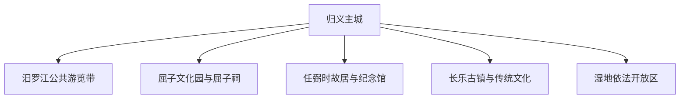
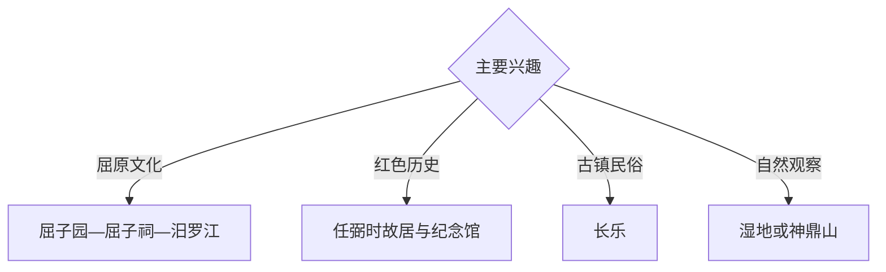

# 汨罗旅行指南

汨罗位于洞庭湖东南岸，以汨罗江与屈原文化、任弼时故居与纪念馆、长乐传统文化和湿地生态形成清晰旅行主线。固定快照中的 **Miluo / GeoNames 1800531** 锚定归义主城；屈子文化园、弼时镇和长乐镇需要分方向安排。

## 城市速览

| 项目 | 信息 |
|---|---|
| 主线 | 归义主城—汨罗江—屈子文化园—任弼时纪念馆—长乐 |
| 停留 | 屈原文化 1 天；红色文化或长乐专题各加半天至 1 天 |
| 住宿 | 归义主城接驳便利；活动期宜提前订房 |
| 交通 | 铁路、公路抵达，远郊宜公交、约车或自驾 |
| 季节 | 春秋舒适；端午氛围浓，夏季关注洪水和高温 |
| 预算 | 主城灵活，节庆、讲解与远郊车辆增加预算 |

## 城市格局与游览区域

归义主城承担交通、住宿和城市服务；屈子文化园连接屈原纪念体系与汨罗江文化，弼时镇承接红色历史，长乐镇适合地方传统与甜酒专题。河道、湿地、堤防、龙舟训练水域和文物本体按开放及管理要求进入。

## 主要景点

| 景点 | 区域 | 类型 | 核心体验 | 用时 | 环境 | 体力 | 研究价值 | 拥挤 | 优先级 |
|---|---|---|---|---:|---|---|---|---|---|
| 屈子文化园 | 屈子祠方向 | 文化景区 | 屈原生平、楚辞文化与纪念空间 | 半天至 1 天 | 混合 | 中 | 很高 | 端午高 | A |
| 屈子祠 | 屈子文化园 | 文物与纪念 | 建筑、祭祀传统与地方记忆 | 1–2 小时 | 混合 | 低中 | 很高 | 节庆高 | A |
| 汨罗江公共游览带 | 主城及屈子方向 | 河流与文化 | 江景、龙舟文化与滨水空间 | 2–3 小时 | 室外 | 低 | 很高 | 端午高 | A |
| 任弼时故居与纪念馆 | 弼时镇 | 红色文化 | 生平史料、故居和革命历史 | 半天 | 混合 | 低 | 很高 | 节假日中 | A |
| 长乐古镇公开区 | 长乐镇 | 古镇与民俗 | 故事会、街巷和甜酒文化 | 半天 | 混合 | 低中 | 高 | 活动时高 | B |
| 神鼎山依法开放区 | 东部山地 | 山岳与生态 | 登高、森林和乡村景观 | 半天至 1 天 | 室外 | 中高 | 中高 | 季节性 | B |
| 洞庭湿地正规观察点 | 西部方向 | 湿地与观鸟 | 湖区生态、候鸟与水文环境 | 半天 | 室外 | 低 | 高 | 鸟季中 | B |

## 美食与餐饮

长乐甜酒、粽子、湖区水产、腊味和湘北米粉适合结合线路体验。端午食品优先选择正规门店；水产按禁捕与市场规范消费，湿地和堤防游览自备饮水并带走垃圾。

## 经典行程

### 屈原文化一日线
**路线**：归义主城—屈子文化园—屈子祠—汨罗江公开岸段—返城。**逻辑**：用完整一天串联人物、文本与地方记忆。**预约锚点**：场馆和讲解。**休息**：文化园服务区。**删除条件**：高温或暴雨时压缩滨水段。

### 汨罗江端午线
**路线**：主城—节庆公开活动区—龙舟观赛点—文化展陈。**逻辑**：围绕官方活动理解端午传统。**预约锚点**：活动日程、票务和交通。**休息**：主城。**删除条件**：水位、天气或安保调整时服从现场安排。

### 任弼时专题线
**路线**：主城—任弼时故居—纪念馆—弼时镇公共空间。**逻辑**：以史料和原址构成红色历史专题。**预约锚点**：纪念馆开放。**休息**：弼时镇。**删除条件**：闭馆日顺延。

### 长乐民俗线
**路线**：主城—长乐古镇公开区—传统文化活动点—正规甜酒体验。**逻辑**：把街巷、故事会与地方产业结合。**预约锚点**：活动和接待。**休息**：长乐镇。**删除条件**：无活动时缩短为半天。

### 湿地观鸟线
**路线**：主城—正规湿地观察点—堤岸公开段—返程。**逻辑**：以低干扰方式观察洞庭湖区生态。**预约锚点**：水位、鸟讯和开放。**休息**：管理服务点。**删除条件**：洪水、浓雾或湿地管制时取消。

### 亲子低体力线
**路线**：屈子文化园室内展陈—午餐—汨罗江公共空间短段。**逻辑**：文化学习与轻量户外平衡。**预约锚点**：亲子活动。**休息**：文化园。**删除条件**：雨天保留室内部分。

### 三日组合线
**路线**：首日屈原文化；次日任弼时专题；第三日长乐或湿地。**逻辑**：文学、历史和民俗生态分日。**预约锚点**：场馆和第三日天气。**休息**：归义主城连续住宿。**删除条件**：两天时删第三日。

## 住宿区域

归义主城适合铁路接驳、餐饮和多方向出发；节庆期间优先确认交通管制与退改。屈子、弼时和长乐方向选择有正式资质的住宿及接待点。

## 市内交通

汨罗站、汨罗东站的车次和位置不同，购票后核对终到站。屈子文化园、弼时镇和长乐镇不在同一方向，按主题分日；端午期间以官方接驳和临时交通公告为准。

## 不同旅行者须知

文学旅行者给屈子文化园半天以上；历史研究者优先预约任弼时纪念馆；亲子和长者选择场馆与滨水平缓段；观鸟者保持距离并降低噪声。文物本体、湿地核心保护范围、禁捕水域、堤防作业区和龙舟训练水域保留明确限制。

## 行前核对

- 核对屈子文化园、屈子祠与任弼时纪念馆开放。
- 核对端午活动、龙舟赛、交通管制与现场容量。
- 核对长乐活动、湿地观察点、水位与鸟季信息。
- 核对铁路站点、暴雨、洪水、雷电和高温预警。

## 来源与更新记录

| 来源 | 支持内容 | 核验日期 |
|---|---|---|
| [汨罗市政府：旅游资源](https://miluo.gov.cn/25214/25218/28529/content_1802254.html) | 汨罗江、屈子文化园、屈子祠、神鼎山、龙舟与湿地资源 | 2026-09-03 |
| [汨罗市政府：任弼时纪念馆](https://www.miluo.gov.cn/25214/25218/28529/content_650440.html) | 任弼时故居和纪念馆专题 | 2026-09-03 |
| [GeoNames 1800531](https://www.geonames.org/1800531/) | Miluo 固定人口点与汨罗主城位置 | 2026-09-03 |

