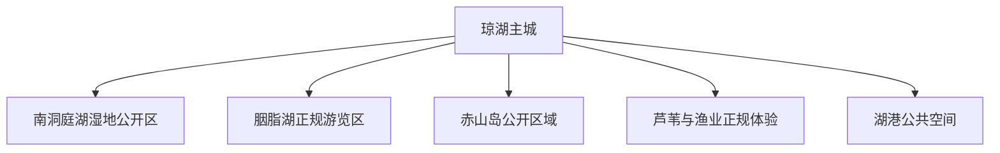
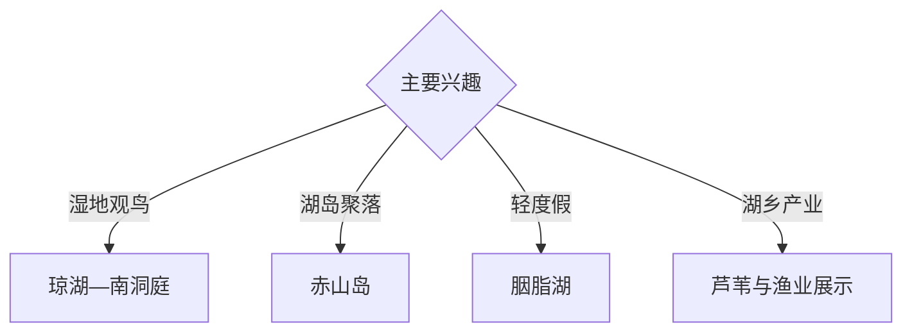

# 沅江旅行指南

沅江位于南洞庭湖腹地，以琼湖主城、南洞庭湿地、胭脂湖、赤山岛和芦苇湖乡产业景观形成典型湖区旅行体系。固定快照中的 **Qionghu / GeoNames 1797543** 锚定琼湖主城；湖岛、湿地和水上线路受水位、航运及保护管理共同影响。

## 城市速览

| 项目 | 信息 |
|---|---|
| 主线 | 琼湖主城—南洞庭湖湿地—胭脂湖—赤山岛—湖乡产业 |
| 停留 | 主城与湿地 1–2 天；赤山岛或胭脂湖另留 1 天 |
| 住宿 | 琼湖主城服务完整；湖区选择正规接待点 |
| 交通 | 公路抵达，湖岛及远郊宜正规车辆和持证船舶 |
| 季节 | 秋冬适合观鸟；汛期关注水位、风浪和交通调整 |
| 预算 | 主城灵活，包车、船务、讲解和湖区住宿增加预算 |

## 城市格局与游览区域

琼湖主城承担住宿、餐饮和陆路接驳；南洞庭湖适合生态观察，胭脂湖承担休闲游览，赤山岛体现湖岛聚落与地貌。湿地核心区、候鸟栖息地、禁捕水域、芦苇生产区、航道和堤防作业区按管理公告保持边界。

## 主要景点

| 景点 | 区域 | 类型 | 核心体验 | 用时 | 环境 | 体力 | 研究价值 | 拥挤 | 优先级 |
|---|---|---|---|---:|---|---|---|---|---|
| 湖南琼湖国家湿地公园开放区 | 琼湖周边 | 湿地与城市生态 | 湖泊湿地、科普与近城观鸟 | 半天 | 室外 | 低 | 很高 | 鸟季中 | A |
| 南洞庭湖正规观察点 | 湖区 | 湿地与观鸟 | 洞庭水文、候鸟和洲滩景观 | 半天至 1 天 | 室外 | 低中 | 很高 | 鸟季中 | A |
| 胭脂湖正规游览区 | 胭脂湖方向 | 湖泊与休闲 | 湖岸景观、水乡休闲和轻度假 | 半天 | 室外 | 低 | 中高 | 周末中 | B |
| 赤山岛公开区域 | 赤山岛 | 湖岛与聚落 | 大型内陆岛屿、丘岗和湖乡生活 | 1 天 | 混合 | 中 | 很高 | 节假日中 | A |
| 琼湖主城公共空间 | 琼湖 | 城市与湖港 | 湖城生活、港口记忆与夜间散步 | 2–3 小时 | 混合 | 低 | 中 | 晚间中 | B |
| 正规芦苇产业体验点 | 湖区接待点 | 农业与产业 | 芦苇生长、收储与湖区产业 | 半天 | 混合 | 低 | 高 | 预约制 | B |
| 正规渔业与湖鲜展示点 | 主城及乡镇 | 饮食与产业 | 洞庭水产、禁捕转型与餐饮文化 | 2–3 小时 | 混合 | 低 | 中高 | 用餐时中 | B |

## 美食与餐饮

沅江芦笋、湖藕、银鱼等湖区食材和家常湘菜适合在正规餐馆体验。水产消费核对合法来源与时令供应；湿地日携带饮水，尊重禁捕制度和野生动物保护要求。

## 经典行程

### 主城湿地线
**路线**：琼湖主城—琼湖湿地公园开放区—湖港公共空间。**逻辑**：从城市尺度进入洞庭湖生态。**预约锚点**：湿地开放和科普活动。**休息**：主城。**删除条件**：暴雨或水位异常时保留城市段。

### 南洞庭观鸟线
**路线**：主城—正规观察点—公开堤岸—返程。**逻辑**：以低干扰方式观察候鸟和洲滩。**预约锚点**：鸟讯、水位和向导。**休息**：管理服务点。**删除条件**：大风、浓雾、洪水或管制时取消。

### 赤山岛一日线
**路线**：主城—正规交通节点—赤山岛公开区域—返程。**逻辑**：独立一天理解湖岛地貌与聚落。**预约锚点**：车辆、船务和天气。**休息**：岛上正规接待点。**删除条件**：风浪或交通停运时顺延。

### 胭脂湖休闲线
**路线**：主城—胭脂湖正规游览区—湖岸慢行—返程。**逻辑**：以低体力方式体验湖区景观。**预约锚点**：开放和接驳。**休息**：游客服务区。**删除条件**：强对流或岸线维护时改主城。

### 湖乡产业线
**路线**：主城—预约制芦苇展示—正规水产市场或展厅。**逻辑**：从生产与流通理解湖区生计转型。**预约锚点**：企业和社区接待。**休息**：乡镇正规餐饮。**删除条件**：生产区无接待时保留公开展厅。

### 亲子低体力线
**路线**：琼湖湿地科普—午餐—主城湖岸短段。**逻辑**：自然教育与城市休闲兼顾。**预约锚点**：科普活动。**休息**：主城。**删除条件**：雨天选择室内公共文化空间。

### 三日组合线
**路线**：首日主城与琼湖；次日南洞庭或赤山岛；第三日胭脂湖与产业体验。**逻辑**：湿地、湖岛和产业分日。**预约锚点**：水位、船务和接待。**休息**：琼湖主城连续住宿。**删除条件**：两天时删第三日。

## 住宿区域

琼湖主城适合陆路接驳、餐饮和天气变化下调整计划；湖岛和乡镇选择有正式资质的住宿。订房核对防汛安排、夜间交通、消防、停车及船务取消后的退改。

## 市内交通

沅江以公路接驳为主，从益阳等交通节点转入时核对末班车。南洞庭、胭脂湖和赤山岛分方向安排；水上交通选择合规码头、持证船舶和救生设施齐备的运营方。

## 不同旅行者须知

观鸟者携带望远镜并保持观察距离；亲子和长者优先琼湖及胭脂湖平缓区域；摄影者关注清晨光线与返程交通；产业研究者提前联系正规接待点。湿地核心区、禁捕水域、航道、芦苇收割作业区、堤防工程区和未经批准的洲滩保留明确限制。

## 行前核对

- 核对琼湖、南洞庭、胭脂湖与赤山岛开放信息。
- 核对水位、风浪、船务、道路与防汛交通公告。
- 核对鸟季、湿地管理、禁捕和生态保护要求。
- 核对住宿、返程车辆、雷雨、浓雾与高温预警。

## 来源与更新记录

| 来源 | 支持内容 | 核验日期 |
|---|---|---|
| [益阳市政府：沅江概况](https://www.yiyang.gov.cn/yiyang/1/6/12/content_235.html) | 湖泊、赤山岛、水产、港口与湖区地理 | 2026-09-03 |
| [湖南省文化和旅游厅：沅江湿地与湖区资源](https://whhlyt.hunan.gov.cn/whhlyt/rdjy/202208/t20220815_27583187.html) | 琼湖国家湿地公园、胭脂湖与南洞庭湖湿地 | 2026-09-03 |
| [GeoNames 1797543](https://www.geonames.org/1797543/) | Qionghu 固定人口点与沅江主城位置 | 2026-09-03 |

