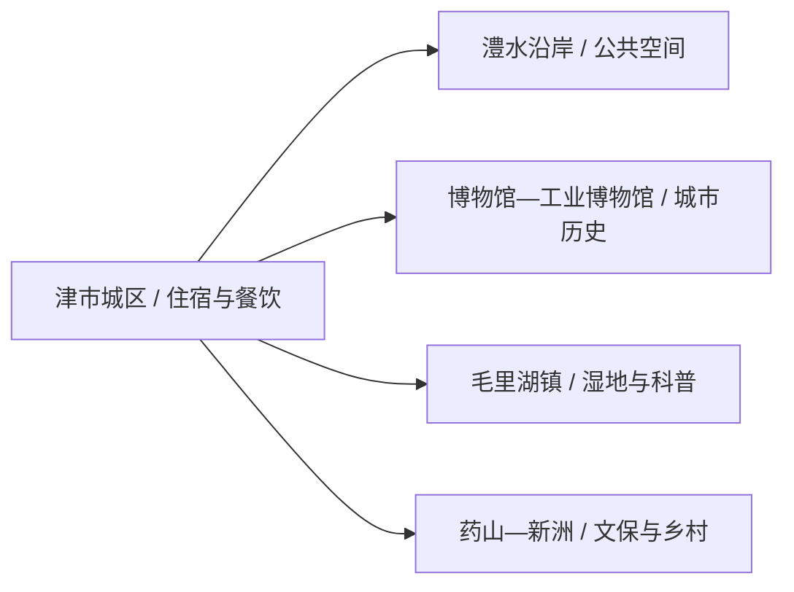
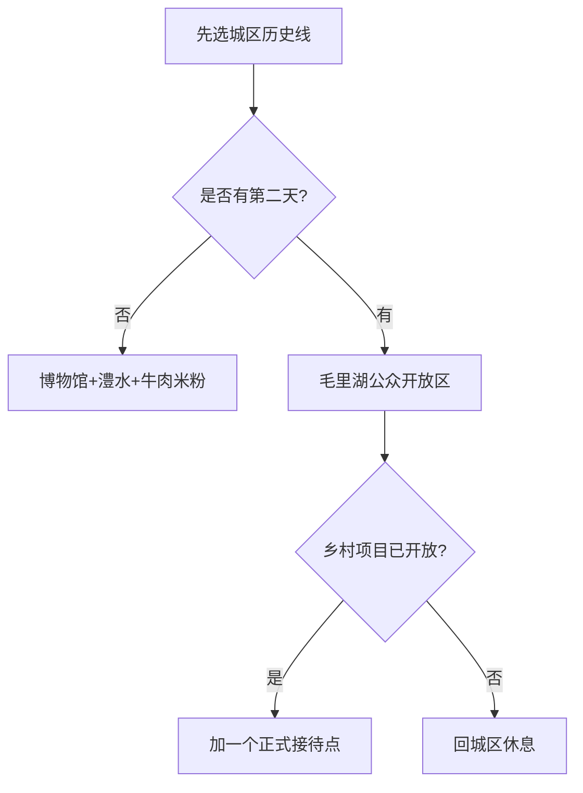

# 津市旅行指南

津市适合用一碗牛肉米粉开始：先在澧水城区看博物馆、工业记忆与城市公共空间，再把毛里湖作为独立半日至一天。药山、虎爪山等方向按当期开放选择，把时间留给已有正式接待的区域。

> 建议停留：城区 1 天；加入毛里湖与乡村方向为 2 天 
> 旅行关键词：津市牛肉米粉、澧水、毛里湖、工业记忆、车胤与孟姜女文化 
> 无障碍说明：城区现代场馆与公园可优先询问坡道、电梯和轮椅；湿地、乡村与文保点的设施连续性需向官方确认

## 城市速览

| 项目 | 旅行信息 |
|---|---|
| 主要旅行价值 | 小城餐饮、博物馆与工业史、澧水城市生活、毛里湖湿地和乡村文化 |
| 建议停留 | 1–2 天；毛里湖独立半日至一天 |
| 舒适季节 | 春秋适合步行；夏季清晨和傍晚更舒适，汛期关注水情 |
| 预算特点 | 城区消费较易控制；往返毛里湖、活动和乡村接驳是增量 |
| 步行强度 | 城区低至中；湖区和乡村中等 |
| 天气风险 | 高温、强降雨、雷电、湖岸大风、汛期水情 |
| 独行旅行 | 城区适合独行，湖区先确认返程车辆 |
| 亲子旅行 | 博物馆、工业博物馆和毛里湖科普项目适合分段安排 |
| 长者与低体力 | 城区一馆一公园，湖区只走游客服务点附近短线 |
| 行前重点 | 场馆开放、毛里湖活动、水情、返程交通、项目建设状态 |

## 城市格局与游览区域

津市是常德市代管的法定县级市，代码 `430781`。主城区沿澧水展开，博物馆、工业记忆与城市餐饮较集中；毛里湖、药山、新洲等乡镇方向需要车辆。

| 区域 | 适合安排 | 怎么选择 | 时间尺度 |
|---|---|---|---|
| 津市城区 | 市博物馆、工业博物馆、牛肉米粉、澧水公共岸线 | 住城区，场馆与餐饮步行或短程车辆连接 | 1 天 |
| 毛里湖方向 | 国家湿地公园相关公众开放区、植物园与宣教展示 | 先核开放和活动，独立半日至一天 | 半日至 1 天 |
| 药山方向 | 药山文化、乡村与规划中的旅游项目 | 只选已明确开放和接待的点 | 半日至 1 天 |
| 新洲及北部乡村 | 红色旧址、地方历史与乡村文化 | 提前联系属地，按文保开放安排 | 半日至 1 天 |

GeoNames `1805379` 是固定库存中的津市驻地点；法定实体为 Wikidata `Q1374715`、代码 `430781`，该实体目前未配置 `P1566`。固定点只用于定位，不替代县级市行政边界。

## 主要景点

### 城区与澧水

| 景点 | 区域 | 类型 | 主要看点 | 建议用时 | 室内外 | 体力 | 预约风险 | 天气影响 | 优先级 |
|---|---|---|---|---:|---|---|---|---|---|
| 津市市博物馆 | 城区 | 地方博物馆 | 城市历史、地方文化与文物展陈 | 2–3 小时 | 室内 | 低 | 高 | 低 | A |
| 津市工业博物馆 | 城区 | 工业主题博物馆 | 小城工业发展、食品与制造业记忆 | 1.5–2.5 小时 | 室内 | 低 | 高 | 低 | A |
| 红二军团指挥部旧址陈列馆 | 城区或属地旧址 | 红色文化 | 红军历史与地方革命记忆 | 1–2 小时 | 混合 | 低至中 | 高 | 中 | B |
| 澧水公共岸线代表段 | 城区 | 城市滨水 | 港埠城市格局、望江与日常生活 | 1–2 小时 | 室外 | 低 | 低 | 高 | B |
| 落雁湖公园 | 城区 | 城市公园 | 休息、短步行与城市绿地 | 1–2 小时 | 室外 | 低 | 低 | 高 | C |

### 毛里湖与乡村

| 景点 | 区域 | 类型 | 主要看点 | 建议用时 | 室内外 | 体力 | 预约风险 | 天气影响 | 优先级 |
|---|---|---|---|---:|---|---|---|---|---|
| 毛里湖公众开放区与宣教展示馆 | 毛里湖镇 | 湿地、科普 | 湖泊湿地、生态教育与公众游览边界 | 3–5 小时 | 混合 | 中 | 高 | 很高 | A |
| 毛里湖植物园当期开放区 | 毛里湖镇 | 植物、亲子 | 植物科普、油茶与季节花木 | 2–4 小时 | 室外为主 | 中 | 高 | 很高 | B |
| 药山镇正式开放文化点 | 药山镇 | 乡村、文化 | 药山文化与乡村景观 | 半日 | 混合 | 中 | 很高 | 高 | C |

毛里湖的湿地、植物园、宣教馆和赛事场地按同一湖区组织，不拆成多个完整目的地。2026 年报告中的虎爪山基地、药山景区和天河幻境等项目需以正式开放公告为准，规划或建设信息不直接转化为游客入口。

## 美食与餐饮

| 类型 | 怎么点 | 份量与过敏原 | 选择建议 |
|---|---|---|---|
| 津市牛肉米粉 | 一人一碗，可选清炖、红烧或麻辣 | 米粉本身通常无麸质，但汤底、酱料可能含小麦、大豆；含牛肉和油脂 | 先问辣度、牛肉部位与是否另加配料，再按位置和营业状态选店 |
| 炖粉与地方粉面 | 一人一份 | 汤底可能含猪骨、牛骨、辣椒和豆制品 | 早餐就近选营业稳定的粉馆 |
| 钵子菜 | 2–4 人共享 | 肉类、鱼类、豆制品和辣椒常见，共锅接触明显 | 先点小钵并确认计价，独食者可换小炒 |
| 毛里湖水产 | 多人共享更合适 | 鱼、虾、贝类过敏风险；整鱼注意重量 | 选择明码标价的正规餐馆，不自行捕捞 |

## 经典行程

### 一日经典路线

**路线**：津市市博物馆 → 牛肉米粉午餐 → 工业博物馆 → 澧水公共岸线

- **适用条件**：两馆开放，城区道路正常。
- **串联逻辑**：先看城市史，再看工业转型，最后回到澧水空间。
- **预约锚点**：场馆闭馆日、讲解与团队接待。
- **休息安排**：午餐后留完整坐休，岸线只走平缓短段。
- **时间不足时**：保留市博物馆与一顿牛肉米粉。

### 两日城市路线

**第 1 天**：城区博物馆—工业博物馆—澧水 
**第 2 天**：毛里湖公众开放区 → 宣教展示馆或植物园二选一 → 城区

- **适用条件**：毛里湖接待、天气和车辆已确认。
- **串联逻辑**：城市历史与湖区生态各占一天。
- **预约锚点**：湖区开放、科普活动和返程车辆。
- **休息安排**：湖区游客服务点午休，下午提早回城。
- **时间不足时**：第二天只走宣教馆附近短线。

### 三日深度路线

**第 1 天**：城区历史与工业线 
**第 2 天**：毛里湖生态线 
**第 3 天**：新洲红色旧址或药山正式开放点二选一

- **适用条件**：第三日属地已确认接待与开放。
- **串联逻辑**：城市、湿地和乡村文化逐日展开。
- **预约锚点**：文保点、乡村活动和往返车辆。
- **休息安排**：第三日午后回城区，不追加第二条乡村线。
- **时间不足时**：删除第三天，保持前两天完整。

### 雨天路线

**路线**：津市市博物馆 → 午餐 → 工业博物馆

- **适用条件**：城区无积水和防汛转移要求。
- **串联逻辑**：两座室内场馆形成完整城市认识线。
- **预约锚点**：场馆开放和临时活动。
- **休息安排**：午间坐休，场馆之间用车辆短接。
- **时间不足时**：只保留市博物馆。

### 亲子与低体力路线

**亲子路线**：市博物馆 → 午休 → 毛里湖宣教展示馆或植物园短线 
**低体力路线**：车辆到市博物馆 → 牛肉米粉午餐 → 落雁湖公园平缓段

- **减负方式**：湖区只走游客服务设施附近，不安排长距离环湖。
- **预约锚点**：亲子活动、电梯、轮椅、落客点和卫生间。
- **休息安排**：城区午休，下午只保留一个点。
- **时间不足时**：保留市博物馆，取消湖区或公园。

### 远郊路线

**路线**：津市城区 → 毛里湖镇 → 一个正式开放乡村项目 → 城区

- **适用条件**：接待、道路、天气和返程均已确认。
- **串联逻辑**：沿同一方向组合湖区与相邻乡村，减少折返。
- **预约锚点**：湖区活动、乡村接待与车辆。
- **休息安排**：毛里湖服务点完成午餐与坐休。
- **时间不足时**：取消乡村项目，只保留毛里湖。

## 住宿区域

| 区域 | 优点 | 取舍 | 适合人群 |
|---|---|---|---|
| 津市城区 | 餐饮、交通和场馆集中 | 到毛里湖仍需车辆 | 首访、短住、独行 |
| 澧水沿岸正规住宿 | 晚间散步方便 | 汛期水情、停车和噪声需确认 | 城市休闲、摄影 |
| 毛里湖周边合规住宿 | 便于清晨湖景与活动 | 房量、餐饮和夜间交通较少 | 湿地、赛事、乡村慢游 |
| 常德联程 | 大交通和住宿选择更多 | 每日往返会压缩津市时间 | 只做一日线者 |

## 市内交通

- 津市目前以公路交通为主，可从常德、澧县等方向换乘客运或合规车辆。
- 城区场馆和餐饮可用公交、出租车与短程步行连接；去毛里湖和乡镇先核班次或包车。
- 湖区赛事和节庆可能临时调整道路、停车和公共空间，按现场引导进入。
- 自驾避开堤防作业路、泵站、水厂和农业生产便道，把车辆停在正式停车区域。

## 不同旅行者须知

| 情况 | 怎么安排 | 重点核对 |
|---|---|---|
| 独行 | 住城区，湖区当日往返 | 末班、叫车范围和湖区信号 |
| 亲子 | 场馆与科普活动为主 | 活动年龄、护栏、亲水边界和卫生间 |
| 长者与低体力 | 一馆一公园，车辆分段 | 电梯、轮椅、座椅、落客点和防滑 |
| 美食旅行 | 以菜品类型选店 | 明码标价、牛肉和水产过敏原、盐油辣度 |
| 湖区活动 | 只参加运营方正式项目 | 水情、救生装备、天气、活动资质和保险 |

安全与生产边界：毛里湖按湿地、水域和赛事现场规则活动；堤防、水闸、泵站、农业基地、食品工厂与尚在建设的文旅项目保留生产或施工属性。

## 行前核对

| 项目 | 何时核对 | 官方入口 |
|---|---|---|
| 博物馆与工业博物馆 | 排行程时、到访前一日 | [津市市人民政府](https://www.jinshishi.gov.cn/)及文旅公告 |
| 毛里湖开放、活动与水情 | 订房前、前一日 | 津市政府、湿地管理和水务信息 |
| 公路客运与乡镇接驳 | 出发前一日 | 常德、津市交通运输部门与客运站 |
| 高温、雷雨与汛情 | 出发前三日起每日 | [湖南省气象局](http://hn.cma.gov.cn/)及应急、水利公告 |
| 无障碍条件 | 预约与订房时 | 场馆、景区、住宿与承运方 |

## 来源与更新记录

| 来源 | 支持内容 | 核验日期 |
|---|---|---|
| [津市市人民政府：走进津市](https://www.jinshishi.gov.cn/zjjs/lsyy) | 行政归属、澧水、牛肉米粉、毛里湖与产业背景 | 2026-08-13 |
| [津市市“十四五”文旅融合发展规划](https://www.jinshishi.gov.cn/group1/M00/01/D4/ClADFGRYodGAQ2DgACcEFyOVBP8172.pdf) | 城区、毛里湖、药山、文博与旅游布局 | 2026-08-13 |
| [津市市 2025 年政府工作报告](https://www.jinshishi.gov.cn/zwgk/public/6616338/2811394911.html) | 工业博物馆、落雁湖、毛里湖宣教展示馆开放信息 | 2026-08-13 |
| [津市市 2026 年政府工作报告](https://www.jinshishi.gov.cn/zwgk/public/6616338/3746263391.html) | 在建或计划项目边界、毛里湖和文旅动态 | 2026-08-13 |
| [民政部行政区划查询](https://dmfw.mca.gov.cn/xzqh/getList?code=43&trimCode=true&maxLevel=3) | `430781` 及常德代管关系 | 2026-08-13 |
| [GeoNames 1805379](https://www.geonames.org/1805379/jinshi.html) | 固定津市驻地点 | 2026-08-13 |
| [Wikidata Q1374715](https://www.wikidata.org/wiki/Q1374715) | 法定津市市实体 | 2026-08-13 |

| 日期 | 更新 |
|---|---|
| 2026-08-13 | 首次完成津市市指南；建立城区、毛里湖与乡村分区，补齐牛肉米粉、湿地、水情、项目开放和标识粒度。 |
