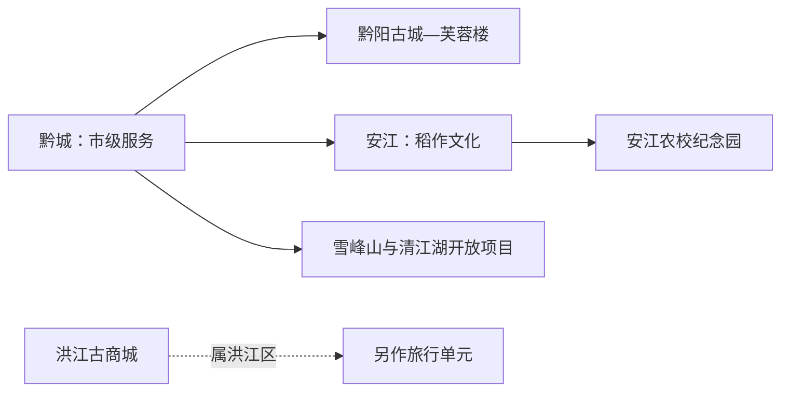
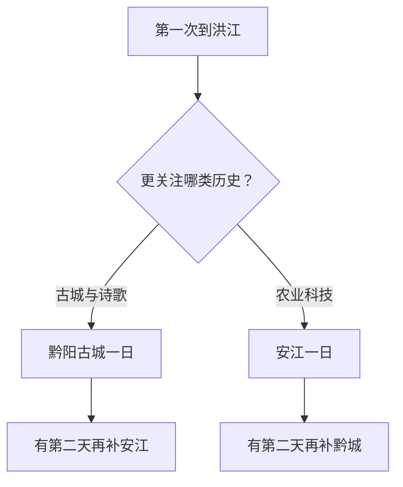

# 洪江旅行指南

洪江市的两条核心主线分别在黔城与安江：黔阳古城以沅水上游古城、芙蓉楼和街巷生活为主，安江农校纪念园讲述杂交水稻科研与农业教育史。两座城镇需要公路接驳；名称相近的洪江古商城位于怀化市洪江区，属于另一个行政与旅行单元。

## 城市速览

| 项目 | 信息 |
|---|---|
| 旅行主线 | 黔阳古城—芙蓉楼、安江农校纪念园、雪峰山与清江湖当期开放项目 |
| 建议停留 | 1 天选择黔城或安江；2 天完成双城；山地延伸再加 1 天 |
| 住宿基地 | 黔城便于古城与市级服务；安江便于稻作文化与东部方向 |
| 步行强度 | 古城中等且有石板门槛；纪念园低至中；山地中至高 |
| 主要天气 | 暴雨、山洪、滑坡、河流水位、高温湿热与冬季山路结冰 |
| 预约核心 | 古城场馆、纪念园讲解、县域车辆、山地景区与返程 |
| 边界重点 | 科研试验田、农业生产区、河岸、库区、林地与保护地按开放范围进入 |
| 无障碍 | 黔城石板路与古建连续性有限；安江先问落客、电梯、卫生间和轮椅 |

## 城市格局与游览区域

洪江市是怀化市代管的县级市，法定代码 `431281`。GeoNames `1808106` 与 Wikidata `Q762724` 对应洪江城市实体。市政府驻黔城，安江是重要城镇组团；洪江区及其洪江古商城由怀化市直接管理，本页不承接古商城。

| 区域 | 旅行价值 | 怎么安排 |
|---|---|---|
| 黔城城区 | 到达、住宿、城市服务与古城入口 | 首访基地 |
| 黔阳古城 | 沅水古城、芙蓉楼与传统街巷 | 留半日至一日 |
| 安江镇 | 稻作文化、城镇生活与纪念园 | 与黔城分半日以上处理 |
| 雪峰山方向 | 山地、森林与当期开放景区 | 天气稳定时独立一天 |
| 清江湖等水域项目 | 湖库景观与正式运营活动 | 先确认码头、船艇和水位 |

## 主要景点

| 景点 | 所在区域 | 类型 | 核心看点 | 建议用时 | 室内/室外 | 体力 | 预约难度 | 天气敏感度 | 适合旅程 |
|---|---|---|---|---|---|---|---|---|---|
| 黔阳古城 | 黔城 | 古城与历史街区 | 古城格局、传统建筑、地方生活与沅水关系 | 3–5 小时 | 混合 | 中 | 中 | 高 | A |
| 芙蓉楼 | 黔阳古城内 | 古建筑与文学 | 楼阁建筑、诗歌文化与古城视野 | 1–2 小时 | 混合 | 中 | 中 | 高 | A |
| 安江农校纪念园 | 安江镇 | 科技史与农业教育 | 杂交水稻科研、历史校舍与稻作文明 | 2–4 小时 | 混合 | 低至中 | 中高 | 中 | A |
| 雪峰山正式开放景区 | 市域山地 | 山地与生态 | 森林、山地景观与地方文化 | 5–8 小时 | 室外 | 中至高 | 高 | 极高 | B |
| 清江湖等正式开放项目 | 市域水域 | 湖库与休闲 | 水域景观、当期船艇或岸上活动 | 半日至 1 天 | 室外为主 | 中 | 高 | 极高 | B |

黔阳古城内部街巷、芙蓉楼及相关展陈按一个古城单元安排。安江农校的试验田、科研空间和文保建筑以现场游线为准。雪峰山跨区域延展，行程使用属地正式景区入口；林业道路、水利设施和保护地核心区域保持管理用途。

## 美食与餐饮

| 类型 | 适合场景 | 份量 | 过敏与饮食提示 | 怎么选 |
|---|---|---|---|---|
| 洪江血粑鸭 | 黔城或安江正餐 | 常适合分享 | 鸭肉、鸭血、糯米、辣椒与大豆调味 | 独行先问小份和辣度 |
| 怀化米粉 | 早餐与简餐 | 一人份 | 汤底、肉臊、辣椒、花生与大豆 | 选现烫、调味可分开的店 |
| 沅水合规鱼菜 | 城区正规餐馆 | 整鱼多为多人份 | 鱼刺、水产过敏和酱油 | 确认鱼种、来源、重量与价格 |
| 安江稻米与家常菜 | 安江正餐 | 一人或共享 | 肉类、腌制品、油盐和共锅 | 选择可说明配料的小份菜 |

## 经典行程

### 一日黔城路线

**路线**：黔阳古城入口 → 核心街巷 → 芙蓉楼 → 午餐长休 → 沅水公共空间短段

- **串联逻辑**：围绕古城、文学与河流关系展开。
- **预约锚点**：古城场馆、芙蓉楼与讲解。
- **休息安排**：午餐后再走临河短段。
- **时间不足时**：保留古城主街与芙蓉楼。

### 两日双城路线

**第 1 天**：黔阳古城—芙蓉楼 
**第 2 天**：安江农校纪念园—安江城镇生活

- **串联逻辑**：古城史与稻作科技史各占一天。
- **预约锚点**：纪念园开放、讲解与两地交通。
- **休息安排**：黔城和安江各安排一次完整午休。
- **时间不足时**：按兴趣保留一座城镇。

### 稻作文化路线

**路线**：安江住宿地 → 安江农校纪念园 → 午餐 → 当期开放展陈或稻作文化活动

- **适用条件**：场馆和活动已确认。
- **预约锚点**：讲解、团队接待与试验田开放边界。
- **休息安排**：正午转入室内展陈。
- **时间不足时**：只保留纪念园核心展线。

### 雨天路线

**路线**：黔城或安江的一处室内场馆 → 午餐 → 同城镇短段

- **适用条件**：普通降雨且交通正常；山洪地质预警时减少跨城镇移动。
- **预约锚点**：场馆开放、道路和水位。
- **休息安排**：室内座椅与正规餐饮。
- **时间不足时**：只留一处场馆。

### 亲子路线

**路线**：安江农校纪念园 → 午休 → 安江低强度公共空间

- **串联逻辑**：以农业科学和稻作文化为主题。
- **预约锚点**：儿童讲解、展项、田间边界与卫生间。
- **休息安排**：户外段控制在两小时内。
- **时间不足时**：保留纪念园。

### 低体力路线

**路线**：车辆到达安江农校 → 午餐长休 → 黔阳古城近入口平缓短段

- **适用条件**：两城镇门到门车辆已落实。
- **预约锚点**：落客、轮椅、台阶和返程。
- **休息安排**：每处只看核心展线。
- **时间不足时**：选择安江或黔城其中一处。

### 山地延伸路线

**路线**：城区早出发 → 雪峰山当期开放景区 → 服务点午休 → 原路返回

- **适用条件**：天气、道路、防火与返程稳定。
- **预约锚点**：准确入口、景交、最晚离园和预警。
- **休息安排**：游客服务点补给，降低连续爬升。
- **时间不足时**：整段删除，改走城镇线。

## 住宿区域

| 区域 | 优点 | 取舍 | 适合人群 | 核对项 |
|---|---|---|---|---|
| 黔城城区 | 接近古城与市级服务 | 去安江仍需公路接驳 | 首访、古城旅行 | 停车、隔音、夜间入住与早餐 |
| 安江镇 | 接近农校纪念园 | 去黔城与山地需另算交通 | 稻作文化、慢游 | 场馆距离、返程、供餐与消防 |
| 山地正规住宿 | 接近单一景区 | 天气与道路敏感 | 自驾、摄影 | 合法经营、供暖、通信和退改 |

## 市内交通

洪江市通过铁路与公路联系怀化及周边。黔城、安江和山地景区不在连续步行范围，每天按一个主要方向安排。

| 场景 | 怎么做 | 行前核对 |
|---|---|---|
| 铁路到达 | 按票面完整站名选择到站，再转黔城或安江 | 车次、站前接驳和夜间交通 |
| 黔城—安江 | 使用县域客运、出租或正规包车 | 班次、上下客点、等候与返程 |
| 前往山地 | 自驾或正规包车，早出晚回 | 路况、防火、通信和燃油 |
| 与怀化联游 | 洪江市与洪江区分别核对交通和住宿 | 行政名称、目的地地址与最后一段接驳 |

## 不同旅行者须知

| 旅行者 | 推荐做法 | 重点核对 |
|---|---|---|
| 独行 | 住黔城或安江，提前锁定跨镇交通 | 返程、司机资质和夜间入住 |
| 亲子 | 以安江农校为核心 | 讲解、田间边界、防滑和卫生间 |
| 长者与低体力 | 每天一个城镇，车辆门到门 | 石板、台阶、轮椅和座椅 |
| 摄影 | 古城与山地分日 | 水位、日落返程、三脚架和无人机 |
| 自驾 | 白天完成山路，每日一方向 | 雨雾、落石、停车和疲劳驾驶 |

## 行前核对

- 洪江市政府与文旅部门：古城、纪念园、山地景区和活动。
- 景区与场馆：开放、讲解、停车、步道和退改。
- 湖南气象、水利、林业与应急信息：暴雨、河流水位、地质灾害与火险。
- 中国铁路 12306：车次、完整站名与退改。

## 来源与更新记录

| 来源 | 支持内容 | 核验日期 |
|---|---|---|
| [洪江市政府：黔阳古城](https://www.hjs.gov.cn/hjs/c106462/202501/aaa34d67efed444e96e11bb7e71b6431.shtml) | 黔阳古城、芙蓉楼与属地文旅信息 | 2026-09-01 |
| [洪江市 A 级景区概览](https://www.hjs.gov.cn/hjs/c123456/202306/f646931e0b5447beaf4503a3433807e3.shtml) | 黔阳古城、安江农校、雪峰山与清江湖 | 2026-09-01 |
| [洪江市文旅发展信息](https://www.hjs.gov.cn/hjs/c137889/202411/46514b4a83d6473ca4836bd1c736c484.shtml) | 当前文旅方向与项目边界核对 | 2026-09-01 |
| [洪江市政府：安江农校纪念园](https://www.hjs.gov.cn/hjs/c106462/201501/a259e78c3fac4a0fb5f4238220599e4c.shtml) | 安江农校历史与杂交水稻科研主题 | 2026-09-01 |
| [Wikidata Q762724](https://www.wikidata.org/wiki/Q762724) | 洪江市实体与 GeoNames 对齐 | 2026-09-01 |
| [GeoNames 1808106](https://www.geonames.org/1808106/) | 固定洪江城市点 | 2026-09-01 |
| [湖南省气象局](http://hn.cma.gov.cn/) | 气象预警 | 2026-09-01 |

| 日期 | 更新 |
|---|---|
| 2026-09-01 | 首次完成黔城、安江及山地水域方向研究，并与洪江区古商城明确分工。 |
