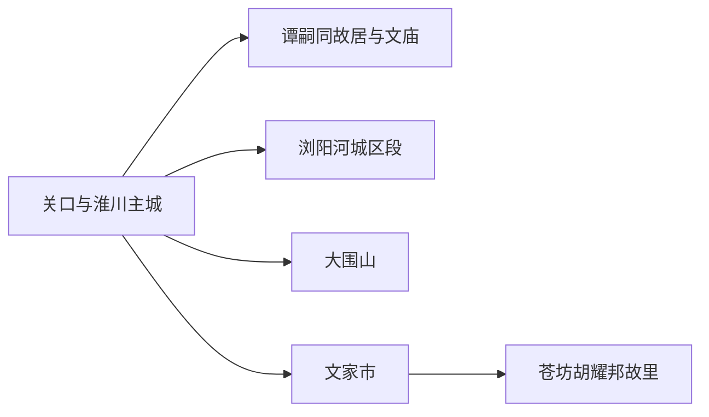
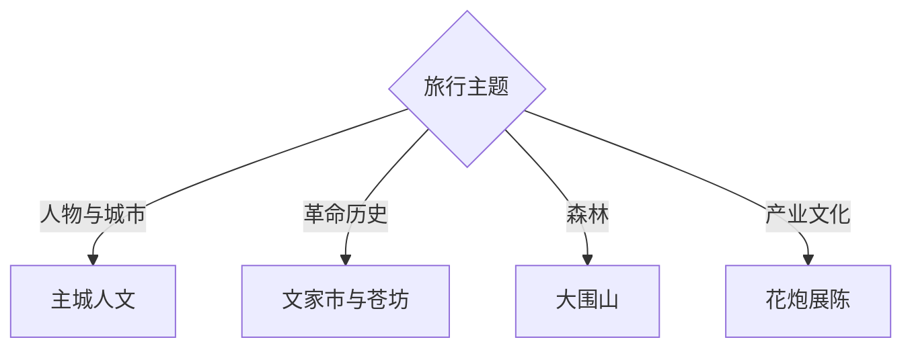

# 浏阳旅行指南

浏阳从关口—淮川主城向湘赣边山地展开：城区适合谭嗣同故居、文庙和博物馆，大围山、文家市与苍坊则各是一条完整远线。先选“城市人文、红色历史、森林山地”中的主主题，再决定住宿与车辆，行程会更清楚。

## 城市速览

| 项目 | 信息 |
|---|---|
| 主线 | 浏阳河城区—谭嗣同故居—大围山—文家市—苍坊胡耀邦故里 |
| 停留 | 主城1天；每条远线另留1天，完整组合3–4天 |
| 住宿 | 淮川—关口适合首访；大围山适合清晨登山；文家市或中和适合红色专题 |
| 交通 | 长沙方向以公路进入，县域跨度大，远线用班车、合规包车或自驾 |
| 风险 | 山区暴雨、漂流季水情、森林火险、高温雷雨与烟花生产运输 |
| 边界 | 革命旧址按参观礼仪进入；森林、烟花工厂仓储、试放区和跨省山路按管理边界通行 |

## 城市格局与游览区域

固定 **Guankou / GeoNames 1802875** 对应浏阳城区东部的关口街道，也是现行市级公共服务核心之一；本页用它定位主城，并以浏阳市实体 `Q1025444`、法定代码 `430181` 覆盖全市旅行尺度。大围山位于东部湘赣边，文家市和中和在南部，两条远线之间车程长。长沙市区、平江石牛寨和浏阳境外周洛方向分别属于其他行政或旅行单元。

## 主要景点

| 景点 | 区域 | 类型 | 核心体验 | 用时 | 环境 | 体力 | 研究价值 | 拥挤 | 优先级 |
|---|---|---|---|---:|---|---|---|---|---|
| 谭嗣同故居与祠 | 淮川主城 | 名人故居 | 维新思想、人物生平与晚清城市空间 | 1.5–2.5小时 | 室内 | 低 | 很高 | 中 | A |
| 浏阳文庙与市级文博场馆 | 主城 | 古建文博 | 地方历史、祭孔古乐与公共展览 | 2–4小时 | 混合 | 中 | 很高 | 中 | A |
| 浏阳河城区公共岸线 | 主城 | 滨水城市 | 河流城市关系、桥梁与夜间生活 | 1.5–3小时 | 室外 | 低至中 | 中 | 中高 | B |
| 大围山国家森林公园正式景区 | 大围山镇 | 山地森林 | 峰林、森林、季节花景与开放步道 | 1天 | 室外 | 高 | 高 | 旺季高 | A |
| 秋收起义文家市会师旧址 | 文家市镇 | 革命旧址 | 文华书院、会师历史与纪念陈列 | 2–4小时 | 混合 | 低至中 | 很高 | 中高 | A |
| 苍坊旅游区 | 中和镇 | 纪念场馆 | 胡耀邦故居、纪念馆与村落环境 | 3–5小时 | 混合 | 中 | 很高 | 中 | A |
| 中国花炮文化博物馆或正式展陈 | 大瑶方向 | 产业文化 | 花炮历史、工艺与安全规范 | 2–3小时 | 室内 | 低 | 高 | 中 | B |
| 画里小河与公开乡村空间 | 小河乡 | 乡村艺术 | 农民画、山村公共文化与乡野景观 | 半日至1天 | 混合 | 中 | 中 | 活动时高 | C |

## 美食与餐饮

浏阳蒸菜适合多人选小碗组合，也便于控制辣度；主城可补充米粉、腊味和湘菜，大围山方向有时令蔬果与山地家常菜。点菜时确认辣椒、腌腊盐度、花生芝麻和动物内脏；选择明码标价、具备正式接待条件的门店与乡村餐饮点。

## 经典行程

### 两日基础线
**路线**：主城人文—浏阳河—文家市或大围山。**逻辑**：一日城市、一日远线。**预约锚点**：场馆与景区。**休息**：主城午休。**删除条件**：天气不稳时选择文家市室内展陈。

### 主城人文线
**路线**：谭嗣同故居—浏阳文庙—博物馆—浏阳河岸。**逻辑**：连续理解人物、礼制与城市。**预约锚点**：故居和场馆。**休息**：淮川餐饮区。**删除条件**：闭馆时保留公共街区与河岸。

### 大围山森林线
**路线**：正式入口—当日开放步道—游客中心—返城或山麓住宿。**逻辑**：把体力与天气窗口集中给山地。**预约锚点**：门票、交通和防火。**休息**：景区服务点。**删除条件**：暴雨、雷电、冰雪或火险时取消。

### 文家市红色线
**路线**：会师旧址—纪念馆完整展陈—镇区公共空间。**逻辑**：以原址和展览建立事件线。**预约锚点**：团队与讲解。**休息**：文家市镇。**删除条件**：重大活动管控时调整日期。

### 苍坊纪念线
**路线**：胡耀邦故居—纪念馆—文博园开放区。**逻辑**：把同一纪念景区作为完整单元。**预约锚点**：开放、实名与讲解。**休息**：景区服务区。**删除条件**：时间不足时保留故居和主馆。

### 花炮文化线
**路线**：主城—正式花炮文化展陈—大瑶公共商贸空间。**逻辑**：通过展览理解产业。**预约锚点**：展馆与接待。**休息**：镇区。**删除条件**：只剩生产参访时改回主城文博。

### 低体力线
**路线**：车辆到谭嗣同故居—文庙或博物馆—浏阳河短段。**逻辑**：以室内、座席和短接驳控制负担。**预约锚点**：无障碍入口。**休息**：每站场馆。**删除条件**：高温或拥挤时只留两处室内点。

## 住宿区域

淮川—关口主城兼顾餐饮、场馆和跨方向发车；大围山镇适合山地早出与季节花期；文家市或中和住宿适合连续红色主题。订房时核对真实镇街、夜间交通、消防、停车和景区入口距离，远线之间换宿往往比每天折返更省时。

## 市内交通

浏阳主要通过公路连接长沙及周边城市，主城公交适合短距离移动。大围山、文家市、中和和小河分处不同方向，班次、末班和旅游专线会调整；自驾或合规包车提前明确山路、等待、返程和跨省边界。烟花运输车辆、节庆管制与大型活动散场会改变道路节奏。

## 不同旅行者须知

历史兴趣者优先主城与文家市；山地旅行者把大围山独立成日；亲子家庭选择文博、正式研学和短步道；长者以主城和单一纪念景区为主。烟花生产、原料、仓储、运输与试放区域属于高风险作业空间，旅行参观采用官方展陈、批准活动和明确观众区。

## 行前核对

- 核对谭嗣同故居、文庙、文家市、苍坊、大围山和花炮展陈的开放与预约。
- 核对长沙往返、县内末班、山区道路、暴雨雷电、漂流水情和森林火险。
- 花炮节庆按主办方观众区、安检、疏散和交通管制安排进入。

## 来源与更新记录

| 来源 | 支持内容 | 核验日期 |
|---|---|---|
| [湖南省文旅厅：浏阳红色文化与景点](https://whhlyt.hunan.gov.cn/whhlyt/cyfz/cyxm/202306/t20230620_29380253.html) | 主城、大围山、文家市、花炮与乡村方向 | 2026-09-01 |
| [湖南省政府：谭嗣同故居和祠](https://hunan.gov.cn/hnszf/c101474/202108/t20210827_20403688.html) | 故居身份、人物与周边文博 | 2026-09-01 |
| [湖南省政府：文家市会师旧址](https://hunan.gov.cn/hnszf/c101474/202108/t20210826_20401143.html) | 旧址身份与参观主题 | 2026-09-01 |
| [湖南省政府：胡耀邦故居和陈列馆](https://hunan.gov.cn/hnszf/c101474/202108/t20210827_20403609.html) | 苍坊景区组成与交通入口 | 2026-09-01 |
| [湖南省林业局：大围山国家森林公园](https://lyj.hunan.gov.cn/lyj/tslm_71206/slly/slgy/201512/t20151227_2587728.html) | 山地产品、森林与正式游览体系 | 2026-09-01 |
| [GeoNames 1802875](https://www.geonames.org/1802875/) | Guankou 固定人口点 | 2026-09-01 |
| [Wikidata Q1025444](https://www.wikidata.org/wiki/Q1025444) | 浏阳市实体与跨库标识 | 2026-09-01 |

| 日期 | 更新 |
|---|---|
| 2026-09-01 | 首次完成浏阳旅行研究；以关口主城承接固定记录，并分开城市人文、红色旧址、山地森林与花炮展陈。 |
