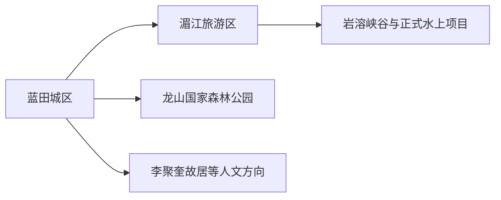
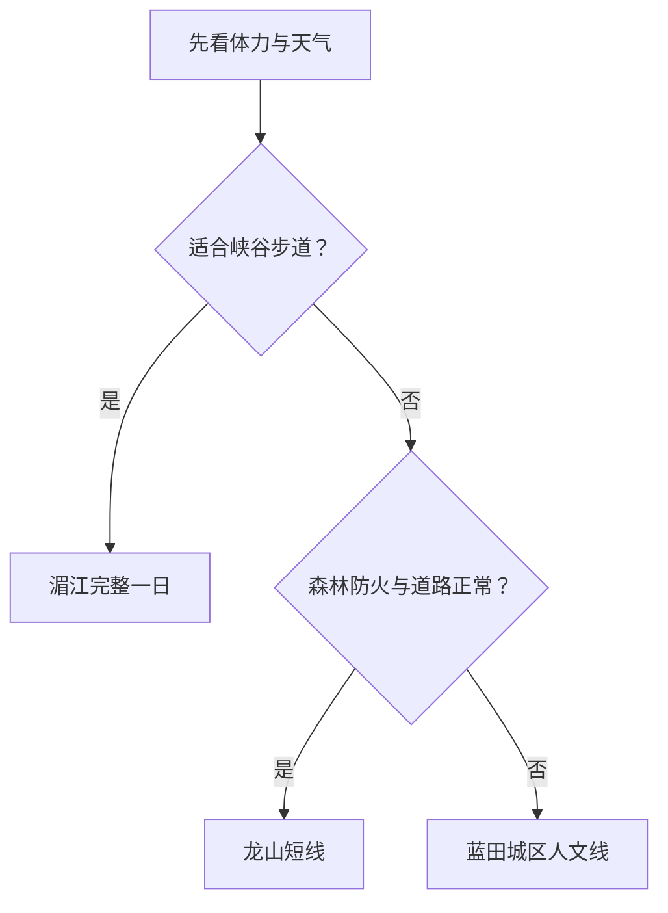

# 涟源旅行指南

涟源位于湘中，旅行重点由蓝田城区、湄江岩溶山水、龙山森林和李聚奎故居等人文点组成。最实用的安排是把城区当作交通与住宿基地，每天只选择湄江或龙山一个远线；雨天则回到城市公共文化和饮食体验。

## 城市速览

| 项目 | 信息 |
|---|---|
| 旅行主线 | 蓝田城区、湄江旅游区、龙山国家森林公园、红色人文 |
| 建议停留 | 1 天湄江；2 天加入城区或龙山；3 天再加人文乡村线 |
| 住宿基地 | 涟源城区交通与餐饮集中；景区住宿用于已确认的单一远线 |
| 步行强度 | 城区低；湄江与龙山中至高，峡谷、洞穴和台阶影响明显 |
| 主要天气 | 高温、暴雨、雷电、山洪、湿滑岩溶步道与冬季湿冷 |
| 预约核心 | 湄江、龙山、洞穴或水上项目、景区交通和返程 |
| 亲子 | 城区公共文化、地质科普和年龄规则明确的景区短线 |
| 低体力 | 城区加车辆观景；远线只走游客中心附近的平缓段 |
| 边界重点 | 洞穴、水库、林区、药材基地和农业生产空间按正式开放区进入 |
| 无障碍 | 设施连续性需向官方确认，重点核对洞穴台阶、景区接驳、卫生间与落客 |

## 城市格局与游览区域

涟源市是娄底市代管的县级市，法定代码 `431382`。GeoNames `1804451` 是涟源城市点，Wikidata `Q1344742` 代表法定涟源市，`P1566=1804451`。湄江位于北部、龙山位于南部，二者不适合在同一天机械串联。

| 区域 | 旅行价值 | 怎么安排 |
|---|---|---|
| 蓝田城区 | 到达、住宿、公共文化、涟水河城市空间 | 抵达日或雨天半日 |
| 湄江方向 | 岩溶峡谷、湖面、地质与当期开放项目 | 留完整一天 |
| 龙山方向 | 森林、山地与药文化 | 天气稳定时独立一天 |
| 人文乡村方向 | 红色历史、故居与正式乡村项目 | 预约明确时作为第三日支线 |

## 主要景点

### 城区与人文

| 景点 | 所在区域 | 类型 | 核心看点 | 建议用时 | 室内/室外 | 体力 | 预约难度 | 天气敏感度 | 适合旅程 |
|---|---|---|---|---|---|---|---|---|---|
| 涟源城市公共文化场馆 | 蓝田城区 | 地方史与公共文化 | 湘中城市、涟商文化与当期展陈 | 1–2 小时 | 室内 | 低 | 中 | 低 | A |
| 涟水河公共风光带短段 | 城区 | 城市滨水空间 | 城市生活、河流与公共景观 | 1–2 小时 | 室外 | 低 | 低 | 高 | B |
| 李聚奎故居公开区 | 市域乡村方向 | 名人故居与红色历史 | 人物生平、地方革命史与院落 | 1.5–3 小时 | 混合 | 中 | 高 | 中 | B |

### 湄江与龙山

| 景点 | 所在区域 | 类型 | 核心看点 | 建议用时 | 室内/室外 | 体力 | 预约难度 | 天气敏感度 | 适合旅程 |
|---|---|---|---|---|---|---|---|---|---|
| 湄江旅游区 | 湄江镇方向 | 岩溶峡谷与湖区 | 峡谷、地质遗迹、湖面和开放步道 | 6–9 小时 | 混合 | 中至高 | 高 | 极高 | A |
| 龙山国家森林公园公开区 | 南部龙山 | 山地森林 | 森林、山地、药文化与季节景观 | 6–9 小时 | 室外 | 高 | 高 | 极高 | A |
| 正式开放乡村文旅项目 | 市域乡村 | 乡村与季节活动 | 湘中村落、农事与当期接待 | 2–5 小时 | 室外为主 | 中 | 高 | 高 | C |

湄江内部峡谷、洞穴、湖面和水上项目按一个旅游区安排；当期关闭的洞穴、水域与施工步道直接从路线中删去。龙山的林业生产路、保护地核心区、药材种植区和未开放山脊保持原有用途。

## 美食与餐饮

| 类型 | 适合场景 | 份量 | 过敏与饮食提示 | 怎么选 |
|---|---|---|---|---|
| 涟源南粉合菜 | 城区正餐 | 多为共享盘 | 红薯粉、肉类、蛋、豆制品与辣椒 | 独行问小份，确认配菜与辣度 |
| 富田桥豆腐 | 城区及属地餐馆 | 可小份或合餐 | 大豆、肉汤、辣椒与酱油 | 严格素食先问汤底和用油 |
| 湘中腊味与家常菜 | 正餐 | 份量偏大 | 猪肉、高盐、烟熏和辣椒 | 配蔬菜主食，两人以上分享 |
| 米粉与早餐 | 城区简餐 | 一人份方便 | 米制品汤底仍可能含肉、花生与大豆 | 逐项询问浇头、汤底和辣度 |

## 经典行程

### 一日经典路线

**路线**：涟源城区出发 → 湄江游客中心 → 开放峡谷或地质步道 → 正规服务点午休 → 返回

- **串联逻辑**：整天围绕湄江一个大型景区，减少跨山地移动。
- **预约锚点**：景区开放、内部交通、洞穴、水上项目和返程。
- **休息安排**：游客中心或正规餐饮长休。
- **时间不足时**：只走一条核心步道，删除水上或洞穴支线。

### 两日城市路线

**第 1 天**：湄江旅游区 
**第 2 天**：蓝田城区公共文化 → 李聚奎故居或城区滨水短线

- **串联逻辑**：高体力山水与低体力人文分日。
- **预约锚点**：两处场馆和县域车辆。
- **休息安排**：第二日在城区安排完整午休。
- **时间不足时**：第二日只留城区公共文化。

### 三日深度路线

**第 1 天**：湄江旅游区 
**第 2 天**：龙山国家森林公园 
**第 3 天**：蓝田城区与人文点

- **串联逻辑**：北部湄江、南部龙山和城区分别成日。
- **预约锚点**：龙山入口、车辆、森林防火与天气。
- **休息安排**：山地日使用游客服务点，第三日城区长休。
- **时间不足时**：删除龙山或第三日，保留湄江核心。

### 雨天路线

**路线**：城区公共文化场馆 → 午餐 → 当期室内展览或住宿休息

- **适用条件**：普通降雨且城区交通正常；暴雨、山洪或雷电预警时按官方提示调整。
- **串联逻辑**：留在蓝田城区，避开洞穴、峡谷和林道。
- **预约锚点**：场馆与城市交通公告。
- **休息安排**：午餐和场馆座椅。
- **时间不足时**：只留一处场馆。

### 亲子路线

**路线**：城区公共文化场馆 → 午餐 → 湄江游客中心附近地质科普短线

- **适用条件**：儿童年龄、护栏与短线开放明确。
- **串联逻辑**：先室内理解地方自然，再走低难度户外段。
- **预约锚点**：研学活动、儿童票和景区交通。
- **休息安排**：午餐长休，户外段控制在两小时内。
- **时间不足时**：保留城区场馆。

### 低体力路线

**路线**：车辆到达城区场馆 → 午餐长休 → 涟水河公共空间近入口短段

- **适用条件**：平整步道、落客和座椅已确认。
- **串联逻辑**：全部在城区或近距离车辆范围内完成。
- **预约锚点**：无障碍入口、轮椅和卫生间。
- **休息安排**：每处控制在一小时左右。
- **时间不足时**：只留场馆。

### 龙山森林路线

**路线**：涟源城区 → 龙山正式入口 → 开放山地短线 → 游客服务点 → 返回

- **适用条件**：天气、森林防火和返程车辆稳定。
- **串联逻辑**：围绕龙山一个目的地，按体力选择步道长度。
- **预约锚点**：入口、接驳、封山和停车。
- **休息安排**：游客服务点午休并补水。
- **时间不足时**：整段删除，改走城区线。

## 住宿区域

| 区域 | 优点 | 取舍 | 适合人群 | 核对项 |
|---|---|---|---|---|
| 涟源城区 | 铁路、公路、餐饮和叫车便利 | 到湄江、龙山仍需长距离车辆 | 首访、无车、多日旅行 | 夜间入住、停车、早餐与站前接驳 |
| 湄江周边正规住宿 | 靠近景区，便于早出发 | 选择和餐饮少，受淡旺季影响 | 湄江深度、摄影 | 景区距离、消防、退改、返程 |
| 龙山方向正规住宿 | 便于山地慢游 | 对城区与湄江没有位置优势 | 山地、森林、已落实车辆者 | 合法经营、供餐、道路与通信 |

## 市内交通

涟源可利用铁路和公路抵达，城区内部以公交、出租车和短段步行为主。湄江、龙山与乡村人文点分处不同方向，通常需要自驾、正规包车或当期景区交通；地图时间要为山路和天气留余量。

| 场景 | 怎么做 | 行前核对 |
|---|---|---|
| 铁路到达 | 按票面完整站名到涟源，再转城区住宿 | 车次、站前接驳与夜间叫车 |
| 前往湄江 | 预先落实景区交通或正规车辆 | 入口、接驳、停车、返程 |
| 前往龙山 | 日间出发，按一整天规划 | 山路、森林防火、天气与加油 |
| 城区移动 | 公交、出租车与短步行组合 | 首末班、施工与高温避让 |

## 不同旅行者须知

| 旅行者 | 推荐做法 | 重点核对 |
|---|---|---|
| 独行 | 住城区，远线加入正规小团或可靠包车 | 司机资质、返程与通信 |
| 亲子 | 场馆加地质科普短线 | 洞穴、水边、护栏和儿童座椅 |
| 长者与低体力 | 城区为主，景区只走近入口段 | 台阶、接驳、轮椅与卫生间 |
| 摄影 | 湄江与龙山分日，预留天气机动 | 三脚架、无人机、日落返程 |
| 山地旅行 | 选择明确开放步道并控制单日强度 | 雷电、山洪、落石、森林火险和救援 |

## 行前核对

- 涟源市政府与湖南省文旅厅：景区、民宿、活动和县域交通。
- 湄江、龙山运营与管理方：入口、步道、洞穴、水上项目和接驳。
- 湖南省气象、应急和林业部门：暴雨、雷电、山洪、地灾和森林火险。
- 中国铁路 12306：涟源相关车站、车次和退改。
- 住宿经营方：合法经营、消防、夜间到店和返程车辆。

## 来源与更新记录

| 来源 | 支持内容 | 核验日期 |
|---|---|---|
| [涟源市人民政府](https://www.lianyuan.gov.cn/) | 市情、交通、文旅与动态入口 | 2026-08-30 |
| [湖南省文旅厅：山水涟源](https://whhlyt.hunan.gov.cn/whhlyt/news/sxxw/202410/t20241009_33470810.html) | 湄江、龙山、李聚奎故居与文旅格局 | 2026-08-30 |
| [湖南省文旅厅：涟源民宿产业](https://whhlyt.hunan.gov.cn/whhlyt/news/sxxw/202607/t20260714_34026316.html) | 2026 年湄江、龙山与正规民宿动态 | 2026-08-30 |
| [湖南省自然资源厅：湄江国家地质公园](https://zrzyt.hunan.gov.cn/zrzyt/xxgk/qtxx/sxfc/201703/t20170328_4166476.html) | 湄江岩溶地质与保护属性 | 2026-08-30 |
| [湖南省林业局：龙山国家森林公园](https://lyj.hunan.gov.cn/lyj/tslm_71206/slly/slgy/201512/t20151227_2587641.html) | 龙山森林公园属地与山地属性 | 2026-08-30 |
| [Wikidata Q1344742](https://www.wikidata.org/wiki/Q1344742) | 法定涟源市、代码与 `P1566=1804451` | 2026-08-30 |
| [GeoNames 1804451](https://www.geonames.org/1804451/) | 固定涟源城市点、别名与坐标 | 2026-08-30 |

| 日期 | 更新 |
|---|---|
| 2026-08-30 | 首次完成蓝田城区、湄江、龙山、红色人文与山地旅行研究。 |
