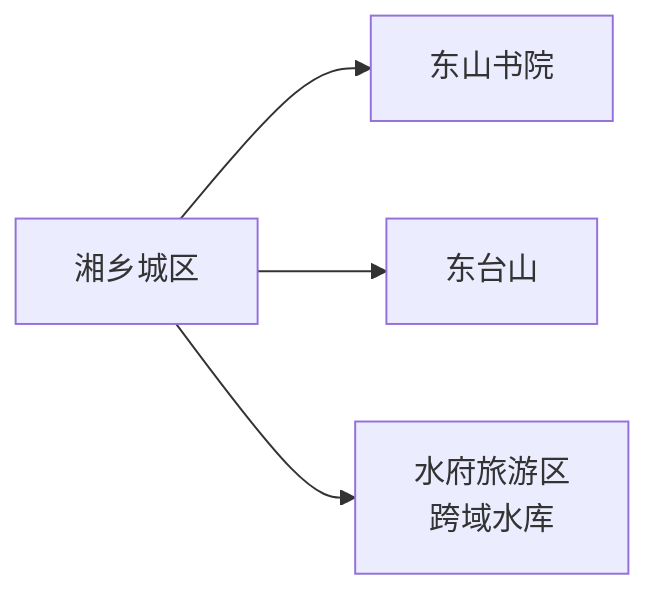
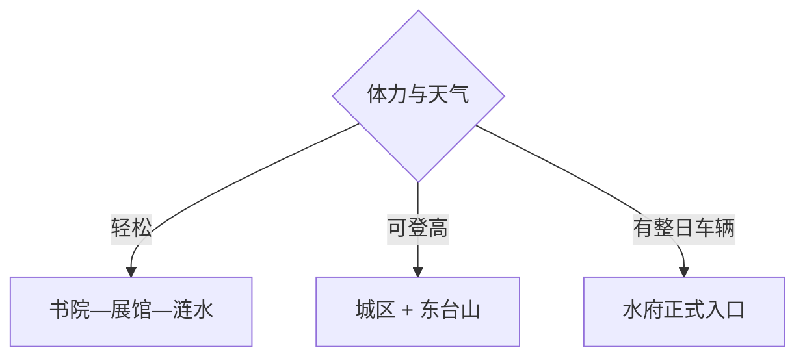

# 湘乡旅行指南

湘乡适合先用东山书院认识近代教育史，再从东台山短线或水府旅游区远线中选择一个。水府水库跨行政区且兼具水利、湿地和旅游属性，先锁定具体入口，行程才会清楚。

> 建议停留：城区 1 天；水府方向再留 1 天 
> 旅行关键词：东山书院、东台山、涟水、水府、湘中饮食 
> 无障碍说明：现代展馆可询问无障碍入口；书院门槛、山地步道和水库岸线的设施连续性需向官方确认

## 城市速览
| 项目 | 旅行信息 |
|---|---|
| 主要旅行价值 | 东山书院、湘乡城区历史、东台山与水府湖区 |
| 建议停留 | 1–2 天 |
| 舒适季节 | 春秋；夏季关注高温暴雨 |
| 预算特点 | 城区平实，水府车辆和住宿增加预算 |
| 步行强度 | 城区中等，东台山中高，湖区视入口而定 |
| 天气风险 | 暴雨、雷电、山洪、库区水位和高温 |
| 独行旅行 | 城区方便，水府方向先锁返程 |
| 亲子旅行 | 书院展陈和城市公园适合半日 |
| 长者与低体力 | 书院主院落加车辆接驳 |
| 行前重点 | 书院开放、森林防火、水府入口和交通 |

## 城市格局与游览区域
湘乡是湘潭代管的县级市，代码 `430381`；GeoNames `1790471` 与 Wikidata `Q1207051` 的 P1566 精确对应。

| 区域 | 主要内容 | 怎么安排 | 时间 |
|---|---|---|---|
| 湘乡城区 | 东山书院、公共文化、涟水城市生活 | 首日步行加车辆 | 1 天 |
| 东台山 | 城市近旁森林 | 天气稳定时加半日 | 半日 |
| 水府方向 | 水库、湿地与正式旅游入口 | 单独一天，按入口导航 | 1 天 |
| 乡村生产空间 | 农田、水产和林地 | 只走正式接待路线 | 预约制 |

## 主要景点
### 城区与山地
| 景点 | 区域 | 类型 | 主要看点 | 建议用时 | 室内外 | 体力 | 预约风险 | 天气影响 | 优先级 |
|---|---|---|---|---:|---|---|---|---|---|
| 东山书院旅游区 | 城区 | 书院、教育史 | 书院建筑、近代教育与陈列 | 2.5–4 小时 | 混合 | 中 | 高 | 中 | A |
| 湘乡市博物馆或当期公共文化展馆 | 城区 | 博物馆 | 地方史与湘中社会文化 | 1.5–2.5 小时 | 室内 | 低 | 高 | 低 | B |
| 涟水公共岸线代表段 | 城区 | 城市滨水 | 河流城市格局和日常生活 | 1–2 小时 | 室外 | 低 | 低 | 高 | B |
| 东台山国家森林公园开放步道 | 城区南侧 | 森林、登高 | 城市近山与森林景观 | 3–5 小时 | 室外 | 中高 | 高 | 很高 | A |
| 水府旅游区正式开放入口 | 水府方向 | 湖库、湿地 | 湖面、湿地与水利景观 | 4–6 小时 | 室外 | 中 | 很高 | 很高 | B |
| 正式开放乡村文化项目 | 县域 | 乡村、非遗 | 湘中农业和地方生活 | 2–4 小时 | 混合 | 中 | 很高 | 高 | C |

东山书院及内部旧址、陈列按一个完整目的地计数。水府水库跨湘乡、娄底等区域，页面只承接湘乡一侧经确认开放的入口。

## 美食与餐饮
| 类型 | 怎么点 | 过敏原与份量 | 选择建议 |
|---|---|---|---|
| 湘乡教堂鸡 | 多人分享，先选辣度 | 鸡肉、辣椒、花生和骨头 | 低辣需求提前说明 |
| 水府火焙鱼 | 小份下饭或包装食品 | 鱼类、盐分、烟熏与酱油 | 问清来源和配料 |
| 米粉与湘中家常菜 | 单人或多人都方便 | 汤底、猪油、小麦和大豆 | 在城区成熟餐饮区选择 |
| 时令蔬菜与腊味 | 2–4 人分享 | 腌制、高钠和烟熏 | 与清淡菜搭配 |

## 经典行程

### 一日经典路线
**路线**：东山书院 → 城区午餐 → 公共文化展馆 → 涟水公共岸线
- **串联逻辑**：书院教育史与城市地方史相接。
- **预约锚点**：书院和展馆开放。
- **休息安排**：午餐与下午在城区休息。
- **时间不足时**：保留东山书院和涟水短段。

### 两日城市路线
**第 1 天**：城区经典路线 
**第 2 天**：东台山开放步道或水府旅游区二选一
- **串联逻辑**：历史城区与自然方向分日。
- **预约锚点**：森林防火或水府入口。
- **休息安排**：游客服务点和城区。
- **时间不足时**：第二天只走东台山短段。

### 三日深度路线
**第 1 天**：城区 
**第 2 天**：东台山 
**第 3 天**：水府正式入口
- **串联逻辑**：城市、森林与湖库逐层展开。
- **预约锚点**：第三天车辆和开放边界。
- **休息安排**：每天中午使用正式服务点。
- **时间不足时**：删除第三天。

### 雨天路线
**路线**：东山书院开放院落 → 午餐 → 公共文化展馆
- **适用条件**：普通降雨、城市道路正常。
- **串联逻辑**：保留城区文化内容。
- **预约锚点**：古建分区开放和场馆。
- **休息安排**：城区室内节点。
- **时间不足时**：只保留书院。

### 亲子或低体力路线
**亲子路线**：东山书院 → 午休 → 城市展馆或公园 
**低体力路线**：车辆到书院主入口 → 午休 → 涟水平缓短段
- **减负方式**：减少东台山爬升和水府长距离。
- **预约锚点**：电梯、轮椅、落客与卫生间。
- **休息安排**：书院、场馆和城区。
- **时间不足时**：保留书院主院落。

### 远郊路线
**路线**：水府旅游区湘乡一侧正式入口
- **适用条件**：入口、天气、车辆和返程确认。
- **串联逻辑**：湖库完整成日，与城区山地分日安排。
- **预约锚点**：运营、水位和水上项目。
- **休息安排**：游客中心与镇区。
- **时间不足时**：改为东台山半日。

## 住宿区域
| 区域 | 优点 | 取舍 | 适合人群 |
|---|---|---|---|
| 湘乡城区 | 铁路、餐饮和书院方便 | 去水府仍需车辆 | 首访、短住 |
| 水府正式住宿 | 靠近湖区 | 运营和餐饮季节性强 | 湖区慢旅行 |
| 湘潭联程 | 干线交通更多 | 属跨城通勤 | 多城组合 |

## 市内交通
- 湘乡站及其他铁路站点按 12306 票面核对。
- 城区公交、出租和网约车可连接书院与东台山入口；水府方向提前锁返程。
- 水库码头、水上项目和林区道路只使用正式开放与持证运营服务。

## 不同旅行者须知
| 情况 | 怎么安排 | 重点核对 |
|---|---|---|
| 独行 | 住城区，远线白天往返 | 末班和叫车 |
| 亲子 | 书院加展馆 | 古建门槛、临水护栏 |
| 长者与低体力 | 车辆分段 | 坡道、座椅、卫生间 |
| 摄影 | 清晨书院、傍晚涟水 | 三脚架、无人机和人物同意 |
| 水库旅行 | 正式入口活动 | 水位、风浪、救生衣和保险 |

## 行前核对
| 项目 | 何时核对 | 官方入口 |
|---|---|---|
| 东山书院与东台山 | 出发前一周及前一日 | 湘乡市政府、湖南文旅与林业公告 |
| 水府入口与水上活动 | 订车前及当天 | 湖区运营方、湖南水利公告 |
| 铁路与城乡交通 | 购票时及前一日 | [中国铁路 12306](https://www.12306.cn/) |
| 暴雨、山洪与防火 | 出发前三日起每日 | [中国气象局](https://www.cma.gov.cn/)及属地应急信息 |

## 来源与更新记录
| 来源 | 支持内容 | 核验日期 |
|---|---|---|
| [湖南省文旅厅：湘乡线路](https://whhlyt.hunan.gov.cn/whhlyt/news/sxxw/202311/t20231124_32448114.html) | 东山书院、东台山与地方饮食 | 2026-08-13 |
| [湖南省林业局](https://lyj.hunan.gov.cn/lyj/tslm_71206/slly/zrbhq/201512/t20151227_2587441.html) | 东台山森林与水府空间 | 2026-08-13 |
| [湖南省水利厅](https://slt.hunan.gov.cn/xxgk/slxw/sxsl/201901/t20190131_5269753.html) | 水府跨域治理与水利边界 | 2026-08-13 |
| [民政部行政区划代码查询](https://dmfw.mca.gov.cn/xzqh/getList?code=43&trimCode=true&maxLevel=3) | `430381` 县级市层级 | 2026-08-13 |
| [GeoNames 1790471](https://www.geonames.org/1790471/xiangxiang.html) | 固定城市点 | 2026-08-13 |
| [Wikidata Q1207051](https://www.wikidata.org/wiki/Q1207051) | 法定实体与精确 `P1566` | 2026-08-13 |

| 日期 | 更新 |
|---|---|
| 2026-08-13 | 首次完成湘乡市指南；建立城区、东台山与水府分层。 |
