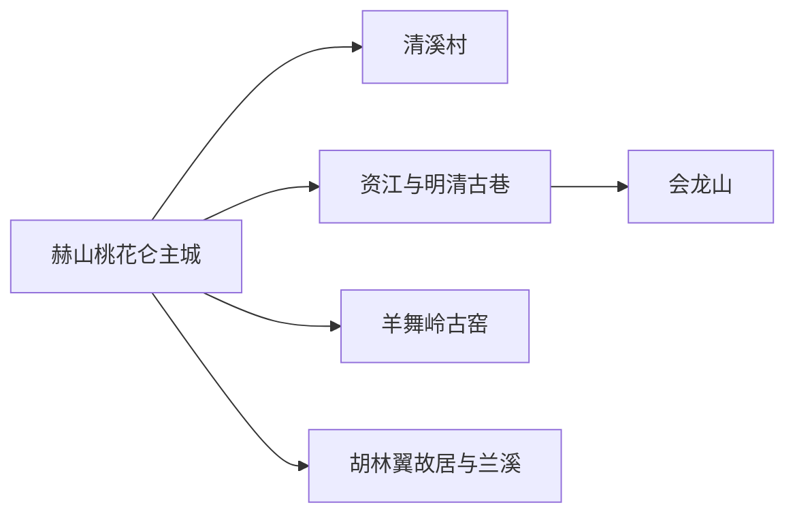
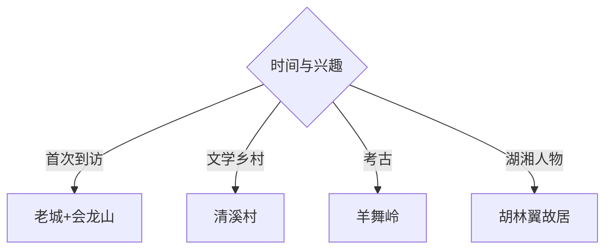

# 益阳旅行指南

益阳主城沿资江展开，适合用明清古巷、会龙山、清溪村和城市博物馆认识“城、乡、山、水”四种面貌，再从羊舞岭古窑、胡林翼故居或兰溪方向选择一条专题线。安化、南县和桃江等县域距离明显，应另作远线安排。

## 城市速览

| 项目 | 信息 |
|---|---|
| 主线 | 资江—明清古巷—会龙山—清溪村—赫山人文远线 |
| 停留 | 主城1–2天；古窑、故居或县域远线另留1天 |
| 住宿 | 桃花仑—赫山适合场馆与餐饮；资江两岸适合老城；高铁站周边适合抵离 |
| 交通 | 益阳南站与公路客运构成门户，主城公交加短途车辆，远线逐段核对 |
| 风险 | 汛期水位、暴雨内涝、高温雷雨、湿地与乡村道路 |
| 边界 | 资江岸线、洞庭湖湿地、古窑遗址、农田鱼塘和工业园按开放与保护范围进入 |

## 城市格局与游览区域

固定 **Heshan / GeoNames 1808316** 是益阳主城人口点，本页以它定位赫山区和市级公共服务核心，并以地级益阳市实体 `Q416669`、代码 `430900` 组织主城与市域关系。中心城区跨赫山、资阳两区，资江两岸需要实际过桥；羊舞岭、泉交河和兰溪已属城郊或乡镇远线。安化茶马古道、南洞庭湖和桃江竹海分别位于其他县域，一天只选择一个方向。

## 主要景点

| 景点 | 区域 | 类型 | 核心体验 | 用时 | 环境 | 体力 | 研究价值 | 拥挤 | 优先级 |
|---|---|---|---|---:|---|---|---|---|---|
| 益阳市博物馆 | 主城 | 地方文博 | 洞庭门户、资江水运与地方历史 | 2–3小时 | 室内 | 低 | 很高 | 中 | A |
| 益阳明清古巷 | 资江老城 | 历史街区 | 码头商业、会馆宅院与城市更新 | 2–4小时 | 混合 | 中 | 很高 | 活动时高 | A |
| 会龙山—白鹿寺公开区域 | 会龙山 | 城市山地 | 山城视野、寺院与资江关系 | 2–4小时 | 混合 | 中高 | 高 | 中 | A |
| 资江公共风貌带 | 两岸 | 滨水城市 | 桥梁、码头记忆与沿江生活 | 1.5–3小时 | 室外 | 低至中 | 中 | 中 | B |
| 清溪村 | 谢林港方向 | 文学乡村 | 周立波文学、乡村公共文化与田园 | 2–4小时 | 混合 | 中 | 高 | 活动时高 | B |
| 羊舞岭古窑址公开展示 | 朝阳街道 | 考古遗址 | 宋明窑业、陶瓷工艺与遗址保护 | 1.5–3小时 | 混合 | 低至中 | 很高 | 低 | B |
| 胡林翼故居或陈列开放区 | 泉交河镇 | 名人故居 | 晚清人物、湖湘文化与乡村空间 | 半日至1天 | 混合 | 中 | 高 | 中 | B |
| 兰溪古镇公共街区 | 兰溪镇 | 河港古镇 | 洞庭水乡、龙舟与米市文化 | 半日至1天 | 室外为主 | 中 | 高 | 节庆高 | C |

## 美食与餐饮

益阳擂茶、米粉、麻辣烫、蒿子粑粑和湖区鱼菜适合在主城与正规乡镇餐馆尝试。擂茶常含花生、芝麻、大豆或坚果，鱼菜先问来源、重量和做法；洞庭湖禁捕与水生生物保护按现行法规执行，选择正规供应链与明码标价餐厅。

## 经典行程

### 两日基础线
**路线**：博物馆—明清古巷—会龙山—清溪村。**逻辑**：先城市史，再看山水与乡村。**预约锚点**：博物馆和活动。**休息**：桃花仑或老城。**删除条件**：雨天缩短山地与村落。

### 资江城市线
**路线**：博物馆—明清古巷—资江风貌带。**逻辑**：沿水运与商业历史顺序展开。**预约锚点**：场馆和街区活动。**休息**：古巷餐饮。**删除条件**：高水位或封控时保留室内。

### 会龙山人文线
**路线**：会龙山正式入口—白鹿寺开放区—资江观景短段。**逻辑**：把登高和城市水景结合。**预约锚点**：寺院活动与开放。**休息**：山脚。**删除条件**：雷雨、湿滑或大风时取消登高。

### 清溪文学线
**路线**：清溪村公共展陈—文学步道—乡村餐饮。**逻辑**：从作品进入乡村变迁。**预约锚点**：展馆和研学。**休息**：村级服务点。**删除条件**：团队活动满额时改为主城文博。

### 羊舞岭考古线
**路线**：正式展示入口—古窑保护区外围—非遗陶艺公开空间。**逻辑**：先看遗址，再理解工艺。**预约锚点**：开放与讲解。**休息**：展厅。**删除条件**：考古或安防作业时只看公开展陈。

### 湖湘人物线
**路线**：泉交河—胡林翼故居开放区—兰溪二选一。**逻辑**：以人物史连接乡镇文化。**预约锚点**：故居与返程车辆。**休息**：镇区。**删除条件**：时间不足时只保留故居。

### 低体力线
**路线**：博物馆—车辆到明清古巷平缓段—资江短段。**逻辑**：用场馆、车辆和座席控制步行。**预约锚点**：无障碍入口。**休息**：每站室内。**删除条件**：高温时只留两处室内点。

## 住宿区域

桃花仑—赫山商圈适合首访、餐饮和多方向接驳；资江老城适合古巷与沿江散步；益阳南站周边适合早晚铁路；泉交河或兰溪住宿适合第二天继续乡镇专题。选择江景房时核对桥梁通行、噪声、防汛与实际步行入口。

## 市内交通

益阳南站是主要铁路门户，抵达后通过公交、出租车或网约车进入主城。资江两岸按桥梁实际路线移动；清溪村、羊舞岭、泉交河和兰溪的公交与返程频率不同。前往安化、南县、桃江等县域时按客运站、道路和换宿单独规划。

## 不同旅行者须知

城市史兴趣者优先博物馆和古巷；文学旅行者选择清溪村；陶瓷考古兴趣者选羊舞岭；亲子家庭用场馆和研学控制节奏；长者选择资江平缓段与车辆接驳。汛期河岸、湿地核心区、遗址堆积区、农田鱼塘和产业作业区保持正式边界。

## 行前核对

- 核对博物馆、明清古巷、清溪村、羊舞岭和胡林翼故居的开放与活动。
- 核对益阳南站车次、乡镇返程、桥梁施工、暴雨洪水与高温预警。
- 资江与洞庭湖相关水域按防汛、禁捕、湿地保护和码头管理进入。

## 来源与更新记录

| 来源 | 支持内容 | 核验日期 |
|---|---|---|
| [益阳市政府：中心城区四类文旅资源](https://www.yiyang.gov.cn/yiyang/2/134/14114/43598/43605/content_2139923.html) | 清溪村、明清古巷、会龙山与资水格局 | 2026-09-01 |
| [赫山区文旅发展规划](https://www.hnhs.gov.cn/23247/23248/23891/24239/content_1515449.html) | 羊舞岭、胡林翼、会龙山、乡村线路与保护边界 | 2026-09-01 |
| [益阳市政府：资江风貌带](https://www.yiyang.gov.cn/gzw/31833/content_1587031.html) | 资江、白鹿寺、会龙山和古城节点 | 2026-09-01 |
| [益阳市文旅局：文化和自然遗产日](https://www.yiyang.gov.cn/wlgt/4601/4602/content_2075318.html) | 市博物馆、明清古巷与非遗活动 | 2026-09-01 |
| [赫山区文物保护清单](https://www.hnhs.gov.cn/jc_hs/32/35/content_5548.html) | 羊舞岭古窑与保护范围 | 2026-09-01 |
| [GeoNames 1808316](https://www.geonames.org/1808316/) | Heshan 固定人口点 | 2026-09-01 |
| [Wikidata Q416669](https://www.wikidata.org/wiki/Q416669) | 益阳市实体与跨库标识 | 2026-09-01 |

| 日期 | 更新 |
|---|---|
| 2026-09-01 | 首次完成益阳旅行研究；以赫山主城承接固定记录，并明确资江两岸、乡镇远线与县域边界。 |
