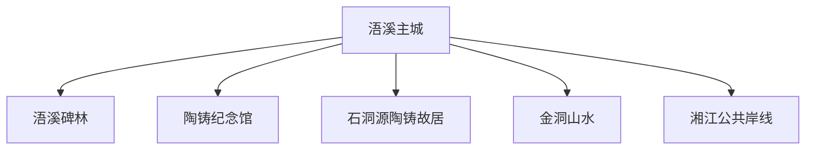
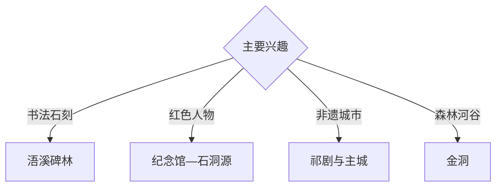

# 祁阳旅行指南

祁阳位于湘江中上游，以浯溪碑林的摩崖石刻、陶铸故居与石洞源、祁剧、湘江古城和金洞山水形成独立旅行结构。固定快照中的 **Wuxi / GeoNames 1797417** 锚定浯溪主城；金洞与南部山地适合另列全天远线。

## 城市速览

| 项目 | 信息 |
|---|---|
| 主线 | 浯溪主城—浯溪碑林—陶铸纪念—石洞源—金洞山水 |
| 停留 | 主城与碑林 1 天；红色专题或金洞另留 1 天 |
| 住宿 | 浯溪主城适合综合接驳；金洞选择正规住宿 |
| 交通 | 铁路、公路抵达，远郊宜约车或自驾 |
| 季节 | 春秋适合石刻与古村；汛期关注湘江和山洪 |
| 预算 | 主城灵活，讲解、远郊车辆与山地住宿增加预算 |

## 城市格局与游览区域

浯溪主城承担铁路、住宿和城市服务，碑林位于湘江沿岸；石洞源承接陶铸故居专题，金洞方向集合森林、湿地与峡谷资源。摩崖石刻本体、古建、湘江水域、自然保护地与漂流河段按正式开放范围进入。

## 主要景点

| 景点 | 区域 | 类型 | 核心体验 | 用时 | 环境 | 体力 | 研究价值 | 拥挤 | 优先级 |
|---|---|---|---|---:|---|---|---|---|---|
| 浯溪碑林风景名胜区 | 浯溪 | 石刻与山水 | 摩崖书法、元结文化和湘江景观 | 半天 | 混合 | 中 | 很高 | 节假日中高 | A |
| 摩崖石刻数字体验馆 | 浯溪碑林 | 数字展陈 | 石刻保护、释读和数字化呈现 | 1–2小时 | 室内 | 低 | 很高 | 中 | A |
| 陶铸纪念馆 | 主城 | 红色与人物 | 生平史料、地方历史与纪念展陈 | 1–2小时 | 室内 | 低 | 高 | 节假日中 | B |
| 石洞源景区与陶铸故居 | 潘市方向 | 故居与乡村 | 故居、红色历史和乡村聚落 | 半天 | 混合 | 低中 | 很高 | 中 | A |
| 祁阳主城公共文化空间 | 浯溪 | 城市与非遗 | 祁剧、地方文博和湘江城市生活 | 2–3小时 | 混合 | 低 | 高 | 活动时中 | B |
| 金洞正规游览区 | 金洞方向 | 森林与河谷 | 森林、湿地、峡谷和山地村落 | 1天 | 室外 | 中高 | 高 | 季节性 | A |
| 文昌塔等公开古建 | 主城周边 | 古建与城市景观 | 塔影、湘江视野和地方历史 | 1–2小时 | 室外 | 低中 | 中高 | 低 | B |

## 美食与餐饮

祁阳曲米鱼、米粉、油茶、腊味和湘南家常菜适合在主城正规餐馆体验。金洞山地日准备饮水与简餐；传统食品按正规门店和清晰储存条件选择。

## 经典行程

### 浯溪碑林半日线
**路线**：主城—碑林正式入口—摩崖公开游线—数字体验馆。**逻辑**：先看原址，再用数字展陈辅助释读。**预约锚点**：景区和展馆开放。**休息**：游客中心。**删除条件**：湘江高水位或石阶湿滑时缩短临水段。

### 主城文化线
**路线**：地方公共文化空间—午餐—文昌塔公开区—湘江岸线。**逻辑**：用一天理解祁剧、古建和城市生活。**预约锚点**：场馆和演出。**休息**：主城。**删除条件**：雨天保留室内内容。

### 陶铸专题线
**路线**：陶铸纪念馆—石洞源景区—陶铸故居公开区—返城。**逻辑**：将史料展陈与故居原址连接。**预约锚点**：两处场馆开放。**休息**：潘市镇正规接待点。**删除条件**：故居维护时保留纪念馆。

### 金洞一日线
**路线**：主城—金洞正规入口—依法开放森林或湿地游线—返程。**逻辑**：独立一天承接远距离山路。**预约锚点**：道路、防火和接待。**休息**：金洞服务点。**删除条件**：暴雨、山洪、落石或封控时取消。

### 石刻研究线
**路线**：碑林核心石刻—数字馆—资料整理。**逻辑**：为书法史与保护专题留出细读时间。**预约锚点**：讲解。**休息**：景区服务区。**删除条件**：高温时减少露天停留。

### 亲子低体力线
**路线**：数字体验馆—陶铸纪念馆—湘江公共空间短段。**逻辑**：室内学习与轻量户外结合。**预约锚点**：亲子活动。**休息**：主城。**删除条件**：恶劣天气时全部转室内。

### 三日组合线
**路线**：首日碑林与主城；次日石洞源；第三日金洞。**逻辑**：石刻、人物和山水分日。**预约锚点**：第三日道路天气。**休息**：浯溪主城连续住宿。**删除条件**：两天时删金洞。

## 住宿区域

浯溪主城适合铁路接驳、餐饮和碑林游览；金洞正规住宿适合山地慢游。订房核对夜间交通、停车、消防、早餐和极端天气退改。

## 市内交通

祁阳站与祁阳北站等节点位置不同，购票后核对终到站。碑林靠近主城，石洞源和金洞分方向组织车辆；山路按汛期、落石与临时管制行驶。

## 不同旅行者须知

书法旅行者给碑林半天以上；历史旅行者组合纪念馆和故居；亲子与长者选择数字馆及平缓岸线；徒步者按天气进入金洞。石刻本体、古建私宅、湘江非开放岸段、自然保护区核心范围和漂流非运营河段保留明确限制。

## 行前核对

- 核对浯溪碑林、数字馆、陶铸纪念馆与故居开放。
- 核对祁剧活动、金洞接待、森林防火和漂流运营。
- 核对铁路站点、城乡班次、返程和山地住宿。
- 核对暴雨、湘江水位、山洪、地质灾害与高温预警。

## 来源与更新记录

| 来源 | 支持内容 | 核验日期 |
|---|---|---|
| [祁阳市政府：浯溪碑林](https://www.qy.gov.cn/qy/wxbl/list_tt.shtml) | 碑林、摩崖石刻、数字体验馆与位置 | 2026-09-03 |
| [祁阳市文旅局：红色资源](https://www.qy.gov.cn/qywlgtj/0400/202210/0fcb4b28193f4769a8f6798a6a0be363.shtml) | 石洞源、陶铸故居、纪念馆与红色线路 | 2026-09-03 |
| [GeoNames 1797417](https://www.geonames.org/1797417/) | Wuxi 固定人口点与祁阳主城位置 | 2026-09-03 |

