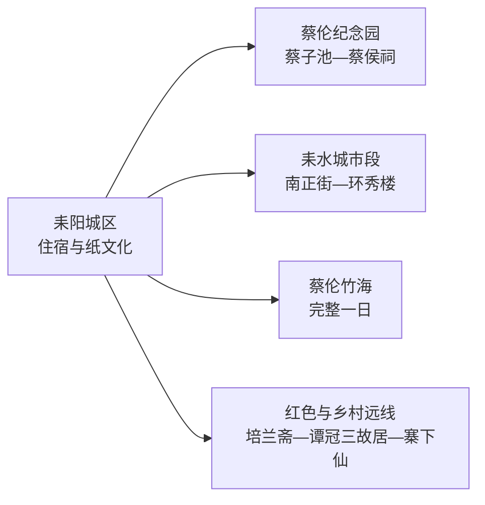
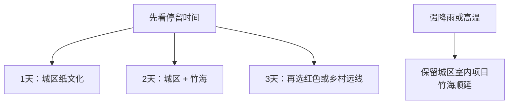

# 耒阳旅行指南

第一次来耒阳，可把行程分成两条主线：城区用半天到一天认识蔡伦、纸文化和耒水城市空间；蔡伦竹海另留完整一天。喜欢红色历史或乡村景观，再从培兰斋、谭冠三故居、寨下仙等方向选一条，不必把分散乡镇拼成赶路清单。

> 建议停留：2–3 天  
> 旅行关键词：蔡伦、纸文化、耒水、竹海、红色记忆、湘南饮食  
> 主要体力：城区低至中等；竹海和远郊山地中至较高  
> 最近研究：2026-08-13

## 城市速览

| 项目 | 旅行信息 |
|---|---|
| 主要旅行价值 | 在城区理解蔡伦与造纸文化，再用一整天进入蔡伦竹海的山水和竹林空间 |
| 建议停留 | 1 天走城区；2 天加入竹海；3 天从红色历史或乡村景区中选一条远线 |
| 较舒适季节 | 春秋适合城区与竹海；夏季竹林清凉但高温、雷雨和山洪风险上升 |
| 预算特点 | 城区公共空间成本较低；竹海交通、景区项目和远郊车辆是主要变量 |
| 步行强度 | 蔡伦纪念园较平缓；竹海、寨下仙及山地步道需更多爬升 |
| 主要天气风险 | 盛夏高温、短时强降雨、雷电、山洪和湿滑山路 |
| 独行旅行 | 城区可独立安排；远郊先锁定返程车辆、通信和最晚离场时间 |
| 亲子旅行 | 纸文化和农耕展示较易理解；竹海选择短线并留午休 |
| 长者与低体力旅行 | 以城区文化线为主，竹海只选车辆可达、休息点明确的短段 |
| 无障碍信息 | 城区新建服务设施可逐处询问；古建、山地和乡村景区的设施连续性需向官方确认 |

## 城市格局与游览区域

GeoNames `1804208` 是耒阳主城的 `P/PPLA3` 聚居点记录；Wikidata `Q1025448` 对应法定县级耒阳市，`P1566` 与固定 GeoNames ID 精确匹配。旅行范围按行政代码 `430481` 组织，耒阳虽由衡阳市代管，仍拥有独立城区、铁路门户、住宿和县域路线。

| 区域 | 适合看什么 | 怎么安排 | 关键取舍 |
|---|---|---|---|
| 耒阳城区 | 蔡伦纪念园、纸文化、南正街、城市餐饮 | 住城区，用半天到一天步行加短途车串联 | 把远郊留到次日，城区体验会更完整 |
| 蔡伦竹海方向 | 大尺度竹林、耒水上游和景区项目 | 独立整日，出发前核对开放、内部交通和返程 | 与城区同日只适合删减版 |
| 培兰斋—红色文化方向 | 革命史展陈、故居和乡村空间 | 选择一至两处正式开放场馆 | 开放日和讲解服务比数量更重要 |
| 寨下仙及乡村景区 | 山地、村落和季节景观 | 自驾或落实接驳后再排 | 雨后山路和返程时间优先核对 |
| 矿冶与工业空间 | 资源型城市转型和矿山修复线索 | 只进入正式开放的矿山公园或研学项目 | 在产煤矿、厂区、矿硐和运输道路属于生产空间 |

耒水国家湿地公园、竹海和山地林区的开放入口各有边界。沿正式栈道、景区道路和公告游线活动；湿地保育区、封闭林道、矿区和施工便道仍保留明确限制。

## 主要景点

### 城区文化与城市空间

| 景点 | 所在片区 | 类型 | 核心看点 | 建议用时 | 室内/室外 | 体力 | 预约 | 天气影响 | 优先级 |
|---|---|---|---|---|---|---|---|---|---|
| 蔡伦纪念园 | 城区蔡子池畔 | 纪念园、园林与纸文化 | 蔡侯祠、蔡子池、造纸文化与园林整体 | 2–3 小时 | 混合 | 低至中 | 中 | 中 | A |
| 南正街历史文化片区 | 城区 | 街区与城市生活 | 老城街巷、夜间餐饮与城市更新 | 1–2 小时 | 室外为主 | 低 | 低 | 中 | B |
| 环秀楼及耒水城市段 | 城区河岸 | 城市景观 | 城楼地标、河岸步行和城市空间 | 1–1.5 小时 | 室外 | 低 | 低 | 高 | B |
| 耒阳市农耕文化博物馆 | 城区或近城 | 专题展示 | 湘南农耕器物、生产生活与地方记忆 | 1–2 小时 | 室内为主 | 低 | 中 | 低 | B |

### 竹海、红色历史与远郊

| 景点 | 所在片区 | 类型 | 核心看点 | 建议用时 | 室内/室外 | 体力 | 预约 | 天气影响 | 优先级 |
|---|---|---|---|---|---|---|---|---|---|
| 蔡伦竹海旅游风景区 | 黄市镇方向 | 山水与竹林景区 | 连片竹林、耒水山水和纸竹文化 | 5–7 小时 | 室外为主 | 中至高 | 高 | 很高 | A |
| 培兰斋 | 红色文化方向 | 革命史场馆 | 湘南起义相关历史与专题展陈 | 1–2 小时 | 室内为主 | 低 | 中 | 低 | B |
| 谭冠三故居 | 乡村方向 | 名人故居 | 生平、革命经历与村落环境 | 1–1.5 小时 | 混合 | 低至中 | 中 | 中 | B |
| 寨下仙景区 | 远郊山地 | 山地与乡村景区 | 山地景观、村落与季节性活动 | 3–5 小时 | 室外为主 | 中至高 | 高 | 很高 | C |
| 上堡晶矿矿山公园 | 上堡方向 | 矿业科普与修复空间 | 矿物资源、矿业记忆和修复展示 | 2–3 小时 | 混合 | 中 | 高 | 高 | C |

景区等级表示质量管理记录，不等于每天开放。蔡伦竹海、寨下仙、矿山公园和故居类场馆都应在出发前核对当日入口、项目、讲解与返程。

## 美食与餐饮

耒阳饮食以湘南鲜辣、米粉、河鲜和码头菜为主。城区适合用早餐粉店、午餐家常菜和晚间街区三种场景分开体验；竹海日自带饮水和简便补给，再把正餐留回城区。

| 类型 | 适合场景 | 份量建议 | 过敏原与饮食注意 | 怎么选 |
|---|---|---|---|---|
| 杀猪粉、肉蛋粉 | 早餐或早午餐 | 一人一碗，内脏浇头可减量 | 猪肉、内脏、鸡蛋、骨汤和辣椒 | 先选汤底与辣度，再决定浇头 |
| 耒阳粉皮 | 小吃或配菜 | 一人小份或多人共享 | 可能含辣椒、花生、芝麻、蒜和酱油 | 调料分放更便于控制辣度 |
| 码头菜 | 午晚餐 | 多为共享菜，2–4 人更合适 | 河鲜、猪肉、辣椒、发酵调味和较高盐分 | 按人数点两菜一汤起步，避免一次点满桌 |
| 坛子菜与腌制菜 | 配饭小菜 | 少量尝味 | 盐分较高，可能含辣椒和发酵成分 | 与清淡蔬菜、汤菜搭配 |
| 竹笋与乡村土菜 | 竹海或乡村线 | 先问盘量 | 竹笋纤维、腊味、辣椒和猪油较常见 | 选择明码标价、营业稳定的餐馆 |

## 经典行程

### 一日经典：蔡伦与耒水城区

- **路线**：蔡伦纪念园 → 城区午餐 → 农耕文化博物馆或南正街 → 环秀楼与耒水城市段。
- **串联逻辑**：先看纸文化核心，再把地方生产生活和城市河岸接起来。
- **预约锚点**：以蔡伦纪念园和博物馆中规则较严格者为准。
- **休息安排**：午餐后留坐席休息，河岸步行放到傍晚。
- **时间不足时**：保留蔡伦纪念园，南正街与河岸二选一。

### 两日组合：城区加蔡伦竹海

- **路线**：第 1 天走城区经典线；第 2 天城区出发 → 蔡伦竹海正式入口 → 景区短线或完整线 → 返回城区。
- **串联逻辑**：文化场馆与山水竹林分日，减少往返和赶闭园。
- **预约锚点**：先确认竹海开放、内部交通、项目和返程车辆。
- **休息安排**：竹海日中段安排遮阴坐席午餐，返程后再吃正餐。
- **时间不足时**：第 2 天只走车辆可达的核心短线，不临时加入其他乡镇。

### 三日深度：纸文化、竹海与红色记忆

- **路线**：前两日按上；第 3 天培兰斋 → 城区午餐 → 谭冠三故居或另一处当期开放红色场馆。
- **串联逻辑**：第三天只选同主题场馆，形成完整历史线。
- **预约锚点**：逐处确认故居、展馆开放日和讲解。
- **休息安排**：中午回到餐饮稳定片区，下午只保留一个远点。
- **时间不足时**：只留培兰斋，不以多个闭馆外观代替参观。

### 雨天路线

- **路线**：蔡伦纪念园室内展陈 → 午餐 → 农耕文化博物馆 → 南正街有遮蔽短段。
- **适用条件**：普通降雨且城区道路正常；暴雨预警时以交通和场馆公告为准。
- **预约锚点**：确认两处场馆是否因维护或天气调整。
- **休息安排**：每段之间用车辆接驳，减少湿滑路面停留。
- **时间不足时**：只选一个主题场馆加坐席午餐。

### 亲子与低体力路线

- **路线**：蔡伦纪念园核心展区 → 午餐与午休 → 农耕文化博物馆或耒水平缓短段。
- **适用与减负**：纸文化适合亲子；低体力旅行可提前约车到最近落客点，删去竹海爬升。
- **预约锚点**：询问讲解、亲子活动、电梯或无障碍卫生间。
- **休息安排**：上午、午后各设一次长休息，傍晚按体力决定河岸段。
- **时间不足时**：保留蔡伦纪念园单点慢游。

### 远郊一日：红色或乡村二选一

- **路线**：方案 A 为培兰斋 → 乡村午餐 → 谭冠三故居；方案 B 为寨下仙或正式开放矿山公园单点整日。
- **适用条件**：已落实车辆、开放入口和最晚返程者。
- **预约锚点**：以远点运营方、乡镇或场馆公告为准。
- **休息安排**：在乡镇或景区服务区完成午餐与补水。
- **时间不足时**：保留一个正式开放目的地，取消跨方向串联。

## 住宿区域

| 区域 | 优点 | 取舍 | 适合人群 | 预订建议 |
|---|---|---|---|---|
| 耒阳城区 | 餐饮、铁路、公路和叫车较集中 | 去竹海仍需长距离接驳 | 首次到访、无车旅行、两日以上 | 选靠近次日出发道路且夜间安静的位置 |
| 耒阳西站或交通便利片区 | 抵离省时 | 城市夜间体验较弱 | 晚到早走 | 先核对站名、接驳和前台时间 |
| 竹海周边经营住宿 | 靠近自然景区 | 选择少、季节波动和返程替代较少 | 自驾、慢游、摄影 | 核实资质、供餐、热水、停车和取消政策 |

## 市内交通

耒阳站、耒阳西站服务场景不同，购票和叫车时使用完整站名。城区短途可用公交、出租车或网约车；竹海和乡镇远线更适合自驾、正规包车或提前确认的景区接驳。

| 场景 | 怎么走 | 出发前核对 |
|---|---|---|
| 铁路抵达 | 高铁通常使用耒阳西站，普速列车按票面站名抵达 | 车次、站名、夜间接驳、重点旅客服务 |
| 城区游览 | 步行结合公交或短途叫车 | 博物馆开放、道路施工、晚间返程 |
| 前往竹海 | 城区出发的自驾、正规包车或当期接驳 | 入口、路况、停车、内部交通和最晚返程 |
| 前往乡镇远点 | 先落实往返车辆，再决定景点 | 单程时间、手机信号、备用联系人和天气 |

## 不同旅行者须知

| 旅行者 | 推荐做法 | 需要留意 | 行前确认 |
|---|---|---|---|
| 独行旅行 | 以城区为基地，每天只选一个远方向 | 乡镇返程和夜间叫车不稳定 | 车辆、末班、信号和住宿电话 |
| 亲子旅行 | 用纸文化场馆加一段轻松河岸 | 水边、车辆、竹海坡道和高温 | 儿童活动、护栏、卫生间和午休 |
| 长者或低体力 | 以城区两馆为主，车辆接驳 | 古建台阶和远郊爬升 | 最近落客点、座椅、轮椅和电梯 |
| 摄影旅行 | 清晨河岸、竹海与乡村季节景观 | 无人机、林区防火和生产区边界 | 当地禁飞、景区拍摄和天气 |
| 工业与矿业兴趣 | 选择正式矿山公园或公开研学 | 在产煤矿、矿硐、厂区和专用道路有明确限制 | 运营方资质、接待范围和安全装备 |
| 特殊天气 | 普通雨天转城区室内线 | 雷暴、山洪和地灾预警时远郊顺延 | 气象、景区、交通和应急公告 |

## 行前核对

| 核对事项 | 为什么要重查 | 建议时间 | 官方入口 |
|---|---|---|---|
| 蔡伦纪念园与城区场馆 | 开放日、讲解和临展会调整 | 确定日期后及前一日 | [耒阳市政府景点介绍](https://www.leiyang.gov.cn/zjly/yzly/jdjs/index.html) |
| 蔡伦竹海 | 项目、内部交通、入口和天气变化较大 | 订住宿前及当天 | [耒阳市政府旅游信息](https://www.leiyang.gov.cn/zjly/yzly/jdjs/20230706/i3055944.html) |
| 铁路 | 车次和站点服务动态变化 | 购票时及出发前 | [中国铁路 12306](https://www.12306.cn/) |
| 高温、暴雨与山洪 | 直接影响竹海和乡村山地 | 出发前三日及当天 | [湖南省气象局](http://hn.cma.gov.cn/) |
| 矿山与林区 | 接待范围、防火和生产安排具有时效性 | 纳入路线前 | [耒阳市人民政府](https://www.leiyang.gov.cn/) |

## 来源与更新记录

### 主要来源

| 来源 | 类型 | 支持内容 | 核验日期 |
|---|---|---|---|
| [耒阳市2025年政府工作报告](https://www.leiyang.gov.cn/xxgk/szfxxgkml/zfgzbg/20250416/i3634196.html) | 市政府 | 蔡伦纪念园4A、农耕博物馆等景区建设及矿山公园开放记录 | 2026-08-13 |
| [耒阳市政府：景点介绍目录](https://www.leiyang.gov.cn/zjly/yzly/jdjs/index.html) | 市政府 | 蔡伦竹海、蔡伦纪念园、培兰斋、环秀楼等属地线索 | 2026-08-13 |
| [耒阳市“十四五”规划](https://www.leiyang.gov.cn/xxgk/bmxxgkml/szfgzbm/sfzhggj/ghjh/20240312/i3277412.html) | 市政府规划 | 纸文化、竹海、湿地、公路与文旅空间 | 2026-08-13 |
| [耒阳十大旅游景点](https://www.leiyang.gov.cn/zjly/yzly/jdjs/20200214/i986455.html) | 市政府 | 蔡伦纪念园、耒水湿地和历史景点背景 | 2026-08-13 |
| [民政部行政区划代码查询](https://dmfw.mca.gov.cn/xzqh/getList?code=430481&trimCode=false&maxLevel=3) | 国家行政区划数据 | 法定县级市代码 `430481` | 2026-08-13 |
| [GeoNames 1804208](https://www.geonames.org/1804208/) | 开放地理数据 | 耒阳固定城市点与坐标 | 2026-08-13 |
| [Wikidata Q1025448](https://www.wikidata.org/wiki/Q1025448) | 开放结构化数据 | 法定耒阳市与 GeoNames 精确映射 | 2026-08-13 |

### 更新记录

| 日期 | 更新内容 |
|---|---|
| 2026-08-13 | 首次完成耒阳市独立旅行研究；建立城区纸文化、蔡伦竹海、红色与乡村远线的选择关系，补充矿区、湿地、林区、天气、交通和无障碍边界。 |
