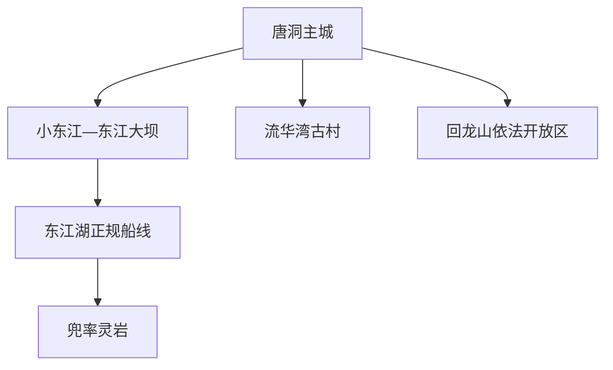
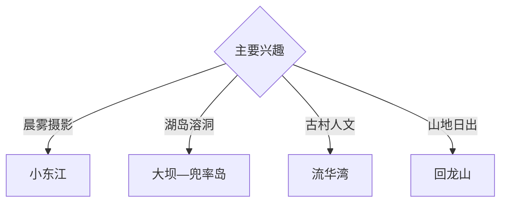

# 资兴旅行指南

资兴位于湘东南，以东江湖、雾漫小东江、东江大坝、兜率灵岩、流华湾古村和回龙山形成湖泊山地旅行体系。固定快照中的 **Tangdong / GeoNames 1783688** 锚定唐洞—资兴主城；东江湖景区范围广，码头、岛屿与山地按运营线路分日安排。

## 城市速览

| 项目 | 信息 |
|---|---|
| 主线 | 唐洞主城—小东江—东江大坝—兜率岛—流华湾—回龙山 |
| 停留 | 东江湖 2 天；古村或回龙山另留 1 天 |
| 住宿 | 东江街道便于看雾；唐洞主城适合综合接驳 |
| 交通 | 郴州转公路进入，湖区使用正规接驳与船舶 |
| 季节 | 春夏晨雾突出；全年关注降雨、水位和山路 |
| 预算 | 景区交通、船票、讲解与湖区住宿构成主要增量 |

## 城市格局与游览区域

唐洞主城承担行政与生活服务，东江街道是东江湖常用入口；流华湾、回龙山和黄草方向各自需要公路时间。水源保护区、库岸消落带、水电设施、未开放岛屿、漂流河段和森林核心保护范围按公告保持边界。

## 主要景点

| 景点 | 区域 | 类型 | 核心体验 | 用时 | 环境 | 体力 | 研究价值 | 拥挤 | 优先级 |
|---|---|---|---|---:|---|---|---|---|---|
| 雾漫小东江正式游线 | 东江街道 | 河谷与摄影 | 晨雾、峡谷水面和栈道观察 | 半天 | 室外 | 低中 | 很高 | 旺季高 | A |
| 东江大坝公开区 | 东江湖入口 | 工程与湖泊 | 水利工程、峡谷和库区尺度 | 2–3 小时 | 室外 | 中 | 很高 | 旺季高 | A |
| 兜率灵岩正规游线 | 兜率岛 | 溶洞与湖岛 | 溶洞地貌、岛屿和乘船体验 | 半天至1天 | 混合 | 中 | 高 | 旺季中高 | A |
| 龙景峡谷 | 东江湖景区 | 峡谷与瀑布 | 瀑布群、森林步道和溪谷生态 | 2–3 小时 | 室外 | 中高 | 高 | 中 | B |
| 流华湾古村公开区 | 三都方向 | 古村与历史 | 湘南民居、巷道和乡村文化 | 半天 | 混合 | 低中 | 高 | 节假日中 | B |
| 回龙山依法开放区 | 团结方向 | 山岳与日出 | 登高、云海和湘南山地视野 | 1 天 | 室外 | 高 | 高 | 节假日中 | B |
| 东江湖文化旅游街 | 东江街道 | 城市与展陈 | 湖区文化、摄影和餐饮休整 | 2–3 小时 | 混合 | 低 | 中 | 晚间中 | B |

## 美食与餐饮

东江湖鱼、米粉、湘南腊味和时令山蔬适合在正规餐馆体验。水产品核对合法来源；清晨拍雾日提前准备简餐，岛屿和山地日携带饮水。

## 经典行程

### 小东江经典线
**路线**：东江街道—小东江正式入口—观雾栈道—东江湖文化街。**逻辑**：把清晨核心景观与午后休整连接。**预约锚点**：景区时段票。**休息**：游客中心。**删除条件**：浓雨或能见度过低时改湖区展陈。

### 大坝兜率线
**路线**：小东江—东江大坝—正规码头—兜率灵岩—返程。**逻辑**：集中理解工程、湖泊和喀斯特。**预约锚点**：船班与洞内开放。**休息**：码头服务区。**删除条件**：大风停航时保留陆上段。

### 龙景峡谷线
**路线**：东江湖入口—龙景峡谷开放步道—大坝观景区。**逻辑**：以半天完成瀑布和峡谷专题。**预约锚点**：步道公告。**休息**：景区服务点。**删除条件**：暴雨或山洪预警时取消。

### 流华湾古村线
**路线**：主城—流华湾公开区—乡村正规接待点—返程。**逻辑**：用半天观察聚落与地方生活。**预约锚点**：古建开放。**休息**：村内服务点。**删除条件**：古建维护时转主城文博。

### 回龙山一日线
**路线**：主城—山地入口—依法开放观景线—返程。**逻辑**：独立一天适应盘山交通与登高。**预约锚点**：道路、天气和防火。**休息**：山脚正规接待点。**删除条件**：雷雨、大风、结冰或封控时顺延。

### 亲子低体力线
**路线**：东江湖文化街—大坝公开区—小东江平缓段。**逻辑**：降低长距离步行和乘船不适。**预约锚点**：景区交通。**休息**：游客中心。**删除条件**：高温时缩短户外段。

### 三日组合线
**路线**：首日小东江与大坝；次日兜率岛；第三日流华湾或回龙山。**逻辑**：水陆核心和远郊分日。**预约锚点**：船班与第三日天气。**休息**：东江街道连续住宿。**删除条件**：两天时删第三日。

## 住宿区域

东江街道适合清晨进入小东江，唐洞主城适合跨方向接驳；湖区正规度假住宿适合慢游。订房核对景区入口距离、停车、早餐、船班联动与天气退改。

## 市内交通

常用铁路门户在郴州，抵达后转公路进入资兴。东江湖内部按景区接驳、码头和船班运行；流华湾与回龙山分方向安排车辆，山路按临时管制通行。

## 不同旅行者须知

摄影者提前确认雾况和开放时段；亲子与长者选择平缓栈道及大坝公开区；洞穴旅行者准备防滑鞋；徒步者按天气进入回龙山。饮用水源保护区、水电生产设施、未开放库岸、森林核心区和非运营船只保留明确限制。

## 行前核对

- 核对小东江时段票、大坝、兜率岛与船班。
- 核对流华湾、回龙山、漂流和山路开放。
- 核对水位、风浪、暴雨、山洪与森林防火公告。
- 核对郴州接驳、返程车辆和湖区住宿。

## 来源与更新记录

| 来源 | 支持内容 | 核验日期 |
|---|---|---|
| [湖南省水利厅：醉美东江湖](https://slt.hunan.gov.cn/slt/xxgk/slxw/sxsl/202111/t20211103_20970501.html) | 东江湖、大坝、岛洞、漂流与山水体系 | 2026-09-03 |
| [湖南省台办：东江湖](https://www.hnstb.gov.cn/m/plus/view-546-1.html) | 小东江、龙景峡谷、兜率灵岩与景区内容 | 2026-09-03 |
| [GeoNames 1783688](https://www.geonames.org/1783688/) | Tangdong 固定人口点与资兴主城位置 | 2026-09-03 |

