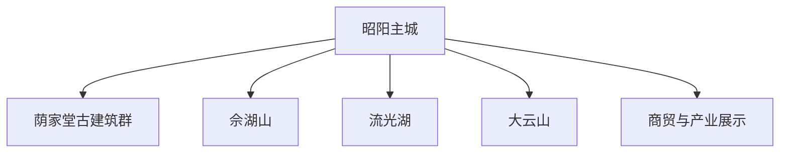
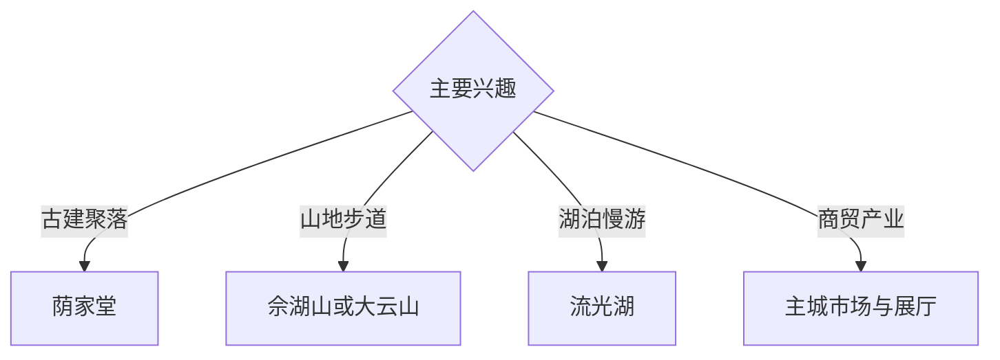

# 邵东旅行指南

邵东位于湘中南，以昭阳主城的商贸产业、荫家堂古建筑群、佘湖山与大云山的山地景观形成紧凑而有辨识度的旅行组合。固定快照中的 **Liangshi / GeoNames 6645575** 对应邵东法定县级市记录；实际住宿和综合接驳以昭阳主城为宜。

## 城市速览

| 项目 | 信息 |
|---|---|
| 主线 | 昭阳主城—荫家堂—佘湖山—流光湖—大云山 |
| 停留 | 主城与古建 1–2 天；山地或产业专题另留 1 天 |
| 住宿 | 昭阳主城适合交通与餐饮；山地选择正规接待点 |
| 交通 | 高铁、公路抵达，远郊景点宜约车或自驾 |
| 季节 | 春秋适合古村与登山；夏季关注强对流和高温 |
| 预算 | 主城较灵活，包车、讲解和山地住宿增加预算 |

## 城市格局与游览区域

昭阳主城承担高铁接驳、住宿和商贸观察；荫家堂适合建筑与聚落专题，佘湖山、流光湖和大云山分属不同郊野方向。古建本体、山地林区、水库岸线、工厂生产线与仓储物流区按正式开放和接待范围进入。

## 主要景点

| 景点 | 区域 | 类型 | 核心体验 | 用时 | 环境 | 体力 | 研究价值 | 拥挤 | 优先级 |
|---|---|---|---|---:|---|---|---|---|---|
| 荫家堂古建筑群公开区 | 杨桥方向 | 古建与聚落 | 清代民居、院落布局与家族聚落 | 半天 | 混合 | 低中 | 很高 | 节假日中 | A |
| 佘湖山依法开放游线 | 主城近郊 | 山岳与人文 | 山地视野、步道与地方文化 | 半天 | 室外 | 中高 | 高 | 周末中 | A |
| 昭阳公园及主城公共空间 | 昭阳 | 城市休闲 | 本地生活、城市发展与夜间散步 | 2–3 小时 | 室外 | 低 | 中 | 晚间中 | B |
| 流光湖正规游览区 | 流光岭方向 | 湖泊与乡村 | 湖岸风景、乡村休闲与慢行 | 半天 | 室外 | 低中 | 中高 | 季节性 | B |
| 大云山依法开放区 | 堡面前方向 | 森林与山岳 | 森林生态、登高与山村景观 | 1 天 | 室外 | 高 | 高 | 季节性 | A |
| 邵东国际商贸城公开区 | 主城 | 商贸观察 | 小商品集散、市场网络与城市产业 | 2–3 小时 | 室内 | 低 | 高 | 工作日中 | B |
| 正规产业展示与体验点 | 主城及园区 | 工业文化 | 打火机、箱包等产业链观察 | 半天 | 室内 | 低 | 高 | 预约制 | B |

## 美食与餐饮

邵东米粉、猪血丸子、湘中腊味、豆制品和时令山蔬适合在主城正规餐馆体验。乡村与山地日提前准备饮水；产业园、批发市场和生产车间按接待安排活动，用餐选择对公众营业的场所。

## 经典行程

### 主城古建线
**路线**：昭阳主城—荫家堂公开区—返城。**逻辑**：用半天至一天理解商贸城市与传统聚落。**预约锚点**：古建开放与讲解。**休息**：主城或杨桥镇。**删除条件**：古建临时维护时保留主城专题。

### 荫家堂细读线
**路线**：游客入口—院落公开区—村落公共空间。**逻辑**：把建筑构造、家族历史和聚落环境连起来。**预约锚点**：开放院落。**休息**：游客服务点。**删除条件**：雨天避开湿滑石阶。

### 佘湖山半日线
**路线**：主城—正式入口—开放步道—返城。**逻辑**：以较短交通完成近郊登高。**预约锚点**：天气和步道公告。**休息**：山脚服务点。**删除条件**：雷雨、大风或封控时改主城。

### 流光湖乡村线
**路线**：主城—流光湖正规游览区—沿线乡村接待点—返程。**逻辑**：把湖泊景观与乡村休闲组合。**预约锚点**：车辆和接待。**休息**：正规农庄。**删除条件**：暴雨、岸线管制或水位异常时顺延。

### 大云山一日线
**路线**：主城—山地入口—依法开放步道—返程。**逻辑**：独立一天适应山路尺度。**预约锚点**：防火、道路与天气。**休息**：山地服务点。**删除条件**：山洪、地质风险或森林防火封控时取消。

### 商贸产业线
**路线**：国际商贸城公开区—预约制产业展厅—主城餐饮。**逻辑**：从市场端理解邵东制造与流通网络。**预约锚点**：企业接待。**休息**：商贸城公共区。**删除条件**：企业无接待时保留市场公开区。

### 三日组合线
**路线**：首日主城与荫家堂；次日佘湖山或流光湖；第三日大云山或产业专题。**逻辑**：古建、自然和产业分日展开。**预约锚点**：山地天气与企业接待。**休息**：昭阳主城连续住宿。**删除条件**：两天时删第三日。

## 住宿区域

昭阳主城适合高铁接驳、餐饮和多方向出发；古建或山地区域的正规住宿适合慢游。订房核对夜间交通、停车、消防、早餐与山路天气退改。

## 市内交通

邵东站与邵东汽车枢纽是主要抵达点，购票后核对终到站和住宿距离。荫家堂、流光湖与大云山方向分散，按方向包车或自驾更顺畅；山区按临时交通、会车和落石提示行驶。

## 不同旅行者须知

建筑爱好者给荫家堂半天以上；产业研究者提前联系公开展厅；亲子和长者选择主城、市场与湖区平缓段；徒步者按天气选择佘湖山或大云山。古建私宅、林区核心保护范围、水库管理区、工厂生产线和物流作业区保留明确限制。

## 行前核对

- 核对荫家堂、佘湖山、流光湖与大云山开放公告。
- 核对产业展厅、商贸市场营业与团队接待安排。
- 核对高铁、城乡班次、返程车辆和山地住宿。
- 核对雷雨、山洪、地质灾害、森林防火和高温预警。

## 来源与更新记录

| 来源 | 支持内容 | 核验日期 |
|---|---|---|
| [邵东市人民政府](https://www.shaodong.gov.cn/) | 城市概况、公共服务与旅游动态核对入口 | 2026-09-03 |
| [邵东市政府：全域旅游发展规划](https://www.shaodong.gov.cn/jc_sds/uploadfiles/202310/2023101008280048703.pdf) | 荫家堂、佘湖山、大云山与产业旅游资源 | 2026-09-03 |
| [GeoNames 6645575](https://www.geonames.org/6645575/) | Liangshi 固定记录与邵东县级市映射 | 2026-09-03 |
