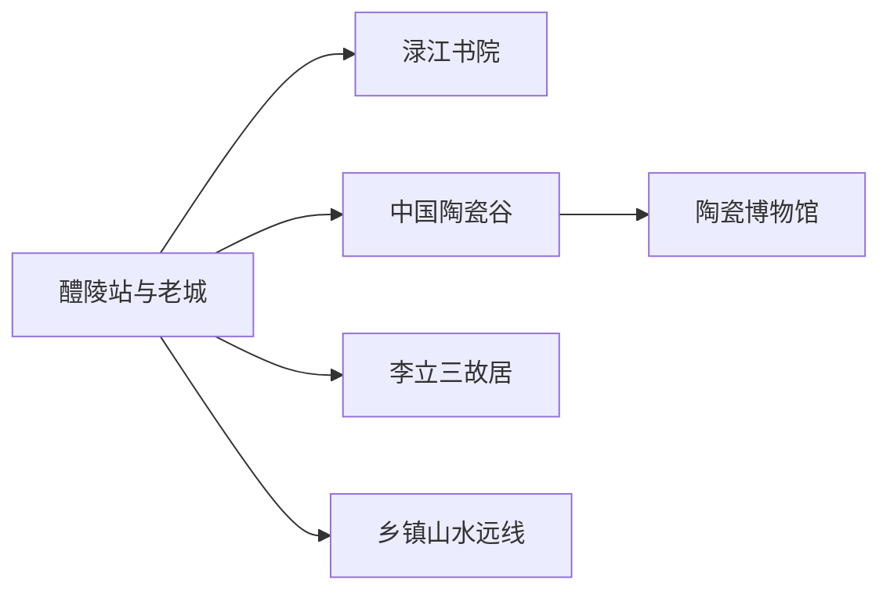
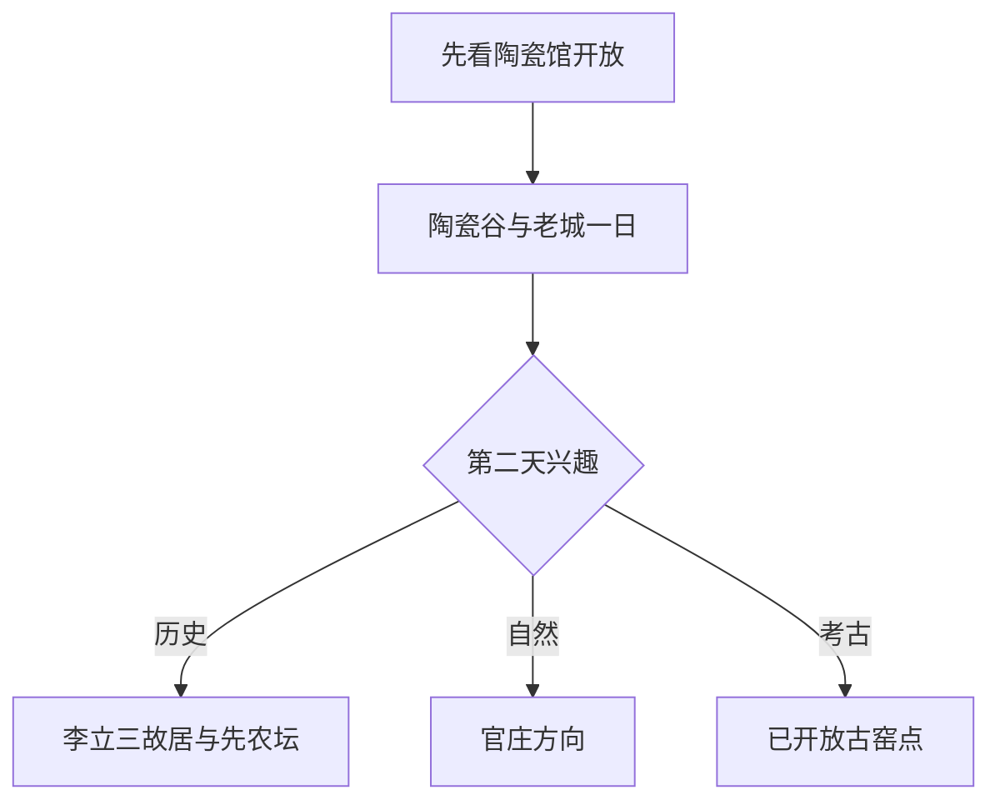

# 醴陵旅行指南

醴陵最适合围绕陶瓷安排：先在中国陶瓷谷和博物馆建立从古窑、釉下五彩到当代产业的完整认识，再走渌江书院与老城水岸；有第三天时，从李立三故居、先农坛或一条山水远线中选一项。陶瓷生产、烟花爆竹和窑址考古都有明确作业边界，游客体验优先选择博物馆、正式展厅和已公布研学项目。

> 建议停留：1–3 天 
> 旅行关键词：陶瓷、釉下五彩、渌江书院、古窑、工业文化、湘东风味 
> 主要体力：低至中等；山水远线较高 
> 最近研究：2026-08-13

## 城市速览

| 项目 | 旅行信息 |
|---|---|
| 主要旅行价值 | 用陶瓷博物馆、陶瓷谷和老城遗存理解一座持续生产的陶瓷城市 |
| 建议停留 | 1 天看陶瓷与书院；2 天增加红色文博；3 天加入一条乡镇远线 |
| 较舒适季节 | 春秋适合步行；盛夏安排室内陶瓷场馆，雨季远线按路况调整 |
| 预算特点 | 主城中等；体验课、作品购买、远线车辆与景区项目增加预算 |
| 步行强度 | 陶瓷谷和老城低至中等；书院台阶、乡镇山水为中至高 |
| 主要天气风险 | 高温、强降雨、雷电、山洪、道路湿滑与森林火险 |
| 独行旅行 | 主城场馆容易组合，乡镇远线先锁定返程 |
| 亲子旅行 | 陶瓷展陈和正式手作体验较合适，窑火与工具活动按年龄选择 |
| 长者与低体力旅行 | 以博物馆、陶瓷谷短段和车辆串联书院为主 |
| 无障碍信息 | 新场馆可提前咨询；老建筑与山地设施连续性需向官方确认 |

## 城市格局与游览区域

醴陵是株洲市代管的县级市，法定代码 `430281`。GeoNames `1803616` 是主城居民点，Wikidata `Q604609` 的 `P1566` 与之精确对应；点位帮助核对城市位置，法定市域仍以行政区划资料为准。旅行上分为陶瓷谷—经开区、渌江老城、东富—李畋和南北乡镇四组。

| 区域 | 主要内容 | 怎么安排 | 与其他区域的关系 |
|---|---|---|---|
| 中国陶瓷谷片区 | 陶瓷博物馆、展览、设计与正式体验 | 半日至一日 | 首访核心，和老城可同日组合 |
| 渌江老城 | 渌江书院、文庙文化、河岸与日常餐饮 | 半日 | 适合放在陶瓷馆之后 |
| 东富—李畋方向 | 李立三故居、先农坛等红色与近代遗存 | 半日至一日 | 与陶瓷谷分开安排更从容 |
| 官庄、沩山等远线 | 水库、山林、古窑与乡村活动 | 一日 | 每次只选一个正式开放方向 |
| 陶瓷与烟花生产空间 | 窑炉、原料、釉料、仓储和烟花爆竹工厂 | 参加运营方明确接待的项目 | 按生产安全、消防与保密规则活动 |

## 主要景点

### 陶瓷与老城

| 景点 | 区域 | 类型 | 主要看点 | 建议用时 | 室内外 | 体力 | 预约风险 | 天气影响 | 优先级 |
|---|---|---|---|---:|---|---|---|---|---|
| 中国陶瓷谷 | 经开区 | 产业文化园区 | 当代陶瓷建筑、展览和产业城市尺度 | 2–4 小时 | 混合 | 中 | 中 | 中 | A |
| 醴陵陶瓷博物馆 | 陶瓷谷 | 博物馆 | 古窑、釉下五彩与近现代陶瓷发展 | 2–3 小时 | 室内 | 低 | 中 | 低 | A |
| 渌江书院 | 老城 | 书院与文物建筑 | 书院建筑、地方教育史与渌江环境 | 1.5–2.5 小时 | 混合 | 中 | 中 | 中 | A |
| 醴陵市博物馆当期展览 | 主城 | 综合文博 | 地方历史、文物与专题展 | 1–2 小时 | 室内 | 低 | 中 | 低 | B |
| 陶瓷谷正式手作或研学项目 | 经开区 | 体验项目 | 拉坯、彩绘或材料认识，按运营方项目选择 | 1–3 小时 | 室内 | 低至中 | 很高 | 低 | B |

### 历史、红色与远线

| 景点 | 区域 | 类型 | 主要看点 | 建议用时 | 室内外 | 体力 | 预约风险 | 天气影响 | 优先级 |
|---|---|---|---|---:|---|---|---|---|---|
| 李立三故居 | 阳三石方向 | 纪念馆 | 生平、近现代史与故居建筑 | 1–2 小时 | 混合 | 低 | 中 | 低 | B |
| 醴陵先农坛 | 主城 | 历史建筑 | 近代公共建筑与地方历史 | 1–2 小时 | 混合 | 低 | 高 | 中 | B |
| 醴陵窑遗址群已公布开放点 | 沩山等方向 | 考古与文保 | 古窑址、制瓷历史与保护现场 | 半日至一日 | 室外为主 | 中 | 很高 | 高 | C |
| 官庄水库正式游览区 | 官庄方向 | 湖库与山水 | 湖面、山林与正式服务区 | 半日至一日 | 室外 | 中 | 高 | 很高 | C |
| 李畋文化相关正式开放点 | 富里方向 | 民俗与行业史 | 烟花祖师传说、地方行业文化 | 2–4 小时 | 混合 | 中 | 很高 | 中 | C |

陶瓷谷的博物馆、展览与体验可在一日内组合，但同一场馆不重复计数。窑址只走已公布入口；窑炉、釉料、原料堆场和烟花爆竹生产仓储属于生产空间，参观以企业或主管部门明确接待为前提。

## 美食与餐饮

| 菜品或餐饮类型 | 常见区域 | 一个人用餐与常见份量 | 风味、过敏原与饮食限制 | 排队风险与替代方法 |
|---|---|---|---|---|
| 醴陵炒粉 | 主城早餐店 | 一人一份，适合抵达日 | 常见猪肉、鸡蛋、鲜椒和酱油；可要求少辣 | 早餐高峰错峰，选择同类粉店 |
| 醴陵小炒肉 | 主城湘菜馆 | 多为共享盘，一人问小份 | 猪肉、鲜椒、豆豉和酱油常见 | 搭配蔬菜和米饭，热门店满位时换居民商圈 |
| 蒸鱼与湘东鱼菜 | 渌江沿线、主城 | 多按重量或整鱼计价 | 注意鱼刺、辣椒、豆豉和料酒 | 点菜前确认重量与价格 |
| 乡土腊味和蒸菜 | 主城及乡镇餐馆 | 适合共享 | 盐分较高，含猪肉、豆制品或辣椒 | 清淡饮食改选时蔬与汤菜 |
| 陶瓷主题茶饮与简餐 | 陶瓷谷 | 一人容易安排 | 甜品可能含奶、蛋、小麦和坚果 | 展会期排队时回主城用餐 |

## 经典行程

### 一日经典路线

**路线**：中国陶瓷谷 → 醴陵陶瓷博物馆 → 午餐 → 渌江书院 → 渌江沿岸短步行

- **串联逻辑**：上午认识陶瓷产业，下午回到老城补教育史与城市生活。
- **预约锚点**：陶瓷博物馆、书院和体验项目。
- **休息安排**：陶瓷谷或主城午餐，书院前后安排室内休息。
- **时间不足时**：保留陶瓷博物馆和渌江书院。

### 两日城市路线

**第 1 天**：陶瓷谷—博物馆—渌江书院。 
**第 2 天**：李立三故居 → 主城午餐 → 先农坛或市博物馆。

- **串联逻辑**：两天分别处理陶瓷主线与近现代历史，减少跨片区往返。
- **预约锚点**：四座场馆的开放日与讲解。
- **休息安排**：两晚住主城，午餐和午休回商业区。
- **时间不足时**：第二天保留李立三故居。

### 三日深度路线

**第 1 天**：陶瓷谷与博物馆。 
**第 2 天**：老城、书院与红色文博。 
**第 3 天**：官庄水库、已开放古窑点或李畋文化线三选一。

- **串联逻辑**：前两天在主城建立背景，第三天只进入一个乡镇方向。
- **预约锚点**：远线开放、车辆、午餐和返程。
- **休息安排**：远线在正式游客服务点休息。
- **时间不足时**：先删第三天。

### 雨天路线

**路线**：陶瓷博物馆 → 室内午餐 → 正式陶瓷体验或市博物馆

- **适用条件**：市区交通正常；强对流升级时缩短为一座场馆。
- **预约锚点**：馆舍和体验课。
- **休息安排**：全程用室内场所与车辆串联。
- **时间不足时**：只保留陶瓷博物馆。

### 亲子或低体力路线

**亲子路线**：陶瓷博物馆 → 午餐 → 适龄手作体验。 
**低体力路线**：车辆到陶瓷博物馆 → 午休 → 渌江书院可达短段。

- **减负方式**：亲子线减少古建筑长步行；低体力线提前确认落客点、台阶和座椅。
- **预约锚点**：体验年龄、材料、窑烧交付和场馆无障碍。
- **休息安排**：陶瓷谷与主城餐饮区。
- **时间不足时**：两类路线都保留陶瓷博物馆。

### 远郊一日路线

**路线**：主城 → 官庄水库正式游览区或一处已开放古窑点 → 乡镇午餐 → 返回

- **适用条件**：开放、天气、道路和返程已确认。
- **预约锚点**：入口、讲解、车辆和森林火险信息。
- **休息安排**：正式服务点午餐，避免把生产村落当休息站。
- **时间不足时**：整段改为陶瓷谷—老城线。

## 住宿区域

| 区域 | 优点 | 缺点 | 适合人群 | 交通特点 |
|---|---|---|---|---|
| 醴陵站—老城 | 餐饮、书院与铁路抵达方便 | 到陶瓷谷需乘车 | 首访、独行、铁路抵达 | 步行加短程车 |
| 陶瓷谷周边 | 方便看展和参加活动 | 夜间餐饮密度需核对 | 陶瓷兴趣、展会与亲子 | 适合次日继续园区活动 |
| 高铁站或公路节点周边 | 到发和自驾停车方便 | 与老城景点有距离 | 晚到早走、自驾 | 核对实际站名和市区接驳 |
| 乡镇正式住宿 | 靠近单一远线 | 营业、餐饮和返程选择少 | 已锁定山水或研学项目者 | 先确认住宿资质与道路 |

## 市内交通

| 场景 | 建议与取舍 | 行前需要重查的内容 |
|---|---|---|
| 铁路抵达 | 按车票完整站名确认到站，再用公交、出租或网约车进主城 | 车次、站口、末班和上客点 |
| 主城与陶瓷谷 | 公交或短程车辆更省步行，老城内部可分段步行 | 线路、闭馆日、展会交通管制 |
| 乡镇远线 | 自驾或正规包车更灵活，每天只选一个方向 | 路况、停车、返程和山洪火险 |
| 工业研学 | 仅使用运营方公布的集合与参观动线 | 实名、年龄、保险、摄影与劳动防护 |

## 不同旅行者须知

| 旅行维度 | 可行条件 | 主要取舍 | 需额外核对 |
|---|---|---|---|
| 独行旅行 | 主城文博和粉店适合单人 | 远线车辆成本较高 | 返程与夜间上客点 |
| 亲子旅行 | 博物馆和适龄陶瓷体验 | 窑火、工具和材料有年龄门槛 | 监护、作品领取和过敏原 |
| 长者或低体力旅行 | 车辆串联新场馆和老城短段 | 书院台阶与山地增加负担 | 落客点、电梯、座椅和卫生间 |
| 无障碍需求 | 新场馆可提前咨询 | 老建筑与山地连续通行有限 | 设施连续性需向官方确认 |
| 摄影旅行 | 公共展陈和老城水岸较方便 | 工厂、窑炉和考古区按管理拍摄 | 三脚架、闪光灯、无人机和商业拍摄 |
| 工业兴趣 | 正式研学可理解陶瓷与烟花文化 | 生产、仓储、试验和高温区有安全边界 | 企业接待、实名、保险和防护 |

## 行前核对

| 核对事项 | 为什么需要重查 | 建议核对时间 | 官方入口 |
|---|---|---|---|
| 陶瓷馆与书院 | 闭馆、展览和活动会变化 | 排入路线前及到访前一日 | [湖南省文化和旅游厅](https://whhlyt.hunan.gov.cn/) |
| 古窑与生产体验 | 开放点、考古和企业接待并不固定 | 预约前 | [醴陵市人民政府](http://www.liling.gov.cn/) |
| 铁路 | 车次、到站和停靠日期变化 | 出发前一周及当天 | [中国铁路 12306](https://www.12306.cn/) |
| 天气与山地 | 暴雨、雷电和火险影响远线 | 出发前三日及当天 | [湖南省气象局](https://hn.cma.gov.cn/) |

## 来源与更新记录

### 主要来源

| 来源 | 类型 | 支持内容 | 核验日期 |
|---|---|---|---|
| [湖南省政府：渌江书院](https://www.hunan.gov.cn/hnszf/jxxx/hslv/c101475/202108/t20210827_20404566.html) | 省政府 | 书院历史、建筑与游览价值 | 2026-08-13 |
| [湖南省文旅厅：醴陵陶瓷文化](https://whhlyt.hunan.gov.cn/whhlyt/news/sxxw/201909/t20190910_5474951.html) | 文旅主管部门 | 陶瓷、书院与城市文旅背景 | 2026-08-13 |
| [湖南省文旅厅：陶瓷谷](https://whhlyt.hunan.gov.cn/whhlyt/news/tpxw/201909/t20190910_5481839.html) | 文旅主管部门 | 陶瓷谷与产业文化 | 2026-08-13 |
| [文化和旅游部乡村线路：醴陵](https://zhuanti.mct.gov.cn/xcss2024_xcygj/hunan/detail/7165.html) | 国家文旅部门 | 乡村与陶瓷线路线索 | 2026-08-13 |
| [GeoNames 1803616](https://www.geonames.org/1803616/) | 开放地名库 | 固定城市点与坐标 | 2026-08-13 |
| [Wikidata Q604609](https://www.wikidata.org/wiki/Q604609) | 开放知识库 | 法定实体与 GeoNames 映射 | 2026-08-13 |

### 更新记录

| 日期 | 更新内容 |
|---|---|
| 2026-08-13 | 首次建立醴陵独立指南；按陶瓷谷、渌江老城、红色文博和乡镇远线组织，并明确窑址、陶瓷与烟花生产边界。 |
