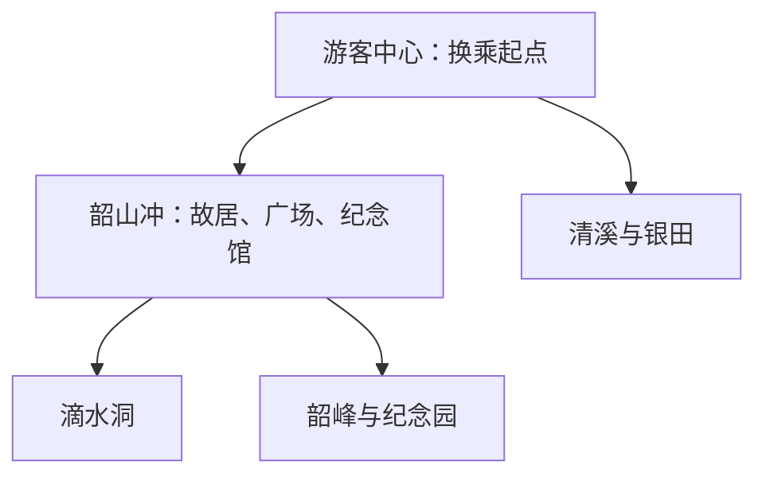
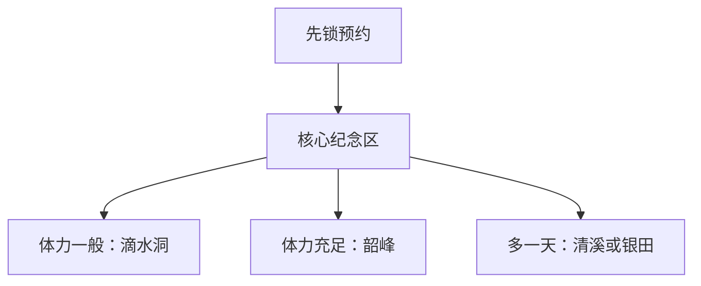

# 韶山旅行指南

韶山适合先用一天完成核心纪念区，再按兴趣选择滴水洞、韶峰、清溪或银田。核心区人流、预约与换乘会决定当天节奏，把最重要的纪念馆和故居时段先锁定，其他项目围绕它们增减。

> 建议停留：1–3 天 
> 旅行关键词：红色文化、故居、纪念馆、滴水洞、韶峰 
> 主要体力：核心区低至中等，韶峰中高 
> 无障碍提醒：设施连续性需向官方确认；纪念建筑、环保车站点和山地入口分别核对

## 城市速览

| 项目 | 信息 |
|---|---|
| 主要旅行价值 | 集中理解毛泽东早年生活、革命记忆与韶山乡村环境 |
| 建议停留 | 1 天完成核心纪念区；2–3 天增加滴水洞、韶峰或银田 |
| 较舒适季节 | 春秋步行较舒适，节假日重点考虑预约与客流 |
| 预算特点 | 核心纪念场馆以公共文化为主，换乘、收费景区和演出增加支出 |
| 步行强度 | 核心区低至中等；韶峰和求学路较高 |
| 独行旅行 | 核心区线路清晰，远点先确认换乘与返程 |
| 亲子旅行 | 纪念馆、特别支部和农耕项目适合分段参观 |
| 长者与低体力旅行 | 以环保车和核心纪念区短线为主 |
| 主要天气风险 | 高温、强降雨、雷电、山路湿滑与客流拥挤 |
| 行前关键动作 | 先锁核心场馆预约与换乘，再选择滴水洞或韶峰 |

## 城市格局与游览区域

韶山是湘潭市代管的县级市，法定代码 **430382**。韶山冲核心纪念区集中故居、广场和纪念馆；滴水洞、韶峰与纪念园由景区换乘串联，清溪和银田适合另留半日。

| 区域 | 主要内容 | 建议节奏 | 选择提示 |
|---|---|---|---|
| 韶山冲核心区 | 故居、广场、纪念馆、特别支部 | 半日至 1 天 | 先按预约时段排序 |
| 滴水洞方向 | 峡谷环境与历史陈列 | 2–3 小时 | 与核心区通过换乘组合 |
| 韶峰—纪念园方向 | 山地、纪念设施与登高 | 半天 | 按体力和天气选线 |
| 清溪—银田方向 | 城市公共空间、水利与乡村 | 半日至 1 天 | 适合第二天和低体力路线 |

## 主要景点

| 景点 | 区域 | 类型 | 主要看点 | 建议用时 | 室内外 | 体力 | 预约风险 | 天气影响 | 优先级 |
|---|---|---|---|---:|---|---|---|---|---|
| 毛泽东同志故居、广场与纪念馆核心区 | 韶山冲 | 纪念地、博物馆 | 早年生活、革命历史、文物与纪念空间 | 半日至 1 天 | 混合 | 低至中 | 很高 | 中 | A |
| 中共韶山特别支部陈列馆 | 韶山冲 | 红色历史 | 早期农村党组织与地方革命史 | 1–2 小时 | 室内 | 低 | 高 | 低 | A |
| 滴水洞景区 | 韶山冲西部 | 历史、山谷 | 山谷环境、建筑与历史陈列 | 2–3 小时 | 混合 | 中 | 高 | 高 | A |
| 韶峰景区 | 韶山冲 | 山地 | 登高、林地与韶山地貌 | 半天 | 室外 | 中至高 | 高 | 很高 | B |
| 韶山毛泽东纪念园 | 核心区周边 | 纪念园 | 革命历史主题纪念设施 | 2–3 小时 | 室外为主 | 中 | 中至高 | 高 | B |
| 清溪景区与青年水库公共游览区 | 清溪方向 | 城市休闲、水利 | 城市公共空间、水利景观与青年主题 | 半天 | 室外为主 | 低 | 中 | 高 | B |
| 银田银河景区正式开放项目 | 银田镇 | 乡村、农耕 | 灌区、水稻、农耕与乡村文化 | 半天 | 混合 | 低至中 | 中至高 | 中 | C |

故居、广场和纪念馆距离近，但预约与安检分别核对；纪念园内部主题点按一个完整园区安排。

## 美食与餐饮

可按湘菜、毛氏红烧肉、剁椒鱼头、腊味、米粉和乡村家常菜选择。湘菜辣度与油盐可提前说明；整鱼和大份肉菜适合分享，一人可选米粉、蒸菜或小份套餐。辣椒、花生、芝麻、大豆和共锅烹饪是常见过敏原线索。

## 经典行程

### 一日经典路线
**路线**：游客中心换乘 → 故居与广场 → 纪念馆 → 特别支部陈列馆。
- **串联逻辑**：核心纪念点集中，按预约时段顺序步行。
- **预约锚点**：故居与纪念馆入场。
- **休息安排**：核心区游客服务点和午餐区。
- **时间不足时**：保留预约场馆，删除外围加点。

### 两日城市路线
**第 1 天**：核心纪念区；**第 2 天**：滴水洞 → 清溪。
- **串联逻辑**：首日完成核心，次日用换乘连接山谷和城市休闲。
- **预约锚点**：核心场馆与滴水洞。
- **休息安排**：第二天在清溪安排长休息。
- **时间不足时**：第二天只留滴水洞。

### 三日深度路线
**第 1 天**：核心区；**第 2 天**：滴水洞与韶峰二选一；**第 3 天**：银田或清溪。
- **串联逻辑**：纪念、山地、乡村三类体验分日。
- **预约锚点**：先锁第一天，再查山地与乡村活动。
- **休息安排**：第三天用低强度路线恢复体力。
- **时间不足时**：先删第三天。

### 雨天路线
**路线**：纪念馆 → 特别支部陈列馆 → 室内休息。
- **串联逻辑**：两处室内场馆都在核心纪念区，按预约时段短距离衔接。
- **适用条件**：普通降雨且场馆开放；强降雨减少山地与跨片区移动。
- **预约锚点**：两处场馆时段。
- **休息安排**：游客中心和核心区室内空间。
- **时间不足时**：只保留已预约场馆。

### 亲子或低体力路线
**亲子路线**：纪念馆 → 特别支部 → 清溪；**低体力路线**：环保车 → 故居与广场 → 纪念馆。
- **串联逻辑**：亲子方案由人物史过渡到城市休闲，低体力方案依靠环保车串起核心纪念点。
- **减负方式**：亲子分段参观；低体力方案依靠换乘并减少韶峰、长步道。
- **预约锚点**：儿童预约、环保车和无障碍设施。
- **休息安排**：每个场馆间留固定休息。
- **时间不足时**：各保留核心纪念区。

### 远郊一日路线
**路线**：韶山城区 → 银田银河景区正式开放项目 → 清溪 → 返回。
- **串联逻辑**：先走银田乡村方向，返程在清溪收尾，避免再次折回核心纪念区。
- **适用条件**：乡村活动、道路与返程已确认。
- **预约锚点**：银田接待与活动。
- **休息安排**：银田或清溪正式服务点。
- **时间不足时**：删除银田，只走清溪半日。

## 住宿区域

| 区域 | 优点 | 缺点 | 适合人群 | 交通特点 |
|---|---|---|---|---|
| 游客中心与城区 | 换乘、餐饮和到发方便 | 与核心纪念区需换乘 | 首访、无车与早出发 | 便于高铁和景区换乘 |
| 韶山冲周边 | 靠近核心区、清晨较从容 | 客流和管理规则影响较大 | 两日以上慢游 | 按当期车辆管理进入 |
| 清溪方向 | 城市生活和休息便利 | 距核心点稍远 | 低体力与长住 | 适合出租车或公交衔接 |

## 市内交通

韶山南站承担高铁到发，韶山站是否有适合车次以12306为准。核心景区实行换乘和车辆管理，先到游客中心了解当期规则；核心区内部以步行和环保车结合。

## 不同旅行者须知

纪念场所保持安静、按安检与拍摄规定参观。高峰期把预约时段和换乘排队纳入行程；亲子和长者优先核心短线。韶峰、求学路和水库岸线按天气、体力与开放边界选择。设施连续性需向官方确认。

## 行前核对

| 核对事项 | 为什么需要重查 | 建议时间 | 官方入口 |
|---|---|---|---|
| 核心场馆预约 | 实名、放票与开放日会调整 | 确定日期后及前一日 | [韶山旅游区](https://www.shaoshan.com.cn/) |
| 景区换乘与车辆管理 | 管制时段和站点会变化 | 到访前一日及当天 | [韶山市人民政府](https://www.shaoshan.gov.cn/) |
| 收费景区与演出 | 票价、场次和维护会变化 | 排入路线前 | 运营方官方渠道 |
| 铁路班次 | 车次与售票会调整 | 订票时及当天 | [中国铁路12306](https://www.12306.cn/) |

## 来源与更新记录

### 主要来源

| 来源 | 类型 | 支持内容 | 核验日期 |
|---|---|---|---|
| [湖南省文旅厅韶山线路](https://whhlyt.hunan.gov.cn/whhlyt/news/mtjj/202204/t20220429_22970266.html) | 省文旅厅 | 核心景点、两日线路、换乘与住宿线索 | 2026-08-13 |
| [韶山景区换乘资料](https://whhlyt.hunan.gov.cn/whhlyt/news/sxxw/201909/t20190910_5470802.html) | 省文旅厅 | 游客中心与核心区交通结构 | 2026-08-13 |
| [湖南省文旅厅韶山两日游](https://whhlyt.hunan.gov.cn/news/sxxw/202311/t20231128_32450532.html) | 省文旅厅 | 故居、滴水洞与纪念园 | 2026-08-13 |
| [GeoNames 1795860](https://www.geonames.org/1795860/shaoshan.html) | 开放地名数据 | 固定城市点 | 2026-08-13 |
| [Wikidata Q838542](https://www.wikidata.org/wiki/Q838542) | 开放知识库 | 法定韶山市实体；当前无P1566，不据此推定边界 | 2026-08-13 |

### 更新记录

| 日期 | 更新内容 |
|---|---|
| 2026-08-13 | 首次完成城市格局、景点选择、路线与动态核对 |
