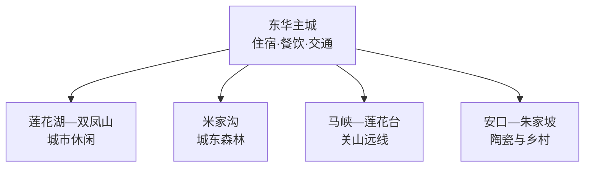
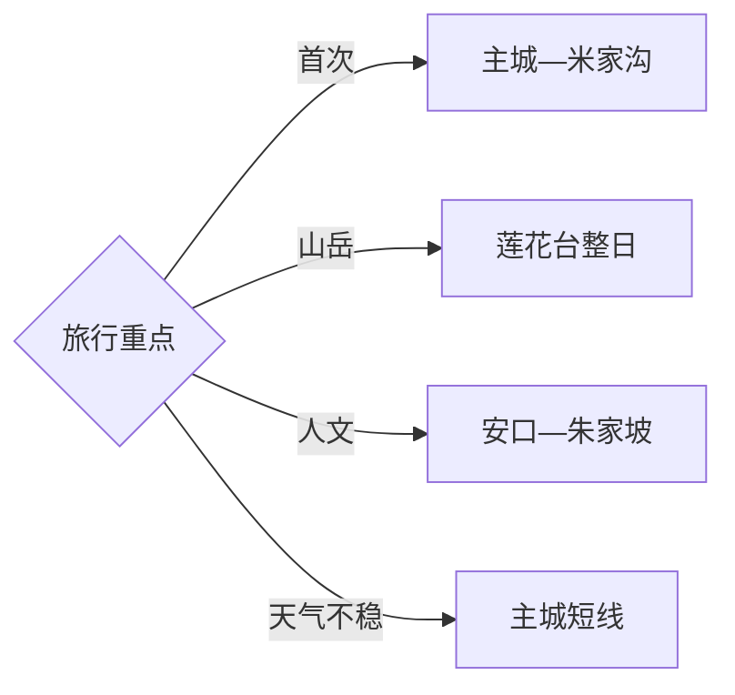

# 华亭旅行指南

华亭位于陇山东部关山腹地，主城沿汭河展开，米家沟在城东近郊，莲花台则进入更深的关山山地；安口陶瓷、乡村休闲和资源型城市转型构成另一条人文线。固定快照中的 **Donghua / GeoNames 1812488** 对应华亭主城，首访可把主城与米家沟合为一天，再给莲花台完整一天。

> 建议停留：2–3 天\
> 旅行关键词：关山、莲花台、米家沟、汭河、安口陶瓷\
> 主要体力：主城低；山地中等至较高\
> 最近研究：2026-09-03

## 城市速览

| 项目 | 旅行信息 |
|---|---|
| 主要旅行价值 | 从汭河小城进入关山森林、山岳景观与陇上陶瓷文化 |
| 建议停留 | 2天覆盖主城、米家沟和莲花台；乡村或安口另加1天 |
| 较舒适季节 | 春末至秋季适合山地；冬季雪景鲜明并伴随结冰与低温 |
| 预算特点 | 主城支出温和，莲花台车辆、山地住宿与冬季装备增加预算 |
| 步行强度 | 城市公园较低；米家沟中等；莲花台按开放步道达到中高强度 |
| 主要天气风险 | 暴雨、山洪、落石、雷电、低温、积雪结冰与森林火险 |
| 独行旅行 | 主城方便，远线提前落实车辆、返程与通信条件 |
| 亲子旅行 | 城市公园和米家沟短线较合适，山地按儿童体力减量 |
| 长者与低体力旅行 | 选择莲花湖—双凤山低段—米家沟短线，减少连续爬升 |
| 无障碍信息 | 主城新建空间较易通行，森林步道连续性需向景区确认 |

## 城市格局与游览区域

| 区域 | 主要内容 | 游览特点 | 与其他区域的关系 |
|---|---|---|---|
| 东华主城 | 莲花湖、双凤山、汭河与城市街区 | 适合步行和低强度休息 | 是各条远线的住宿基地 |
| 米家沟 | 森林步道、四季休闲与正规夜游项目 | 距主城近，半日至一天 | 可与主城组合 |
| 莲花台 | 关山地貌、森林、遗址与高处步道 | 距离长、海拔高、天气变化快 | 单列整日并预留返程 |
| 安口—朱家坡 | 陶瓷文化与乡村体验 | 公路接驳，接待具有季节性 | 适合作为第三天 |

## 主要景点

| 景点 | 区域 | 类型 | 主要看点 | 建议用时 | 室内外 | 体力 | 预约风险 | 天气影响 | 优先级 |
|---|---|---|---|---:|---|---|---|---|---|
| 关山莲花台景区公开区 | 马峡方向 | 山岳与森林 | 关山峡谷、峰林、森林与历史遗迹 | 1天 | 室外 | 高 | 中 | 很高 | A |
| 米家沟旅游景区 | 城东 | 森林公园 | 松林、溪流、步道与四季休闲 | 半天–1天 | 室外 | 中 | 活动期中 | 高 | A |
| 莲花湖公园 | 主城 | 城市公园 | 汭河沿岸、湖面与城市生活 | 1–2小时 | 室外 | 低 | 低 | 中 | B |
| 双凤山公园公开区 | 主城 | 城市山地 | 松林、城市俯瞰与地方记忆 | 2–3小时 | 室外 | 中 | 低 | 中 | B |
| 安口古镇公开街区 | 安口镇 | 聚落与陶瓷 | 陇上陶瓷传统、街巷与地方生活 | 半天 | 混合 | 低 | 中 | 低中 | B |
| 朱家坡正规乡村游点 | 安口方向 | 乡村休闲 | 采摘、田园与乡村接待 | 半天 | 混合 | 低 | 季节中 | 中 | B |
| 大南峪正规乡村游点 | 策底方向 | 乡村与山谷 | 山村景观、休闲与季节活动 | 半天 | 室外 | 低中 | 季节中 | 中高 | C |

## 美食与餐饮

| 菜品或餐饮类型 | 常见区域 | 一个人用餐与常见份量 | 风味、过敏原与饮食限制 | 排队风险与替代方法 |
|---|---|---|---|---|
| 核桃包子 | 主城早餐店 | 单份易点 | 坚果过敏者选择其他面点 | 早餐时段就近选现做店 |
| 荞面饸饹 | 主城、乡镇 | 单碗适合独行 | 汤底可能含肉和辣椒 | 热门店排队时选同类面馆 |
| 洋芋搅团 | 主城家常餐馆 | 可点小份 | 常配蒜、辣椒与酸味调料 | 按口味选择蘸汁 |
| 华亭红牛与牛肉菜 | 主城正规餐馆 | 汤面适合独行，炒菜适合分享 | 牛肉、内脏和高盐汤底按需求取舍 | 选择明码标价、份量合适的餐馆 |
| 山野时蔬 | 米家沟及正规乡村接待点 | 多人分享更合适 | 野菜品种与处理方式先询问 | 只在正规餐饮点食用可识别食材 |

## 经典行程

### 一日经典路线

**路线**：莲花湖 → 双凤山低段 → 主城午餐 → 米家沟正规步道

- **串联逻辑**：以主城为起点，下午进入距离较近的森林景区。
- **预约锚点**：米家沟开放与活动信息。
- **休息安排**：主城午餐，景区游客服务点休息。
- **时间不足时**：删双凤山高处段，保留莲花湖与米家沟。

### 两日城市路线

**第 1 天**：主城 → 米家沟。\
**第 2 天**：莲花台整日。

- **串联逻辑**：近郊森林和关山远线分日，降低往返压力。
- **预约锚点**：莲花台道路、景区、车辆和天气。
- **休息安排**：主城连住，山地在正式服务点补给。
- **时间不足时**：第二日改为米家沟深度线。

### 三日深度路线

**第 1 天**：主城公园与街区。\
**第 2 天**：莲花台。\
**第 3 天**：安口—朱家坡或大南峪。

- **串联逻辑**：城市、关山和乡村文化各占一天。
- **预约锚点**：远线车辆与乡村接待。
- **休息安排**：以主城为固定住宿点。
- **时间不足时**：先删第三日，再缩短主城段。

### 雨天路线

**路线**：主城公共文化空间 → 午餐 → 安口可开放的室内文化点 → 返回

- **适用条件**：普通降雨选择城市人文线；暴雨与地灾预警时减少跨乡镇移动。
- **预约锚点**：室内场所开放。
- **休息安排**：主城商业区。
- **时间不足时**：保留主城单点，安口顺延。

### 亲子或低体力路线

**亲子路线**：莲花湖 → 米家沟短步道 → 主城。\
**低体力路线**：莲花湖 → 汭河公共岸线 → 主城休息。

- **减负方式**：亲子线选平缓短线；低体力线用车辆连接并避开山地长台阶。
- **预约锚点**：米家沟设施与接驳。
- **休息安排**：公园和游客中心。
- **时间不足时**：两线均保留莲花湖。

### 远郊一日路线

**路线**：主城 → 莲花台正式入口 → 公开步道 → 原路返回

- **适用条件**：适合道路、天气、火险与体力条件稳定的日期。
- **预约锚点**：景区开放、车辆、最晚返程。
- **休息安排**：游客中心与正式服务点。
- **时间不足时**：整段删除，改米家沟。

### 冬季路线

**路线**：主城 → 米家沟开放冰雪或森林项目 → 莲花湖 → 主城

- **串联逻辑**：用近郊线体验冬季景观，减少深山道路负担。
- **预约锚点**：冰雪项目、道路和低温预警。
- **休息安排**：米家沟室内服务点与主城餐饮。
- **时间不足时**：删户外停留较长部分，保留主城。

## 住宿区域

| 区域 | 优点 | 缺点 | 适合人群 | 交通特点 |
|---|---|---|---|---|
| 东华主城 | 餐饮、交通与住宿集中 | 远线需要早出发 | 首访、独行和公共交通旅行者 | 各方向共同基地 |
| 米家沟周边正规住宿 | 靠近森林和夜游项目 | 选择少于主城 | 休闲度假与亲子 | 确认接送和返程 |
| 莲花台方向正规住宿 | 便于深度山地游 | 天气、通信与退改变量较多 | 山岳摄影和慢游 | 核对具体入口与道路 |

## 市内交通

| 场景 | 建议与取舍 | 行前需要重查的内容 |
|---|---|---|
| 抵达主城 | 铁路、公路客运或自驾先落脚东华主城 | 到达站、班次、末班与施工 |
| 前往米家沟 | 公交、出租或自驾均较灵活 | 活动交通和返程 |
| 前往莲花台 | 车辆接驳更稳妥，按山路预留冗余 | 道路、景区入口、天气与火险 |
| 自驾 | 适合乡村与山地，冬季准备防滑 | 结冰、落石、停车和临时管制 |

## 不同旅行者须知

| 旅行维度 | 可行条件 | 主要取舍 | 需额外核对 |
|---|---|---|---|
| 独行旅行 | 主城便利 | 莲花台返程与通信需计划 | 车辆、住宿和联络 |
| 亲子旅行 | 公园和森林短线友好 | 山地台阶与车程较长 | 儿童设施和天气 |
| 长者或低体力旅行 | 主城与米家沟短线可行 | 莲花台爬升负担高 | 接驳、坡度与休息点 |
| 无障碍需求 | 优先主城公园 | 山地连续通行有限 | 无障碍入口和卫生间 |
| 摄影旅行 | 森林、山岳与汭河题材丰富 | 清晨低温和器材负担 | 航拍、三脚架与火险规则 |
| 预算有限 | 主城公共空间成本低 | 远线车辆增加支出 | 拼车合规性与退改 |
| 晚出发或紧凑行程 | 主城半日线可执行 | 莲花台需完整白天 | 最晚入园与返程 |
| 特殊天气或自然条件 | 近郊线便于调整 | 暴雨、积雪与大雾影响山路 | 气象、应急和景区公告 |

关山景区、森林和乡村项目均按正式入口与公开步道进入；矿山、煤化工园区、铁路专用线、地灾治理区、林业生产道路、农田与水源保护范围保留明确限制。

## 行前核对

| 核对事项 | 为什么需要重查 | 建议核对时间 | 官方入口 |
|---|---|---|---|
| 莲花台开放和道路 | 山地天气、维护与火险改变可走范围 | 出发前三日及当天 | [平凉市政府：莲花台](https://www.pingliang.gov.cn/zjpl/lyjd/art/2022/art_6620e89786a74079a0050e92b5d95afa.html) |
| 米家沟运营 | 活动和季节项目会调整 | 排入路线前 | [平凉市文旅局](https://wlj.pingliang.gov.cn/) |
| 交通与住宿 | 班次、接驳和退改具有时效性 | 订票订房前 | [华亭市政府](https://www.gsht.gov.cn/) |
| 天气与地灾 | 暴雨、冰雪、落石和火险影响山地 | 出发前三日及当天 | [甘肃省气象局](https://gs.cma.gov.cn/) |

## 来源与更新记录

### 主要来源

| 来源 | 类型 | 支持内容 | 核验日期 |
|---|---|---|---|
| [平凉市政府：华亭关山文旅](https://www.pingliang.gov.cn/ywdt/bmxx/zfbm/swlj/art/2026/art_1b14933ca6e14fb5ad51c160e21a9dca.html) | 政府 | 莲花台、米家沟、乡村游与交通格局 | 2026-09-03 |
| [平凉市文旅局：米家沟获评4A](https://wlj.pingliang.gov.cn/xwdt/plwlxx/art/2024/art_1ca0da12aebe47b4ae844329372743c2.html) | 政府 | 米家沟景区等级与属性 | 2026-09-03 |
| [GeoNames 1812488](https://www.geonames.org/1812488/) | 开放数据 | Donghua 固定人口点、坐标与行政代码 | 2026-09-03 |

### 更新记录

| 日期 | 更新内容 |
|---|---|
| 2026-09-03 | 首次完成资料研究、关山空间拆分、七条路线与县级市映射 |
