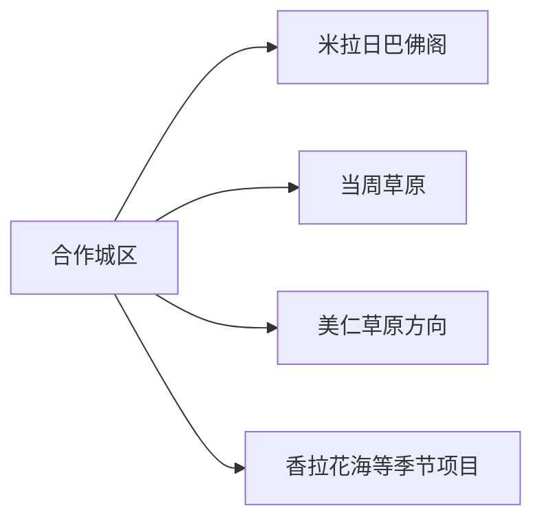
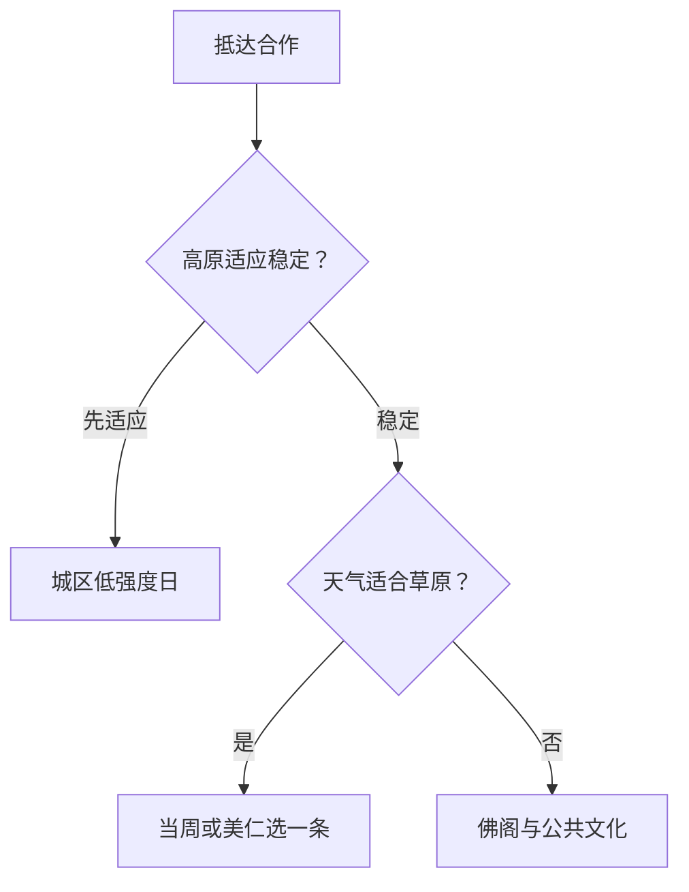

# 合作旅行指南

合作是甘南藏族自治州州府，适合作为进入甘南高原的适应站。米拉日巴佛阁、城市公共文化和当周草原距离相对集中，美仁草原等远线则需要公路日；先用一天适应海拔，再决定草原强度，通常比抵达后直接连续赶景区更舒适。

## 城市速览

| 项目 | 信息 |
|---|---|
| 旅行主线 | 米拉日巴佛阁、合作城市公共文化、当周草原、美仁草原与季节花海 |
| 建议停留 | 城区与当周 1–2 天；美仁草原等远线再加 1 天 |
| 住宿基地 | 合作城区便于州府交通、医疗、餐饮和高原适应 |
| 步行强度 | 城区中等；草原中等，高海拔会显著增加心肺负担 |
| 主要天气 | 强紫外线、昼夜温差、雷暴冰雹、雨雪、大风和冬季结冰 |
| 预约核心 | 宗教场所开放、草原季节、道路、节庆、车辆和返程 |
| 边界重点 | 宗教活动空间、牧场、草场、林草防火区和生产道路按属地规则使用 |
| 无障碍 | 城区逐点询问；佛阁台阶和草原自然地面需要替代短线 |

## 城市格局与游览区域

合作市是甘南藏族自治州所辖县级市和州府，法定代码 `623001`。GeoNames `1808181` 与 Wikidata `Q1364651` 对应合作市。夏河、碌曲、玛曲、卓尼等是独立县域目的地，本页不把甘南全州景点归入合作。

| 区域 | 旅行价值 | 怎么安排 |
|---|---|---|
| 合作城区 | 州府服务、公共文化、餐饮与高原适应 | 抵达日先安排低强度活动 |
| 米拉日巴佛阁片区 | 藏传佛教建筑、艺术与宗教文化 | 留 2–3 小时，尊重仪轨与摄影规则 |
| 当周草原 | 近城草原、节庆与高原景观 | 半日至一日，按当期开放区域活动 |
| 美仁草原方向 | 开阔草原、公路景观与牧区文化 | 天气稳定时独立一日 |
| 季节花海与乡村项目 | 花期和节庆体验 | 只在运营信息明确时加入 |

## 主要景点

| 景点 | 所在区域 | 类型 | 核心看点 | 建议用时 | 室内/室外 | 体力 | 预约难度 | 天气敏感度 | 适合旅程 |
|---|---|---|---|---|---|---|---|---|---|
| 米拉日巴佛阁 | 城区 | 宗教建筑与艺术 | 佛阁建筑、造像与藏传佛教文化 | 2–3 小时 | 混合 | 中至高 | 中高 | 中 | A |
| 合作城市公共文化 | 城区 | 地方文化 | 甘南州情、民族文化与当期展览 | 1–2 小时 | 室内 | 低 | 中 | 低 | A |
| 当周草原景区 | 城区近郊 | 高原草原 | 草原景观、节庆场地与城市近郊生态 | 3–6 小时 | 室外 | 中 | 高 | 极高 | A |
| 美仁草原正式游览点 | 公路远线 | 草原与地貌 | 开阔高原、草原公路与牧区景观 | 5–8 小时 | 室外 | 中 | 高 | 极高 | B |
| 香拉花海等正式项目 | 市域乡村 | 花海与乡村 | 季节花期、乡村景观与当期活动 | 2–4 小时 | 室外 | 中 | 高 | 极高 | B |

宗教场所按现场引导决定可进入区域、行走方向、着装与摄影。草原游览使用景区道路和公共观景点，牧户院落、牲畜通道、草场生产区与林草防火封控保持原有用途；高火险期执行禁火管理。

## 美食与餐饮

| 类型 | 适合场景 | 份量 | 过敏与饮食提示 | 怎么选 |
|---|---|---|---|---|
| 藏面与面片 | 城区早餐简餐 | 一人份 | 小麦、肉汤和乳制品 | 询问汤底、辣度与素食选择 |
| 牦牛肉菜肴 | 城区正餐 | 可单人或分享 | 牛肉、油脂、香料与共锅 | 选择来源和价格清楚的熟制菜 |
| 酥油茶与奶茶 | 正规餐饮或文化体验 | 小杯先试 | 乳制品、盐、油脂和咖啡因 | 先问甜咸、奶源和续杯方式 |
| 糌粑与青稞制品 | 早餐或体验 | 小份 | 青稞、乳制品与可能的小麦混用 | 让经营者说明配料和吃法 |
| 手抓羊肉 | 多人正餐 | 常适合分享 | 羊肉、盐和高脂 | 按人数点小份并确认重量 |

## 经典行程

### 一日适应路线

**路线**：城区公共文化 → 午餐长休 → 米拉日巴佛阁 → 早回住宿

- **串联逻辑**：以低强度城市活动完成高原适应。
- **预约锚点**：场馆、佛阁开放和身体状态。
- **休息安排**：午休充足，步速放慢。
- **时间不足时**：保留佛阁或一处公共文化。

### 两日首次到访路线

**第 1 天**：城区—米拉日巴佛阁 
**第 2 天**：当周草原短线

- **串联逻辑**：先适应海拔，再进入草原。
- **预约锚点**：草原开放、活动、车辆与天气。
- **休息安排**：第二天缩短连续户外时间。
- **时间不足时**：第二日只走近入口段。

### 美仁草原路线

**路线**：合作早出发 → 美仁草原正式观景点 → 午餐与补给 → 原路返回

- **适用条件**：道路、天气和返程稳定。
- **预约锚点**：车辆、开放点、最晚返程与通信。
- **休息安排**：每小时短休并持续补水。
- **时间不足时**：整段改为当周草原。

### 雨雪与大风路线

**路线**：城区公共文化 → 午餐 → 住宿休息

- **适用条件**：城市道路正常；高原雷暴、暴雪或大风预警时减少移动。
- **预约锚点**：天气、道路与场馆开放。
- **休息安排**：以室内恢复为主。
- **时间不足时**：只留一处场馆。

### 亲子路线

**路线**：城市公共文化 → 午休 → 当周草原近入口短线

- **串联逻辑**：先观察孩子的海拔适应，再进入户外。
- **预约锚点**：儿童身体状况、卫生间、防晒与天气。
- **休息安排**：户外控制在两小时内。
- **时间不足时**：保留城区。

### 低体力路线

**路线**：车辆到达城区场馆 → 午餐长休 → 当周草原车览或近入口平缓段

- **适用条件**：落客和地面条件已确认。
- **预约锚点**：血氧与既往健康、台阶、座椅和医疗距离。
- **休息安排**：每处只看核心内容。
- **时间不足时**：只留城区场馆。

### 节庆路线

**路线**：城区 → 当周草原官方活动入口 → 指定观众区域 → 提前返程

- **适用条件**：官方已公布日期、交通和观众规则。
- **预约锚点**：门票、接驳、安检、摄影与散场交通。
- **休息安排**：避开正午暴晒并携带保暖层。
- **时间不足时**：只参加一个主要时段。

## 住宿区域

| 区域 | 优点 | 取舍 | 适合人群 | 核对项 |
|---|---|---|---|---|
| 合作城区 | 州府服务、餐饮、医疗与交通集中 | 去远线仍需车辆 | 首访、高原适应、无车旅行 | 供氧、供暖、电梯、停车与夜间接诊 |
| 当周草原周边正规住宿 | 接近草原活动 | 季节强、夜温低、服务较少 | 节庆、摄影、自驾 | 合法经营、供暖、消防、交通和退改 |
| 公路远线正规住宿 | 减少单日往返 | 医疗与通信距离更远 | 深度自驾 | 海拔、供电、供暖、餐食与通信 |

## 市内交通

合作以公路交通为主，城区是甘南州内换乘与补给节点。远线按高原公路一日准备，行程给天气、牲畜通行和道路施工留出缓冲。

| 场景 | 怎么做 | 行前核对 |
|---|---|---|
| 到达合作 | 选择正规客运、自驾或包车进入城区 | 班次、海拔、夜间到达和天气 |
| 城区—当周 | 公交、出租或正规车辆短程接驳 | 活动管制、入口和返程 |
| 美仁草原远线 | 正规包车或自驾，整日往返 | 路况、燃油、通信、天气和司机资质 |
| 甘南联游 | 每个县域分别确定住宿和接驳 | 行政边界、路程、加油与高原适应 |

## 不同旅行者须知

| 旅行者 | 推荐做法 | 重点核对 |
|---|---|---|
| 独行 | 先住合作适应，远线正规拼包车 | 资质、返程、通信和医疗 |
| 亲子 | 城区加当周短线 | 高反、防晒、保暖和饮水 |
| 长者与低体力 | 城区为主，草原车览短段 | 心肺状况、供氧、电梯与医疗 |
| 摄影 | 每天一个草原方向 | 宗教摄影、无人机、风力与日落返程 |
| 自驾 | 降低日里程，白天行车 | 雨雪、牲畜、加油、结冰和疲劳 |

## 行前核对

- 合作市政府和甘南州文旅信息：场馆、草原、节庆与临时管理。
- 宗教场所与景区：开放、着装、摄影、票务和道路。
- 甘肃气象、交通、林草与应急信息：雨雪、大风、火险和高原道路。
- 个人健康：既往心肺疾病、高原反应预案、常用药与旅行保险。

## 来源与更新记录

| 来源 | 支持内容 | 核验日期 |
|---|---|---|
| [合作市政府：旅游线路](http://www.hezuo.gov.cn/info/1180/23026.htm) | 米拉日巴佛阁、当周草原与城市线路 | 2026-09-01 |
| [合作市政府：2025 假日线路](http://www.hezuo.gov.cn/info/1187/57542.htm) | 美仁草原、米拉日巴佛阁、当周草原和香拉花海 | 2026-09-01 |
| [合作市政府：当周草原](http://www.hezuo.gov.cn/info/1186/63990.htm) | 当周草原位置、景区等级与夏季活动 | 2026-09-01 |
| [Wikidata Q1364651](https://www.wikidata.org/wiki/Q1364651) | 合作市实体与 `P1566=1808181` | 2026-09-01 |
| [GeoNames 1808181](https://www.geonames.org/1808181/) | 固定合作城市点 | 2026-09-01 |
| [甘肃省气象局](http://gs.cma.gov.cn/) | 气象预警 | 2026-09-01 |

| 日期 | 更新 |
|---|---|
| 2026-09-01 | 首次完成城区、宗教文化、当周与美仁草原旅行研究。 |
