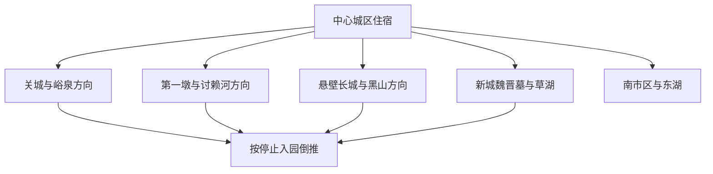
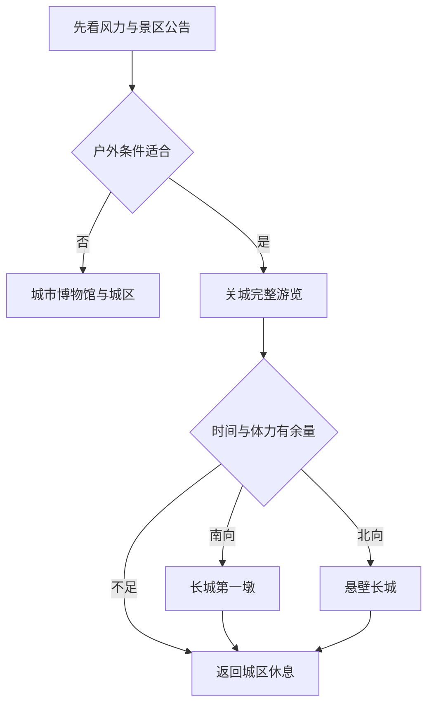

# 嘉峪关旅行指南

嘉峪关位于河西走廊中西部，是一座因钢铁工业建设而成长、又因明代雄关而得名的地级市。对旅行者而言，最容易产生的误判是把“嘉峪关文物景区”理解成一座紧凑城堡：关城、长城第一墩和悬壁长城虽然属于同一文物景区与票务体系，却分处城市西部、南部和北部方向；城市博物馆、魏晋墓群、湿地、主题乐园和工业城市空间又构成另外几条路线。合理安排通常以中心城区为住宿基地，每天只处理一至两个方向。

> 建议停留：关城与城市文博 2 天；加入长城两翼、魏晋墓或生态方向后 3–4 天 
> 旅行关键词：嘉峪关关城、明长城、丝绸之路、魏晋砖画、钢铁工业、戈壁绿洲 
> 主要体力：城区低至中等；关城与第一墩中等；悬壁长城中高；戈壁远线受风沙放大
> 最近研究：2026-08-12

## 城市速览

| 项目 | 旅行信息 |
|---|---|
| 主要旅行价值 | 在关城、长城第一墩和悬壁长城理解山、河、戈壁与军事防御体系，再以城市博物馆、魏晋墓砖画和钢铁工业城市观察丝路节点从古代到现代的变化。 |
| 建议停留 | 1 天只能完成关城加一项城市内容；2 天可加入第一墩、悬壁长城或城市文博；3–4 天再从魏晋墓、草湖湿地、主题乐园、紫轩或讨赖河中选择。 |
| 较舒适季节 | 春秋温度较适合户外，但春季大风和沙尘风险高；夏季日照、紫外线和高温明显，也可能出现短时强降雨；冬季寒冷、风大、日短，景区时刻和服务会缩减。 |
| 预算特点 | 中心城区住宿与面食较易控制；文物景区接驳、包车或出租车、主题乐园、酒庄体验和跨城联程是主要增量。三处长城点位共享票务关系不等于交通免费或彼此步行可达。 |
| 步行强度 | 城市博物馆和城区公园较低；关城院落、城墙与第一墩为中等；悬壁长城有连续台阶和坡度；戈壁大风、暴晒会放大相同距离的体力消耗。 |
| 主要天气风险 | 干燥、强紫外线、昼夜温差、大风和沙尘是长期背景；夏季还需防高温、雷电、短时强降雨与山洪，冬季关注低温、积雪和道路结冰。 |
| 独行旅行 | 中心城区、正规场馆和成熟景区适合独立安排；远郊应预先落实返程，不独自进入未开放长城点段、戈壁野路、湿地深处、矿区或工业生产区。 |
| 亲子旅行 | 关城、城市博物馆、魏晋砖画主题和部分主题乐园便于开展历史与丝路主题；悬壁长城、临崖区域、酒庄品饮和长距离曝晒需按年龄取舍。 |
| 长者与低体力旅行 | 可用车辆连接关城、城市博物馆和东湖；悬壁长城可直接取消。关城与第一墩是否存在连续少台阶路线，需要在购票前向运营方确认。 |
| 无障碍信息 | 嘉峪关酒泉机场公布了轮椅等特殊旅客服务，但这不能证明关城、第一墩、悬壁长城、魏晋墓和湿地之间存在连续无障碍动线。场馆入口、接驳车辆、卫生间与轮椅通行需逐处确认。 |

嘉峪关全域面积不大，却不是“步行小城”。关城、第一墩、悬壁长城之间有明确方向差异；同一张文物景区票覆盖多个点位，也不能消除接驳、排队、停止入园和天气变化。

## 城市格局与游览区域

嘉峪关是少见的不设区县地级市，现辖雄关、钢城两个街道和新城、文殊、峪泉三个镇。旅行空间可理解为中心城区、关城—峪泉、第一墩—讨赖河、悬壁长城—黑山、新城—草湖和南市区六个方向。酒钢厂区、工业园、核技术保障区、铁路编组与能源设施穿插在城市周边，行政上“都在嘉峪关”不表示可以自由进入。

| 区域 | 主要内容 | 游览特点 | 与其他区域的关系 |
|---|---|---|---|
| 中心城区 | 嘉峪关城市博物馆、居民餐饮、商业与公共服务 | 适合作为住宿和换乘基地，博物馆与街区可组成低强度半日 | 到关城、第一墩、悬壁长城和魏晋墓都需要车辆，不是连续步行线 |
| 关城—峪泉方向 | 嘉峪关关城、长城博物馆相关展示、关城里及当期开放活动 | 是文物景区核心，院落、城墙和展陈应连贯游览 | 关城、第一墩、悬壁长城在票务上关联，但三个地点分别核交通与停止入园 |
| 第一墩—讨赖河方向 | 长城第一墩、讨赖河峡谷与正式生态文化景区 | 临崖、开阔、风大，河谷和长城点段均受保护与安全边界约束 | 位于关城南向，不把河道、水库、便道和未开放长城当作景区延伸 |
| 悬壁长城—黑山方向 | 悬壁长城、石关峡方向 | 连续台阶和坡度明显，大风、结冰与高温都会增加负担 | 位于关城北向；黑山岩画及长城沿线只有正式开放、可接待范围才能进入 |
| 新城—草湖方向 | 魏晋墓群地下画廊、草湖国家湿地公园公开区 | 文物墓葬与湿地是两种不同游览逻辑，均需确认入口、开放与接驳 | 农田、湿地保护区、灌渠和光伏生态治理区不能作为捷径 |
| 南市区 | 东湖生态旅游景区、讨赖河城市开放段、方特相关项目 | 城市休闲、主题乐园和高铁站方向较集中，但项目开放与赛事活动动态变化 | 可作到达日或天气替代，不与长城远线硬拼 |
| 工业生产方向 | 酒钢厂区、嘉北与嘉东产业空间、铁路编组、能源与核技术保障设施 | 只有运营方明确开放、实名组织的工业研学项目才可参观 | “钢铁是怎样炼成的”是受组织的研学产品，不代表厂区可自由进入 |

**行政与数据范围。**本页对应法定地级市嘉峪关市，行政代码为 **620200**。GeoNames `1280957` 是名为 Jiayuguan 的 `P/PPLA2` 城市点；Wikidata `Q532560` 的 GeoNames 属性和法定代码与本页精确对应。旧条目 `Q12965293` 已重定向到 `Q532560`，本页不采用重定向编号。嘉峪关市与东侧酒泉市肃州区相邻，但两者是独立地级行政单元。

**长城去重。**嘉峪关关城、长城第一墩和悬壁长城由官方共同称为“嘉峪关文物景区”。本页把三者作为一个完整长城防御体系和一个核心大景区去重，同时在路线中承认三地空间分离、各自需要接驳和开放核对。城楼、墩台、城墙段、表演与展陈不拆成多个景点提高数量。

**遗产、生态与生产边界。**境内仍有未开放长城点段、黑山岩画、湿地、水库、河沟、戈壁、工业园和生产设施。只在公告明确的景区入口、步道、道路和研学组织内活动；不攀爬、刻画长城，不越过围栏追踪墙体，不进入湿地深处、河道行洪区、铁路专用线、酒钢生产区、矿区、光伏设备区或核技术保障区域。

## 主要景点

优先级用于安排时间，不代表绝对排名：**A** 为首访核心，**B** 为城市与丝路历史补充，**C** 为专题、季节性或需独立半天以上的方向。车站、餐饮区和只承担集散功能的空间标为“路线节点”。

### 长城防御体系

| 景点 | 区域 | 类型 | 主要看点 | 建议用时 | 室内外 | 体力 | 预约风险 | 天气影响 | 优先级 |
|---|---|---|---|---:|---|---|---|---|---|
| 嘉峪关文物景区（关城、长城第一墩、悬壁长城） | 峪泉镇及南北两翼 | 世界遗产、长城、关隘与军事防御体系 | 关城指挥中枢、讨赖河天险与第一墩、黑山石关峡与悬壁长城的整体关系；三处合并计一次 | 关城 3–5 小时；三点完整需一至两天 | 以室外为主 | 中至中高 | 高 | 很高 | A |

凭关城景区门票可按当期规则参观另外两处，并不等于三处可在同一时段连续步行。悬壁长城的台阶体力、第一墩的临崖与大风、关城的院落和城墙动线各不相同。若只有一天，优先完整看关城，再从第一墩和悬壁长城中择一，不以“票里包含”作为赶路理由。

文物景区明确禁止攀爬、翻越、刻画长城，禁止在景区水域游泳、垂钓，并限制无人机等低慢小航空器。夜游、演出、研学和临时活动只有当期公告明确时才纳入行程，旧活动报道不能证明今天仍演出。

### 城市与丝路历史

| 景点 | 区域 | 类型 | 主要看点 | 建议用时 | 室内外 | 体力 | 预约风险 | 天气影响 | 优先级 |
|---|---|---|---|---:|---|---|---|---|---|
| 嘉峪关城市博物馆 | 中心城区 | 城市博物馆 | 因关得名、因企设市的城市史，长城、丝路、钢铁工业与绿洲建设关系 | 2–3 小时 | 室内 | 低 | 中 | 低 | B |
| 新城魏晋墓群地下画廊 | 新城镇方向 | 墓葬、砖画、考古 | 魏晋墓室与画像砖中的宴饮、农牧、出行和生活图景；开放墓室按一个遗址群计 | 2–3 小时，另加往返 | 以室内为主 | 低至中 | 高 | 中 | B |
| 当期开放的工业研学项目 | 运营方公布集合点 | 工业遗产、现代生产研学 | 钢铁城市形成、生产流程与安全管理；只进入组织方划定参观线 | 半日至一日 | 混合 | 中 | 很高 | 中 | 活动节点 |

魏晋墓群的砖画内容常被用于解释河西生活史，但墓室承载量、开放数量、摄影与照明规则可能调整；不要依据旧游记寻找未开放墓葬。城市博物馆适合在关城前建立年代与城市框架，也可在大风、沙尘或高温时作为室内替代。

### 城市生态与专题体验

| 景点 | 区域 | 类型 | 主要看点 | 建议用时 | 室内外 | 体力 | 预约风险 | 天气影响 | 优先级 |
|---|---|---|---|---:|---|---|---|---|---|
| 东湖生态旅游景区 | 南市区 | 城市公园、人工湖与体育空间 | 戈壁城市绿化、水体、铁人三项赛事空间与城市休闲 | 1.5–3 小时 | 室外 | 低至中 | 低；赛事另计 | 高 | B |
| 讨赖河生态文化景区公开段 | 南市区讨赖河沿线 | 河谷生态、城市休闲 | 讨赖河与嘉酒绿洲、水资源和城市景观关系；只走正式开放段 | 1.5–3 小时 | 室外 | 中 | 中 | 高 | B |
| 新城草湖国家湿地公园公开游览区 | 新城镇方向 | 湿地、自然教育 | 戈壁绿洲湿地、候鸟与水资源保护；只进入游客服务和标识明确区域 | 半日至一日 | 室外 | 中 | 高 | 很高 | C |
| 紫轩葡萄酒庄园当期开放游线 | 城市公开接待点 | 工业农业、酒窖与品饮 | 葡萄种植、酒窖与河西产业；参观、品饮、年龄与交通分别核对 | 2–4 小时 | 以室内为主 | 低至中 | 高 | 中 | C |
| 方特欢乐世界或方特丝路神画 | 南市区相关园区 | 主题乐园、演艺 | 游乐设施或丝路主题演艺；两个园区、票种和开园日不能混用 | 一整天 | 混合 | 中至高 | 很高 | 高 | C |

东湖和讨赖河景区兼有水体、调蓄和生态功能，公共游览区不等于水库、坝体、河沟和岸线均可进入。草湖湿地以保护为先，不追鸟、不投喂、不使用无人机惊扰，不沿农业或光伏作业道路深入。酒庄不是饮酒义务；未成年人、驾驶者、孕期或服药者可只参观，不参与品饮。

## 美食与餐饮

嘉峪关饮食汇集河西面食、牛羊肉和多地移民口味，烤肉是最有城市辨识度的餐饮主题。选择居民餐饮区和明码标价的正规门店，比把某一家“老店”当作唯一答案更稳妥。

| 菜品或餐饮类型 | 常见区域 | 一个人用餐与常见份量 | 风味、过敏原与饮食限制 | 排队风险与替代方法 |
|---|---|---|---|---|
| 嘉峪关烤肉 | 中心城区、美食街与夜间餐饮区 | 常按串或份点，适合共享；独行先少量点单 | 常见羊肉、孜然、辣椒与较多油盐；可能使用芝麻，牛羊肉不自动代表门店清真 | 晚餐和夜间热门店排队较高；选择资质清楚、明码标价的同类店 |
| 糊锅、羊肉汤与河西汤食 | 早餐店、居民区 | 一人一碗，适合早午餐；配料与份量因店而异 | 可能含小麦面筋、肉汤、胡椒、粉条和豆制品；严格素食需确认汤底 | 早餐时段可能售罄；换同片区热汤或面食，不必跨城追店 |
| 牛肉面、臊子面与炒面片 | 中心城区、车站周边 | 多为一人一碗或一盘，便于控制预算 | 含小麦；臊子、牛肉汤、辣油、葱蒜和酱油需按限制确认 | 日常面馆替代性强；远郊出发前先吃，不把景区餐饮当作唯一保障 |
| 酿皮、凉面与杏皮饮品 | 城区小吃区、夏季餐饮 | 适合单人或加餐，饮品注意含糖量 | 酿皮可能含小麦，调味常有芝麻、花生、蒜和辣椒；冷食注意储存卫生 | 高温时优先选择制作环境清楚、周转快的门店；不能确认则改热食 |
| 河西牛羊肉正餐 | 中心城区与乡镇正规餐馆 | 手抓、炖肉和火锅更适合共享；独行询问小份 | 骨头、油脂、盐分和共锅需注意；清真需求查看当期标识并询问肉源与酒类 | 团餐时段可能较忙；按份量、价格和食品安全替换同类正规餐馆 |

严重过敏者应说明坚果、芝麻、乳、蛋、小麦和共锅需求。前往长城两翼、湿地或墓群前，准备独立包装饮水与补给；戈壁干燥并不表示可以在景区水体、灌渠或河道取水。

## 经典行程

路线按“一个核心方向加一个恢复节点”组织。文物景区三点可以在票务上联动，但不要求一天全部完成。

### 一日经典路线

**路线**：嘉峪关关城 → 景区内正式展陈与午间休息 → 嘉峪关城市博物馆 → 城区烤肉或面食

- **串联逻辑**：先完整理解雄关实体，再回城区用博物馆补足丝路与钢铁城市史，不在第一天追赶长城两翼。
- **适合谁**：首次到访、只有一天、亲子或希望控制步行的人。
- **减负办法**：关城内部只走开放主线，城墙高处量力；两点间用车，不加入悬壁长城。
- **预约锚点**：关城实名票、停止入园、城市博物馆开放与闭馆日。
- **休息安排**：关城游览中段在正式服务区休息，转场前完成午餐与补水；博物馆后再安排晚餐。
- **时间不足时**：缩短城市博物馆或改至下次，保留关城；不要在关城结束后临时赶第一墩。

### 两日长城与城市路线

**第 1 天**：关城完整游览 → 城市博物馆或城区休息 
**第 2 天**：长城第一墩 → 午间长休 → 悬壁长城（仅在体力、天气和停止入园允许时）

- **串联逻辑**：把关城与南北两翼拆开，第二天再用车辆连接防御体系的河险与山险。
- **适合谁**：历史兴趣较高、体力中等以上、希望理解完整长城结构的人。
- **减负办法**：第二天可在第一墩和悬壁长城中二选一；悬壁长城只走能安全返回的台阶段。
- **预约锚点**：三处当日票务关系、分别的停止入园、接驳车辆和天气停运。
- **休息安排**：第一墩后回到有餐饮和卫生间的服务区长休，不在戈壁路边临时用餐。
- **时间不足时**：直接删除悬壁长城；共享票务不构成必须完成三点的理由。

### 两日丝路考古路线

**第 1 天**：嘉峪关城市博物馆 → 关城 
**第 2 天**：新城魏晋墓群地下画廊 → 新城镇正规午餐 → 草湖湿地公开短线（条件适合时）

- **串联逻辑**：从城市总览进入明长城，再用魏晋砖画和绿洲湿地理解更早的河西生活与环境。
- **适合谁**：考古、博物馆、亲子研学和不追求高强度登长城的人。
- **减负办法**：墓群与湿地用车连接；高温、大风或候鸟敏感期只参观墓群。
- **预约锚点**：城市博物馆、魏晋墓群开放墓室、草湖游客中心与公开游线。
- **休息安排**：两天都在室内场馆后完成长休；进入湿地前补水、防晒并确认返程。
- **时间不足时**：删除草湖，保留魏晋墓群；不沿农田或湿地便道“看一眼”。

### 一日低体力城市线

**路线**：嘉峪关城市博物馆 → 中心城区午餐 → 东湖生态旅游景区短段 → 讨赖河生态文化景区公开段或提前返回

- **串联逻辑**：用室内城市史和两个南市区公共空间组成低门槛路线，避开悬壁长城连续台阶。
- **适合谁**：长者、低体力、轮椅使用者的候选路线，以及等待户外天气改善的人。
- **减负办法**：车辆点到点；东湖与讨赖河只选平缓、照明和卫生间明确的短段。
- **预约锚点**：城市博物馆开放、东湖赛事或活动封闭、讨赖河公共区域临时管制。
- **休息安排**：博物馆后完成午餐长休，公园每 30–45 分钟回到座椅或服务点评估体力。
- **时间不足时**：在东湖结束，不追加讨赖河；无障碍连续性未确认时不要靠现场试错。

### 一日专题体验线

**路线**：方特单一园区或紫轩葡萄酒庄园当期开放游线 → 返回城区

- **串联逻辑**：主题乐园和酒庄都可能占用大半日至一天，应作为独立兴趣日，不与关城完整游览硬拼。
- **适合谁**：亲子娱乐、演艺或葡萄酒产业兴趣旅行者；酒庄品饮不适合驾驶者和未成年人。
- **减负办法**：方特只选一个园区；酒庄只参加正式导览，参观者可不品饮。
- **预约锚点**：实际开园日、园区名称、票种、演出、身高年龄限制；酒庄参观和品饮规则。
- **休息安排**：主题乐园按室内项目和餐饮区穿插，酒庄后不安排驾车或高强度户外。
- **时间不足时**：取消晚间追加项目；不要凭过期促销判断园区今日开放。

### 大风沙尘或暴雨替代线

**路线**：查看预警与关闭公告 → 嘉峪关城市博物馆 → 中心城区正规餐饮 → 车站、机场或住宿休息

- **串联逻辑**：大风、沙尘、雷电、强降雨或极端温度时，优先进入有运营保障的室内空间，取消临崖、登高和湿地路线。
- **适合谁**：所有遇到预警、停运、能见度差或身体不适的旅行者。
- **减负办法**：减少户外转场，佩戴适合自己的防护用品，不在戈壁边缘等待天气“马上过去”。
- **预约锚点**：市气象预警、文物景区与场馆公告、航班和列车变更。
- **休息安排**：在城区、车站或住宿地补水、清洁和恢复，不在关城外、河沟或临时停车点滞留。
- **时间不足时**：取消全部远郊；天气风险不能通过包车加速或缩短停留抵消。

## 住宿区域

| 住宿区域 | 优点 | 局限 | 适合行程 | 订房前核对 |
|---|---|---|---|---|
| 中心城区 | 餐饮、城市博物馆、商业和多方向叫车较方便 | 距关城、第一墩、悬壁长城和草湖仍需车辆 | 多日综合路线、独行、餐饮优先 | 到南站和普速站的实际车程、夜间前台、电梯、供暖制冷、无障碍客房 |
| 关城—峪泉周边 | 方便早进关城及参与当期夜游或研学 | 餐饮、医疗和夜间交通不如中心城区稳定；不能步行解决第一墩与悬壁长城 | 长城主题、摄影与早场 | 景区实际入口、夜间照明、接送、早餐、行李寄存和活动取消规则 |
| 嘉峪关南站—南市区 | 高铁抵离、方特、东湖与新区道路较方便 | 与关城、老城区、普速站分处不同方向 | 晚到早走、亲子主题乐园、低体力城市线 | 南站出口、公交与出租车上客点、园区开园日、餐饮和夜间返程 |
| 嘉峪关站周边 | 普速铁路与老城区生活服务方便 | 酒店品质和街区环境差异较大，到南站、机场和景区需转场 | 普速列车、预算型住宿 | 是否确为嘉峪关站而非南站、噪声、空调供暖、停车和退房时间 |
| 乡镇或湿地周边合法住宿 | 可服务草湖、乡村或专题活动 | 接待能力、餐饮、通信与交通变化较大，不适合临时晚到 | 已确认运营的生态或乡村项目 | 合法经营、真实位置、接送、供餐、供暖、卫生间、取消和紧急联系 |

“嘉酒地区”是交通与生活联系概念，不是一个城市中心。订房时应核对住宿究竟在嘉峪关市、酒泉肃州区还是两市之间；机场名称中的“酒泉”也不能代替具体地址。

## 市内交通

嘉峪关主要依靠公交、出租车、网约车和包车连接景区。嘉峪关南站服务兰新高铁，嘉峪关站承担普速列车到发；嘉峪关酒泉机场位于嘉峪关市，同时服务嘉峪关和酒泉区域。三者名称与位置不可混用。

| 场景 | 推荐方式与边界 | 出发前核对 |
|---|---|---|
| 嘉峪关南站到中心城区 | 当期公交、出租车或网约车；高铁到达高峰应预留排队 | 出站口、公交首末班、出租车上客点、行李与夜间到达 |
| 嘉峪关站到住宿 | 步行只适合真实距离短且道路明确的住宿，其余用公交或车辆 | 普速车实际停靠、站外交通、夜间照明和酒店前台 |
| 机场到嘉峪关或酒泉 | 按目的城市选择机场巴士、合规车辆或接送；机场位于嘉峪关市，前往酒泉肃州仍需公路接驳 | 航站楼、航班、当期接驳、夜间车辆、特殊旅客服务和备选住宿 |
| 关城、第一墩、悬壁长城 | 优先使用景区当期公布的交通或合规车辆；三点不连续步行 | 三处开放、停止入园、道路、司机等待、返程和费用包含范围 |
| 中心城区到魏晋墓与草湖 | 公交覆盖和末班可能有限，远线应落实往返车辆 | 墓群入口、湿地游客中心、道路、通信和返程 |
| 嘉峪关到酒泉、张掖、敦煌 | 铁路或公路分段安排；相邻城市也不等于适合每晚往返 | 12306 到发站、车次、景点离站距离、住宿与道路天气 |

包车时应书面或在平台订单中确认车辆、点位、等待、停车、返程和额外费用。不要接受从非开放戈壁道路靠近长城、岩画或工业设施的安排。

## 不同旅行者须知

| 旅行者 | 更合适的安排 | 主要风险 | 可执行的减负方法 |
|---|---|---|---|
| 独行者 | 关城、城市博物馆、东湖与正规远线接驳 | 远郊返程、沙尘、通信和戈壁偏离路线 | 提前锁定往返车辆，共享行程，不进入未开放长城和工业区 |
| 亲子家庭 | 关城、城市博物馆、魏晋墓和单一方特园区 | 城墙台阶、临崖、暴晒、游乐设施限制与走失 | 每天只设一个核心；核对身高年龄，取消悬壁长城高段和酒庄品饮 |
| 长者与低体力者 | 城市博物馆、关城低段、东湖短线 | 长城台阶、景区间长距离、排队和大风 | 车辆点到点，关城只走平缓段；第一墩与悬壁长城二选一或全删 |
| 轮椅使用者 | 先核对城市博物馆、机场、住宿和东湖候选段 | 古建门槛、城墙、接驳车辆和湿地断点 | 逐场馆询问坡道、电梯、卫生间与轮椅尺寸；准备完全不登城的替代方案 |
| 摄影者 | 关城开放平台、第一墩正式观景区、城市公园 | 越界取景、无人机禁限飞、大风损坏器材和错过末班 | 不跨护栏，不进入未开放墙段；无人机以当期公安和景区规定为准 |
| 自驾者 | 中心城区为基地，按方向分日 | 戈壁疲劳、风沙、道路施工、酒后驾驶和误入生产区 | 每日只跑一个远线；酒庄不饮酒或由未饮酒驾驶者返程；不走地图野路 |
| 预算有限者 | 城区住宿、公共交通、关城加博物馆 | 远线包车、重复接驳、过期套票和主题乐园支出 | 先选一个核心大景区，第一墩与悬壁长城择一；不按旧优惠宣传预算 |

## 行前核对

| 核对事项 | 为什么会变化 | 核对时间 | 官方入口 |
|---|---|---|---|
| 嘉峪关文物景区实名入园、开放与票务 | 淡旺季、夜游、活动和文保工程会调整 | 订票前、出发前一日、到达日 | [嘉峪关市文化和旅游局](https://www.jyg.gov.cn/wlj/)、[日间入园须知](https://www.jyg.gov.cn/wlj/xwdt/tzgg/art/2025/art_9ef6a22298a946268de62164b71dfe19.html) |
| 关城、第一墩、悬壁长城交通 | 三点道路、接驳和停止入园分别变化 | 规划路线时及当日 | [嘉峪关文物景区官方介绍](https://wap.jyg.gov.cn/zjjyg/jygly/art/2022/art_fd4b69941cab446ea5e8818f7e81cefb.html) |
| 城市博物馆、魏晋墓与工业研学 | 闭馆、开放墓室、团体预约和生产安全要求会变化 | 到访前一至三日 | [嘉峪关市人民政府](https://www.jyg.gov.cn/) |
| 草湖、东湖、讨赖河与水域 | 生态保护、赛事、汛情和施工会限制区域 | 出发前及现场 | [嘉峪关市林业和草原局](https://www.jyg.gov.cn/lcj/)、[嘉峪关市水务局](https://www.jyg.gov.cn/shuiwj/) |
| 方特与紫轩 | 开园日、园区、演出、参观和品饮规则动态变化 | 购票前及出发日 | 各运营方官方售票与客服；过期政府促销仅作历史信息 |
| 大风、沙尘、高温、强降雨 | 戈壁和长城户外暴露高，河沟存在山洪风险 | 出发前 72 小时滚动核对，当日复核 | [甘肃省气象局](http://gs.cma.gov.cn/)、[嘉峪关市应急管理局](https://www.jyg.gov.cn/yjj/) |
| 铁路、航班与机场接驳 | 车次、航线、航站楼和地面交通会调整 | 订票时及出发日 | [中国铁路 12306](https://www.12306.cn/)、[中国民用航空局](https://www.caac.gov.cn/) |
| 无障碍与特殊旅客服务 | 机场服务不能外推至景区，车辆和场馆能力各异 | 订票、订房和包车前 | 机场、景区、场馆、车站和住宿方官方客服 |

2026 年冬春季优惠等活动具有明确截止日期，不能作为 8 月或后续旅行的当前价格。开放时间也应采用最新公告，不用 2023 年旧通知覆盖 2025 年及以后规则。

## 来源与更新记录

### 主要来源

| 来源 | 类型 | 用途 | 核验日期 |
|---|---|---|---|
| [GeoNames 固定快照：CN inventory](../../../coverage/geonames/2026-07-30/inventory/CN.csv) | 项目数据 | `1280957` 的名称、要素类型、人口、坐标与清单归属 | 2026-08-12 |
| [民政法定城市固定清单](../../../coverage/legal-cities/2025-12-31/inventory/CN-legal-cities.csv) | 项目数据、政府源快照 | 嘉峪关市代码 `620200` 与地级市层级 | 2026-08-12 |
| [Wikidata：嘉峪关市 Q532560](https://www.wikidata.org/wiki/Q532560) | 结构化数据 | `P1566=1280957`、法定代码与旧重定向核验 | 2026-08-12 |
| [嘉峪关市人民政府：城市概况](https://www.jyg.gov.cn/zjjyg/jyggk/art/2022/art_d96d334ed95f4dcf9146ae35651b5e4a.html) | 政府 | 不设区县、街道乡镇、交通、工业、文旅与生态结构 | 2026-08-12 |
| [嘉峪关市人民政府：嘉峪关文物景区](https://wap.jyg.gov.cn/zjjyg/jygly/art/2022/art_fd4b69941cab446ea5e8818f7e81cefb.html) | 政府、景区 | 关城、长城第一墩、悬壁长城的统一景区与空间关系 | 2026-08-12 |
| [嘉峪关文物景区日间入园须知](https://www.jyg.gov.cn/wlj/xwdt/tzgg/art/2025/art_9ef6a22298a946268de62164b71dfe19.html) | 文旅主管部门、运营方 | 实名入园、三点票务、文保行为、无人机、水域与季节开放 | 2026-08-12 |
| [嘉峪关长城国家文物保护利用示范区建设方案](https://credit.jyg.gov.cn/wap/jdzc/20251208/4842.html) | 政府 | 长城重点区、核心区、未开放点段、保护监测和公众利用边界 | 2026-08-12 |
| [嘉峪关市人民政府：东湖生态旅游景区](https://www.jyg.gov.cn/zjjyg/jygly/art/2022/art_d278a1bdbe39412ab06896a6ddc7d038.html) | 政府 | 东湖的城市生态、人工湖、体育与公共休闲功能 | 2026-08-12 |
| [嘉峪关市人民政府：讨赖河生态文化景区](https://www.jyg.gov.cn/zjjyg/jygly/art/2022/art_926357ec14954c988829c8de1168e496.html) | 政府 | 讨赖河水系、生态文化景区与嘉酒地表水关系 | 2026-08-12 |
| [嘉峪关市国土空间总体规划相关公开文本](https://credit.jyg.gov.cn/jdzc/20241216/4268.html) | 政府规划 | 公交枢纽、湿地、水域、工业组团、核保障与生态管控边界 | 2026-08-12 |
| [嘉峪关市：文旅产业与关城烟火气](https://www.jyg.gov.cn/xwzx/bdyw/art/2024/art_4e0b122266294f5aa8a207dca85ad032.html) | 政府转载、地方报道 | 南站、机场、烤肉、长城与钢铁研学线索；动态数据不作当前承诺 | 2026-08-12 |
| [嘉峪关酒泉机场特殊旅客服务](https://credit.jyg.gov.cn/jddt/20230920/3287.html) | 机场服务信息 | 轮椅、引导、母婴与特殊旅客服务；不外推到景区 | 2026-08-12 |
| [嘉峪关市防汛抗旱应急预案](https://www.jyg.gov.cn/zfxxgk/zc/xzgfxwj/zfbwj/art/2026/art_cefb10b3c82f4956b74b5f258babc54d.html) | 政府、应急 | 水库、河沟、山洪、暴雨预警和暂停户外活动边界 | 2026-08-12 |
| [嘉峪关市：文旅市场布局与草湖建设](https://www.jyg.gov.cn/fgw/xwdt/fgfc/art/2025/art_312278cc346441298e7bbbd7ef00d961.html) | 政府 | 草湖公开接待、讨赖河与文旅项目发展状态 | 2026-08-12 |
| [嘉峪关市林业和草原局职责](https://www.jyg.gov.cn/zfxxgk/fdzdgknr/jgxx/jgzn/art/2022/art_54927110891140fa8556459853b576a3.html) | 林草主管部门 | 湿地、自然保护地与野生动植物监管职责 | 2026-08-12 |
| [嘉峪关市促进经济发展政策](https://www.jyg.gov.cn/zfxxgk/zc/xzgfxwj/zfwj/art/2023/art_cf1a77ea5df14892be2800555d8acede.html) | 政府 | “嘉峪关烤肉”品牌、交通衔接与文旅产业背景 | 2026-08-12 |
| [甘肃省气象局](http://gs.cma.gov.cn/) | 气象主管部门 | 大风、沙尘、高温、强降雨与预警入口 | 2026-08-12 |
| [中国铁路 12306](https://www.12306.cn/) | 铁路官方 | 嘉峪关南站、嘉峪关站与跨城车次动态核对 | 2026-08-12 |
| [中国民用航空局](https://www.caac.gov.cn/) | 民航主管部门 | 航班、机场运行与行业公告入口 | 2026-08-12 |

### 数据映射说明

GeoNames `1280957` 在项目固定日期清单中名为 Jiayuguan，坐标约为北纬 39.81121、东经 98.28618，要素类型为 `P/PPLA2`。法定嘉峪关市代码为 `620200`，是地级市；Wikidata `Q532560` 同时保存 `P1566=1280957` 与相同法定代码。`Q12965293` 返回同一实体并已重定向，因此本页统一使用 `Q532560`。城市点定位中心聚居区，不等同于长城两翼、湿地、乡镇和工业设施的法定边界。

### 更新记录

- 2026-08-12：首次完成公众旅行指南；建立中心城区、关城南北两翼、新城湿地、南市区与工业生产的旅行结构；把关城、长城第一墩和悬壁长城作为一个完整文物景区去重；区分嘉峪关市与酒泉市；补充大风沙尘、暴雨山洪、文物、湿地、水库、工业与核技术保障区域边界；识别旧开放通知和限期促销的时效，不固化过期价格与时刻。
