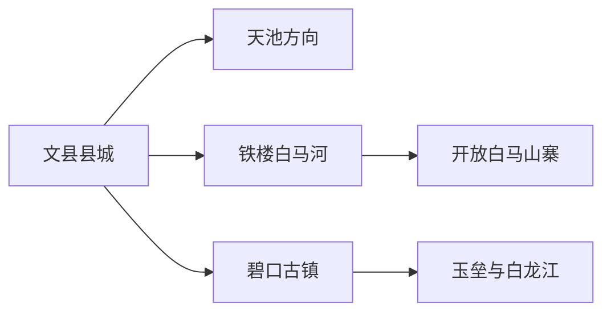
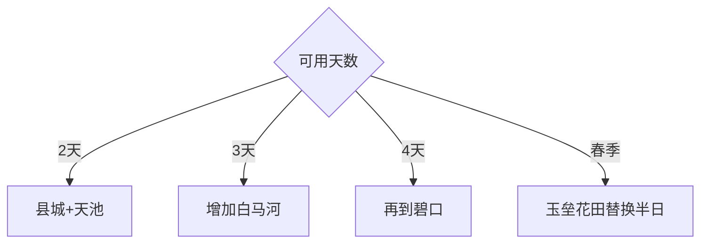

# 文县旅行指南

文县位于甘川交界的白龙江山地，县城是天池、铁楼白马河和碧口古镇三条方向的补给点。山路、雨季和保护地边界会拉长实际移动时间，适合把天池、白马民俗与碧口各自安排为完整一天。

## 城市速览

| 项目 | 信息 |
|---|---|
| 主线 | 县城—文县天池—铁楼白马河—碧口古镇与茶园 |
| 停留 | 县城1天；三条远线各留1天 |
| 住宿 | 县城适合分流；碧口适合古镇茶乡；正式民宿适合白马河慢游 |
| 交通 | 公路和包车为主，连续山路需要充足缓冲 |
| 风险 | 强降雨、山洪、滑坡落石、冬季结冰、峡谷通信波动 |
| 边界 | 大熊猫国家公园、白水江保护地、林区、库区和茶园分别管理 |

## 城市格局与游览区域

天池位于县城北侧山地，铁楼在白马河流域，碧口位于南部白龙江沿线，三者不适合压缩为同日。固定清单的 **GeoNames 7372977 Yulong** 对应文县玉垒乡，本页按县域旅行尺度承接；Wikidata `Q519605` 与法定代码 `621222` 锁定文县边界，其 P1566 为行政记录 `1791408`。

## 主要景点

| 景点 | 区域 | 类型 | 核心体验 | 用时 | 环境 | 体力 | 研究价值 | 拥挤 | 优先级 |
|---|---|---|---|---:|---|---|---|---|---|
| 文县天池景区 | 天池方向 | 高山湖泊 | 堰塞湖、山林与秦巴地貌 | 1天含往返 | 室外 | 中高 | 很高 | 旺季中高 | A |
| 白马河生态民俗风情景区 | 铁楼 | 民俗山地 | 白马村寨、非遗与河谷聚落 | 1天 | 混合 | 中 | 很高 | 节庆高 | A |
| 草河坝等正式开放村寨 | 铁楼 | 社区文化 | 民俗展陈、村寨空间与乡村体验 | 3–5小时 | 混合 | 中 | 高 | 活动时高 | B |
| 碧口古镇 | 碧口 | 古镇茶乡 | 茶马通道、白龙江与川甘生活 | 半日至1天 | 混合 | 中 | 高 | 节假日中 | A |
| 碧口茶园开放区 | 碧口周边 | 农业景观 | 陇南茶园、春季采制与山地农业 | 3–5小时 | 室外 | 中 | 高 | 采茶季中 | B |
| 文县博物馆及县城文化空间 | 县城 | 地方文博 | 阴平古道、地方历史与多民族文化 | 2–3小时 | 室内 | 低 | 高 | 低 | B |
| 玉垒油菜花与开放乡村 | 玉垒方向 | 季节乡村 | 白龙江河谷早春与山地农田 | 半日 | 室外 | 中 | 中 | 花期中 | B |

天池和白马河周边涉及大熊猫国家公园及多类保护空间，按正式景区、社区接待点和批准游线进入；林区巡护道、野生动物栖息地、库区生产岸线与茶园按各自管理边界通行。

## 美食与餐饮

碧口茶、核桃馍、豆花面、洋芋搅团、面皮和山地腊味具有地方性。县城和碧口便于补给，天池与白马河方向提前准备饮水；点餐说明辣度、腊肉、动物油、花生核桃和麸质需求，社区家访与民俗体验按主人安排和预约开展。

## 经典行程

### 两日基础线
**路线**：县城文博—文县天池。**逻辑**：先理解地方，再用完整天气日进山。**预约锚点**：景区开放、道路和车辆。**休息**：县城与游客中心。**删除条件**：强降雨时保留县城。

### 天池山水线
**路线**：县城—天池正式入口—开放湖岸—返程。**逻辑**：山路与湖区各留缓冲。**预约锚点**：门票、接驳和天气。**休息**：游客服务点。**删除条件**：山洪、落石或结冰预警时取消。

### 白马民俗线
**路线**：县城—铁楼—白马河景区—正式开放村寨。**逻辑**：以社区和非遗场景理解文化。**预约锚点**：民宿、演出和村寨接待。**休息**：铁楼接待点。**删除条件**：无接待或道路预警时改县城文化线。

### 碧口茶乡线
**路线**：碧口古镇—茶园开放区—白龙江公共岸线。**逻辑**：古镇与茶业属于同一南部片区。**预约锚点**：茶园体验和车辆。**休息**：古镇。**删除条件**：雨天删茶园坡地。

### 玉垒春日线
**路线**：县城—玉垒开放花田—乡村午餐—返程。**逻辑**：围绕早春花期安排短线。**预约锚点**：花况和村路。**休息**：乡镇。**删除条件**：花期结束时改碧口或县城。

### 县城低天气线
**路线**：县城文化空间—地方餐饮—白龙江城市公共空间。**逻辑**：普通降雨时保留较稳定项目。**预约锚点**：场馆开放。**休息**：县城。**删除条件**：极端天气预警时按应急信息调整全部移动。

### 低体力线
**路线**：县城文博—车辆观天池主要开放点或碧口古镇短步行。**逻辑**：二选一减少山路和台阶。**预约锚点**：接驳、入口与无障碍条件。**休息**：午后酒店。**删除条件**：连续山路不适时只留县城。

## 住宿区域

文县县城适合分赴三条远线；碧口适合茶乡与南部公路联程；铁楼正式民宿适合白马文化体验；天池周边住宿按营业季和管理规则选择。核对停车、供暖、热水、通信、早餐和雨季退改。

## 市内交通

文县跨县抵达以公路为主，县城到天池、铁楼和碧口分别走不同山路。包车时明确具体入口、等待时间和返程；自驾关注窄路、会车、落石与夜间视线。汛期根据气象、交通和景区公告压缩远线。

## 不同旅行者须知

自然爱好者优先天池正式游线；文化旅行者预约白马河社区体验；茶文化旅行者住碧口；摄影者按春季花期和天气选玉垒；亲子、长者与低体力旅行者在天池和碧口中择一，增加车辆休息。

## 行前核对

- 核对天池、白马河、村寨演出、碧口和茶园开放。
- 核对强降雨、山洪、滑坡落石、结冰、道路与通信。
- 大熊猫国家公园、白水江保护地、林区、库区和农田按管理边界进入。

## 来源与更新记录

| 来源 | 支持内容 | 核验日期 |
|---|---|---|
| [甘肃省文旅厅：文县精品线路](https://www.gswbj.gov.cn/a/2026/03/04/27639.html) | 天池、铁楼白马河、碧口组合与旅行顺序 | 2026-09-01 |
| [甘肃省文旅厅：白马风情](https://www.gswbj.gov.cn/a/2024/02/26/19774.html) | 铁楼白马山寨与民俗体验 | 2026-09-01 |
| [甘肃省文旅厅：碧口古镇文旅活动](https://www.gswbj.gov.cn/a/2026/02/02/27413.html) | 碧口古镇现行文旅场景 | 2026-09-01 |
| [陇南生态规划公开资料](https://credit.longnan.gov.cn/bszc/7931835.jhtml) | 天池、白水江保护地和生态廊道关系 | 2026-09-01 |
| [GeoNames 7372977](https://www.geonames.org/7372977/) | Yulong 固定城市点 | 2026-09-01 |
| [Wikidata Q519605](https://www.wikidata.org/wiki/Q519605) | 文县实体、代码与行政记录 | 2026-09-01 |

| 日期 | 更新 |
|---|---|
| 2026-09-01 | 首次完成文县旅行研究；建立天池、白马河与碧口三条远线 |
