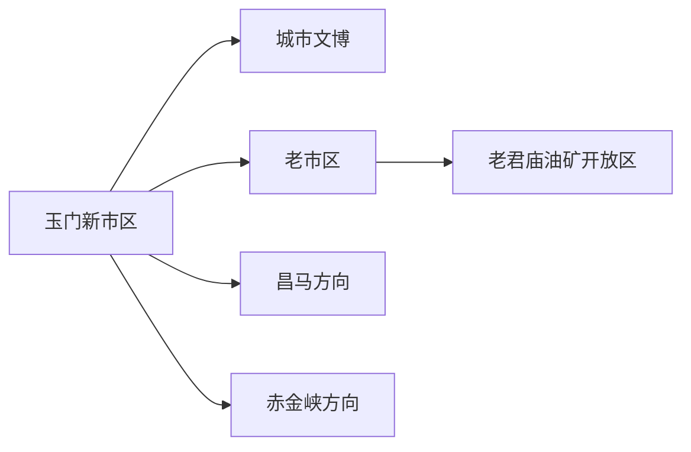
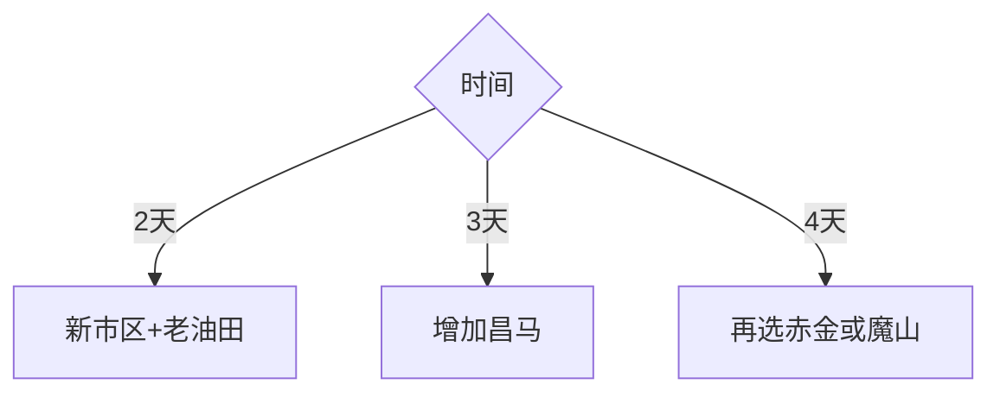

# 玉门旅行指南

玉门的旅行结构由新市区、老市区石油工业记忆和昌马—赤金等山水遗址远线组成。老君庙油矿旧址与铁人精神是核心，但油田生产、能源基地和矿区道路继续承担生产功能；选择正式开放的红色旅游景区和场馆，既能读懂城市，也能保持清晰边界。

## 城市速览

| 项目 | 信息 |
|---|---|
| 主线 | 新市区—老市区油田史—昌马或赤金远线 |
| 停留 | 新老城区2天；每条山地远线另留1天 |
| 住宿 | 新市区服务较集中；老市区适合工业史专程 |
| 交通 | 铁路、公路和跨组团车辆 |
| 风险 | 大风沙尘、严寒酷暑、山洪、矿区与能源生产安全 |
| 边界 | 景区展示区、油田生产区、风光电场、石窟文保和水库工程分别管理 |

## 城市格局与游览区域

新市区承担行政、住宿与铁路服务；老市区承接石油城市史；昌马与赤金分处不同远线。敦煌玉门关遗址位于敦煌市，与玉门市不是同一目的地。

## 主要景点

| 景点 | 区域 | 类型 | 核心体验 | 用时 | 环境 | 体力 | 研究价值 | 拥挤 | 优先级 |
|---|---|---|---|---:|---|---|---|---|---|
| 老君庙油矿旧址正式开放区 | 老市区 | 工业遗产 | 中国石油工业与城市建设史 | 3–5小时 | 混合 | 中 | 高 | 中 | A |
| 玉门市博物馆与城市展陈 | 新市区 | 文博 | 地方历史、能源与移民城市 | 2–4小时 | 室内 | 低 | 高 | 低 | A |
| 铁人干部学院相关开放展陈 | 老市区 | 红色教育 | 石油会战与铁人精神 | 2–4小时 | 室内 | 低 | 高 | 中 | B |
| 昌马石窟当期开放点 | 昌马方向 | 石窟文物 | 河西走廊佛教艺术与文保 | 1天含往返 | 混合 | 中 | 高 | 低 | B |
| 赤金峡正式景区 | 赤金方向 | 峡谷水利 | 峡谷、水库与季节活动 | 1天含往返 | 室外 | 中 | 中 | 中 | C |
| 魔山地质公园当期开放区 | 市域远线 | 地质荒漠 | 戈壁地貌与地质观察 | 1天含往返 | 室外 | 中高 | 中高 | 低 | C |

油矿旧址与教育展陈按各自运营单元记录；油井、储运、炼化、风光电场和专用铁路只在明确开放线路参观。石窟、长城和考古点使用文物部门开放范围。

## 美食与餐饮

牛羊肉、面食、烤饼和本地瓜果适合新市区补给；远线准备饮水与路餐。点羊肉先问重量，询问辣度、乳制品、坚果与共享锅具。

## 经典行程

### 两日基础线
**路线**：新市区文博—老市区油田史。**逻辑**：先城市框架后工业现场。**预约锚点**：场馆与旧址。**休息**：跨区车辆。**删除条件**：旧址关闭时保留展陈。

### 石油工业线
**路线**：博物馆—老君庙—铁人展陈。**逻辑**：按发现、会战与城市发展阅读。**预约锚点**：开放与讲解。**休息**：老市区午餐。**删除条件**：生产安全管制时只进场馆。

### 昌马文化线
**路线**：新市区—昌马石窟开放点—返程。**逻辑**：石窟远线独占一天。**预约锚点**：文保开放与车辆。**休息**：沿正式服务点。**删除条件**：山洪或道路管制时取消。

### 赤金峡线
**路线**：新市区—赤金峡—返程。**逻辑**：以当期景区活动为核心。**预约锚点**：水情、运营、保险。**休息**：服务区。**删除条件**：停漂或水利管制时改城市线。

### 魔山地质线
**路线**：住宿—正式地质公园入口—返程。**逻辑**：荒漠远线配置完整保障。**预约锚点**：准入、车辆、通信。**休息**：车内分段。**删除条件**：大风沙尘时整段删除。

### 亲子研学线
**路线**：博物馆—油田开放展陈—城市休息。**逻辑**：以能源史科普为主。**预约锚点**：年龄与讲解。**休息**：室内外交替。**删除条件**：高温大风时缩短户外。

### 低体力线
**路线**：新市区场馆—车辆观察城市—老市区室内展陈。**逻辑**：减少荒漠步行。**预约锚点**：落客、电梯。**休息**：午后酒店。**删除条件**：跨区车程不适时只留新市区。

## 住宿区域

新市区适合铁路、餐饮与多方向出发；老市区适合工业史专程。确认供暖制冷、停车、早餐、跨区车辆和取消政策，远线当天不依赖临时返程。

## 市内交通

玉门站、新市区、老市区和各远线并非连续步行范围。按日租用合规车辆或确认公共交通，票面“玉门关”相关名称也要与敦煌遗址区分。

## 不同旅行者须知

工业爱好者选择正式开放旧址；自驾者沿公开道路并避开矿运和能源检修路；亲子长者以场馆和开放展陈为主；摄影者遵守油田、风电、铁路与文物拍摄规则。

## 行前核对

- 核对老君庙旧址、博物馆、昌马石窟、赤金峡与魔山开放。
- 核对大风沙尘、山洪、冬季结冰和长距离道路。
- 油田、矿区、能源、水利、铁路与文保空间按正式开放边界进入。

## 来源与更新记录

| 来源 | 支持内容 | 核验日期 |
|---|---|---|
| [玉门市人民政府](https://www.yumen.gov.cn/) | 属地政务、文旅、交通与动态公告 | 2026-09-01 |
| [甘肃政务服务：玉门市概况](https://zwfw.gansu.gov.cn/jiuquan/tsfw/zsyzfwzq/szgk/art/2023/art_99af3667811d4c62b650af63e5207f90.html) | 铁人故里、天境昌马、魔山与全域旅游结构 | 2026-09-01 |
| [中国石油：玉门油田工业遗产探访](https://news.cnpc.com.cn/cms_udf/2025/gyyz0624/index.shtml) | 老君庙一号井、炼油厂遗址与矿史展览馆 | 2026-09-01 |
| [民政部行政区划代码查询](https://dmfw.mca.gov.cn/xzqh/getList?code=62&trimCode=true&maxLevel=3) | 玉门市代码与层级 | 2026-09-01 |
| [GeoNames 13535802](https://www.geonames.org/13535802/) | 玉门固定居民点 | 2026-09-01 |
| [Wikidata Q729562](https://www.wikidata.org/wiki/Q729562) | 玉门市实体 | 2026-09-01 |

| 日期 | 更新 |
|---|---|
| 2026-09-01 | 首次完成玉门旅行研究；建立新市区、老油田与昌马赤金远线 |
