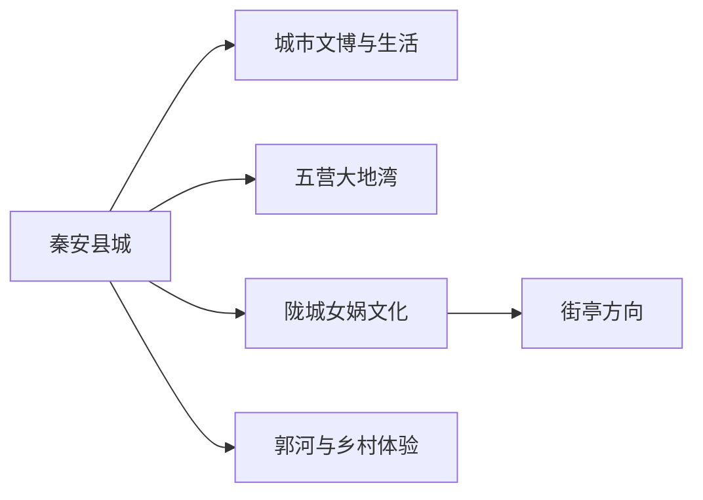
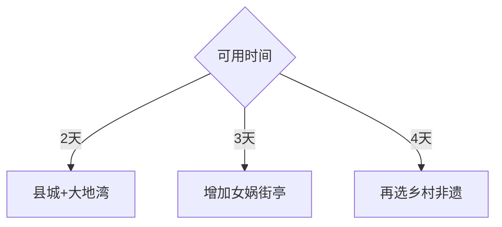

# 秦安旅行指南

秦安适合以县城为住宿和补给基地，把大地湾史前考古、女娲文化、街亭三国遗址与陇东南乡村体验拆成不同方向。核心遗址距离县城较远，按“一天一条县域线”安排，比连续追点更能留出讲解、山路和返程时间。

## 城市速览

| 项目 | 信息 |
|---|---|
| 主线 | 县城文博—大地湾—女娲与街亭 |
| 停留 | 县城半日至1天；每条遗址远线另留1天 |
| 住宿 | 县城服务集中；五营、陇城方向按正规接待点选择 |
| 交通 | 天水联程、县城客运与合规包车 |
| 风险 | 高温严寒、强降雨、山洪、乡道夜行与遗址保护 |
| 边界 | 考古遗址、庙宇、果园农田和村落生活空间分别管理 |

## 城市格局与游览区域

县城承担住宿和换乘；大地湾位于五营方向，女娲祠与街亭方向可顺路组合，但仍需按开放和山路控制点数。固定清单以人口较高的 `Baituo` 城市点 **GeoNames 1817306** 建页，页面承接秦安县完整旅行尺度；Wikidata `Q1201152` 的 P1566 指向县级行政记录 `1789030`，二者粒度不同。

## 主要景点

| 景点 | 区域 | 类型 | 核心体验 | 用时 | 环境 | 体力 | 研究价值 | 拥挤 | 优先级 |
|---|---|---|---|---:|---|---|---|---|---|
| 大地湾遗址与博物馆 | 五营方向 | 考古文博 | 史前聚落、彩陶与早期建筑 | 4–6小时含讲解 | 混合 | 中 | 很高 | 中 | A |
| 秦安县博物馆及县城文博 | 县城 | 文博 | 地方历史与出土文物框架 | 2–3小时 | 室内 | 低 | 高 | 低 | A |
| 女娲祠及正式开放文化点 | 陇城方向 | 人文 | 女娲信俗与地方文化 | 2–3小时 | 混合 | 中 | 中高 | 中 | B |
| 街亭古战场遗址公开区 | 陇城方向 | 历史遗址 | 三国地理与陇右交通 | 2–3小时 | 室外 | 中 | 高 | 低 | B |
| 郭河书香村公开接待区 | 郭河方向 | 乡村文化 | 村落文脉与乡土生活 | 2–3小时 | 混合 | 低中 | 中 | 低 | C |
| 五营泥塑与正规非遗体验 | 五营方向 | 非遗 | 泥塑、麦秆编和彩陶主题 | 1–2小时 | 室内 | 低 | 中 | 低 | C |

大地湾遗址、展厅和考古展示区按同一核心目的地连续游览。遗址保护区、田野考古区、祭祀空间、果园和村民院落均以现场开放范围为准。

## 美食与餐饮

秦安老豆腐、醋凉粉、锅盔、暖锅与时令蜜桃苹果适合在县城或正规农家乐体验。点餐时先确认份量、辣度、醋味、坚果和共享锅具；遗址远线携带饮水与简便路餐。

## 经典行程

### 两日基础线
**路线**：县城文博—大地湾遗址。**逻辑**：先建立县域框架，再进入核心考古现场。**预约锚点**：博物馆、遗址讲解和车辆。**休息**：县城午后与景区休息点。**删除条件**：遗址临时关闭时保留县城文博。

### 大地湾考古线
**路线**：县城—大地湾博物馆—遗址开放区—返程。**逻辑**：展厅与现场连续阅读。**预约锚点**：开放、讲解和拍摄规则。**休息**：五营正规服务点。**删除条件**：暴雨或道路管制时取消户外段。

### 女娲街亭线
**路线**：陇城女娲文化点—街亭公开遗址—县城。**逻辑**：同方向组合神话传统与三国地理。**预约锚点**：庙宇活动、道路和车辆。**休息**：陇城镇区。**删除条件**：节庆拥挤或山路预警时减为一处。

### 乡村非遗线
**路线**：郭河—五营正规体验点—县城。**逻辑**：以预约体验连接村落文化。**预约锚点**：接待主体和制作时段。**休息**：农家乐午餐。**删除条件**：未确认接待时改县城线。

### 亲子研学线
**路线**：县博物馆—大地湾博物馆—短段遗址。**逻辑**：用室内展陈降低理解门槛。**预约锚点**：讲解、儿童活动和开放。**休息**：每90分钟一次。**删除条件**：高温或低温时缩短现场段。

### 摄影季节线
**路线**：县城—正式观景道路—果园乡村公开接待点。**逻辑**：把花果季作为加项。**预约锚点**：花期、采摘和停车。**休息**：正规接待点。**删除条件**：农忙、道路拥堵或天气不佳时取消。

### 低体力线
**路线**：县城文博—车辆到大地湾博物馆—县城。**逻辑**：以室内和可落客点为主。**预约锚点**：坡道、座椅和卫生间。**休息**：午后酒店。**删除条件**：长车程不适时只留县城。

## 住宿区域

县城适合铁路或天水联程、餐饮和多方向出发。选择靠近客运与主干路的住宿，并确认供暖制冷、早餐、停车、热水和取消政策；清晨远线提前约车。

## 市内交通

秦安站、县城、大地湾、陇城与街亭分属不同交通节点。铁路抵达后先完成县城接驳，再按日选择客运或合规车辆；乡道日落前返程，并留出强降雨后的路况缓冲。

## 不同旅行者须知

考古爱好者优先预约大地湾讲解；亲子家庭用博物馆加短现场；长者选择可落客展馆；自驾者沿公开道路停车；摄影者先取得村落、宗教活动和人物拍摄同意。

## 行前核对

- 核对大地湾、县博物馆、女娲文化点和街亭遗址开放。
- 核对天水联程、县域车辆、降雨山洪与冬季结冰。
- 考古、宗教、农田、村落与道路施工空间按现场边界进入。

## 来源与更新记录

| 来源 | 支持内容 | 核验日期 |
|---|---|---|
| [天水市文旅局：秦安县冬春季乡村旅游线路](https://www.tianshui.gov.cn/wlj/info/2602/281162.htm) | 大地湾、女娲祠、街亭、郭河与五营线路 | 2026-09-01 |
| [民政部行政区划代码查询](https://dmfw.mca.gov.cn/xzqh/getList?code=62&trimCode=true&maxLevel=3) | 秦安县行政层级与代码 | 2026-09-01 |
| [GeoNames 1817306](https://www.geonames.org/1817306/) | Baituo 固定城市点 | 2026-09-01 |
| [Wikidata Q1201152](https://www.wikidata.org/wiki/Q1201152) | 秦安县实体与行政记录关系 | 2026-09-01 |

| 日期 | 更新 |
|---|---|
| 2026-09-01 | 首次完成秦安旅行研究；建立县城、大地湾、女娲街亭与乡村非遗路线 |
