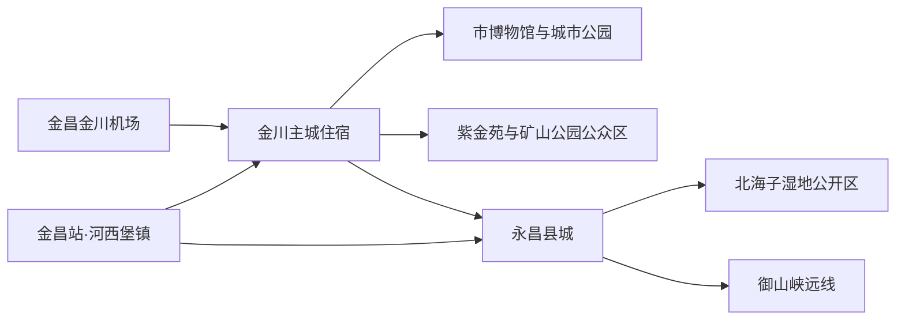
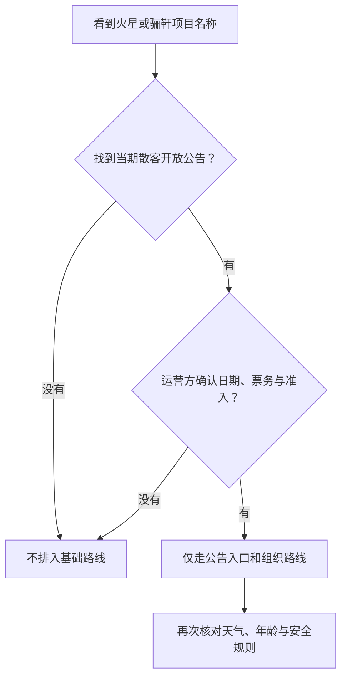

# 金昌旅行指南

金昌是河西走廊中段一座“缘矿兴企、因企设市”的工业城市：金川区主城把镍铜工业史、城市博物馆、矿山公园公众区与季节花海连在一起，永昌县则是需要单独往返的普通县域远线，县城古建、湿地和长城遗存不能当作主城街区。最稳妥的安排是住在金川主城，先理解矿业城市如何形成，再按一整天选择永昌县城或御山峡方向；任何矿井、冶炼厂、尾矿设施和“火星”“骊靬”项目都先核开放，不凭宣传名称进入。

> 建议停留：金川主城 1–2 天；加入永昌县城后 2–3 天；再加御山峡等县域远线需 3–4 天 
> 旅行关键词：镍都工业史、紫金花海、矿山修复、永昌古城、河西走廊、汉明长城 
> 主要体力：主城低至中等；县域远线中等，风沙、暴晒与台阶会放大负担 
> 最近研究：2026-08-12

## 城市速览

| 项目 | 旅行信息 |
|---|---|
| 主要旅行价值 | 在金川主城看资源型城市的建立、工业记忆与生态修复，再以永昌县城和御山峡理解河西走廊的县城生活、古建、湿地与长城遗存。 |
| 建议停留 | 1 天可做主城文博与一处户外；2 天加入矿山公园公众区或季节花海；3–4 天再从永昌县城、御山峡与红色专题中按方向选择。 |
| 较舒适季节 | 春秋较适合户外，但春季大风、沙尘与昼夜温差明显；夏季花卉活动较多，同时日照、高温与短时强对流风险上升；冬季寒冷、日短，部分户外服务收缩。 |
| 预算特点 | 主城餐饮和住宿通常易控制；金昌站、机场、永昌县城及更远景区之间的接驳是主要增量。包车按往返等待、空驶与停车一起询价。 |
| 步行强度 | 博物馆、城市公园较低；矿山公园观景、钟鼓楼登临和御山峡为中等或更高。干燥、大风和暴晒会使相同距离更累。 |
| 主要天气风险 | 干燥、强紫外线、大风、沙尘、昼夜温差；夏季还要防高温、雷电、短时强降雨和沟谷山洪，冬季关注积雪结冰。 |
| 独行旅行 | 主城正规场馆与公共公园适合独立安排；县域远线先落实返程，不独自进入戈壁野路、沟谷、湿地深处或工业生产区。 |
| 亲子旅行 | 市、县博物馆与城市花园便于拆成短段；矿山边坡、工业研学、临水空间、长城遗址和远线曝晒需按年龄与运营方规则取舍。 |
| 长者与低体力旅行 | 以市博物馆、金水湖、紫金苑平缓公开区为主，车辆点到点；取消钟鼓楼登临和御山峡长线。所有入口、卫生间与座椅需逐处确认。 |
| 无障碍信息 | 官方资料不足以证明各景点之间或景点内部存在连续无障碍动线；轮椅入口、电梯、无障碍卫生间、陪同与车辆装载条件须向各运营方确认。 |

金昌适合“分层看”：先把主城的博物馆与公开工业遗产看明白，再决定是否为花期、县城古建或长城远线增加一天。名称相近并不意味着同一入口；官方活动到访也不等于散客日常开放。

## 城市格局与游览区域

金昌现辖金川区和永昌县。日常所说的“金昌市区”通常指金川区主城；金昌站实际位于永昌县河西堡镇，永昌县城又在更南侧。机场、主城、河西堡车站、永昌县城与御山峡不是一条可连续步行的城市线，应按车辆接驳和返程时限拆开。

| 区域 | 主要内容 | 游览特点 | 与其他区域的关系 |
|---|---|---|---|
| 金川主城 | 金昌市博物馆、金川公园、餐饮与住宿 | 公共服务最集中，可用博物馆加一处公园组成低强度半日 | 是机场、车站、县城和郊区方向的住宿基地 |
| 紫金苑—东部生态休闲 | 紫金苑景区、季节花海及正式活动 | 花期和活动时段变化大，户外暴晒明显 | “紫金花城”是更广的城市文旅品牌和景观体系，不是一座统一售票景区 |
| 西北矿业记忆方向 | 金川国家矿山公园公众区、当期正式组织的金川科技馆或工业研学 | 退役露天采坑的展示区与在产矿冶系统必须严格分开 | 只有公告开放入口和运营方带领路线可进入 |
| 金水湖—城市水景 | 金水湖及公告开放绿地 | 适合日落前后休息，受大风、高温和临水安全影响 | 可作到达日、离开日或主城减负段 |
| 河西堡镇 | 金昌站、工业与交通节点 | 是铁路到发地，不是金川主城市中心；站外接驳时刻动态变化 | 可转往金川主城或永昌县城，不建议凭站名直接步行找主城 |
| 永昌县城 | 永昌县博物馆、钟鼓楼、县城餐饮 | 普通县城尺度，场馆闭馆日与钟鼓楼登临规则需分别核对 | 从金川主城或河西堡往返，至少按大半天至一天安排 |
| 北海子—御山峡方向 | 北海子湿地公开区、御山峡汉明历史文化景区 | 湿地、沟谷、长城和寺塔遗存边界敏感，天气与道路影响大 | 北海子可接县城；御山峡更远，通常单列一日，不与主城硬拼 |

**行政与数据范围。**本页对应法定地级市金昌市，行政代码 **620300**，包括金川区和永昌县。候选 GeoNames `1805733` 是名为 Jinchang 的 `P/PPLA2` 城市点，用于定位金川主城，不等于全市行政边界；另有 GeoNames `1805747` 对应 Jinchang Shi 行政区记录。2026-08-12 实时核验的 Wikidata 法定实体 `Q532776` 标注为甘肃省地级市、正式名称“金昌市”，其 `P1566=1805733` 与本页候选城市点精确对应，行政代码属性显示 `62 03`。因此 frontmatter 采用 `Q532776` 与 `1805733`，正文保留“城市点不等于法定边界”的限制。

**紫金项目去重。**官方所称“紫金花城生态景区”是以城市花卉景观为核心、辐射多个公园和景点的广义体系；“紫金苑景区”则是可定位的具体花卉与生态休闲场所。金水湖、金川公园、矿山公园各有独立入口与功能，不能因出现在广义体系介绍中就合并成一张票或同一园区。本页只把“紫金苑景区（紫金花海）”列作具体景点，花况和活动另行核对。

**生产、生态与文物边界。**矿山公园的公众展示区不等于金川集团在产区域开放。未经运营方正式组织，不进入在产矿井、地下巷道、选矿及冶炼厂、制酸和化工区域、铁路专用线、尾矿库、排土场、渣场、复垦施工区或任何设卡围挡范围；不把远望、地图道路或研学报道当作准入许可。湿地、水库、灌渠、河沟、行洪通道、长城保护范围和考古遗址同样只走公告开放入口与步道，不越栏、不取土石、不攀爬文物。

## 主要景点

优先级用于安排时间，不代表绝对排名：**A** 为首访核心，**B** 为城市和县域历史补充，**C** 为远线或专题项目。交通枢纽和状态未明项目仅作路线节点，不计入景点完成率；同一景区内部展项不拆分计数。

### 金川主城与生态休闲

| 景点 | 区域 | 类型 | 主要看点 | 建议用时 | 室内外 | 体力 | 预约风险 | 天气影响 | 优先级 |
|---|---|---|---|---:|---|---|---|---|---|
| 金昌市博物馆 | 金川主城 | 综合博物馆、城市史 | 史前至近现代地方历史、河西走廊与资源型城市背景；先建立全市时间线 | 2–3 小时 | 室内 | 低 | 中 | 低 | A |
| 紫金苑景区（紫金花海） | 主城东部方向 | 花卉、园林、季节活动 | 具体可定位的花卉景观与城市生态建设，不与“紫金花城”广义品牌混同 | 1.5–3 小时 | 室外 | 低至中 | 中 | 很高 | A（花期）／B（非花期） |
| 金川国家矿山公园公众区 | 主城西北方向 | 工业遗产、矿山修复 | 退役露天采坑、矿业城市记忆与生态治理；仅限公告开放观景与展示线 | 2–3 小时 | 以室外为主 | 中 | 高 | 很高 | A |
| 金川公园 | 金川主城 | 城市公园 | 居民日常绿地与工业城市生活尺度，适合用餐前后短停 | 1–2 小时 | 室外 | 低 | 低 | 高 | B |
| 金水湖景区 | 主城东南方向 | 城市水景、生态绿地 | 调蓄水体与公共绿地构成的城市休闲空间；不进入非开放水工设施 | 1.5–2.5 小时 | 室外 | 低 | 低 | 高 | B |
| 当期正式开放的金川科技馆或工业研学线 | 运营方公布地点 | 工业科普、组织活动 | 镍铜资源、工艺与城市建设关系；只按实名预约、集合、讲解和防护要求进入 | 半日至一日 | 混合 | 中 | 很高 | 中 | 活动节点 |

金川科技馆、工业研学和矿山公园不是三个可随意穿行的厂区入口。官方 2026 年采风活动到访科技馆和矿山公园，只能证明当时组织活动存在；散客能否预约、集合点在哪里、是否有年龄和着装限制，仍须由运营方当期确认。

### 永昌县城与县域远线

| 景点 | 区域 | 类型 | 主要看点 | 建议用时 | 室内外 | 体力 | 预约风险 | 天气影响 | 优先级 |
|---|---|---|---|---:|---|---|---|---|---|
| 永昌县博物馆 | 永昌县城 | 县域博物馆 | 县域历史、长城沿线与地方文物，适合作为远线起点 | 1.5–2.5 小时 | 室内 | 低 | 中 | 低 | A |
| 永昌钟鼓楼 | 永昌县城 | 古建筑、全国重点文物保护单位 | 城市中轴与河西县城格局；外观和登临是两种状态 | 1–1.5 小时 | 以室外为主 | 低；登临中等 | 高 | 中 | A |
| 北海子湿地公园公开区 | 永昌县城北侧 | 湿地、城市生态 | 泉水湿地与县城绿地，只在公开步道和服务区活动 | 1.5–2.5 小时 | 室外 | 低至中 | 中 | 很高 | B |
| 御山峡汉明历史文化景区 | 永昌县域远线 | 峡谷、汉明长城与文物景观 | 河西走廊山口、公告开放的长城与圣容寺塔相关游览段；内部子点合并计一次 | 半日至一日 | 以室外为主 | 中至中高 | 高 | 很高 | B／C |
| 红西路军永昌战役纪念馆 | 永昌县域 | 纪念馆、近现代史 | 永昌战役和红西路军历史，适合按专题单独安排 | 1.5–2.5 小时，另加往返 | 以室内为主 | 低 | 中 | 中 | B／C |

钟鼓楼 2024 年修缮后曾以预约、限流、定时方式组织登临；这不应固化成永久开放承诺。即便无法登临，外部文物环境仍可与县博物馆连看，但不得尾随工作人员进入或攀越围挡。御山峡内长城、寺塔、沟谷和保护范围是一个整体目的地，不把每座塔、每段墙体拆成多个景点；暴雨、雷电、大风、火险、结冰或道路预警时整段取消。

### 两个高风险名称的运营核验

**火星 1 号基地。**截至 2026-08-12，能找到的最新明确公共状态是金昌市文旅局 2025-10-13 发布的“暂停营业通告”；其后 2026 年确有企业活动和官方采风到访，年度工作计划也提到 VR／AR 升级，但这些只能证明受组织活动或建设推进，不能证明已经恢复常态散客售票。本页不把它列入基础景点与固定路线；只有运营方明确发布恢复营业、日期票务、适用人群和安全要求后，才可作为预约活动加入。

**骊靬相关项目。**官方 2026 年文章把“骊靬古城”列入地方历史文化叙事，但 2024 年永昌文旅发展材料仍把“神秘骊靬景区建设项目”表述为申报、争取实施的项目；未检索到足以证明 2026 年常态散客运营的官方开放公告。古代地名、地方传说、现代仿建或项目名称与学术结论不是一回事，不把“罗马军团后裔”等争议叙事写成定论，也不把项目用地当成开放景区。确有兴趣者应向永昌县文旅主管部门核实具体可进入的公共区域，未获确认则从路线删除。

## 美食与餐饮

金昌餐桌同时体现河西面食、羊肉和永昌县域家常菜。羊肉垫卷子与“永昌十八子”在官方近年活动中持续出现，但“十八子”更像一组地方菜品体系而非一道固定配方；询问具体菜名、做法和份量，比只按招牌下单更可靠。主城适合独行和晚到，永昌县城适合把县博物馆、钟鼓楼与午餐串成一日。

| 菜品或餐饮类型 | 常见区域 | 一个人用餐与常见份量 | 风味、过敏原与饮食限制 | 排队风险与替代方法 |
|---|---|---|---|---|
| 羊肉垫卷子 | 金川主城、永昌县城 | 常见为多人共享锅或大盘；独行先问能否做小份、半份或按人数配量 | 羊肉、面卷含麸质；汤汁可能有葱蒜、辣椒和复合香辛料，清真需求逐店确认 | 正餐时段可能久等；换同类家常馆，不必追单一名店 |
| 永昌暖锅及“永昌十八子”组合 | 永昌县城及县域餐馆 | 暖锅与组合菜通常适合共享；先确认具体包含几道、肉菜比例与主食 | 常见猪肉或羊肉、豆制品、蛋、麸质和复合汤底；素食者不可只捞蔬菜，应确认是否共锅 | 节庆或团队餐高峰提前问桌位；人数少改点两三样代表菜 |
| 漏鱼子等粉面小吃 | 主城、永昌县城 | 单碗较适合一人，饭量小可先问小碗 | 原料可能为淀粉、杂粮或面粉，各店不同；浇汁可能含醋、辣椒、肉臊子，乳糜泻者须逐项问 | 用早餐店、面馆同类替代，避开集中用餐时段 |
| 油饼、卷糕与面点 | 早餐铺、市场周边 | 常按个或份出售，适合分食；甜糯类不要一次点多 | 小麦麸质、食用油；馅料可能含糖、枣、芝麻或其他坚果种子，过敏者先问 | 早餐高峰可外带，但远线前避免买过量油炸食物 |
| 羊肉、牛肉与家常炒菜 | 全城常见 | 肉菜常为共享份量，一人可选面饭、小炒或要求小份 | 肉类、辣椒、花椒、葱蒜常见；蚝油、酱油可能含大豆或麸质，严格过敏需明确说明并防交叉接触 | 选择菜单透明、能复述需求的店；无法确认时改吃原料简单菜品 |
| 季节果蔬与花卉主题饮品 | 主城公园和活动周边 | 饮品甜度和容量可调；果蔬按小份购买 | 奶饮含乳，烘焙含蛋奶和麸质；“花卉”名称不代表花材可食或无过敏风险 | 花期摊位与活动强时效，不把临时摊点当唯一餐源 |

点菜时把“不能吃”说成原料清单，并询问汤底、腌料、酱油、炒锅和炸油是否共用。对严重食物过敏或乳糜泻，地方小馆可能无法保证无交叉接触，应携带书面说明与安全备用食品。进入永昌或御山峡远线前准备饮水和简单补给，但不在文物、湿地或生产区野炊。

## 经典行程

### 一日经典路线

**路线**：金昌市博物馆 → 主城午餐与休息 → 紫金苑景区（当期花况合适）或金水湖 → 金川公园附近晚餐

- **串联逻辑**：把稳定的室内文博放在前半日，午后只选一个城市户外方向；花况不佳时直接换成金水湖或缩短为主城公园。
- **预约锚点**：先锁定市博物馆开放与预约；紫金苑活动、入园和停车规则在出发前确认。
- **休息安排**：午间回主城商业区用餐避晒；户外每 60–90 分钟补水并找遮阴座椅。
- **时间不足时**：先删晚间公园，再删第二处户外；保留市博物馆与一顿地方餐。

### 两日城市路线

**第 1 天**：金昌市博物馆 → 主城午休 → 紫金苑或金水湖 
**第 2 天**：金川国家矿山公园公告开放区 → 主城午餐 → 金川公园；若已取得正式工业研学名额，则整天服从集合与组织路线

- **串联逻辑**：第一天建立城市历史与生态印象，第二天单独理解矿业记忆；不把矿山公园、科技馆和厂区想象成可自由串门的连续园区。
- **预约锚点**：市博物馆、矿山公园实际开放入口；工业研学仅以运营方书面或官方通知为准。
- **休息安排**：每天中午回主城；矿山公园日携水、防晒和防风层，按工作人员指引休息。
- **时间不足时**：没有可靠准入就整段删除工业研学；第二天只保留矿山公园公众区，不追加入厂。

### 三日深度路线

**第 1 天**：金昌市博物馆 → 主城公园或金水湖 
**第 2 天**：金川国家矿山公园公众区 → 紫金苑（依花况） 
**第 3 天**：金川主城出发 → 永昌县博物馆 → 县城午餐 → 永昌钟鼓楼外观／当期预约登临 → 北海子湿地公开区 → 返回

- **串联逻辑**：前两天留在金川主城，第三天才做普通县域远线；县博物馆提供背景，钟鼓楼与北海子按县城空间连接。
- **预约锚点**：第三天先核县博物馆闭馆日、钟鼓楼登临与北海子公开范围，并确认往返车辆。
- **休息安排**：在永昌县城固定午餐和室内休息，不在湿地边临时找餐；回程前补水、如厕。
- **时间不足时**：先删北海子，再取消钟鼓楼登临只看外观；若返程无把握，县域日整段删除。

### 雨天路线

**路线**：金昌市博物馆 → 主城午餐 → 已确认开放的室内公共文化场馆；在永昌县住宿者可改为永昌县博物馆 → 县城午餐，不跨县追点

- **串联逻辑**：两套方案都把已确认开放的单一博物馆作为核心，并把午餐与避雨留在同一城区，避免雨天跨城换乘和临时寻找入口。
- **适用条件**：只适合普通降雨。雷电、暴雨、大风、沙尘、山洪或道路预警时，取消紫金苑、矿山公园、北海子、御山峡及一切沟谷和临水路线；不要把工业区当作避雨空间。
- **预约锚点**：博物馆当天开放和临时闭馆信息；金川科技馆不能作为无预约备选。
- **休息安排**：全程在主城或县城有固定座位的室内场所休息，避免在地下通道、树下和临时棚体躲雷雨。
- **时间不足时**：只保留一座已确认开放的博物馆；极端天气遵从预警停留住宿地。

### 亲子或低体力路线

**亲子路线**：金昌市博物馆短段参观 → 午餐与午休 → 紫金苑平缓公开区或金川公园 
**低体力路线**：车辆到市博物馆无障碍入口（先确认） → 午餐 → 车辆到金水湖或紫金苑最近的平缓入口 → 返回住宿

- **串联逻辑**：两线都先用室内短段建立城市背景，再经完整午休连接一处平缓户外；亲子线减少换乘，低体力线用点到点车辆替代连续步行。
- **减负方式**：亲子按儿童注意力拆成 45–60 分钟段，远离采坑边缘、临水空间和生产围挡；低体力方案取消钟鼓楼登临、御山峡与长距离矿山公园步行，轮椅只走已确认的平整路线。
- **预约锚点**：确认博物馆儿童与推车规则、无障碍入口、电梯、卫生间和陪同政策；工业研学另核年龄下限与防护装备。
- **休息安排**：午间至少留 1.5 小时；自带水和必要药物，不依赖远线临时座椅。
- **时间不足时**：两类路线均先删户外，只保留博物馆短段；儿童或长者状态下降即返程。

### 远郊一日路线

**路线**：金川主城／永昌县城出发 → 御山峡汉明历史文化景区公告开放入口 → 固定补给与休息点 → 原路返回

- **串联逻辑**：御山峡作为单一远郊目的地处理，去程、景区公开线和原路返程围绕同一车辆闭环，不再叠加县城景点或另一条远线。
- **适用条件**：仅在道路、天气、景区开放和往返车辆全部确认时执行；需承担较长车程、户外曝晒、风沙、坡道和通信不稳定的可能。它与永昌县城日是两种强度，不建议第一次到访硬塞在同一天。
- **预约锚点**：景区当期开放范围、停止入园、讲解或预约、司机等待位置；长城与寺塔只看明确开放段。
- **休息安排**：出发前在县城补水、如厕并准备简餐；只在运营方指定休息区停留，不在沟谷、河道、文物基址或林草防火区野餐生火。
- **时间不足时**：远郊整段删除，改做永昌县博物馆与钟鼓楼外观；遇暴雨、雷电、大风、沙尘、火险或结冰预警同样整段取消。

## 住宿区域

| 区域 | 优点 | 缺点 | 适合人群 | 交通特点 |
|---|---|---|---|---|
| 金川主城商业与公共服务区 | 餐饮、医院、打车与城市场馆最方便，晚到仍较从容 | 到金昌站、永昌县城和御山峡仍需车辆；街面房可能有交通噪声 | 首访、独行、亲子、低体力及以主城为基地者 | 优先选择便于上车、前台能协助确认接驳的住宿 |
| 紫金广场及主城中部 | 城市生活感强，餐饮和公园相对集中 | 花海、矿山公园和枢纽均不是步行即达；活动期可能嘈杂 | 想把晚餐和城市散步放在一起者 | 公交与出租更实用，订房时问临街噪声和电梯 |
| 永昌县城 | 县博物馆、钟鼓楼、北海子和县域餐饮衔接方便，可减少远线早起 | 住宿选择和夜间交通少于主城；往机场和金川主城需再接驳 | 专做永昌县域、准备御山峡一日者 | 先锁次日车辆与返程，不把“永昌”住宿误订到河西堡镇 |
| 河西堡镇／金昌站周边 | 适合很晚到站或很早乘车 | 是交通与工业城镇节点，不是金川主城或永昌县城景点中心 | 只为铁路过夜、第二天转车者 | 预订前核地图、夜间接站和前台时段；次日仍需转往目的片区 |

订房时同时核对电梯、无障碍淋浴、空调或供暖、夜间前台、停车和取消规则。参加工业研学或远线包车，不要只按“距离最近”订在工业园、厂门或陌生乡道附近；以运营方明确集合点为准。

## 市内交通

| 场景 | 建议与取舍 | 行前需要重查的内容 |
|---|---|---|
| 从金昌站抵达 | 金昌站位于永昌县河西堡镇，不在金川主城。到站后用当期公共客运、出租或合规预约车前往金川主城／永昌县城；晚到先确认接站 | 12306 到发、站外上车点、公共客运首末班、夜间出租与住宿接站 |
| 从金昌金川机场抵达 | 机场航线具有航季性，抵达后按当期机场接驳、出租或合规预约车进主城；不要用上一航季航线和巴士信息推断本次 | 航班、机场运行、接驳方式、末班与晚点后的替代方案 |
| 主城跨片区 | 公交适合不赶时间的市区移动；紫金苑、金水湖和矿山公园方向先查站点与返程，出租车更适合多人或低体力 | 线路调整、首末班、活动交通管制、矿山公园实际游客入口 |
| 前往永昌县城 | 县际公交、客运或合规车辆承担往返；按一整段公路移动预留时间，不在同日叠加多个远线 | 客运站点、班次、返程末班、道路施工与天气 |
| 前往御山峡等远线 | 自驾或合规包车更可控，但司机熟悉入口不等于景区开放；约定等待、返程和失联处理 | 景区公告、道路通行、手机信号、油量／充电、停车与保险 |
| 片区内步行与骑行 | 主城公园可短距离步行；大风、沙尘、结冰和强日照下不宜用共享骑行代替远距离车辆 | 道路施工、共享车辆服务区、头盔与夜间照明规则 |

金昌没有可替代全部跨片区公路接驳的城市轨道交通。火车站名、机场名和“市区”三个词容易制造距离错觉：订票后应把站点、住宿和首个景点放在同一地图上核一次，再决定是否需要接站。所有实时班次与票价只以运营方或主管部门当日信息为准。

## 不同旅行者须知

| 旅行维度 | 可行条件 | 主要取舍 | 需额外核对 |
|---|---|---|---|
| 独行旅行 | 主城博物馆、公园、正规餐馆和出租较易安排 | 县域返程、晚间站外交通与远线通信是短板 | 末班、接站、包车资质和住宿夜间前台 |
| 亲子旅行 | 市博物馆、县博物馆、平缓花园可做短段 | 采坑、临水、长城、沟谷和工业安全区不适合自由跑动 | 儿童预约、推车、年龄下限、护栏与卫生间 |
| 长者或低体力旅行 | 主城点到点车辆可显著减负 | 钟鼓楼登临、矿山公园长距离观景和御山峡坡道应删除 | 落客点、座椅、电梯、轮椅入口和司机等待 |
| 无障碍需求 | 可先选择博物馆和城市公园的已确认入口 | 旧建筑、湿地、矿山边坡和远线难形成连续通行 | 设施连续性需向官方确认；同时问轮椅租借、无障碍卫生间与陪同 |
| 摄影旅行 | 紫金苑、金水湖和矿山公园公众观景点具有城市与工业地景 | 花期、逆光、大风和器材重量影响很大 | 无人机、三脚架、商业拍摄、文物和工业保密规则 |
| 预算有限 | 以博物馆和公共绿地为主、住金川主城可少换住宿 | 远线公共交通等待可能牺牲时间，包车是主要成本 | 免费不等于免预约；核优惠资格、返程和取消条款 |
| 晚出发或紧凑行程 | 只保留主城单一片区 | 不追永昌县城、御山峡或状态敏感项目 | 最晚入场、闭馆日、日落和末班交通 |
| 特殊天气或自然条件 | 普通小雨可转室内，寒冷季增加防风保暖 | 大风、沙尘、雷电、暴雨、山洪、高温、火险或结冰会整段关闭户外 | 甘肃省气象预警、景区公告、道路与应急信息 |

摄影时尤其注意工业边界：在公共道路和正式观景点也要服从禁拍标识，不对门岗、安防、生产线、铁路装卸、危化设施或工作人员近距离拍摄；无人机不得凭空旷印象起飞。保护地与文物区不采花、不追鸟、不离开步道，也不以“网红机位”为由翻越护栏。

## 行前核对

| 核对事项 | 为什么需要重查 | 建议核对时间 | 官方入口 |
|---|---|---|---|
| 市、县博物馆开放与预约 | 闭馆日、临展、团体预约和停止入馆会变化 | 确定日期后及到访前一日 | [金昌市博物馆](http://www.jcsbwg.com/)、[金昌市文化广电和旅游局](http://wlj.jcs.gov.cn/) |
| 紫金苑、矿山公园与城市活动 | 花况、活动、入口、停车和临时管制具有时效性 | 出发前一周及当天 | [金昌市文化广电和旅游局](http://wlj.jcs.gov.cn/) |
| 工业研学与科技馆 | 散客资格、集合点、年龄、着装、保险和保密规则必须由运营方确认 | 付款前及出发前 | [金昌市文化广电和旅游局](http://wlj.jcs.gov.cn/)、[金昌市人民政府](http://www.jcs.gov.cn/) |
| 火星 1 号基地 | 最新明确公共通告为暂停营业；活动到访不等于散客复业 | 排入路线前、出发前一日 | [暂停营业通告](http://wlj.jcs.gov.cn/zwgk/fdzdgknr/gsgg/art/2025/art_32abfb4f10414bd0873c1f301760e9e2.html)、[金昌市文化广电和旅游局](http://wlj.jcs.gov.cn/) |
| 骊靬相关项目 | 项目建设、历史叙事与日常开放是三件事 | 任何交通或消费预订前 | [永昌文旅发展材料](http://wlj.jcs.gov.cn/wldt/art/2024/art_aa7b3b4d6c0145bcb4c90bf506bb1582.html)、[金昌市文化广电和旅游局](http://wlj.jcs.gov.cn/) |
| 钟鼓楼、北海子和御山峡 | 登临、湿地公开范围、长城文物段、道路与停止入园会变化 | 出发前三日及当天 | [金昌市文化广电和旅游局](http://wlj.jcs.gov.cn/)、[金昌市人民政府](http://www.jcs.gov.cn/) |
| 铁路、机场和公路接驳 | 金昌站在河西堡；航班、公交、客运和末班动态变化 | 订票前、出发前一周及当天 | [中国铁路 12306](https://www.12306.cn/)、[中国民用航空局](https://www.caac.gov.cn/)、[金昌市人民政府](http://www.jcs.gov.cn/) |
| 大风、沙尘、强降雨、山洪与道路 | 户外、沟谷、湿地和远线安全高度依赖预警 | 出发前三日、前一晚和当天 | [甘肃省气象局](http://gs.cma.gov.cn/)、[金昌市人民政府](http://www.jcs.gov.cn/) |
| 餐饮、住宿与活动 | 店铺营业、花期活动、电梯和过敏原处理会变化 | 预订时及到访前 | 经营者官方渠道与订房合同 |

行前至少保存住宿、返程、车辆和景区联系电话；把火星基地、骊靬项目与工业研学视为“证据不足即删除”的可选项。远线日若无法同时确认开放、天气、道路、司机等待和返程，直接改为主城或永昌县城室内路线。

## 来源与更新记录

### 主要来源

| 来源 | 类型 | 支持内容 | 核验日期 |
|---|---|---|---|
| [金昌概况](http://www.jcs.gov.cn/jcgs/index.html) | 金昌市人民政府 | 一区一县、城市形成、地形气候与城市概况 | 2026-08-12 |
| [Wikidata Q532776 实体数据](https://www.wikidata.org/wiki/Special:EntityData/Q532776.json) | 结构化开放数据 | 法定地级市身份、正式名称、行政代码属性及 `P1566=1805733` | 2026-08-12 |
| 项目内 GeoNames 与法定行政区划清单 | 项目数据 | `1805733` 城市点、`1805747` 行政记录与法定代码 `620300` 的范围辨析 | 2026-08-12 |
| [2026 金昌达人采风活动](http://wlj.jcs.gov.cn/wldt/art/2026/art_a84057bcfde9405cb53196f2a2bc6353.html) | 金昌市文化广电和旅游局 | 2026 年组织活动到访花海、市县博物馆、科技馆、矿山公园、火星基地和北海子；地方饮食线索 | 2026-08-12 |
| [金昌市博物馆](http://www.jcsbwg.com/) | 场馆 | 当前展览活动、开放指南与团体预约入口 | 2026-08-12 |
| [紫金花城生态景区介绍](http://www.jcs.gov.cn/jcgs/cyjc/jqjd/art/2016/art_bcd1f25545a34525847de198dc892379.html)与[紫金苑活动](http://wlj.jcs.gov.cn/wldt/art/2024/art_301abf13c0654b63a24af8bc1add29b0.html) | 市政府／市文旅局 | 广义城市景观体系与具体紫金苑景区的实体区分 | 2026-08-12 |
| [金水湖景区介绍](http://www.jcs.gov.cn/jcgs/cyjc/jqjd/art/2016/art_6d98b3a06c9d4ef4afc725957ce59f45.html) | 金昌市人民政府 | 金水湖作为独立城市生态与水景空间 | 2026-08-12 |
| [金川国家矿山公园活动信息](http://wlj.jcs.gov.cn/zwgk/fdzdgknr/qtfdxx/art/2026/art_567fe8bf6acf473192a01be57e279e9c.html)与[金昌工业遗产介绍](http://wlj.jcs.gov.cn/wldt/art/2024/art_af463199854a48d7b0f52c9173953037.html) | 金昌市文化广电和旅游局 | 矿山公园公共活动、露天矿业遗迹与环境治理背景；不用于推定在产区域开放 | 2026-08-12 |
| [永昌文旅发展综述](http://wlj.jcs.gov.cn/wldt/art/2026/art_92090d0c6a90438098098bbccb4e82d2.html)与[2024 年项目材料](http://wlj.jcs.gov.cn/wldt/art/2024/art_aa7b3b4d6c0145bcb4c90bf506bb1582.html) | 金昌市文化广电和旅游局 | 北海子、长城、县域文旅及骊靬项目运营边界 | 2026-08-12 |
| [永昌钟鼓楼 2024 年活动](http://wlj.jcs.gov.cn/wldt/art/2024/art_f400347b435944f3acaadb5e1bf988ba.html) | 金昌市文化广电和旅游局 | 修缮后预约、限流、定时活动，支持登临需动态核验 | 2026-08-12 |
| [2023 年新增 A 级景区公告](http://wlj.jcs.gov.cn/zwgk/fdzdgknr/gsgg/art/2023/art_01f08d03e1c94a5d9a1aa7dbd9215522.html) | 金昌市文化广电和旅游局 | 御山峡、大沽政治部旧址、火星基地当时等级；等级不替代当前开放核验 | 2026-08-12 |
| [火星 1 号基地暂停营业通告](http://wlj.jcs.gov.cn/zwgk/fdzdgknr/gsgg/art/2025/art_32abfb4f10414bd0873c1f301760e9e2.html)与[2026 年工作计划](http://wlj.jcs.gov.cn/zwgk/fdzdgknr/ghjh/art/2026/art_da636db9eea04565a20ab56bcfd49466.html) | 金昌市文化广电和旅游局 | 最新明确暂停状态、后续建设支持与“项目推进不等于复业”边界 | 2026-08-12 |
| [2025 航季推介](http://wlj.jcs.gov.cn/wldt/art/2025/art_bc2b7bfb381a4e529e234ec06640e2b2.html)与[民航局运输机场名录](https://www.caac.gov.cn/GYMH/MHGK/MYJC/index_16.html) | 市文旅局／中国民用航空局 | 金昌机场运营事实及航线季节性，具体航班需实时查询 | 2026-08-12 |
| [中国铁路客运车站信息（金昌）](https://www.12306.cn/mormhweb/kyyyz/lanzhou/201001/t20100124_1740.html) | 中国铁路 12306 | 金昌站位于永昌县河西堡镇；具体车次、客运服务与接驳仍需实时查询 | 2026-08-12 |
| [甘肃省气象局](http://gs.cma.gov.cn/) | 气象主管部门 | 大风、沙尘、高温、强降雨等预警入口 | 2026-08-12 |

### 更新记录

| 日期 | 更新内容 |
|---|---|
| 2026-08-12 | 首次完成研究型指南；实时确认 Wikidata `Q532776` 的 `P1566=1805733`；区分金川主城、河西堡站点、永昌县城与御山峡远线；核清紫金苑／紫金花城、火星基地、骊靬项目及工业生产边界。 |
