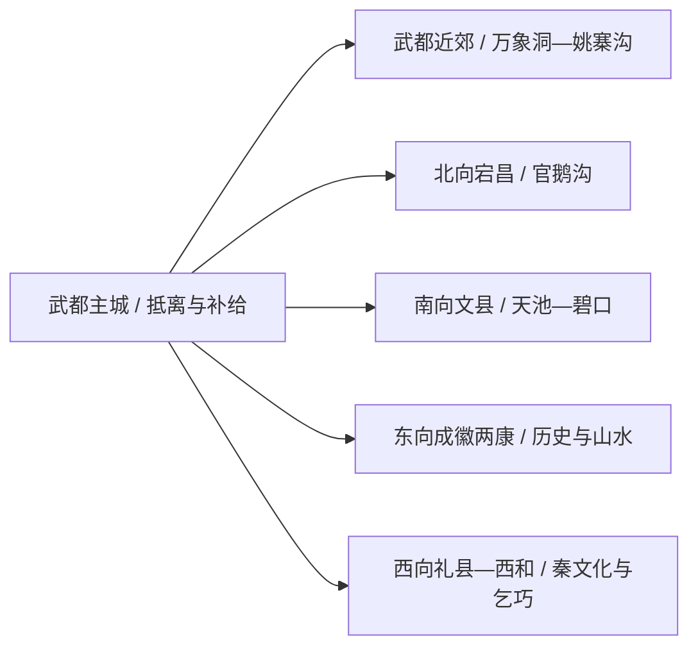
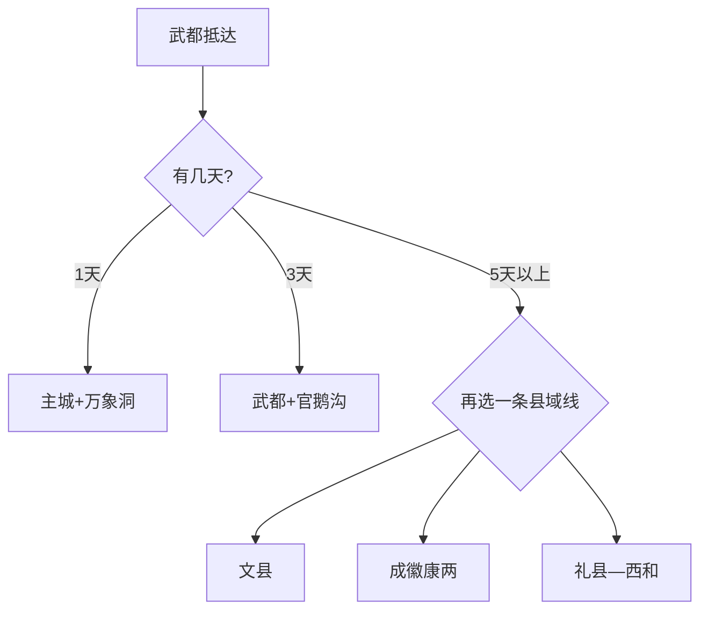

# 陇南旅行指南

陇南最实用的旅行方式，是把武都作为白龙江谷地的到达与补给基地，再在官鹅沟、文县天池、成县—徽县或康县—两当中选择一条方向。九个县区之间山路距离很长，换宿通常比每天返回武都更轻松。

> 建议停留：武都 1 天；加入一个县域方向 3 天；两条方向组合 5–7 天 
> 旅行关键词：白龙江、万象洞、官鹅沟、秦蜀古道、山地康养 
> 无障碍说明：主城公共场馆可优先询问电梯与轮椅；溶洞、峡谷、古道和县域景区的设施连续性需向官方确认

## 城市速览

| 项目 | 旅行信息 |
|---|---|
| 主要旅行价值 | 武都河谷城市、万象洞地质景观、官鹅沟山水，以及文县、成县、康县等不同山地文化 |
| 建议停留 | 1–7 天；一个远县通常占完整一天或需要换宿 |
| 舒适季节 | 春秋适合多数方向；夏季关注暴雨山洪，冬季关注高海拔结冰和景区淡季安排 |
| 预算特点 | 主城成本较稳；跨县车辆、景区交通和换宿增加预算 |
| 步行强度 | 武都主城低至中；溶洞与峡谷中高；高山和长古道高 |
| 天气风险 | 强降雨、山洪、滑坡、落石、低能见度、冬季冰雪 |
| 独行旅行 | 武都适合独行；远县提前锁返程、住宿与司机联络 |
| 亲子旅行 | 场馆、万象洞短线和成熟景区适合分段安排 |
| 长者与低体力 | 主城一馆一街；远线一天只选一个大型景区 |
| 行前重点 | 景区开放、跨县道路、末段接驳、返程班次、地灾和天气预警 |

## 城市格局与游览区域

陇南是法定地级市，代码 `621200`，辖武都区和成县、文县、宕昌、康县、西和、礼县、徽县、两当八县。武都是行政与交通核心，其他县域各自拥有住宿和景区入口。

| 区域 | 适合安排 | 怎么选择 | 时间尺度 |
|---|---|---|---|
| 武都主城 | 城市公共文化、白龙江沿岸、餐饮住宿 | 作为首晚基地，先完成交通与天气核对 | 半日至 1 天 |
| 武都近郊 | 万象洞、姚寨沟等正式开放点 | 溶洞与山谷二选一，留足末段车辆时间 | 1 天 |
| 宕昌 | 官鹅沟 5A 景区、哈达铺方向 | 适合换宿，景区与红色线路分日 | 1–2 天 |
| 文县 | 天池、碧口与白马文化方向 | 山路和活动季节差异大，按属地公告选点 | 2 天起 |
| 成县—徽县—康县—两当 | 西狭颂、嘉陵江峡谷、阳坝与红色文化 | 选择一条相邻县组合，不跨回武都折返 | 2–4 天 |
| 礼县—西和 | 秦文化、乞巧文化与县域景区 | 适合专题自驾或包车 | 2 天起 |

GeoNames `11778484` 是固定库存中的陇南城市点；法定陇南市使用 Wikidata `Q519810` 与代码 `621200`，其 `P1566=1802494` 指向另一行政记录。固定点用于定位武都主城，法定实体用于解释全市边界。

## 主要景点

### 武都与北向

| 景点 | 区域 | 类型 | 主要看点 | 建议用时 | 室内外 | 体力 | 预约风险 | 天气影响 | 优先级 |
|---|---|---|---|---:|---|---|---|---|---|
| 武都万象街区 | 武都 | 城市街区、公共文化 | 白龙江河谷城市生活、地方餐饮与当期文化活动 | 2–3 小时 | 混合 | 低 | 中 | 中 | B |
| 白龙江城市公共岸线代表段 | 武都 | 城市滨水 | 河谷城市格局与日常生活 | 1–2 小时 | 室外 | 低至中 | 低 | 高 | B |
| 万象洞景区 | 武都 | 溶洞、地质 | 喀斯特洞穴、地下景观与地质科普 | 3–5 小时 | 洞内为主 | 中高 | 高 | 中 | A |
| 姚寨沟当期开放区域 | 武都近郊 | 山谷、乡村 | 山谷生态与近郊休闲 | 半日至 1 天 | 室外 | 中高 | 高 | 很高 | B |
| 官鹅沟景区 | 宕昌县 | 5A 山水景区 | 峡谷、湖瀑、森林和羌藏文化 | 1–2 天 | 室外 | 高 | 很高 | 很高 | A |
| 哈达铺红色旅游开放单元 | 宕昌县 | 红色文化、历史街区 | 长征历史与旧址群 | 半日至 1 天 | 混合 | 中 | 高 | 中 | B |

### 南部与东部县域

| 景点 | 区域 | 类型 | 主要看点 | 建议用时 | 室内外 | 体力 | 预约风险 | 天气影响 | 优先级 |
|---|---|---|---|---:|---|---|---|---|---|
| 文县天池正式开放区域 | 文县 | 高山湖泊、森林 | 山地湖泊与森林生态 | 1 天 | 室外 | 高 | 高 | 很高 | A |
| 碧口古镇公共街区 | 文县 | 河谷古镇 | 白龙江上游商贸与山地城镇生活 | 2–4 小时 | 室外为主 | 中 | 中 | 高 | B |
| 西狭颂景区 | 成县 | 摩崖石刻、峡谷 | 汉代摩崖与山谷景观 | 4–6 小时 | 室外 | 中高 | 高 | 很高 | A |
| 阳坝正式开放景区 | 康县 | 森林、乡村 | 亚热带山地生态与乡村休闲 | 1 天 | 室外 | 中高 | 高 | 很高 | B |
| 云屏三峡正式游览区 | 两当县 | 峡谷、森林 | 嘉陵江支流峡谷与山地生态 | 1 天 | 室外 | 高 | 高 | 很高 | B |

官鹅沟按一个完整 5A 景区组织，内部沟谷、湖泊和交通节点不重复拆点；万象洞以运营入口为一处景区。自然保护地、地质公园与公众景区范围不同，路线只进入正式开放单元。

## 美食与餐饮

| 类型 | 怎么点 | 份量与过敏原 | 选择建议 |
|---|---|---|---|
| 武都洋芋搅团与面食 | 独行点一份主食加小菜 | 可能含小麦、辣椒、蒜、豆制品 | 先问辣度与配料，山路日选熟悉的小份早餐 |
| 花椒风味菜 | 2–4 人共享 | 花椒麻味明显，可能搭配牛羊肉或鸡肉 | 对麻辣敏感者请店家分开调味 |
| 橄榄油与山地蔬菜 | 按时令点炒菜或凉菜 | 凉菜注意冷链与交叉接触 | 优先选择明码标价、厨房与食材说明清楚的餐馆 |
| 县域腊肉、罐罐茶与地方小吃 | 到属地后少量尝试 | 腌腊制品盐分高；茶饮可能含乳或糖 | 远线按营业状态与返程时间就近选择 |

## 经典行程

### 一日经典路线

**路线**：武都主城 → 万象洞景区 → 返回武都用餐

- **适用条件**：景区开放、往返车辆和返程时间已确认。
- **串联逻辑**：主城短段打底，把主要体力留给溶洞。
- **预约锚点**：万象洞票务、开放区、讲解和末班接驳。
- **休息安排**：进洞前后各留一次补水和坐休。
- **时间不足时**：只保留万象洞，城市岸线改为晚间短走。

### 两日城市路线

**第 1 天**：武都万象街区 → 白龙江公共岸线 → 武都住宿 
**第 2 天**：万象洞 → 武都餐饮与返程

- **适用条件**：首日抵达时间充足，第二日景区开放。
- **串联逻辑**：先认识河谷城市，再用完整半日看地质景观。
- **预约锚点**：街区活动、万象洞与返程班次。
- **休息安排**：第二日洞外服务区和武都城区各一次。
- **时间不足时**：首日只保留岸线短段。

### 三日深度路线

**第 1 天**：武都主城与万象洞 
**第 2 天**：转场宕昌 → 官鹅沟核心游览 → 宕昌住宿 
**第 3 天**：官鹅沟余下开放段或哈达铺二选一 → 返程

- **适用条件**：官鹅沟票务、景交、住宿和道路均已确认。
- **串联逻辑**：先完成武都，再向北换宿，避免每天往返。
- **预约锚点**：官鹅沟入口、内部交通和哈达铺开放。
- **休息安排**：宕昌县城作为两晚之间的恢复点。
- **时间不足时**：第三天直接返程，保留官鹅沟完整一天。

### 雨天路线

**路线**：武都区文化馆或图书馆当期活动 → 武都城区午餐 → 住宿地休息

- **适用条件**：主城道路正常且无地灾转移要求。
- **串联逻辑**：留在武都，减少峡谷、洞穴支路和跨县移动。
- **预约锚点**：文化馆、图书馆与活动开放。
- **休息安排**：午后回住宿地休息，再决定晚间短线。
- **时间不足时**：只保留一项室内活动。

### 亲子与低体力路线

**亲子路线**：武都区文化馆或图书馆当期活动 → 午休 → 万象洞短线或城市岸线二选一 
**低体力路线**：车辆到武都万象街区 → 完整午休 → 白龙江平缓公共段

- **减负方式**：大型峡谷与远县另成一天，溶洞按中途退出条件取舍。
- **预约锚点**：电梯、轮椅、洞内台阶、卫生间和最近落客点。
- **休息安排**：主城住宿地承担午休，下午只设一个点。
- **时间不足时**：保留一项主城活动，取消洞穴或岸线。

### 远郊路线

**路线**：文县线、成县—徽县—康县—两当线、礼县—西和线三选一，沿途换宿

- **适用条件**：县域道路、住宿、景区和返程均已落实。
- **串联逻辑**：顺向连接相邻县，不跨市域来回折返。
- **预约锚点**：景区开放、道路预警、末段车辆和夜间到店。
- **休息安排**：每天只安排一个主景区，并保留半日机动。
- **时间不足时**：整条远线取消，改为武都两日。

## 住宿区域

| 区域 | 优点 | 取舍 | 适合人群 |
|---|---|---|---|
| 武都主城 | 交通、医院、餐饮和住宿集中 | 前往远县仍需长途 | 首访、短住、公共交通旅行 |
| 宕昌县城或官鹅沟入口 | 方便完整游览官鹅沟 | 与武都和其他县域方向不同 | 官鹅沟深度旅行 |
| 文县县城或碧口 | 可拆分南向山路 | 天池与碧口也有明显距离 | 文县专题、自驾 |
| 成县、康县等县城 | 便于对应景区和次日转场 | 跨县班次与夜间服务需核对 | 东向连续旅行 |

## 市内交通

- 陇南站位于武都，是主要铁路门户；成县机场与武都、成县及各景区之间仍需公路接驳。
- 武都城区使用公交、出租车和合规网约车；去万象洞、官鹅沟和各县需核客运、景区直通车或包车。
- 山区车程按实时路况估算；雨季把地灾排查、临时管制和绕行计入时间。
- 自驾用县城作为每日终点，避免在不熟悉的峡谷和山路赶夜路。

## 不同旅行者须知

| 情况 | 怎么安排 | 重点核对 |
|---|---|---|
| 独行 | 住武都，远线按正式班次或合规车辆 | 末班、叫车范围、住宿确认和信号覆盖 |
| 亲子 | 场馆、成熟景区与短步道优先 | 洞穴台阶、护栏、景交、饮水和卫生间 |
| 长者与低体力 | 一天一处大型目的地，跨县日只转场 | 落客点、观光车、台阶、休息座椅和中途退出 |
| 山地自驾 | 每天一条方向，保留机动半日 | 地灾、落石、涉水、加油充电和司机休息 |
| 生态与乡村体验 | 选正式景区、开放村落和合规接待点 | 保护地、农田、果园、茶园与私人住宅边界 |

安全与保护边界：白水江、大熊猫国家公园相关区域、自然保护区、矿山、河道、库区和施工便道均按管理边界活动；公众景区入口不代表周边保护地可以自由穿越。

## 行前核对

| 项目 | 何时核对 | 官方入口 |
|---|---|---|
| 万象洞、官鹅沟与县域景区 | 订房前、到访前一日 | [陇南市人民政府](https://www.longnan.gov.cn/)及各县区文旅公告 |
| 铁路、机场和跨县交通 | 购票时、出发前一日 | [中国铁路 12306](https://www.12306.cn/)、航司及交通部门 |
| 暴雨、山洪、滑坡和结冰 | 出发前三日起每日 | [中国气象局](https://www.cma.gov.cn/)及陇南应急、交警信息 |
| 自然保护地和水域边界 | 进入远线前 | 林草、水务、景区与属地公告 |
| 无障碍条件 | 预约与订房时 | 场馆、景区、酒店和承运方 |

## 来源与更新记录

| 来源 | 支持内容 | 核验日期 |
|---|---|---|
| [陇南市人民政府](https://www.longnan.gov.cn/) | 市情、公共服务与动态信息入口 | 2026-08-13 |
| [陇南文旅康养行动计划（2025—2027）](https://credit.longnan.gov.cn/bszc/8934230.jhtml) | 武都、官鹅沟、青龙山、县域集散与旅游服务布局 | 2026-08-13 |
| [陇南生态与文旅布局](https://credit.longnan.gov.cn/bszc/7931835.jhtml) | 官鹅沟、万象洞、文县天池、保护地与县域线路 | 2026-08-13 |
| [陇南文旅发展资料](https://credit.longnan.gov.cn/bsdt/8904103.jhtml) | 官鹅沟 5A、万象洞及重点项目 | 2026-08-13 |
| [民政部行政区划查询](https://dmfw.mca.gov.cn/xzqh/getList?code=62&trimCode=true&maxLevel=3) | `621200` 及所辖县区层级 | 2026-08-13 |
| [GeoNames 11778484](https://www.geonames.org/11778484/longnan.html) | 固定库存中的陇南城市点 | 2026-08-13 |
| [Wikidata Q519810](https://www.wikidata.org/wiki/Q519810) | 法定陇南市实体与 `P1566=1802494` | 2026-08-13 |

| 日期 | 更新 |
|---|---|
| 2026-08-13 | 首次完成陇南市指南；建立武都、官鹅沟、文县与东西县域走廊，补齐山地交通、地灾、保护地和标识粒度。 |
