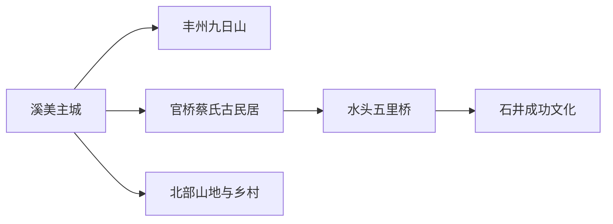
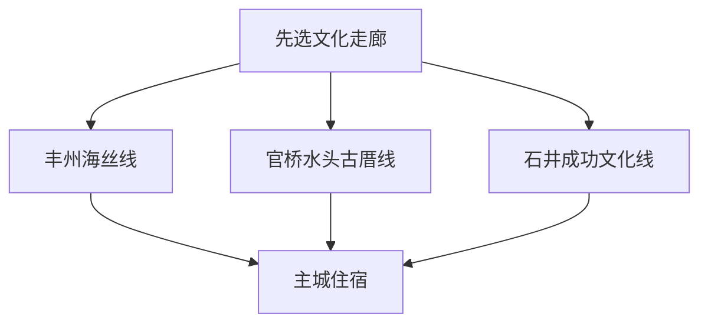

# 南安旅行指南

南安的看点分布在一座面积不小的县级市：丰州的九日山连接宋元海丝，水头—石井的五里桥与郑成功文化面向滨海侨乡，官桥的蔡氏古民居展现闽南聚落与建筑，主城则适合住宿、用餐和夜游西溪。最实用的安排是每天选择一个文化走廊，避免把北部山地和南部滨海压进同一天。

> 建议停留：2–4 天 
> 旅行关键词：九日山、五里桥、蔡氏古民居、郑成功、闽南侨乡、高甲戏 
> 主要体力：中等；山地与跨镇移动较高 
> 最近研究：2026-08-13

## 城市速览

| 项目 | 旅行信息 |
|---|---|
| 主要旅行价值 | 沿海丝世遗、侨乡古厝和成功文化理解泉州南部的闽南文化网络 |
| 建议停留 | 2 天看九日山与五里桥；3–4 天加入蔡氏古民居、石井或北部山线 |
| 较舒适季节 | 秋冬春适合步行；夏季优先早晚户外与室内场馆，台风期留弹性 |
| 预算特点 | 主城中等；跨镇车辆、讲解、研学与滨海住宿增加预算 |
| 步行强度 | 世遗点和古厝中等；山地、石板路和跨镇接驳增加负担 |
| 主要天气风险 | 台风、强降雨、高温、雷电、山洪、沿海大风与森林火险 |
| 独行旅行 | 主城和公共交通覆盖点可行，远镇先核末班与叫车 |
| 亲子旅行 | 石材自然史、非遗和正式研学较合适，古厝与山地注意台阶 |
| 长者与低体力旅行 | 五里桥短段、博物馆和车辆串联古厝更轻松 |
| 无障碍信息 | 新场馆可咨询；世遗石刻、古桥、古厝和山地设施连续性需向官方确认 |

## 城市格局与游览区域

南安是泉州市代管的县级市，法定代码 `350583`。固定 GeoNames `1789289` 名为 `Ximeicun`，对应溪美主城附近的居民点；法定城市使用 Wikidata `Q1209464`，其 `P1566=1800195` 指向另一行政记录。页面用固定点承接人口窗口，用法定代码确定溪美、丰州、官桥、水头、石井及北部乡镇的市域关系。

| 区域 | 主要内容 | 怎么安排 | 与其他区域的关系 |
|---|---|---|---|
| 溪美主城 | 西溪、成功街、公共文化、餐饮住宿 | 抵达日或夜间 | 多日线路基地 |
| 丰州—霞美 | 九日山、金鸡古港和海丝遗存 | 一日或半日 | 靠近泉州主城方向，可单独换城衔接 |
| 官桥—水头 | 蔡氏古民居、五里桥、石材自然史 | 一日 | 两镇点位多，先锁重点与车辆 |
| 石井滨海 | 郑成功文化、古港与滨海侨乡 | 一日 | 与五里桥可组合，不再叠加北部山线 |
| 北部山地与乡村 | 凤山寺、叶飞故里、观山等正式项目 | 一日 | 按单一乡镇方向安排 |
| 石材、水暖与乡村生产空间 | 工厂、矿山、码头、农田和作坊 | 参加明确开放的工业或研学项目 | 按生产安全、港区和生态管理执行 |

## 主要景点

### 海丝、古厝与城市文化

| 景点 | 区域 | 类型 | 主要看点 | 建议用时 | 室内外 | 体力 | 预约风险 | 天气影响 | 优先级 |
|---|---|---|---|---:|---|---|---|---|---|
| 九日山祈风石刻 | 丰州 | 世界遗产组成部分 | 宋元祈风石刻、海丝祭海与山林环境 | 2–4 小时 | 室外为主 | 中 | 中 | 高 | A |
| 五里桥（安平桥南安段） | 水头 | 世界遗产组成部分 | 长桥结构、海湾变迁与两岸聚落 | 2–3 小时 | 室外 | 中 | 低 | 很高 | A |
| 蔡氏古民居建筑群 | 官桥 | 国保与侨乡建筑 | 闽南红砖古厝、家族与侨乡文化 | 2–4 小时 | 混合 | 中 | 高 | 中 | A |
| 南安市公共文化场馆 | 溪美 | 文博与文化 | 地方历史、郑成功、非遗和当期展览 | 1–3 小时 | 室内 | 低 | 中 | 低 | B |
| 成功街—西溪公共空间 | 溪美 | 城市街区 | 城市夜游、餐饮与日常生活 | 1–3 小时 | 混合 | 低 | 中 | 中 | B |

### 石井、自然史与乡镇文化

| 景点 | 区域 | 类型 | 主要看点 | 建议用时 | 室内外 | 体力 | 预约风险 | 天气影响 | 优先级 |
|---|---|---|---|---:|---|---|---|---|---|
| 郑成功纪念馆与文化旅游区 | 石井 | 纪念馆与文化 | 郑成功生平、海防与两岸历史 | 2–4 小时 | 混合 | 中 | 中 | 中 | A |
| 英良石材自然历史博物馆 | 水头方向 | 自然史博物馆 | 石材、化石与地球历史展陈 | 2–3 小时 | 室内 | 低 | 高 | 低 | A |
| 岑兜高甲戏户外博物馆 | 石井方向 | 非遗与村落 | 高甲戏源流、村落和当期演出 | 2–4 小时 | 混合 | 中 | 很高 | 高 | B |
| 诗山凤山寺正式开放区 | 诗山 | 宗教与历史建筑 | 闽南宗教建筑、地方信俗与山景 | 半日 | 混合 | 中 | 中 | 高 | B |
| 叶飞故里红色旅游区 | 金淘方向 | 红色文化 | 叶飞生平、故居与闽南革命史 | 半日至一日 | 混合 | 中 | 高 | 中 | B |

九日山和五里桥各作为“泉州：宋元中国的世界海洋商贸中心”的独立组成部分记录，不把同一遗产点内部石刻、桥段再拆成景点。蔡氏古民居仍在保护与修缮进程中，参观范围以当期入口为准；滨海湿地、港区和石材生产区使用公共游览与正式接待动线。

## 美食与餐饮

| 菜品或餐饮类型 | 常见区域 | 一个人用餐与常见份量 | 风味、过敏原与饮食限制 | 排队风险与替代方法 |
|---|---|---|---|---|
| 官桥牛肉羹 | 官桥及主城 | 一碗适合一人 | 牛肉、淀粉、胡椒和高汤常见 | 午餐高峰换同类小吃店 |
| 官桥烧肉粽 | 官桥 | 一个可试味 | 糯米、猪肉、香菇、花生或蛋黄常见 | 先问馅料与是否含花生 |
| 石井海蛎煎 | 石井、水头 | 一份可共享 | 海鲜、鸡蛋、薯粉和油脂 | 海鲜过敏者改选米粉或蔬菜 |
| 石井头水紫菜与海味 | 石井正规餐馆、商店 | 菜品共享，干货适合买小包 | 海产品、盐分和甲状腺饮食限制需考虑 | 查看产地、生产日期和保存 |
| 英都麻糍、炸枣等闽南点心 | 主城、乡镇市集 | 小份容易尝试 | 糯米、糖、花生、芝麻和油炸食品常见 | 活动市集结束后在正规店找同类 |

## 经典行程

### 一日经典路线

**路线**：九日山 → 丰州午餐 → 溪美公共文化场馆 → 成功街或西溪夜游

- **串联逻辑**：从海丝遗产进入，再回主城补地方背景和晚间生活。
- **预约锚点**：九日山、场馆与夜游项目。
- **休息安排**：丰州或主城午餐，下午场馆内休息。
- **时间不足时**：保留九日山和主城晚餐。

### 两日城市路线

**第 1 天**：九日山 → 溪美主城。 
**第 2 天**：蔡氏古民居 → 午餐 → 五里桥。

- **串联逻辑**：第一天看海丝起点，第二天沿官桥—水头看侨乡建筑与海湾交通。
- **预约锚点**：古民居开放范围、五里桥活动与车辆。
- **休息安排**：两晚住主城或第二晚住水头。
- **时间不足时**：第二天在古民居和五里桥中择一。

### 三日深度路线

**第 1 天**：九日山与主城。 
**第 2 天**：蔡氏古民居—英良石材自然历史博物馆—五里桥。 
**第 3 天**：郑成功纪念馆—石井滨海公共空间—岑兜当期活动。

- **串联逻辑**：三天分别处理海丝、侨乡建筑和成功文化，不跨回北部山地。
- **预约锚点**：博物馆、古民居、岑兜演出与车辆。
- **休息安排**：水头或石井固定午餐，场馆中段休息。
- **时间不足时**：先删岑兜，再删第三天。

### 雨天路线

**路线**：英良石材自然历史博物馆 → 室内午餐 → 南安市公共文化场馆

- **适用条件**：道路正常；台风或暴雨预警升级时留在住宿附近。
- **预约锚点**：两座场馆与跨镇车辆。
- **休息安排**：馆内休息，午餐不跨片区追店。
- **时间不足时**：只保留一座博物馆。

### 亲子或低体力路线

**亲子路线**：石材自然历史博物馆 → 午餐 → 五里桥短段或正式非遗体验。 
**低体力路线**：车辆到公共文化场馆 → 午休 → 五里桥平缓短段。

- **减负方式**：亲子线用室内自然史减少暑热；低体力线控制古厝台阶和跨镇次数。
- **预约锚点**：亲子活动、落客点、卫生间和座椅。
- **休息安排**：水头或主城商业区。
- **时间不足时**：两类路线都保留博物馆。

### 远郊一日路线

**路线**：主城 → 凤山寺、叶飞故里或北部乡村正式项目三选一 → 乡镇午餐 → 返回

- **适用条件**：开放、天气、车辆和返程已确认。
- **预约锚点**：场馆、讲解、乡村接待和森林火险。
- **休息安排**：使用镇区或景区正式服务点。
- **时间不足时**：整段改为九日山—主城线。

## 住宿区域

| 区域 | 优点 | 缺点 | 适合人群 | 交通特点 |
|---|---|---|---|---|
| 溪美主城 | 餐饮、夜间生活与跨镇车辆选择多 | 距石井、水头和北部远点都有车程 | 首访、独行、多日换方向 | 适合作统一基地 |
| 水头—官桥 | 靠近古民居、五里桥与石材馆 | 到九日山和北部山线较远 | 古建、自然史和自驾 | 适合连续两天南部线路 |
| 石井 | 靠近成功文化和滨海 | 海风、台风和夜间交通需核对 | 滨海、摄影、慢节奏 | 核对返程与跨镇车辆 |
| 乡镇正式民宿 | 靠近单一乡村或山地项目 | 营业、餐饮和公共交通有限 | 已锁定远线者 | 先确认资质、停车和退改 |

## 市内交通

| 场景 | 建议与取舍 | 行前需要重查的内容 |
|---|---|---|
| 铁路抵达 | 按车票站名选择南安北等到站，再用地面交通进入对应片区 | 车次、站口、目的地距离和末班 |
| 跨镇移动 | 公交、定制客运、出租或正规包车组合，日程按一个走廊设计 | 线路、节假日专线、最晚返程和叫车覆盖 |
| 泉州联程 | 九日山靠近泉州主城方向，仍按跨行政城市计算交通与住宿 | 到发点、行李和返程余量 |
| 自驾 | 对官桥—水头—石井或北部乡镇更灵活 | 停车、台风暴雨、山路和节庆管制 |

## 不同旅行者须知

| 旅行维度 | 可行条件 | 主要取舍 | 需额外核对 |
|---|---|---|---|
| 独行旅行 | 主城与公交覆盖点容易组合 | 跨镇末班和夜间叫车减少 | 返程、住宿前台和活动最低人数 |
| 亲子旅行 | 自然史、非遗和短桥段较合适 | 古厝台阶、暑热与长车程消耗体力 | 年龄、监护、卫生间和防晒 |
| 长者或低体力旅行 | 车辆串联场馆和短段遗产点 | 九日山坡道、古厝门槛和石桥距离 | 落客点、座椅和接驳 |
| 无障碍需求 | 新场馆可提前咨询 | 世遗点、古厝和山地连续通行有限 | 设施连续性需向官方确认 |
| 摄影旅行 | 公共遗产点和村落街巷适合 | 宗教、古厝居民生活和无人机按规则 | 三脚架、航拍和商业拍摄 |
| 工业兴趣 | 正式工业观光可理解石材与水暖产业 | 矿山、切割线、港区和仓储有安全边界 | 企业接待、保险、防护与摄影 |

## 行前核对

| 核对事项 | 为什么需要重查 | 建议核对时间 | 官方入口 |
|---|---|---|---|
| 世遗点与古民居 | 维护、活动和修缮影响开放范围 | 排入路线前及到访前一日 | [南安市人民政府](https://www.nanan.gov.cn/) |
| 公交与文旅专线 | 节假日专线和末班会变化 | 出发前一周及当天 | [南安市交通运输局](https://www.nanan.gov.cn/zwgk/zfxxgkzl/bmzfxxgk/jtysj/) |
| 台风与天气 | 台风、强降雨和高温影响遗产点与滨海 | 出发前三日及当天 | [福建省气象局](https://fj.cma.gov.cn/) |
| 铁路 | 车次和站点按日期变化 | 出发前一周及当天 | [中国铁路 12306](https://www.12306.cn/) |

## 来源与更新记录

### 主要来源

| 来源 | 类型 | 支持内容 | 核验日期 |
|---|---|---|---|
| [南安概况](https://www.nanan.gov.cn/zjna/nagk/) | 属地政府 | 行政、海丝、国保单位与城市背景 | 2026-08-13 |
| [南安文旅资源提案答复](https://www.nanan.gov.cn/zwgk/jyta/xyta/202506/t20250625_3183125.htm) | 属地政府 | 九日山、五里桥、蔡氏古民居和乡村线路 | 2026-08-13 |
| [2026 精品旅游线路实施方案](https://www.nanan.gov.cn/zwgk/zfxxgkzl/zfxxgkml/qxjzyfjjshjzdkwdglsyhfpqk/202604/t20260429_3287709.htm) | 属地政府 | 一城两山三水线路、餐饮、住宿和项目状态 | 2026-08-13 |
| [2026 交通与旅游协办答复](https://www.nanan.gov.cn/zwgk/zfxxgkzl/bmzfxxgk/jtysj/zfxxgkml/202603/t20260326_3278164.htm) | 交通主管部门 | 运游融合、包车和景点接驳 | 2026-08-13 |
| [2026 五一文旅活动](https://www.nanan.gov.cn/zwgk/xwzx/nayw/202604/t20260428_3287126.htm) | 属地政府 | 当期场馆、景区与活动核对 | 2026-08-13 |
| [GeoNames 1789289](https://www.geonames.org/1789289/) | 开放地名库 | 固定溪美居民点与坐标 | 2026-08-13 |
| [Wikidata Q1209464](https://www.wikidata.org/wiki/Q1209464) | 开放知识库 | 法定南安市与另一行政记录 | 2026-08-13 |

### 更新记录

| 日期 | 更新内容 |
|---|---|
| 2026-08-13 | 首次建立南安独立指南；按溪美、丰州、官桥—水头、石井和北部乡镇组织，并明确世遗点去重及石材、港区、乡村生产边界。 |
