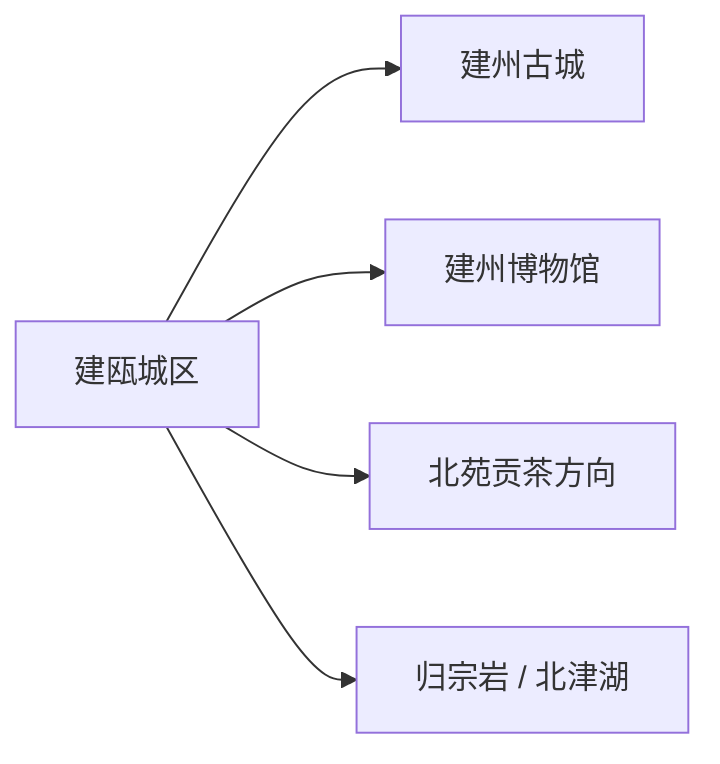
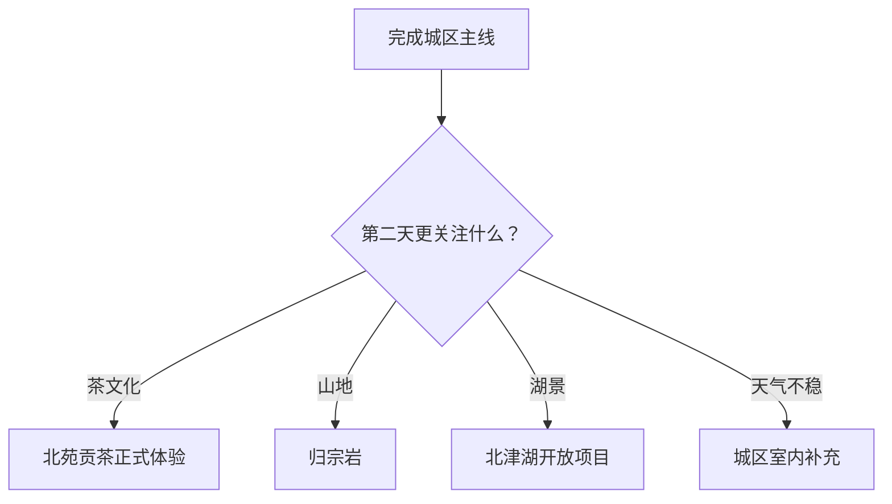

# 建瓯旅行指南

建瓯是闽北历史城市，适合从建州古城格局、地方博物馆、北苑贡茶与笋竹饮食认识。首访把建州古城和建州博物馆放在同一天，再按预约与天气选择北苑贡茶、归宗岩或北津湖方向；古城更新中的开放街巷和文保修缮状态以属地公告为准。

## 城市速览

| 项目 | 信息 |
|---|---|
| 旅行主线 | 建州古城、建州博物馆、北苑贡茶文化、归宗岩与北津湖方向 |
| 建议停留 | 城区 1 天；茶文化或山水方向各加半日至 1 天 |
| 住宿基地 | 城区便于古城、餐饮、铁路公路与多方向接驳 |
| 步行强度 | 古城低至中；山地中至高；夏季湿热会增加负担 |
| 主要天气 | 春夏多雨、台风外围影响、高温、山洪地质灾害与冬季湿冷 |
| 预约核心 | 博物馆、文保建筑、茶文化体验、景区开放和县域车辆 |
| 边界重点 | 文保修缮区、茶园与竹林生产地、水库、林场和宗教空间按开放范围活动 |
| 无障碍 | 新馆先问电梯和轮椅；古城街巷与山地逐段核对坡道、台阶和卫生间 |

## 城市格局与游览区域

建瓯市是南平市代管的县级市，法定代码 `350783`。GeoNames `1806167` 与 Wikidata `Q1374860` 精确对应建瓯市。南平主城、武夷山和邵武各有独立页面；本页聚焦建瓯城区与市域方向。

| 区域 | 旅行价值 | 怎么安排 |
|---|---|---|
| 建州古城片区 | 城门、街巷、历史建筑与城市生活 | 半日至一日步行 |
| 建州博物馆片区 | 建州历史、考古与地方文物 | 先预约，留 2–3 小时 |
| 北苑贡茶方向 | 宋代贡茶文化、茶园与制茶体验 | 有正式接待时留半日至一日 |
| 归宗岩方向 | 山石、森林与历史文化 | 天气稳定时独立安排 |
| 北津湖等水域 | 湖库景观与当期开放项目 | 先核对入口、水位与船艇 |

## 主要景点

| 景点 | 所在区域 | 类型 | 核心看点 | 建议用时 | 室内/室外 | 体力 | 预约难度 | 天气敏感度 | 适合旅程 |
|---|---|---|---|---|---|---|---|---|---|
| 建州古城公开街区 | 城区 | 历史街区 | 古城格局、城门文脉、传统街巷与城市更新 | 3–5 小时 | 混合 | 中 | 中 | 高 | A |
| 建州博物馆 | 城区 | 地方博物馆 | 建州历史、地方考古与文物展陈 | 2–3 小时 | 室内 | 低 | 中高 | 低 | A |
| 北苑贡茶文化公开点 | 市域茶区 | 茶文化与农业 | 北苑贡茶历史、茶园和合规制茶体验 | 3–6 小时 | 混合 | 中 | 高 | 高 | A |
| 归宗岩正式开放区 | 山地方向 | 山地与历史文化 | 山石、森林、摩崖与当期开放游线 | 4–6 小时 | 室外 | 中至高 | 高 | 极高 | B |
| 北津湖正式开放项目 | 水域方向 | 湖库与休闲 | 湖面景观与当期岸上或船艇项目 | 半日至 1 天 | 室外为主 | 中 | 高 | 极高 | B |

建州古城仍包含居民生活、文物保护与更新施工空间，游览选择公开街巷、场馆和标识清楚的建筑。北苑茶区以正规经营者的茶园、工坊和体验边界为准；北津湖水利设施、养殖区和林地生产道路维持原有用途。

## 美食与餐饮

| 类型 | 适合场景 | 份量 | 过敏与饮食提示 | 怎么选 |
|---|---|---|---|---|
| 建瓯光饼 | 早餐或点心 | 单个易尝试 | 小麦、芝麻、猪肉或葱馅 | 先问馅料和出炉时间 |
| 建瓯板鸭 | 正餐或伴手礼 | 多适合分享 | 鸭肉、盐、香料与储存 | 看生产信息、熟制方式和小份 |
| 笋竹家常菜 | 城区正餐 | 可单点小份 | 纤维、腌制盐分、肉汤和共锅 | 选择当季鲜笋并问汤底 |
| 闽北扁肉与粉面 | 早餐简餐 | 一人份 | 猪肉、小麦、蛋和大豆调味 | 询问汤底、皮料与辣度 |
| 北苑茶 | 茶馆或正规体验 | 可单人 | 咖啡因与空腹饮茶 | 看产地、年份、冲泡与明码标价 |

## 经典行程

### 一日经典路线

**路线**：建州博物馆 → 午餐 → 建州古城公开街巷 → 晚餐

- **串联逻辑**：先用博物馆建立历史背景，再读古城空间。
- **预约锚点**：博物馆与古城建筑开放。
- **休息安排**：午餐长休，古城只走核心街巷。
- **时间不足时**：保留博物馆和一段古城主街。

### 两日城市路线

**第 1 天**：博物馆—建州古城 
**第 2 天**：北苑贡茶正式体验

- **串联逻辑**：城市史与茶文化分日。
- **预约锚点**：茶园或工坊接待、车辆和天气。
- **休息安排**：茶区正午在服务点休息。
- **时间不足时**：删除第二日外围参观。

### 茶文化路线

**路线**：城区 → 北苑贡茶公开点 → 茶文化讲解 → 午餐 → 合规制茶或品饮体验 → 返回

- **适用条件**：经营主体、活动和交通已确认。
- **预约锚点**：采制季、课程、费用与成品邮寄。
- **休息安排**：避免空腹浓茶，安排饮水和午餐。
- **时间不足时**：保留讲解与一次品饮。

### 雨天路线

**路线**：建州博物馆 → 午餐 → 古城当日开放的室内展陈

- **适用条件**：普通降雨且城市交通正常；地质灾害预警时留在城区。
- **预约锚点**：场馆开放与古城施工信息。
- **休息安排**：馆内座椅与室内餐饮。
- **时间不足时**：只留博物馆。

### 亲子路线

**路线**：建州博物馆 → 午休 → 茶文化基础体验

- **串联逻辑**：地方史与可操作的茶文化形成学习闭环。
- **预约锚点**：儿童课程、工具、食品过敏与卫生间。
- **休息安排**：体验控制在两小时内。
- **时间不足时**：保留博物馆。

### 低体力路线

**路线**：车辆到达建州博物馆 → 午餐长休 → 古城近入口平缓短段

- **串联逻辑**：以室内场馆为主，用车辆减少连续步行。
- **预约锚点**：落客、电梯、轮椅与古城路面。
- **休息安排**：每处只看核心内容。
- **时间不足时**：只留博物馆。

### 山水延伸路线

**路线**：城区 → 归宗岩或北津湖二选一 → 服务点午休 → 返回

- **适用条件**：入口、天气、道路和运营明确。
- **预约锚点**：景区开放、船艇、停车与最晚返程。
- **休息安排**：选择可中途退出的短线。
- **时间不足时**：整段删除，改走城区。

## 住宿区域

| 区域 | 优点 | 取舍 | 适合人群 | 核对项 |
|---|---|---|---|---|
| 建瓯城区 | 古城、餐饮和交通方便 | 去茶区山水仍需车辆 | 首访、无车、多日旅行 | 车站接驳、停车、隔音和早餐 |
| 古城周边 | 便于早晚步行 | 老建筑设施和停车差异大 | 历史街区、摄影 | 合法经营、消防、台阶和夜间噪声 |
| 乡村正规住宿 | 接近单一茶区或山水方向 | 选择少、返程弹性低 | 自驾、茶文化慢游 | 供餐、通信、消防与退改 |

## 市内交通

建瓯可由铁路和公路抵达，城区内适合公交、出租车与分段步行。北苑茶区、归宗岩和北津湖分处不同方向，县域日优先使用自驾或正规包车。

| 场景 | 怎么做 | 行前核对 |
|---|---|---|
| 铁路到达 | 看清票面完整站名，再转城区 | 车次、站前公交与夜间叫车 |
| 古城—博物馆 | 公交、出租与短步行组合 | 开放入口、施工和高温避让 |
| 前往茶区山水 | 每天一个方向，提前约正规车辆 | 地址、停车、返程和天气 |
| 与南平联游 | 建瓯按独立住宿与交通处理 | 到站名、跨城时间和最后一段接驳 |

## 不同旅行者须知

| 旅行者 | 推荐做法 | 重点核对 |
|---|---|---|
| 独行 | 住城区，远线预约正规车辆 | 返程、司机资质和通信 |
| 亲子 | 博物馆加茶文化短体验 | 热水、工具、过敏和卫生间 |
| 长者与低体力 | 场馆加古城短段 | 门槛、坡道、轮椅和座椅 |
| 摄影 | 古城清晨与茶区分日 | 文保摄影、三脚架、无人机和返程 |
| 自驾 | 每天一条远线 | 山路、停车、充电和疲劳驾驶 |

## 行前核对

- 建瓯市、南平市与福建省文旅信息：场馆、古城、景区和活动。
- 博物馆、茶文化与景区运营方：开放、预约、讲解、停车和退改。
- 福建气象、水利、林业与应急信息：暴雨、台风、地质灾害与火险。
- 中国铁路 12306：车次、完整站名与退改。

## 来源与更新记录

| 来源 | 支持内容 | 核验日期 |
|---|---|---|
| [福建省政府：建州博物馆](https://www.fujian.gov.cn/zwgk/ztzl/sxzygwzxsgzx/sdjj/wvjj/202311/t20231113_6293681.htm) | 博物馆定位、建筑与地方历史展陈 | 2026-09-01 |
| [建瓯市人大：历史文化名城保护与文旅发布](https://www.josrd.gov.cn/doc/release?resourceId=dc69323666e6ca3&resourceType=3) | 建州古城、北苑贡茶与主题线路 | 2026-09-01 |
| [福建省住建厅：建州古城保护与更新](https://zjt.fj.gov.cn/xxgk/gzdt/bmdt/202605/t20260511_7146650.htm) | 古城保护、博物馆、非遗与饮食的当前进展 | 2026-09-01 |
| [Wikidata Q1374860](https://www.wikidata.org/wiki/Q1374860) | 建瓯市实体与 `P1566=1806167` | 2026-09-01 |
| [GeoNames 1806167](https://www.geonames.org/1806167/) | 固定建瓯城市点 | 2026-09-01 |
| [中国铁路 12306](https://www.12306.cn/) | 动态车次与购票 | 2026-09-01 |
| [福建省气象局](http://fj.cma.gov.cn/) | 气象预警 | 2026-09-01 |

| 日期 | 更新 |
|---|---|
| 2026-09-01 | 首次完成建州古城、建州博物馆、北苑贡茶及山水方向研究。 |
