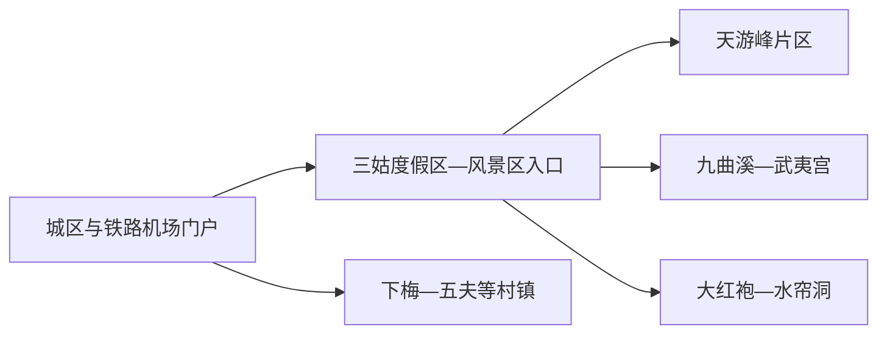
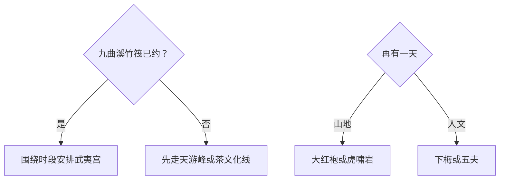

# 武夷山旅行指南

武夷山适合按“风景区核心、茶文化、历史村镇、国家公园公开游憩”四层来选。首访两天可把天游峰与九曲溪—武夷宫分开安排；第三天再选大红袍—水帘洞、下梅古村或五夫朱子文化。国家公园、世界遗产地、风景名胜区和县级武夷山市不是同一个边界，票务与准入也应逐项核对。

> 建议停留：2–4 天；风景区核心至少留两个完整白天 
> 旅行关键词：天游峰、九曲溪、武夷宫、岩茶、世界遗产、国家公园 
> 主要体力：竹筏低至中等；天游峰、虎啸岩等中高 
> 最近研究：2026-08-13

## 城市速览

| 项目 | 旅行信息 |
|---|---|
| 主要旅行价值 | 在丹霞山水、九曲溪、宋明理学、岩茶生产和世界遗产保护之间形成完整旅行 |
| 建议停留 | 2 天完成天游峰与九曲溪；3–4 天加入茶线、下梅或五夫 |
| 较舒适季节 | 春秋适合步行；夏季注意高温雷雨；冬季和汛期按水位与开放选择 |
| 预算特点 | 景区联票、竹筏、观光交通、演出和茶体验是主要变量 |
| 步行强度 | 天游峰和山地中高；九曲溪竹筏本身较低但码头换乘仍需步行 |
| 主要天气风险 | 暴雨、山洪、雷电、高温、大雾、强风、森林火险和湿滑石阶 |
| 独行旅行 | 景区交通较成熟，竹筏和远村仍需提前锁定名额与返程 |
| 亲子旅行 | 九曲溪、武夷宫、茶文化和短步道可组合；山地按年龄体力取舍 |
| 长者与低体力旅行 | 以九曲溪、武夷宫、茶博园和车辆接驳为主 |
| 无障碍信息 | 现代游客中心可先咨询；古村、竹筏码头和山地设施连续性需向官方确认 |

## 城市格局与游览区域

武夷山市是南平市代管的县级市，法定代码 `350782`。GeoNames `1922014` 与 Wikidata `Q94945` 的 `P1566` 精确对应，点记录定位主城，页面按完整县级市组织。南平市站位于建阳区，武夷山北站、武夷山机场、三姑度假区、风景区入口和传统城区是不同交通节点。

| 区域 | 主要内容 | 游览特点 | 与其他区域的关系 |
|---|---|---|---|
| 城区与交通门户 | 传统城区、武夷山北站、机场及公共服务 | 到离功能强，需继续接驳景区 | 不把“到武夷山”理解为已到检票口 |
| 三姑旅游度假区 | 住宿、餐饮、演出和景区接驳 | 最适合连续住两晚 | 与多个景区入口仍有地面交通 |
| 天游峰—云窝片区 | 天游峰、云窝等同一景区内部游线 | 登高和石阶集中 | 单独半日至一日 |
| 星村—九曲溪—武夷宫 | 竹筏码头、九曲溪和下筏后的武夷宫 | 以竹筏时段和水情为锚 | 可与武夷宫顺序组合 |
| 大红袍—水帘洞片区 | 岩茶景观、步道与相关人文节点 | 步行较长、日晒和雨湿明显 | 另留半日至一日 |
| 下梅—五夫等村镇 | 古村、朱子文化、茶与乡村生活 | 公路往返、接待与活动需核 | 从风景区抽离成独立半日或一日 |

武夷山国家公园跨福建、江西两省，福建片区也跨武夷山市、建阳、光泽和邵武。普通游客选择国家公园管理机构发布的游憩线路和访客入口；核心保护区、科研监测地、未开放林道与茶园生产区按保护和经营规则使用。

## 主要景点

### 风景区核心

| 景点 | 区域 | 类型 | 主要看点 | 建议用时 | 室内外 | 体力 | 预约风险 | 天气影响 | 优先级 |
|---|---|---|---|---:|---|---|---|---|---|
| 天游峰—云窝完整游览单元 | 天游峰片区 | 丹霞山地、世界遗产 | 九曲溪中段视野、丹霞地貌与公开步道 | 4–7 小时 | 室外 | 高 | 很高 | 很高 | A |
| 九曲溪竹筏—武夷宫 | 星村至武夷宫 | 水上游览、历史建筑 | 九曲溪山水、正规竹筏和武夷宫历史空间 | 4–7 小时 | 室外为主 | 中 | 极高 | 极高 | A |
| 大红袍—水帘洞公开游线 | 风景区北部 | 茶文化、山地步道 | 岩茶景观、摩崖与公开步道；内部节点合计一次 | 4–7 小时 | 室外 | 中高 | 高 | 很高 | A |
| 虎啸岩—一线天公开游线 | 风景区南部 | 丹霞、洞隙、登高 | 岩壁、狭窄游线与山地视野 | 4–7 小时 | 室外 | 高 | 高 | 很高 | B |

### 城市、村镇与茶文化

| 景点 | 区域 | 类型 | 主要看点 | 建议用时 | 室内外 | 体力 | 预约风险 | 天气影响 | 优先级 |
|---|---|---|---|---:|---|---|---|---|---|
| 中华武夷茶博园及正式茶文化活动 | 三姑方向 | 茶文化、展陈 | 岩茶历史、制作与当期演艺或展览 | 2–4 小时 | 混合 | 低至中 | 高 | 中 | B |
| 下梅古村公开游览区 | 下梅村 | 历史村落、茶路 | 古村格局、茶商历史和居民生活 | 3–5 小时 | 混合 | 中 | 高 | 高 | B |
| 五夫朱子文化公开点 | 五夫镇 | 历史村镇、理学 | 朱子文化、古村与正式开放场馆 | 4–7 小时 | 混合 | 中 | 很高 | 高 | C |
| 国家公园当期公开游憩线路 | 管理机构公布入口 | 自然教育、生态 | 生物多样性、茶园文化与生态游憩 | 5–9 小时 | 室外 | 中高 | 极高 | 极高 | C |

天游峰、九曲溪、武夷宫、大红袍和一线天同属武夷山风景区的不同片区，行程按完整片区而非每个小景观计数。茶园首先是生产空间；体验采制、进入工坊或拍摄作业人员时，选择经营者明确接待的项目。

## 美食与餐饮

| 菜品或餐饮类型 | 常见区域 | 一个人用餐与常见份量 | 风味、过敏原与饮食限制 | 排队风险与替代方法 |
|---|---|---|---|---|
| 岚谷熏鹅 | 城区、度假区正规餐馆 | 适合分享，可问小份 | 禽肉、辣椒、烟熏和盐分 | 选明码标价的同类熟食或餐馆 |
| 朱子孝母饼等茶点 | 城区、度假区 | 小份适合尝试 | 小麦、糖、蛋奶、芝麻或坚果 | 先看配料表 |
| 笋菜、菌菇与山地家常菜 | 正规餐馆 | 适合共享 | 时令来源、动物油和误采风险 | 只选可说明来源的食材 |
| 岩茶体验 | 茶馆、正式茶企 | 按泡品饮 | 咖啡因、空腹刺激和销售压力 | 先确认价格、克数和购买自愿性 |

## 经典行程

### 一日经典路线

**路线**：天游峰—云窝公开游线 → 午餐与坐休 → 三姑度假区轻量茶文化

- **串联逻辑**：把代表性山地放在体力最好的上午，下午回服务成熟片区。
- **预约锚点**：风景区门票、入园时段、入口和景区交通。
- **休息安排**：下山后完整午休，下午只选一项轻量内容。
- **时间不足时**：保留天游峰主线。

### 两日城市路线

**路线**：第 1 天游峰—云窝。 
**第 2 天**：星村码头 → 九曲溪竹筏 → 武夷宫 → 度假区休息。

- **串联逻辑**：山地与水上分日，第二天按竹筏时段顺流到武夷宫。
- **预约锚点**：竹筏实名、时段、码头、天气和返程交通。
- **休息安排**：两天午后都保留坐休，第二天在下筏后再决定延伸。
- **时间不足时**：第二天保留竹筏和武夷宫核心。

### 三日深度路线

**路线**：第 1 天游峰。 
**第 2 天**：九曲溪—武夷宫。 
**第 3 天**：大红袍—水帘洞或下梅古村二选一。

- **串联逻辑**：前两天完成山水核心，第三天按茶山步道或历史村落补充。
- **预约锚点**：第三日入口、活动、车辆和返程。
- **休息安排**：茶线在正式服务点补水，村落线在正规餐饮点午休。
- **时间不足时**：删除第三天。

### 雨天路线

**路线**：茶博园当期室内展陈 → 午餐 → 正式茶文化体验或城区公共文化空间

- **适用条件**：普通降雨且道路正常；暴雨、雷电和山洪预警时留在住宿附近。
- **串联逻辑**：用茶文化和室内展陈替代竹筏与山地。
- **预约锚点**：场馆、体验和演出开放。
- **休息安排**：馆内与餐饮区。
- **时间不足时**：只留茶博园核心展陈。

### 亲子或低体力路线

**亲子路线**：武夷宫短线 → 午餐 → 茶博园精选展陈。 
**低体力路线**：车辆到武夷宫最近落客点 → 核心历史空间 → 午餐长休 → 度假区返回。

- **减负方式**：亲子线减少山地与长讲解；低体力线取消天游峰和狭窄步道。
- **预约锚点**：儿童票、婴儿车、落客点、轮椅和卫生间。
- **休息安排**：每个主点后坐休。
- **时间不足时**：两线均保留武夷宫或茶博园之一。

### 远郊一日路线

**路线**：住宿区 → 下梅古村或五夫镇二选一 → 正式开放文化点 → 原路返回

- **适用条件**：场馆、车辆、天气和返程明确。
- **串联逻辑**：只选一个村镇，完整理解茶路或朱子文化。
- **预约锚点**：开放点、讲解、停车和活动。
- **休息安排**：正规村镇餐饮点午休。
- **时间不足时**：改为度假区茶文化半日。

## 住宿区域

| 区域 | 优点 | 缺点 | 适合人群 | 交通特点 |
|---|---|---|---|---|
| 三姑旅游度假区 | 餐饮、住宿和景区接驳集中 | 旺季价格与人流较高 | 首访、连续两天风景区 | 核对与实际入口的交通 |
| 武夷山市城区 | 日常餐饮和生活便利 | 到风景区需接驳 | 慢住、预算控制、铁路联程 | 公交或车辆连接景区 |
| 星村正规住宿 | 便于早到竹筏码头 | 夜间服务和替代活动较少 | 已锁定早班竹筏者 | 订房前匹配码头和退改 |
| 下梅／五夫正规民宿 | 村镇体验完整 | 到核心景区距离增加 | 文化专题、自驾 | 先核夜间交通与次日返程 |

## 市内交通

| 场景 | 建议与取舍 | 行前需要重查的内容 |
|---|---|---|
| 高铁抵达 | 武夷山北站或南平市站按票面和接驳选择 | 车次、武夷有轨电车、公交和末班 |
| 航空抵达 | 武夷山机场到城区或度假区继续地面接驳 | 航班、航站楼、机场交通和天气 |
| 风景区内部 | 先锁入口和当日片区，再用景区交通 | 观光车、站点、末班和检修 |
| 竹筏与村镇 | 竹筏按星村码头时段；村镇另约车辆 | 集合点、迟到规则、返程和停车 |

## 不同旅行者须知

| 旅行维度 | 可行条件 | 主要取舍 | 需额外核对 |
|---|---|---|---|
| 独行旅行 | 度假区和核心景区服务成熟 | 竹筏名额、村镇晚返需先锁 | 实名票、末班和正规车辆 |
| 亲子旅行 | 竹筏、武夷宫和茶文化易组合 | 山地、狭窄步道与临水持续看护 | 年龄、救生设备和儿童票 |
| 长者或低体力旅行 | 武夷宫、茶博园和车辆短线可行 | 天游峰、虎啸岩和长步道减量 | 落客点、座椅、景区车 |
| 无障碍需求 | 现代游客中心和度假区优先咨询 | 码头、古建、村落和山地转换多 | 设施连续性需向官方确认 |
| 摄影旅行 | 丹霞、溪流、茶园和村落题材丰富 | 文保、居民生活和无人机规则优先 | 禁飞、三脚架和商业拍摄 |
| 国家公园与茶园 | 公开游憩和正式茶体验可行 | 生态保护与生产经营优先 | 访客入口、采摘、拍摄和防火 |

## 行前核对

| 核对事项 | 为什么需要重查 | 建议核对时间 | 官方入口 |
|---|---|---|---|
| 风景区门票、入口和竹筏 | 实名、时段、联票、码头和水情变化明显 | 订票前及当天 | [武夷山国家公园](https://wysgjgy.fujian.gov.cn/) |
| 国家公园游憩与保护边界 | 公开线路、防火和科研区域会调整 | 山地日前一周及当天 | [游客安全须知](https://wysgjgy.fujian.gov.cn/aqxz/ykaq/) |
| 铁路、有轨电车与航空 | 时刻、站点和接驳会变化 | 购票前及当天 | [中国铁路12306](https://www.12306.cn/) |
| 天气、水位和森林火险 | 影响竹筏、步道和村镇道路 | 出发前三日及当天 | [福建省气象局](http://fj.cma.gov.cn/) |

## 来源与更新记录

### 主要来源

| 来源 | 类型 | 支持内容 | 核验日期 |
|---|---|---|---|
| [武夷山国家公园：天游峰](https://wysgjgy.fujian.gov.cn/gygk/gydh/201803/t20180322_5511947.htm) | 国家公园管理机构 | 天游峰位置、地貌与游览价值 | 2026-08-13 |
| [武夷山国家公园：武夷宫](https://wysgjgy.fujian.gov.cn/yxgy/gyjg/201710/t20171025_5511577.htm) | 国家公园管理机构 | 武夷宫历史与九曲溪下筏关系 | 2026-08-13 |
| [国家林草局：武夷山国家公园游憩线路](https://www.forestry.gov.cn/c/www/zrgjgy/583452.jhtml) | 国家主管部门 | 九曲溪、天游峰、大红袍与公开游憩 | 2026-08-13 |
| [福建省文旅厅：环武夷山保护发展带](https://wlt.fujian.gov.cn/zfxxgkzl/zfxxgkml/30qtyzdgkdzfxx/12zxtadf/202305/t20230504_6162308.htm) | 省级文旅部门 | 下梅、五夫、朱子文化和跨区线路 | 2026-08-13 |
| [Wikidata Q94945](https://www.wikidata.org/wiki/Special:EntityData/Q94945.json) | 开放结构化数据 | 武夷山市与 GeoNames 精确交叉核验 | 2026-08-13 |
| [GeoNames 1922014](https://sws.geonames.org/1922014/about.rdf) | 开放地名数据 | 固定武夷山城市记录 | 2026-08-13 |
| [民政部行政区划代码查询](https://dmfw.mca.gov.cn/xzqh/getList?code=350782&trimCode=false&maxLevel=3) | 国家行政区划数据 | 法定代码 350782 | 2026-08-13 |

### 更新记录

| 日期 | 更新内容 |
|---|---|
| 2026-08-13 | 首次完成武夷山指南，核验山水核心、茶文化、村镇、国家公园和县级市边界 |
