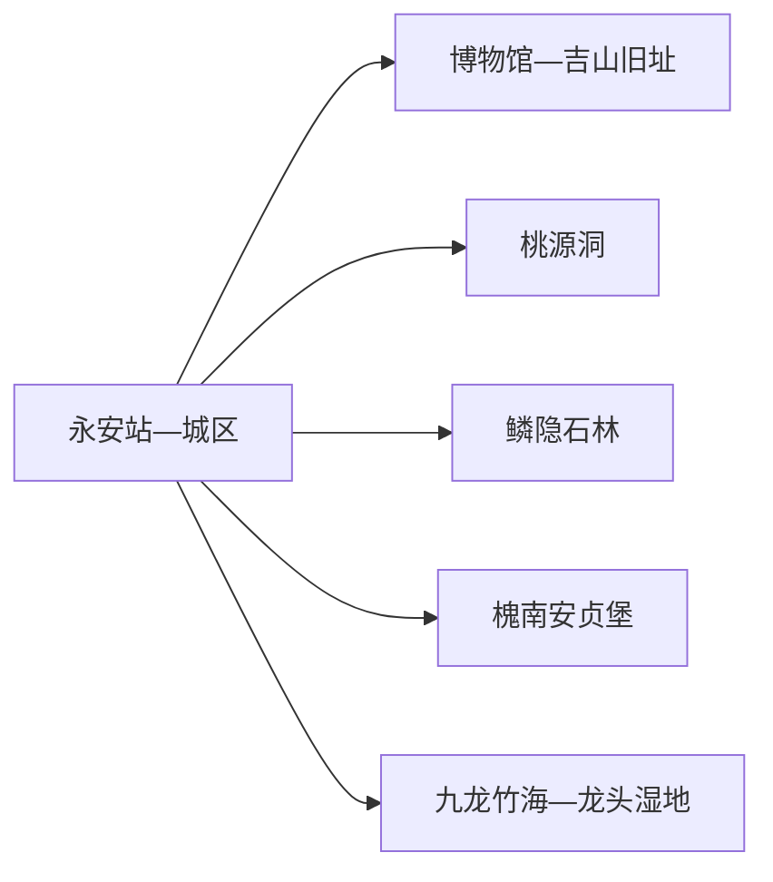
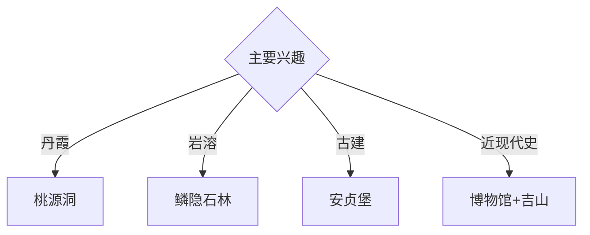

# 永安旅行指南

永安位于闽中西部，桃源洞丹霞、鳞隐石林喀斯特、安贞堡土堡和抗战旧址群构成多样的地貌与人文路线。固定快照中的 **Yong’an / GeoNames 1786401** 对应福建省永安市，与全国多处“永安”镇街点分开管理。

## 城市速览

| 项目 | 信息 |
|---|---|
| 主线 | 永安城区—桃源洞—鳞隐石林—安贞堡 |
| 停留 | 城区与一处地貌2天；完整组合3–4天 |
| 住宿 | 永安站—城区便于换乘；远端住宿按山地或古堡主题选择 |
| 交通 | 铁路、公路抵达；景区间宜公交、约车或自驾 |
| 风险 | 丹霞与岩溶地貌、山洪林火、自然保护区和土堡修缮边界 |

## 城市格局与游览区域

桃源洞位于城区北部燕江沿线，鳞隐石林在大湖镇，安贞堡在槐南镇，三者方向和游览强度不同。吉山抗战旧址群靠近城区文化线；九龙竹海、龙头湿地和天宝岩方向则按自然保护与正式接待条件另行规划。

## 主要景点

| 景点 | 区域 | 类型 | 核心体验 | 用时 | 环境 | 体力 | 研究价值 | 拥挤 | 优先级 |
|---|---|---|---|---:|---|---|---|---|---|
| 桃源洞景区 | 燕江方向 | 丹霞地貌 | 峡谷、一线天、摩崖与丹霞山水 | 半天至1天 | 室外 | 高 | 很高 | 旺季高 | A |
| 鳞隐石林景区 | 大湖镇 | 岩溶地貌 | 石芽、峰林、洞穴与喀斯特科普 | 半天至1天 | 室外 | 中高 | 很高 | 旺季中高 | A |
| 安贞堡景区 | 槐南镇 | 土堡与古建 | 清代大型夯土民居、防御与宗族空间 | 半天 | 混合 | 中 | 很高 | 节假日中 | A |
| 永安市博物馆或地方展陈 | 城区 | 博物馆 | 城市史、竹文化、抗战与地方文物 | 2小时 | 室内 | 低 | 高 | 团体时中 | A |
| 吉山抗战旧址群公开点 | 城郊 | 近现代史 | 抗战时期文化内迁与城市记忆 | 半天 | 混合 | 中 | 很高 | 团体时中 | A |
| 九龙竹海森林公园公开线 | 山林方向 | 森林公园 | 竹林生态、山地步道与林业文化 | 1天 | 室外 | 高 | 高 | 旺季中 | B |
| 龙头国家湿地公园公开区 | 九龙湖方向 | 湿地 | 河湖湿地、鸟类与生态科普 | 半天 | 室外 | 中 | 高 | 旺季中 | B |

## 美食与餐饮

永安粿条、活肉、叉叉粿、笋竹食品和客家山乡菜具有辨识度。山野菜和菌类选择正规经营渠道；景区日提前准备饮水与简餐。夏季补充电解质，土堡与乡村线路提前确认餐馆营业。

## 经典行程

### 一日地貌基础线
**路线**：城区—桃源洞或鳞隐石林单选—景区开放主线—返城。**逻辑**：用完整一天理解一种地貌。**预约锚点**：门票、接驳和末班。**休息**：游客服务区。**删除条件**：雷雨、山洪、结冰或林火预警时取消。

### 桃源洞丹霞线
**路线**：游客入口—燕江公开段—一线天—观景线—返程。**逻辑**：从河谷进入丹霞峡谷。**预约锚点**：开放游线和天气。**休息**：景区服务点。**删除条件**：狭窄段维护或积水时按现场路线缩短。

### 鳞隐石林线
**路线**：大湖镇—石林入口—峰林与洞穴公开线—返城。**逻辑**：集中观察地表与地下岩溶。**预约锚点**：洞穴、照明和返程。**休息**：游客中心。**删除条件**：雷雨或洞穴维护时保留地表开放线。

### 安贞堡古建线
**路线**：城区—槐南镇—安贞堡—村内公开街巷—返城。**逻辑**：把土堡建筑与村落环境放在同一方向。**预约锚点**：古堡开放、讲解和车辆。**休息**：镇区正规服务点。**删除条件**：文物修缮时按开放范围参观。

### 抗战文化线
**路线**：永安地方展陈—午餐—吉山抗战旧址公开点—城区滨水。**逻辑**：用室内史料与旧址空间互证。**预约锚点**：馆舍和旧址开放。**休息**：城区。**删除条件**：旧址闭馆时增加博物馆专题展。

### 亲子自然线
**路线**：市博物馆—午休—鳞隐石林近入口科普段—返城。**逻辑**：室内导读配低强度岩溶观察。**预约锚点**：亲子讲解和景区交通。**休息**：馆内与游客中心。**删除条件**：儿童体力不足时只留室内。

### 雨天线
**路线**：市博物馆—午餐—吉山可进入展陈—正规竹文化体验。**逻辑**：压缩移动并保留城市文化。**预约锚点**：馆舍和体验开放。**休息**：城区。**删除条件**：强降雨或道路积水时提前返宿。

## 住宿区域

永安站—城区适合铁路抵离、餐饮和多方向换乘；大湖、槐南等远端住宿适合明确的地貌或古堡主题。山地与乡村住宿按合法经营、消防、夜间交通和天气响应能力选择。

## 市内交通

永安南站与普铁永安站服务不同车次，订票后核对到发站。城区用公交、出租车和网约车；桃源洞、鳞隐石林、安贞堡和自然保护方向提前确认城乡公交末班或预约返程。

## 不同旅行者须知

地质旅行者把桃源洞和鳞隐石林分开；古建兴趣者给安贞堡半天；亲子家庭优先博物馆和石林近入口段；行动不便者确认峡谷台阶、洞穴路面、土堡门槛与无障碍卫生间。

## 行前核对

- 核对桃源洞、鳞隐石林、安贞堡、博物馆、吉山和自然景区开放。
- 核对铁路站点、景区交通、山洪、林火、洞穴与返程。
- 风景名胜区保护段、自然保护区、洞穴未开放支路、土堡修缮区和林业生产道沿正式游线进入。

## 来源与更新记录

| 来源 | 支持内容 | 核验日期 |
|---|---|---|
| [福建省林业局：桃源洞—鳞隐石林](https://lyj.fujian.gov.cn/bmsjk/fjmsq/202012/t20201209_5479145.htm) | 丹霞、喀斯特、景区分区与保护属性 | 2026-09-01 |
| [三明市政府：4A级景区简介](https://www.sm.gov.cn/zw/ztzl/xxwltjg/zs_38163/202402/t20240229_2004822.htm) | 桃源洞、鳞隐石林、安贞堡位置与建筑 | 2026-09-01 |
| [GeoNames 1786401](https://www.geonames.org/1786401/) | Yong’an 固定人口点与位置 | 2026-09-01 |

| 日期 | 更新 |
|---|---|
| 2026-09-01 | 首次完成永安旅行研究；建立丹霞、岩溶、土堡与抗战文化路线。 |
