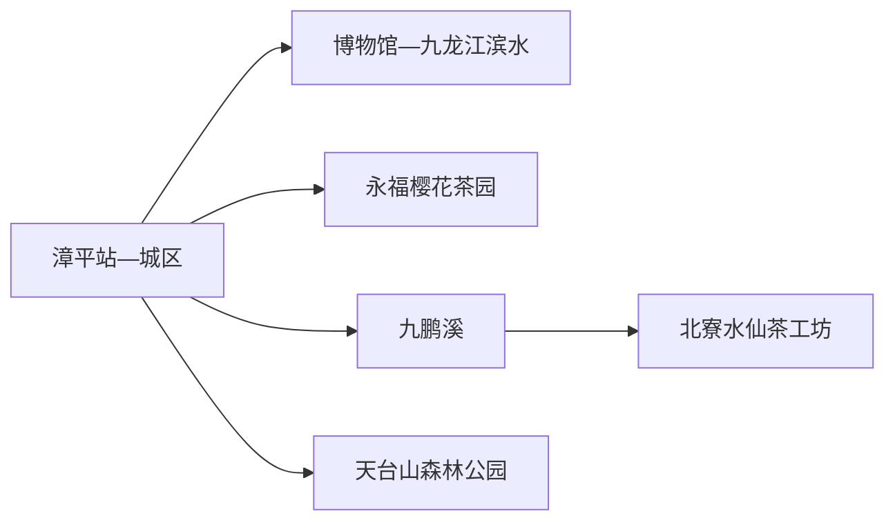
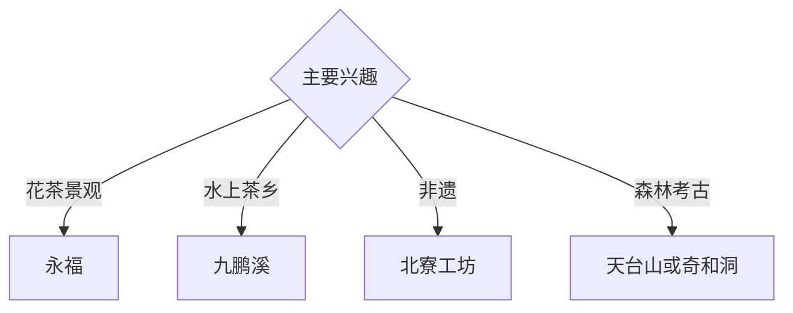

# 漳平旅行指南

漳平位于闽西九龙江北溪上游，永福樱花茶园、九鹏溪、漳平水仙茶和天台山森林构成茶乡与山水路线。固定快照中的 **Zhangping / GeoNames 1805688** 对应现行漳平市；花期、茶季和山地天气决定行程节奏，适合安排两至三天。

## 城市速览

| 项目 | 信息 |
|---|---|
| 主线 | 漳平城区—永福樱花茶园—九鹏溪—水仙茶工坊 |
| 停留 | 城区1天；永福与九鹏溪各另加1天 |
| 住宿 | 漳平站—城区便于换乘；永福适合花季清晨与茶园 |
| 交通 | 铁路、公路抵达；乡镇与山地以公交、约车或自驾为主 |
| 风险 | 花季拥堵、山洪林火、茶园生产、游船和自然保护边界 |

## 城市格局与游览区域

城区承担铁路、住宿和地方文化；永福镇位于南部高山盆地，以樱花与茶园为主。九鹏溪和北寮茶村在另一方向，可组合水上茶乡与非遗体验；天台山森林公园位于赤水镇方向，按当期建设与正式开放区域安排。

## 主要景点

| 景点 | 区域 | 类型 | 核心体验 | 用时 | 环境 | 体力 | 研究价值 | 拥挤 | 优先级 |
|---|---|---|---|---:|---|---|---|---|---|
| 永福樱花茶旅景区 | 永福镇 | 茶园与花景 | 高山茶园、季节樱花与农旅景观 | 半天至1天 | 室外 | 中 | 很高 | 花季高 | A |
| 九鹏溪景区 | 南洋方向 | 山水与茶乡 | 溪湖、游船、森林与水仙茶文化 | 1天 | 混合 | 中 | 很高 | 旺季中高 | A |
| 北寮村水仙茶非遗工坊 | 茶乡 | 非遗与乡村 | 紧压乌龙茶制作、品鉴与茶农生活 | 半天 | 混合 | 低中 | 很高 | 团体时中 | A |
| 漳平市博物馆或地方展陈 | 城区 | 博物馆 | 城市史、九龙江、水仙茶与民俗 | 2小时 | 室内 | 低 | 高 | 团体时中 | A |
| 奇和洞遗址公开展陈 | 和平镇方向 | 考古遗址 | 史前人类、洞穴考古与闽西环境 | 半天 | 混合 | 中 | 很高 | 团体时中 | B |
| 天台山森林公园正式开放线 | 赤水镇 | 森林公园 | 森林、畲族乡村与山地康养 | 1天 | 室外 | 高 | 高 | 旺季中 | B |
| 九龙江北溪城区公开段 | 城区 | 滨水空间 | 河流、铁路城市与日常生活 | 1–2小时 | 室外 | 低 | 中 | 傍晚中 | B |

## 美食与餐饮

漳平水仙茶、米浆粿、风鸭、笋竹和闽西客家菜具有地方辨识度。茶品体验控制空腹浓茶与总咖啡因；茶园、工坊和采摘活动进入经营者正式接待区。山地日自备饮水和简餐。

## 经典行程

### 一日茶乡基础线
**路线**：城区—九鹏溪—午餐—北寮水仙茶工坊—返城。**逻辑**：从山水进入茶叶制作与乡村生活。**预约锚点**：景区、游船、工坊和返程。**休息**：九鹏溪服务区。**删除条件**：强降雨或游船停航时增加工坊室内体验。

### 永福花茶线
**路线**：城区或永福住宿—樱花茶园正式入口—茶园公开线—镇区午餐—返程。**逻辑**：用完整一天应对花季客流和山路。**预约锚点**：花期、票务、停车和交通。**休息**：永福镇。**删除条件**：花期结束、道路管控或雷雨时改九鹏溪。

### 水仙茶非遗线
**路线**：市博物馆—午餐—北寮村正规工坊—制茶或品鉴—返城。**逻辑**：从城市史进入国家级非遗实践。**预约锚点**：传承人接待和体验。**休息**：工坊公共区。**删除条件**：生产安排暂停接待时改正规茶馆展陈。

### 九鹏溪山水线
**路线**：游客入口—景区交通或船线—溪湖公开游线—茶文化体验—返城。**逻辑**：集中一天处理水上与森林景观。**预约锚点**：门票、船线和末班。**休息**：游客中心。**删除条件**：洪水、大风、雷雨或船线停运时缩短水上段。

### 考古森林线
**路线**：奇和洞公开展陈或天台山单选—午间补给—正式步道—返城。**逻辑**：按兴趣选择史前考古或森林生态。**预约锚点**：开放、车辆和天气。**休息**：正规服务点。**删除条件**：洞穴维护、林火或山洪预警时取消。

### 亲子低体力线
**路线**：市博物馆—午休—正规水仙茶工坊—城区滨水短线。**逻辑**：室内知识配动手体验。**预约锚点**：亲子制茶活动。**休息**：馆内和工坊。**删除条件**：儿童对茶饮敏感时只做工艺观察。

### 雨天线
**路线**：市博物馆—午餐—水仙茶非遗工坊—正规室内文化空间。**逻辑**：减少山路与水上风险。**预约锚点**：馆舍和工坊开放。**休息**：城区。**删除条件**：强降雨或道路积水时就近返宿。

## 住宿区域

漳平站—城区适合铁路抵离、餐饮和多方向换乘；永福镇适合花季清晨与茶园；九鹏溪附近正规住宿适合山水茶乡。乡村住宿按合法经营、消防、夜间交通和天气响应能力选择。

## 市内交通

漳平西站与普铁漳平站服务不同车次，订票后核对到发站。城区用公交、出租车和网约车；永福、九鹏溪、北寮和天台山方向提前确认城乡公交末班或预约返程，花季预留拥堵时间。

## 不同旅行者须知

茶文化兴趣者优先九鹏溪与北寮；摄影者按花期选择永福；亲子家庭优先博物馆和工坊；行动不便者确认茶园坡度、游船上下客、森林接驳与无障碍卫生间。

## 行前核对

- 核对永福花期与交通、九鹏溪船线、茶工坊、博物馆和山地开放。
- 核对铁路站点、花季客流、山洪林火、游船天气和返程。
- 茶园生产区、自然保护区、洞穴考古区、林业道路和村庄生产空间沿正式游线进入。

## 来源与更新记录

| 来源 | 支持内容 | 核验日期 |
|---|---|---|
| [福建省文旅厅：福茶夏季线路](https://wlt.fujian.gov.cn/wldt/btdt/202506/t20250612_6924192.htm) | 永福、九鹏溪、北寮、水仙茶与两日线路 | 2026-09-01 |
| [福建省文旅厅：非遗与旅游融合目录](https://wlt.fujian.gov.cn/wldt/btdt/202409/P020250624350030178688.pdf) | 漳平水仙茶技艺、工坊和九鹏溪联动 | 2026-09-01 |
| [GeoNames 1805688](https://www.geonames.org/1805688/) | Zhangping 固定人口点与位置 | 2026-09-01 |

| 日期 | 更新 |
|---|---|
| 2026-09-01 | 首次完成漳平旅行研究；建立永福、九鹏溪、水仙茶、考古与森林路线。 |
