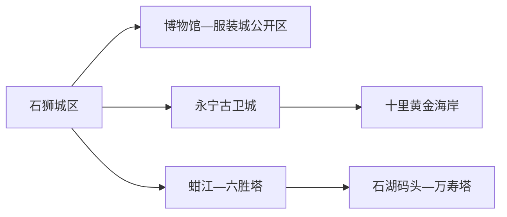
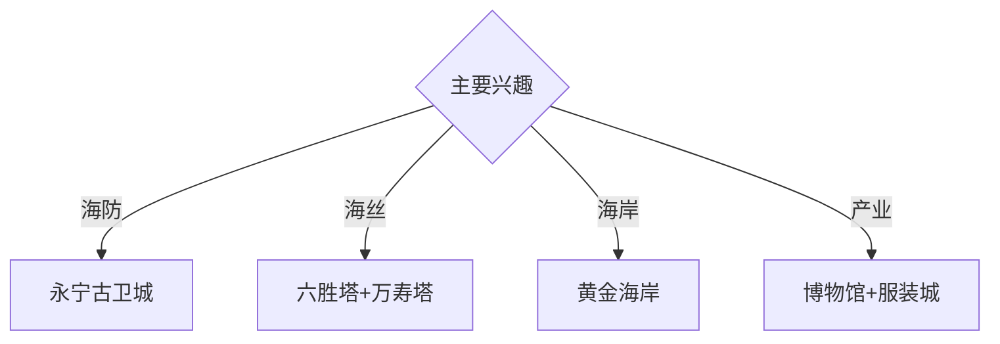

# 石狮旅行指南

石狮位于泉州湾南岸，永宁古卫城、六胜塔与万寿塔、黄金海岸和服装产业构成海防、海丝与现代商贸并行的城市结构。固定快照中的 **Shishi / GeoNames 1795006** 对应现行石狮市；城区、永宁和蚶江石湖方向适合分两天安排。

## 城市速览

| 项目 | 信息 |
|---|---|
| 主线 | 石狮城区—永宁古卫城—黄金海岸—六胜塔 |
| 停留 | 城区与永宁1天；海丝塔与海岸另加1天 |
| 住宿 | 石狮城区便于餐饮与换乘；永宁适合古城海岸慢游 |
| 交通 | 经泉州、晋江方向抵达，市内公交、出租车连接各片区 |
| 风险 | 台风海况、海蚀地貌、文物保护、港区渔业与服装生产边界 |

## 城市格局与游览区域

石狮城区承担住宿、博物馆与服装商贸；永宁古卫城和黄金海岸位于东南海岸。六胜塔、万寿塔与石湖码头集中在泉州湾口海丝方向，但码头生产区和世界遗产保护范围各有现场边界。

## 主要景点

| 景点 | 区域 | 类型 | 核心体验 | 用时 | 环境 | 体力 | 研究价值 | 拥挤 | 优先级 |
|---|---|---|---|---:|---|---|---|---|---|
| 永宁古卫城公开区 | 永宁镇 | 海防古城 | 明代海防、番仔楼、街巷与侨乡 | 半天 | 混合 | 中 | 很高 | 周末中高 | A |
| 六胜塔 | 蚶江石湖方向 | 海丝文物 | 航标塔、泉州湾口与海上交通史 | 1–2小时 | 室外 | 低中 | 很高 | 节假日中 | A |
| 万寿塔 | 宝盖山 | 海丝文物 | 姑嫂塔、航海地标与城市海湾视野 | 2小时 | 室外 | 中高 | 很高 | 傍晚中 | A |
| 十里黄金海岸正式景区 | 永宁海岸 | 海滨 | 沙滩、海蚀地貌与日出日落 | 半天 | 室外 | 中 | 高 | 夏季高 | A |
| 石狮市博物馆或地方展陈 | 城区 | 博物馆 | 海防、华侨、服饰与城市史 | 2小时 | 室内 | 低 | 高 | 团体时中 | A |
| 石狮服装城公开商贸区 | 城区 | 产业与商贸 | 闽派服饰、市场与产业城市 | 2–3小时 | 室内 | 低 | 中 | 展会时高 | B |
| 石湖码头遗产公开观察点 | 蚶江方向 | 港口遗产 | 古码头、海丝交通与泉州湾地理 | 1–2小时 | 室外 | 低中 | 高 | 节假日中 | B |

## 美食与餐饮

海鲜、牛肉羹、面线糊、海蛎煎和闽南小吃最具辨识度。海鲜按明码标价和合法来源点单；海岸日关注冷链与饮水。服装采购确认退换、尺码和运输，商贸体验与生产车间参访分开。

## 经典行程

### 一日海防基础线
**路线**：永宁古卫城—午餐—黄金海岸正式景区—返城。**逻辑**：从海防聚落进入现代海滨。**预约锚点**：古城场馆、浴场和返程。**休息**：永宁镇区。**删除条件**：台风、大风或海岸关闭时增加古城室内展陈。

### 海丝双塔线
**路线**：石狮市博物馆—六胜塔—石湖码头公开点—万寿塔。**逻辑**：用展陈、港口与航标理解泉州湾海丝交通。**预约锚点**：文物开放和车辆。**休息**：城区或蚶江镇。**删除条件**：文物维护时改外围解说点。

### 永宁侨乡线
**路线**：古卫城公开街区—番仔楼公开点—午餐—海防石刻—镇区慢行。**逻辑**：把海防与近代侨乡建筑放在同一空间。**预约锚点**：场馆和古厝接待。**休息**：永宁镇。**删除条件**：私人古厝未开放时只走公共街巷。

### 黄金海岸线
**路线**：正式游客入口—沙滩开放段—海蚀地貌观景—日落前返程。**逻辑**：以管理边界组织亲水与地貌观察。**预约锚点**：潮汐、海况和救生服务。**休息**：景区服务区。**删除条件**：离岸风、雷电、赤潮或浴场关闭时取消亲水。

### 服装产业线
**路线**：市博物馆—午餐—服装城公开商贸区—品牌展陈。**逻辑**：从城市史进入现代产业。**预约锚点**：展会和公开接待。**休息**：服装城商业区。**删除条件**：展会交通管控时缩短采购时间。

### 亲子低体力线
**路线**：市博物馆—午休—六胜塔近入口公开区—正规海滨公园。**逻辑**：室内历史配低强度海湾观察。**预约锚点**：馆舍和天气。**休息**：馆内与公园座椅。**删除条件**：高温或强风时只留室内。

### 雨天线
**路线**：市博物馆—午餐—服装城公开区—永宁室内文化空间。**逻辑**：用室内场所保留海防与产业主题。**预约锚点**：馆舍和交通。**休息**：城区。**删除条件**：台风响应时留在安全住宿。

## 住宿区域

石狮城区适合商贸、餐饮和多方向换乘；永宁镇适合古城与海岸清晨；泉州或晋江住宿适合跨城联程。订房时核对实际行政地址、海岸距离、停车和夜间返程。

## 市内交通

外部通常经泉州南站、晋江站、机场或公路进入，实际最优入口随班次变化。石狮城区、永宁、蚶江和宝盖山之间使用公交、出租车和网约车；节庆和展会预留道路管控时间。

## 不同旅行者须知

海丝兴趣者优先双塔与石湖码头；建筑兴趣者给永宁半天；亲子家庭优先博物馆和管理完善海滨；行动不便者确认古城石板路、宝盖山接驳、沙滩轮椅条件和卫生间。

## 行前核对

- 核对永宁场馆、六胜塔、万寿塔、博物馆和海岸开放。
- 核对台风、潮汐、海况、浴场救生、展会交通和返程。
- 世界遗产保护区、渔港与货运码头、军事海防设施、服装生产车间和海岸危险礁石区按正式边界进入。

## 来源与更新记录

| 来源 | 支持内容 | 核验日期 |
|---|---|---|
| [福建省文旅厅：1号滨海风景道](https://wlt.fujian.gov.cn/wldt/btdt/202507/t20250717_6968242.htm) | 永宁古卫城、黄金海岸、宝盖山与海丝线路 | 2026-09-01 |
| [福建省文物局：八闽不可移动文物](https://wwj.wlt.fujian.gov.cn/wwzy/bmww/202504/t20250408_6841636.htm) | 六胜塔、万寿塔与海丝文物关系 | 2026-09-01 |
| [GeoNames 1795006](https://www.geonames.org/1795006/) | Shishi 固定人口点与位置 | 2026-09-01 |

| 日期 | 更新 |
|---|---|
| 2026-09-01 | 首次完成石狮旅行研究；建立海防、海丝双塔、海岸与服装产业路线。 |
