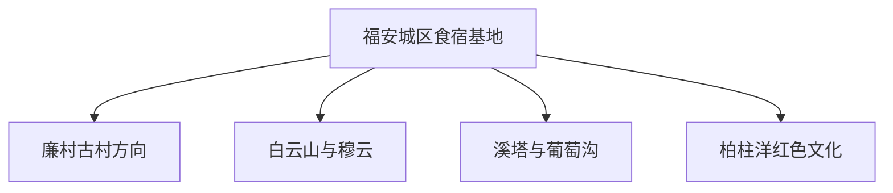
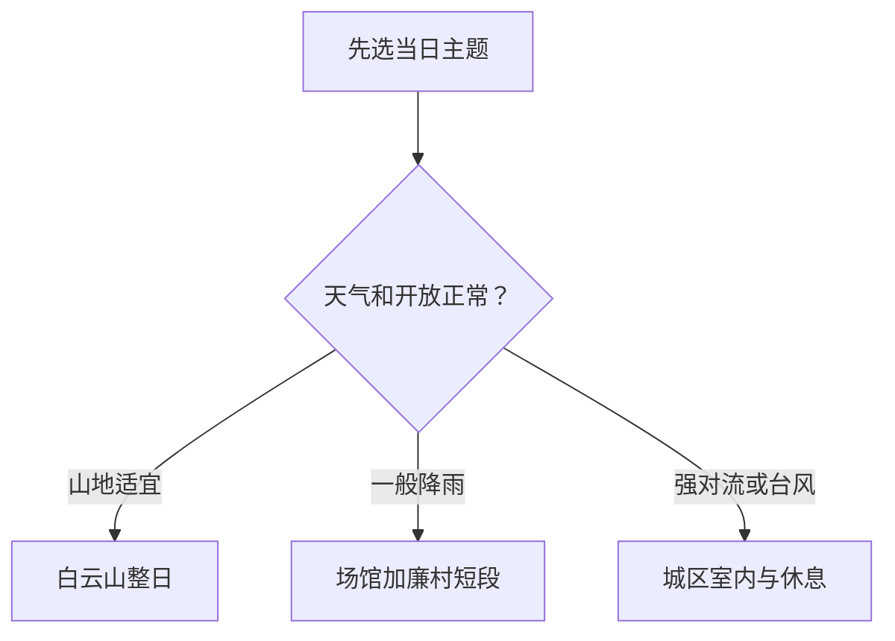

# 福安市旅行指南

福安适合把山水、畲乡、古村和闽东茶果文化拆成几个方向慢慢看。首次到访可以住在城区，先用廉村与城区场馆理解地方历史，再把白云山、溪塔葡萄沟或柏柱洋选成一个整日方向。

> 建议停留：2–3 天\
> 旅行关键词：白云山地貌、廉村、畲乡、茶果产区\
> 主要体力：城区低至中等，山地中高\
> 最近研究：2026-08-12

## 城市速览

| 项目 | 旅行信息 |
|---|---|
| 主要旅行价值 | 沿赛江与群山之间认识福文化、畲族聚落、闽东茶果产业和火山岩峡谷地貌 |
| 建议停留 | 2 天可完成城区—廉村和白云山；3 天再选溪塔、柏柱洋或一处已确认接待的畲乡 |
| 较舒适季节 | 春秋利于村落与山地；夏季水景丰沛但雷雨、高温和台风风险更高 |
| 预算特点 | 城区食宿中等；白云山、乡村和跨乡镇包车是主要增量 |
| 步行强度 | 城区和廉村中等；白云山有山路、台阶与湿滑路面 |
| 主要天气风险 | 台风、短时强降雨、山洪、雷电、高温与汛期道路中断 |
| 独行旅行 | 城区用餐与铁路到发方便；远郊先锁定返程车辆和接待人 |
| 亲子旅行 | 地质科普、古村和果园体验易组合；涉水、茶果加工和山路需成人全程看护 |
| 长者与低体力旅行 | 以城区场馆、廉村短段和车辆可达的游客中心为主 |
| 无障碍信息 | 车站、场馆、景区入口与内部步道应分段确认；设施连续性需向官方确认 |

## 城市格局与游览区域

福安城区是食宿与交通基地，廉村位于西南方向，白云山与穆云畲乡在西北山地，柏柱洋与其他乡村节点又需单独公路转场。这些方向宜按整日选择，而不是用城区直线距离估算。

| 区域 | 主要内容 | 游览特点 | 与其他区域的关系 |
|---|---|---|---|
| 城区—赛江 | 地方博物馆、城市河岸和餐饮 | 适合到达日、雨天或半日 | 作为各个公路方向的换乘与住宿中心 |
| 廉村—溪潭 | 历史文化名村、廉溪与传统建筑 | 以步行阅读村落格局为主 | 可与城区同日，与白云山同日会过于紧凑 |
| 白云山—穆云 | 地质公园、峡谷、壶穴与畲乡 | 需整日、步道与景交核验 | 从城区单线往返最清晰 |
| 溪塔—穆阳 | 葡萄沟、果园与乡镇生活 | 花果季和接待状态决定内容 | 可与已预约的单一畲村组合 |
| 柏柱洋等乡村 | 闽东红色文化、乡村展陈 | 场馆和讲解需预先确认 | 作独立半日至一日方向 |

## 主要景点

优先级用于分配时间：**A** 为首访核心，**B** 为按兴趣补充，**C** 为季节性或远郊目的地。

### 古村、场馆与地方文化

| 景点 | 区域 | 类型 | 主要看点 | 建议用时 | 室内外 | 体力 | 预约风险 | 天气影响 | 优先级 |
|---|---|---|---|---:|---|---|---|---|---|
| 福安市博物馆 | 城区 | 地方博物馆 | 福安建置、民俗与地方文物；展陈和馆址行前确认 | 1.5–2.5 小时 | 室内 | 低 | 中 | 低 | B |
| 廉村 | 溪潭镇 | 历史文化名村 | 村落选址、廉溪、古建筑与薛令之文化 | 2–4 小时 | 室内外混合 | 中 | 中 | 中 | A |
| 柏柱洋红色文化片区 | 溪柄镇方向 | 历史展陈、乡村 | 闽东革命史线索，以当期正式开放场馆为准 | 2–4 小时 | 混合 | 中 | 高 | 中 | B |
| 仙岫或其他正式接待畲村 | 市域乡村 | 畲族文化 | 村落空间、歌舞、服饰或饮食，内容依当日接待 | 2–4 小时 | 混合 | 中 | 高 | 中 | C |

### 山水与乡村

| 景点 | 区域 | 类型 | 主要看点 | 建议用时 | 室内外 | 体力 | 预约风险 | 天气影响 | 优先级 |
|---|---|---|---|---:|---|---|---|---|---|
| 白云山风景名胜区 | 晓阳镇—穆云乡 | 地质公园、峡谷 | 河谷侵蚀、深切峡谷、花岗岩壶穴与地学科普 | 1 天 | 室外 | 高 | 高 | 很高 | A |
| 溪塔葡萄沟 | 穆云畲族乡 | 农业景观、村落 | 葡萄架下水系与农事文化，果期与正式接待影响较大 | 2–4 小时 | 室外 | 中 | 高 | 高 | B |
| 下逢村 | 穆云畲族乡 | 休闲农业、古树村落 | 临溪村落、古树和白云山山麓景观 | 1.5–3 小时 | 室外 | 中 | 中 | 高 | C |
| 穆阳镇时令花果体验 | 穆阳镇 | 季节农业 | 桃花、水蜜桃或当期农事，以当季公告为准 | 2–4 小时 | 室外 | 中 | 高 | 高 | C |

白云山内部的峡谷、壶穴、溪流与观景点属于同一父级景区，不拆成多个景点计数。瓜溪桄植自然保护区的价值在于保护；旅行只选用明确公布的入口、线路或科普活动。

## 美食与餐饮

| 菜品或餐饮类型 | 常见区域 | 一个人用餐与常见份量 | 风味、过敏原与饮食限制 | 排队风险与替代方法 |
|---|---|---|---|---|
| 穆阳烤肉 | 穆阳及城区 | 多人分享更合适，独行先问半份或小串 | 肉类、酱料、大豆、芝麻和小麦；格烧叉可能共用 | 在穆阳或城区选菜单透明的同类店 |
| 福安光饼与粉面 | 城区早餐店、市场 | 适合单人，可从少量尝试 | 小麦、芝麻及可能的肉馅、猪油 | 早餐时段选就近老店，卖完后换同类 |
| 拌粉干与地方小吃 | 城区 | 一人一份易控量 | 酱油、花生、芝麻、猪肉汤底需询问 | 用普通粉面店替代排队点 |
| 坦洋工夫红茶与茶点 | 城区、社口等茶区 | 品饮可小份，茶宴多人更合适 | 咖啡因；茶点可含蛋奶、坚果和小麦 | 选产品可追溯且明码标价的经营者 |
| 葡萄、水蜜桃等时令水果 | 穆云、穆阳与市场 | 按称重购买，采摘前先问计价 | 水果过敏、农药清洗和酒制品酒精 | 非果期改买当地包装果品，不以花果节旧日期安排行程 |

## 经典行程

### 一日经典路线

**路线**：福安市博物馆 → 城区午餐 → 廉村 → 返回城区

- **串联逻辑**：上午先建立地方历史框架，下午在古村阅读选址与建筑。
- **预约锚点**：先确认博物馆开馆和廉村当期开放区域。
- **休息安排**：城区午餐，廉村只在正式服务点休息补水。
- **时间不足时**：缩短城区河岸段，保留一座场馆和廉村主线。

### 两日城市路线

**第 1 天**：场馆 → 廉村。\
**第 2 天**：白云山已开放入口 → 景区步道 → 穆云休息 → 城区。

- **串联逻辑**：人文与地貌分日，山地日只做一个主景区。
- **预约锚点**：白云山入口、景交、步道和返程车辆。
- **休息安排**：白云山游客服务点和穆云镇区安排两段休息。
- **时间不足时**：第二天保留已开放主步道，不再加葡萄沟或村落。

### 三日深度路线

**第 1 天**：城区与廉村。\
**第 2 天**：白云山整日。\
**第 3 天**：溪塔葡萄沟或柏柱洋二选一。

- **串联逻辑**：第三天按季节与兴趣选农业文化或红色历史，保持单一公路方向。
- **预约锚点**：第三天接待点、讲解、果期和返程交通。
- **休息安排**：每天午后都保留镇区餐饮与卫生间节点。
- **时间不足时**：删第三天；若仅一天，回到城区—廉村线。

### 雨天路线

**路线**：福安市博物馆 → 城区正规餐厅 → 已确认开放的室内文化空间 → 早返住宿

- **适用条件**：仅适用于普通降雨；台风、暴雨或山洪预警时以避险为主。
- **预约锚点**：当日开馆、最晚入场和道路积水信息。
- **休息安排**：用同一成熟商业区完成用餐与等车。
- **时间不足时**：只保留一座场馆和一顿本地餐。

### 亲子或低体力路线

**亲子路线**：市博物馆 → 午餐 → 廉村短段或已预约果园。\
**低体力路线**：车辆抵达市博物馆 → 午餐 → 廉村可达入口短段 → 返住宿。

- **减负方式**：亲子线先确认农事活动年龄与看护；低体力线用车辆串联，避开长台阶与湿滑山道。
- **预约锚点**：推车、轮椅、卫生间、落客点和果园接待规则。
- **休息安排**：午餐后留室内休息，下午只安排一处。
- **时间不足时**：删村落或果园，保留场馆和用餐。

### 远郊一日路线

**路线**：城区早出发 → 白云山正式游客入口 → 已开放地质步道 → 穆云镇区休息 → 日落前返回

- **适用条件**：适合山地步行能力与天气窗口均已确认的旅行者。
- **预约锚点**：景区开放、入口、景交、步道、防火防汛与返程车辆。
- **休息安排**：游客中心和镇区各休息一次，携带饮水与防滑雨具。
- **时间不足时**：在返程时点前折返，把畲村、葡萄沟和其他旁支留给另一天。

## 住宿区域

| 区域 | 优点 | 缺点 | 适合人群 | 交通特点 |
|---|---|---|---|---|
| 福安站—城区成熟商业区 | 铁路到发、酒店和餐饮选择较多 | 车站、老城和河岸不在同一步行圈 | 首访、无车、晚到早走 | 适合每日向不同乡镇往返 |
| 老城与赛江附近 | 本地用餐和城市散步方便 | 停车、电梯、隔音和房龄差异大 | 重视城市生活的旅行者 | 城区内短途便利，远郊仍需车辆 |
| 穆阳或穆云镇区 | 便于山地或茶果专题早出 | 夜间餐饮、叫车和医疗选择少 | 已锁定连续两天远郊行程 | 订房前确认车位、接送和次日返程 |

## 市内交通

- **铁路到达**：福安站是主要铁路门户；列车停靠、站前公交与无障碍协助用 12306 和运营方当期信息确认。
- **城区移动**：公交、出租车和分段步行可覆盖城区节点；携行李时按实际道路距离叫车更省力。
- **廉村与远郊**：核对农村客运、正规包车或自驾，同时锁定返程；所谓旅游专线以当期公告为准。
- **山地行车**：在台风、暴雨、浓雾或地质灾害预警期间，选城区行程或顺延出发；恢复通行以交通和景区公告为准。

## 不同旅行者须知

| 旅行维度 | 可行条件 | 主要取舍 | 需额外核对 |
|---|---|---|---|
| 独行 | 以城区为基地、每天一个远郊方向 | 乡村包车成本与返程确定性 | 末班车、司机信息、手机信号和夜间到店 |
| 亲子 | 场馆、古村和已确认接待的农事体验 | 涉水、设备、狭窄山道与高温 | 年龄、推车、卫生间、食品过敏与看护 |
| 长者或低体力 | 车辆门到门、单一场馆与古村短段 | 白云山完整步道和连续换乘负担大 | 落客点、座椅、坡道、轮椅和医疗支援 |
| 摄影 | 古村、峡谷、葡萄架和赛江题材丰富 | 早晚光线会增加山路与返程风险 | 三脚架、无人机、村落人像同意与景区拍摄规则 |
| 特殊天气 | 普通降雨可转城区室内 | 台风、强对流和山洪期间山地与水边行程延后 | 气象、应急、道路、景区和属地政府公告 |

## 行前核对

| 核对事项 | 为什么需要重查 | 建议核对时间 | 官方入口 |
|---|---|---|---|
| 白云山 | 入口、步道、景交、承载、防火与山洪管理随季节变化 | 预订前、前一日和当天 | [福建省林业局](https://lyj.fujian.gov.cn/bmsjk/dzgy/202012/t20201209_5479212.htm)、景区当期公告 |
| 廉村与乡村场馆 | 内部建筑、讲解、停车和团队活动可调整 | 排路线时及前一日 | [福建省文化和旅游厅廉村资料](https://wlt.fujian.gov.cn/zwgk/ztzl/fjsjplyc/ndsfaslc/) |
| 葡萄沟、果园与畲村 | 果期、采摘、表演、讲解与餐饮都依当日接待 | 订车前及到访前一日 | [福建省农业农村厅](https://nynct.fujian.gov.cn/)、属地与经营方公告 |
| 铁路与乡村客运 | 停靠、线路、末班和施工会变化 | 开售时及出发当天 | [中国铁路 12306](https://www.12306.cn/)、[福建省交通运输厅](https://jtyst.fujian.gov.cn/) |
| 台风、暴雨与地质灾害 | 山区道路和步道可在短时间内关闭 | 出发前三日起连续查 | [福建省气象局](https://fj.cma.gov.cn/)、[福建省应急管理厅](https://yjt.fujian.gov.cn/) |

## 来源与更新记录

### 主要来源

| 来源 | 类型 | 支持内容 | 核验日期 |
|---|---|---|---|
| [福建省民政厅](https://mzt.fujian.gov.cn/) | 省民政部门 | 福安市县级市层级与行政代码 `350981` 的动态核对入口 | 2026-08-12 |
| [Wikidata：Fu'an（Q1374581）](https://www.wikidata.org/wiki/Q1374581) | CC0 开放数据 | 法定城市实体与 GeoNames `1808872` 交叉核对 | 2026-08-12 |
| [GeoNames：Fu’an（1808872）](https://www.geonames.org/1808872/fuan.html) | CC BY 4.0 开放数据 | PPLA3 主城驻地点、坐标与名称；点位不代替市域边界 | 2026-08-12 |
| [福建省商务厅：福安县域概况](https://fdi.swt.fujian.gov.cn/county-show-417.html) | 省政府部门 | 市域格局、白云山、廉村、溪塔、柏柱洋与产业边界 | 2026-08-12 |
| [福建省林业局：白云山国家地质公园](https://lyj.fujian.gov.cn/bmsjk/dzgy/202012/t20201209_5479212.htm) | 省林业部门 | 白云山位置、面积、深切峡谷、壶穴与地质科普价值 | 2026-08-12 |
| [福建省文化和旅游厅：廉村](https://wlt.fujian.gov.cn/zwgk/ztzl/fjsjplyc/ndsfaslc/) | 省文旅部门 | 廉村位置、历史文化名村属性与薛令之文化 | 2026-08-12 |
| [福建省农业农村厅：穆云下逢村](https://nynct.fujian.gov.cn/ztzl/xxny/202311/t20231108_6292356.htm) | 省农业部门 | 下逢村位于白云山山麓、古树溪流和休闲农业属性 | 2026-08-12 |

### 更新记录

- 2026-08-12：建立首个完整版本；以 GeoNames `1808872`、Wikidata `Q1374581` 和法定代码 `350981` 核对福安市；按城区、廉村、白云山—穆云、溪塔—穆阳与柏柱洋分方向组织，补齐产业、保护地、山地天气、交通和无障碍核验。
