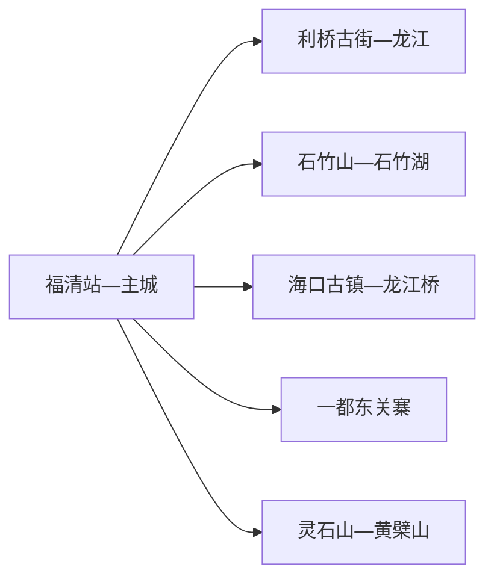
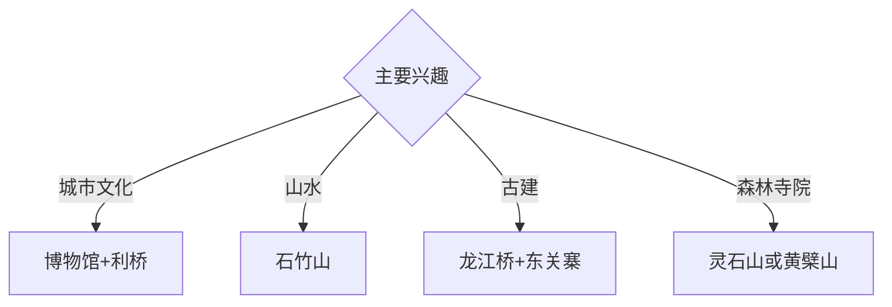

# 福清旅行指南

福清位于福州南部，龙江主城、石竹山、海口古镇与一都东关寨构成山水、侨乡和古建交织的县级市路线。固定快照中的 **Fuqing / GeoNames 1797120** 对应现行福清市；西部山地、东部海湾和南部乡村分散，适合安排两至三天。

## 城市速览

| 项目 | 信息 |
|---|---|
| 主线 | 利桥古街—石竹山—龙江桥—东关寨 |
| 停留 | 主城与石竹山1–2天；东关寨或滨海方向另加1天 |
| 住宿 | 福清站—主城便于综合换乘；石竹湖或一都按主题选择 |
| 交通 | 高铁、公路抵达；山地、古寨与滨海以公交、约车或自驾为主 |
| 风险 | 台风暴雨、山洪林火、海况、古建保护与核电港区生产边界 |

## 城市格局与游览区域

利桥古街和龙江城市滨水集中在主城；石竹山位于西部东张水库方向，海口古镇与龙江桥在东部，东关寨在西南一都镇。灵石山和黄檗山又是独立山林方向，每天选择一个远端组团更便于留出返程和天气缓冲。

## 主要景点

| 景点 | 区域 | 类型 | 核心体验 | 用时 | 环境 | 体力 | 研究价值 | 拥挤 | 优先级 |
|---|---|---|---|---:|---|---|---|---|---|
| 石竹山景区 | 西部 | 山地与寺观 | 石竹湖、山崖寺观与梦文化 | 半天至1天 | 室外 | 高 | 很高 | 节假日高 | A |
| 利桥古街公开区 | 主城 | 历史街区 | 龙江城市史、侨乡商业与夜景 | 2–3小时 | 混合 | 低 | 高 | 傍晚中高 | A |
| 福清市博物馆或地方展陈 | 主城 | 博物馆 | 玉融历史、华侨、海洋与非遗 | 2小时 | 室内 | 低 | 高 | 团体时中 | A |
| 龙江桥 | 海口镇 | 古桥 | 石梁桥、龙江水系与海口古镇 | 1–2小时 | 室外 | 低中 | 很高 | 周末中 | A |
| 东关寨旅游区 | 一都镇 | 古寨与乡村 | 古堡式建筑、传统村落与枇杷乡 | 半天 | 混合 | 中 | 很高 | 节假日中 | A |
| 灵石山国家森林公园公开线 | 西部山地 | 森林公园 | 亚热带森林、山地步道与生态 | 1天 | 室外 | 高 | 高 | 旺季中 | B |
| 黄檗山万福寺正式开放区 | 山地 | 寺院与文化 | 黄檗文化、寺院建筑与中日交流史 | 半天至1天 | 混合 | 中高 | 高 | 节庆中 | B |

## 美食与餐饮

福清光饼、海蛎饼、鱼丸、番薯丸、海鲜和一都枇杷最具地方辨识度。海鲜按明码标价和合法来源点单；枇杷采摘进入正式接待果园。山地与滨海日提前准备饮水、简餐和防晒防雨装备。

## 经典行程

### 一日主城基础线
**路线**：福清市博物馆—午餐—龙江城市滨水—利桥古街夜景。**逻辑**：从地方史进入当代城市与侨乡街区。**预约锚点**：博物馆和街区活动。**休息**：主城商业区。**删除条件**：暴雨时缩短滨水步行。

### 石竹山山水线
**路线**：主城—石竹山入口—正式登山线—石竹湖观景—返城。**逻辑**：完整半天至一天体验西部山水。**预约锚点**：开放、接驳和返程。**休息**：景区服务区。**删除条件**：台风、雷雨、山洪或林火预警时取消。

### 海口古桥线
**路线**：主城—海口古镇公开街区—龙江桥—正规海鲜午餐—返城。**逻辑**：沿龙江下游理解古桥与海湾商贸。**预约锚点**：古桥维护和车辆。**休息**：海口镇。**删除条件**：洪水或古桥保护管控时改远观。

### 东关寨乡村线
**路线**：主城—一都镇—东关寨—传统村落公开区—返城。**逻辑**：把古寨建筑与枇杷乡环境放在同一方向。**预约锚点**：景区接待和返程。**休息**：正规农家乐。**删除条件**：古建维护或乡村接待暂停时改主城线。

### 森林寺院线
**路线**：灵石山或黄檗山单选—开放步道—寺院或森林展陈—返城。**逻辑**：一个完整日只处理一条山地主题。**预约锚点**：开放、天气和交通。**休息**：游客服务点。**删除条件**：林火、雷雨或道路管控时取消。

### 亲子研学线
**路线**：市博物馆—午休—龙江桥近入口公开点—利桥古街。**逻辑**：室内地方史配低体力古桥街区。**预约锚点**：亲子讲解。**休息**：主城与海口镇。**删除条件**：高温或暴雨时只留室内。

### 雨天线
**路线**：市博物馆—午餐—利桥室内文化空间—正规非遗体验。**逻辑**：压缩移动并保留玉融文化。**预约锚点**：馆舍和体验开放。**休息**：主城。**删除条件**：台风响应时留在安全住宿。

## 住宿区域

福清站—主城适合高铁抵离、餐饮和多方向换乘；石竹山附近适合清晨山水线；一都正规民宿适合乡村主题。滨海与山地住宿按合法经营、消防、台风避险和夜间交通能力选择。

## 市内交通

福清站、福清西站等铁路站点服务不同车次，订票后核对实际到发站。主城用公交、出租车和网约车；石竹山、海口、东关寨及山林方向提前核对城乡公交末班或预约返程。

## 不同旅行者须知

古建兴趣者优先龙江桥与东关寨；山水旅行者选择石竹山；亲子家庭优先博物馆和短距离街区；行动不便者确认山地接驳、古桥路面、古寨台阶与无障碍卫生间。

## 行前核对

- 核对石竹山、博物馆、龙江桥、东关寨、灵石山与黄檗山开放。
- 核对铁路站点、城乡公交、台风暴雨、山地天气、海况和返程。
- 水库管理区、森林保护区、核电与港区生产区、海岛、古建修缮区和果园生产面按正式开放边界进入。

## 来源与更新记录

| 来源 | 支持内容 | 核验日期 |
|---|---|---|
| [福清市政府：文创走廊行动方案](https://www.fuqing.gov.cn/xjwz/zwgk/ztzl/lwlb/zcwj/202312/t20231212_4735611.htm) | 石竹山、龙江桥、海口、利桥、山林与滨海格局 | 2026-09-01 |
| [福建省文旅厅：东关寨旅游区](https://wlt.fujian.gov.cn/zwgk/ztzl/fjswljjfzdh/xmdj/zdzsxm/fz/202505/t20250522_6917227.htm) | 东关寨、传统村落、一都位置与接待 | 2026-09-01 |
| [GeoNames 1797120](https://www.geonames.org/1797120/) | Fuqing 固定人口点与位置 | 2026-09-01 |

| 日期 | 更新 |
|---|---|
| 2026-09-01 | 首次完成福清旅行研究；建立主城、石竹山、海口古桥与东关寨路线。 |
