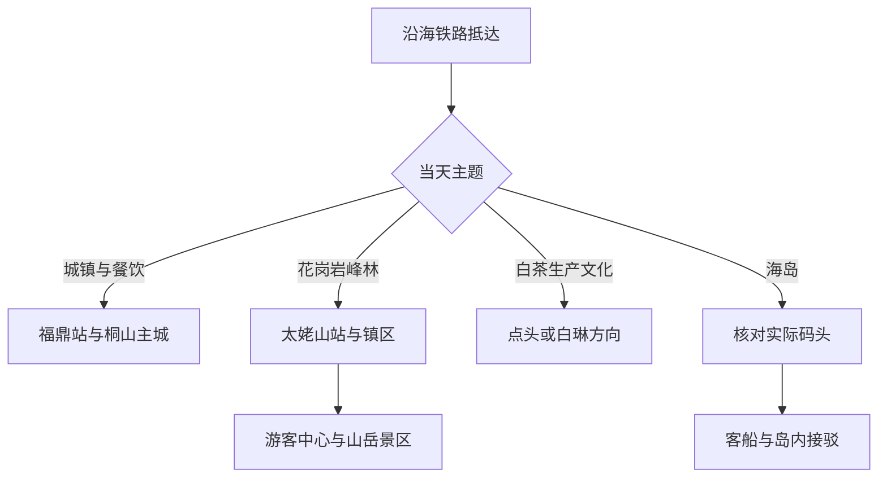
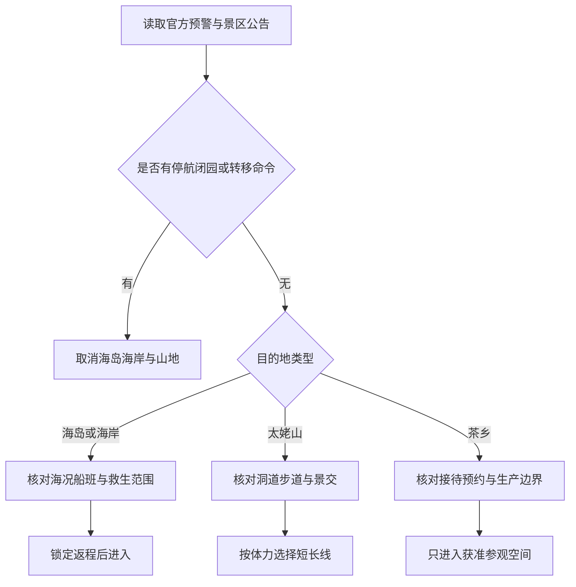

# 福鼎旅行指南

福鼎位于福建东北端、闽浙交界的山海之间。旅行者通常在桐山—桐城主城落脚，再从太姥山花岗岩峰林、点头与白琳的白茶生产乡镇、沙埕湾海岸和嵛山岛中选择方向。它不是一座靠步行串完的紧凑小城：主城、山岳景区、茶村、海滨和登岛码头分属不同交通尺度，一次只安排一个远线主题，体验会比追赶地名更完整。

> 建议停留：2–4 天；主城与太姥山各 1 天，白茶乡镇或嵛山岛另加 1 天 
> 旅行关键词：太姥山、花岗岩峰林、福鼎白茶、桐山城镇、沙埕湾、嵛山岛 
> 主要体力：主城中等步行；太姥山洞道与海岛山路较高 
> 最近研究：2026-08-12

## 城市速览

| 项目 | 旅行信息 |
|---|---|
| 主要旅行价值 | 在太姥山认识滨海花岗岩峰林与地质公园，在点头、白琳或合规茶庄园理解白茶的种植、萎凋和干燥，再用桐山主城、沙埕湾或嵛山岛补足城镇与海洋生活 |
| 建议停留 | 1 天只够主城与一处近郊，或完整游太姥山；2 天可组合主城和太姥山；3–4 天再选白茶乡镇、海岸或嵛山岛，海岛应按船班独立安排 |
| 较舒适季节 | 春秋通常更适合登山、茶乡和城镇慢行；春季采茶体验受茶期与接待安排影响；夏季湿热、雷雨与台风风险较高；冬季海风强，山上体感低于城区 |
| 预算特点 | 主城和公共文化空间可按中低预算安排；太姥山景交、跨镇车辆、茶体验、海岛船票与换宿会显著增加费用 |
| 步行强度 | 桐山—桐城可分段慢走；太姥山有连续石阶、窄洞和湿滑岩面；嵛山岛涉及上下船、坡路与暴露在风中的户外步行 |
| 主要天气风险 | 台风、海上大风、风暴潮、短时强降雨、雷电、山洪、滑坡、高温与大雾可使海岛、海岸或山岳路线整段失效 |
| 独行旅行 | 主城、铁路站和太姥山成熟入口较容易独立移动；茶村、偏远海岸和海岛的末端接驳及返程选择较少，应提前锁定正规交通 |
| 亲子旅行 | 主城场馆、城镇短段和管理完善的海滨可按年龄组合；窄洞、临边岩路、深水、上下船与生产茶园需要持续看护 |
| 长者与低体力旅行 | 可用主城单一场馆、车辆可达的茶文化空间或太姥山短线替代长距离穿洞；海岛与完整山岳环线通常负担较高 |
| 无障碍信息 | 铁路站、新建公共场馆和部分游客中心可能提供协助，但古城巷道、山岳洞道、茶园坡地、码头和客船的连续通行资料不足；设施连续性需向官方确认，并逐段核对 |

福鼎市法定行政代码为 **350982**，是宁德市代管的县级市。GeoNames `1792585` 是 **PPLA3 主城点**，用于锚定桐山—桐城连续建成区；法定县级市实体采用 Wikidata `Q629080` 与行政代码 `350982`。`Q629080` 当前结构化数据中的 GeoNames 标识为 `1811049`，对应的粒度更接近福鼎市行政实体。因此，`1792585` 与 `1811049` 不是两个同粒度城市记录：前者定位主城，后者用于交叉核对法定范围。

## 城市格局与游览区域

福鼎的旅行空间以沿海铁路和南北公路为骨架，但“站名相近”不等于景点步行可达。福鼎站接近主城生活区；太姥山站服务太姥山镇及山岳、海滨方向，抵达后仍需转乘；嵛山岛还多出码头和客船两段。点头、白琳、磻溪等白茶产区是仍在生产和生活的乡镇，公开参观入口、接待时间与商业茶庄园并不通用。

| 区域 | 主要内容 | 游览特点 | 与其他区域的关系 |
|---|---|---|---|
| 桐山—桐城—山前主城 | 福鼎市博物馆及公共文化空间、老城街巷、河岸与日常餐饮 | 可分段步行，适合抵达日、雨天和品尝肉片等本地小吃；新旧场馆地址需重查 | 福鼎站是主要铁路门户；去太姥山、点头、白琳或码头均需车辆 |
| 太姥山镇—山岳景区 | 太姥山山岳景区、花岗岩峰林洞道、游客中心 | 完整路线常有石阶、窄洞、湿滑与上下坡，至少留大半日至一日 | 太姥山站只是换乘节点；山岳景区与牛郎岗、九鲤溪等不是同一入口 |
| 点头—柏柳—磻溪茶乡 | 白茶交易、传统制作技艺、茶园与乡村聚落 | 茶期、天气、生产安排和接待资质决定可看内容；不默认进入厂房和茶园 | 可由主城或太姥山方向公路到达，一天选一个乡镇轴线 |
| 白琳镇 | 白琳老街、石材与茶业城镇景观、地方生活 | 老街适合短走，具体展馆、古厝和茶空间开放不稳定 | 可与一个已预约茶空间组合；不宜再硬拼太姥山完整环线 |
| 沙埕湾—海滨乡镇 | 沙埕港湾、牛郎岗、小白鹭等获准开放海滨空间 | 海岸分散，港口、渔业、核电及生产岸线边界复杂；海况优先于晴雨 | 部分海滨接近太姥山镇，但入口、票务和返程各自独立 |
| 嵛山岛 | 天湖、草甸、海岛村落与公开游线 | 受船班、海况、岛内接驳和山顶天气约束，适合独立一日或过夜 | 需先确认当日实际登船码头，不以地图直线距离推断航线 |

一次多日旅行的交通关系可简化为下面这张图。它强调的是换乘层级，不代表某条线路每天固定运行：

“太姥山”需要按父级范围和实际游线分层理解。太姥山国家级风景名胜区是包含山岳、海滨、岛屿等多类资源的保护与管理名称；旅行者通常购票进入的是具体景区或使用具体公共入口。本页把**太姥山山岳景区**作为一项完整核心景点，不再把夫妻峰、一线天、国兴寺遗址等内部节点拆成多个“必去景点”；嵛山岛因需要独立船班、岛内交通和住宿决策，按独立远线记录。九鲤溪、牛郎岗、翠郊古民居等也按各自入口理解，不因同属太姥山相关旅游体系就默认通票或连续游览。

茶乡同样存在尺度差异。福鼎白茶文化系统覆盖种植环境、地方品种、生产知识、社区生活和加工技艺，不是一座全天开放的主题公园。点头镇、柏柳村、白琳镇、磻溪镇及商业茶庄园各有自己的生活与生产边界；只有经营方明确接待、讲解和安全范围的空间才是游客入口。采茶季不应跨过田埂、移动遮阳设施、触碰萎凋中的茶叶或进入生产车间拍摄。

## 主要景点

优先级用于安排时间，不代表绝对排名：**A** 为首访核心，**B** 为按兴趣补充，**C** 为远郊、季节性或通常需要独立半天以上的目的地。车站、码头和游客中心只作为路线节点，不与正式景点并列；父级风景名胜区、具体售票景区与景区内部岩石或洞道按实际游览关系去重。

### 桐山主城与公共文化空间

| 景点 | 区域 | 类型 | 主要看点 | 建议用时 | 室内外 | 体力 | 预约风险 | 天气影响 | 优先级 |
|---|---|---|---|---:|---|---|---|---|---|
| 福鼎市博物馆及当期开放展陈 | 桐山或官方公布的新馆址 | 博物馆 | 以地方文物、桐山城镇历史和福鼎文化建立县域尺度；搬迁或展陈调整期间以公告为准 | 1–2 小时 | 室内 | 低 | 中 | 低 | B |
| 桐山—桐城老城生活街巷 | 桐山、桐城 | 城镇街区 | 观察福鼎主城日常商业、河岸、传统小吃与新旧城区关系，不把居民巷道当布景 | 1.5–3 小时 | 室外为主 | 低至中 | 低 | 中 | B |
| 福鼎市文化艺术中心当期开放场馆 | 新城公共文化片区 | 公共文化 | 图书馆、文化馆、博物馆或临展的组合，具体开放馆舍需逐一确认 | 1–3 小时 | 室内 | 低 | 中 | 低 | B |
| 福鼎站 | 主城外围 | 交通枢纽 | 铁路抵离与换乘主城的节点，不作为景点计数 | 0.5 小时 | 混合 | 低 | 中 | 低 | 路线节点 |

### 太姥山山岳与周边独立入口

| 景点 | 区域 | 类型 | 主要看点 | 建议用时 | 室内外 | 体力 | 预约风险 | 天气影响 | 优先级 |
|---|---|---|---|---:|---|---|---|---|---|
| 太姥山山岳景区 | 太姥山镇山地 | 地质景观／山岳 | 花岗岩峰林、石蛋地貌、洞道与山海关系；内部节点作为一条完整游线，不重复计数 | 5–8 小时 | 室外 | 高 | 中至高 | 高 | A |
| 太姥山游客中心 | 山岳景区入口 | 游客服务 | 换乘景交、确认当日开放洞道和选择短长路线的必要节点 | 0.5–1 小时 | 室内 | 低 | 中 | 中 | 路线节点 |
| 九鲤溪相关公开景区 | 磻溪—太姥山方向 | 河谷／户外活动 | 山水河谷与合规运营的体验项目；项目、年龄和水情规则变化快 | 3–6 小时 | 室外 | 中至高 | 中至高 | 高 | B |
| 牛郎岗海滨景区 | 太姥山镇滨海 | 海滨 | 管理入口内的沙滩、礁岸和滨海休闲；与山岳景区不是连续步行区 | 2–4 小时 | 室外 | 中 | 中 | 高 | B |
| 翠郊古民居 | 白琳方向 | 历史建筑 | 闽东北大型传统民居的空间与木构细节，开放范围服从文保和居民管理 | 1–2 小时 | 混合 | 中 | 中 | 中 | B |

太姥山最容易被低估的是洞道和石阶，而不是海拔数字。窄处可能要求侧身、俯身或连续用手保持平衡；雨后岩面、苔藓和台阶更滑。携带大背包、婴儿车、登机箱或行动辅助器具时，不应以“景区开放”推断完整环线可通行。先在游客中心说明同行者情况，选择当日实际开放的短线；任何未开放洞口、护栏外岩面和消防通道都不是替代路线。

### 白茶乡镇与生产文化

| 景点 | 区域 | 类型 | 主要看点 | 建议用时 | 室内外 | 体力 | 预约风险 | 天气影响 | 优先级 |
|---|---|---|---|---:|---|---|---|---|---|
| 点头镇公共茶文化空间 | 点头镇 | 茶文化／城镇 | 白茶交易与地方茶业生活；市场、展陈和活动开放以属地公告为准 | 2–4 小时 | 混合 | 低至中 | 中 | 中 | B |
| 柏柳村获准开放的茶文化点 | 点头镇柏柳村 | 农业文化／村落 | 福鼎大毫茶种质、传统制作技艺与村落关系；只进入明确接待范围 | 2–4 小时 | 混合 | 中 | 高 | 中至高 | B |
| 白琳老街 | 白琳镇 | 历史街区／生产城镇 | 老街尺度、茶业与地方商业记忆；居民生活和商铺营业不等于整片景区化 | 1.5–3 小时 | 室外为主 | 低至中 | 低 | 中 | B |
| 已预约的白茶庄园或非遗体验点 | 点头、磻溪、白琳等 | 农业体验 | 在经营方指导下理解萎凋、干燥、品鉴与茶园生态，不把销售介绍当唯一知识来源 | 2–4 小时 | 混合 | 高 | 中至高 | 中 | B |

福鼎白茶制作技艺属于中国传统制茶技艺及其相关习俗的一部分，福鼎白茶文化系统又于 2025 年获联合国粮农组织全球重要农业文化遗产认定。这两种国际框架分别关注活态技艺与农业文化系统，不等同于对某家茶企、某个产品等级或某条商业线路的背书。参观时可重点观察鲜叶如何在通风、温湿度和时间控制下完成萎凋与干燥，但不建议把“年份越久越好”“单一山头代表全城”等销售话术写成普遍事实。

### 沙埕湾海岸与嵛山岛

| 景点 | 区域 | 类型 | 主要看点 | 建议用时 | 室内外 | 体力 | 预约风险 | 天气影响 | 优先级 |
|---|---|---|---|---:|---|---|---|---|---|
| 沙埕港湾公共观景空间 | 沙埕镇 | 港湾／城镇 | 海湾、渔业城镇与山海地形；只在公共道路和获准岸线停留 | 2–4 小时 | 室外 | 中 | 中 | 高 | B |
| 小白鹭等获准开放海滨 | 福鼎东南海岸 | 海滨 | 沙滩与渔村景观，实际开放入口、救生服务和住宿经营需核对 | 2–4 小时 | 室外 | 中 | 中 | 高 | C |
| 嵛山岛公开游线 | 嵛山镇 | 海岛／山地 | 天湖、草甸、海岸与岛上社区共同形成的山海景观 | 6–9 小时或过夜 | 室外 | 高 | 高 | 高 | C |
| 当日实际登船码头 | 大陆沿岸 | 水运枢纽 | 核验航线、实名乘船、返航和岛内接驳，不作为景点计数 | 0.5–1.5 小时 | 混合 | 中 | 高 | 高 | 路线节点 |

嵛山岛的淡水湖、草甸和村落都处于真实的岛屿生态与生活系统中。草甸不等于可任意离开步道的牧场，水库与湖岸也不等于可下水的游乐场；岛上垃圾、淡水、消防、医疗和交通承载力有限。即使大陆一侧晴朗，外海风浪、大雾或雷暴仍可导致延航、停航或缩短游线。没有可确认的返航、住宿和天气窗口时，应把嵛山岛整段删除，而不是临时寻找非正规船只。

海岸、茶园和山地的开放判断可以按下列顺序进行：

生产空间不是“冷门景点”。沙埕湾渔港、作业码头、养殖海域、茶厂、茶园、石材加工区、能源设施和乡村道路各有安全及产权边界；地图可见、社交平台有人拍过或路边没有收费，都不构成进入许可。涉及船舶、无人机、夜间拍摄、采摘、进厂和跨越围挡时，应先取得运营方或属地管理者明确同意。

## 美食与餐饮

福鼎饮食适合按“主城小吃、山海食材、白茶体验”三类理解。肉片、挂霜芋、海鲜和茶点在主城较容易寻找；海边点餐则要先确认计价单位、称重、加工费和禁渔期供应。白茶既可清饮，也会进入茶宴或甜点，但茶的咖啡因、空腹饮用和个人敏感度仍需考虑。

| 菜品或餐饮类型 | 常见区域 | 一个人用餐与常见份量 | 风味、过敏原与饮食限制 | 排队风险与替代方法 |
|---|---|---|---|---|
| 福鼎肉片 | 桐山—桐城主城、小吃集中街区 | 小碗适合单人，可与其他小吃组合 | 常以猪肉和淀粉制成，汤底可能含胡椒、葱、香菜或动物高汤；无麸质需求者需问淀粉与调味料 | 热门店高峰排队，可找明码标价、现煮且客流稳定的同类店 |
| 肉燕、鱼片或本地汤食 | 主城、镇区 | 通常可点单份，适合早餐或简餐 | 可能含猪肉、鱼、虾皮、蛋、麸质或复合调味料；素食者应逐项确认汤底 | 不必只追一家老店，优先选择能说明原料与现煮时间的店 |
| 槟榔芋与挂霜芋类 | 主城餐馆、宴席菜与点心店 | 单人适合小份或与同伴共享 | 糖和油用量可能较高；“槟榔芋”是芋品名称，不含槟榔果 | 宴席大份可改点小吃店或甜品份量，先问是否现做 |
| 黄鱼、海鲜与贝类 | 主城、太姥山镇、沙埕等沿海镇区 | 鱼和贝类多按条、份或重量计价，单人先问最小份 | 鱼贝甲壳类过敏风险高；清蒸也可能使用酱油、料酒和葱姜 | 点单前确认品种、鲜活或冰鲜、计价单位、加工费和总价，再决定替代鱼类 |
| 白茶、茶点与茶宴 | 主城茶空间、已预约庄园、点头或白琳 | 清饮适合单人，茶宴更适合多人共享 | 茶含咖啡因；茶点可能含蛋奶、坚果、芝麻和麸质；药用宣称不作为饮食建议 | 不把免费品鉴等同于购买义务；可选择能说明年份、等级和价格的正规空间 |
| 畲族或乡村风味 | 茶乡及合规乡村接待点 | 多为多人桌餐，单人需提前问能否简餐 | 可能使用猪肉、酒糟、糯米、野菜或自制腌制品，过敏原信息未必标准化 | 提前说明人数与忌口；无接待确认时在镇区用餐，不临时进入农户 |
| 海岛简餐 | 嵛山岛公开经营区 | 选择少于主城，旺季可能需等候 | 海鲜占比高，淡水和冷链受岛屿条件限制；特殊饮食应自备合规补给 | 登岛前确认营业与供餐，随身带水和不易腐坏的备用食物，不依赖深夜加餐 |

购买白茶时先区分品类、原料等级、年份、储存和包装，再看价格。全球重要农业文化遗产与人类非遗是对文化系统和传统技艺的认定，不是每一饼茶的质量证书。散茶、紧压茶和陈年茶都应通过可追溯标签、合规经营者和个人口味判断；跨境携带茶叶还要遵守目的地海关与植物检疫规则。

## 经典行程

以下路线都以“方向少、回程明确”为原则。太姥山、白茶乡镇和嵛山岛不能因行政上同属福鼎就被压缩成连续打卡；船班、景区预约或正式接待是硬锚点，餐饮和街巷是可调整部分。

### 一日经典路线

**路线**：福鼎站或主城住宿 → 桐山—桐城老城短段 → 福鼎市博物馆或当期开放公共文化场馆 → 午间休息与福鼎肉片 → 已预约的近城茶文化空间 → 主城晚餐

- **串联逻辑**：全日留在主城或近城范围，用公共文化场馆理解地方历史，再从日常街巷、餐饮和白茶建立福鼎的基本印象；不承担山岳、海岛和跨镇返程风险。
- **预约锚点**：先确认博物馆或文化艺术中心实际开放馆舍、地址与闭馆日；茶体验只有在经营方明确接受散客时才加入。
- **休息安排**：午间在桐山或桐城成熟商业区休息，下午茶体验本身也可作为避雨和减少步行的时段。
- **时间不足时**：先删近城茶体验，再把老城步行缩成一条街巷；保留一个场馆与一顿主城餐饮即可。

### 两日城市路线

**第 1 天**：福鼎站 → 桐山—桐城主城 → 公共文化场馆 → 老城餐饮与白茶品鉴 
**第 2 天**：太姥山镇或太姥山站方向 → 太姥山游客中心 → 当日开放的山岳短线或标准线 → 原路返回住宿地

- **串联逻辑**：第一天以平缓城镇路线适应交通并核对第二天景区；第二天只做太姥山山岳景区，避免登山后再赶海滨、茶村或跨城交通。
- **预约锚点**：太姥山购票、入园时段、景交和开放洞道是第二天硬锚点；第一天场馆开放是软锚点。
- **休息安排**：第一天在主城室内休息；第二天在游客中心和景区正式服务点补水用餐，不在狭窄洞道入口久留。
- **时间不足时**：第一天删近城茶空间；第二天听从游客中心建议改走短线，不以加快速度完成长环线。

### 三日深度路线

**第 1 天**：桐山—桐城主城 → 福鼎市博物馆或公共文化场馆 → 主城小吃与白茶品鉴 
**第 2 天**：太姥山游客中心 → 山岳景区一条完整游线 → 太姥山镇或主城休息 
**第 3 天**：点头镇公共茶文化空间 → 已预约的柏柳村或合规茶庄园 → 返回主城

- **串联逻辑**：三天分别承担城镇认知、地质景观和农业文化三个主题，第三天只选点头轴线，不同时绕行白琳、磻溪和多个茶厂。
- **预约锚点**：第二天太姥山入园与景交、第三天茶文化接待缺一不可；采茶或制茶演示是否发生由茶期和生产安排决定。
- **休息安排**：第二天在游客中心及正式服务点分段休息；第三天在点头镇成熟餐饮区午休，不在茶园坡地安排长时间站立。
- **时间不足时**：第三天整段删除，或只保留点头镇公共空间；不要把茶庄园塞入太姥山返程傍晚。

### 雨天路线

**路线**：主城住宿 → 当期开放的福鼎市博物馆或文化艺术中心 → 室内白茶讲解与品鉴 → 主城午餐 → 老城有顶棚的短段或提前返店

- **适用条件**：只适用于普通降雨且城市交通正常。暴雨、台风、高温红色预警、山洪地质灾害风险或防汛响应期间，应留在安全建筑并服从停业、停课、停运和人员转移安排。
- **预约锚点**：确认场馆是否因维护、布展或应急响应闭馆；室内茶空间也需确认营业和接待。
- **休息安排**：把移动控制在主城成熟街区，使用正规交通直达场馆；午餐后可回住宿休息，不为完成路线穿越积水路段。
- **时间不足时**：只保留一个确认开放的室内场馆；若出现强对流或内涝预警，整条游览路线取消。

### 亲子或低体力路线

**亲子路线**：主城公共文化场馆 → 午餐与长休息 → 有明确接待的室内白茶体验 → 河岸或老城短段

- **减负方式**：选择有卫生间和室内座椅的场馆，以成年人全程照看儿童；不把热水冲泡交给幼儿，不进入生产车间、无护栏茶园、狭窄洞道或无救生管理海岸。
- **预约锚点**：确认场馆儿童预约、推车寄存和茶体验最低年龄；没有明确亲子接待时删除茶体验。
- **休息安排**：午餐后至少留一段室内休息，老城只走可随时退出的一小段。
- **时间不足时**：删老城短段，保留场馆和一顿本地餐；儿童疲劳、发热或天气闷热时直接返店。

**低体力路线**：车辆抵达主城场馆 → 午餐 → 车辆抵达的白茶文化空间或太姥山游客中心周边已确认短线 → 返回住宿

- **减负方式**：不进入一线天等窄洞和连续石阶，不安排嵛山岛；预订可近距离落客的入口，并在出发前向景区说明轮椅、手杖或心肺耐力需求。
- **预约锚点**：逐处确认落客点、电梯、无障碍卫生间、轮椅借用和短线是否当日开放；“有观光车”不等于全程无台阶。
- **休息安排**：每到一处先确认座椅与卫生间，午后保留可返回住宿的空档，不用等待景点关闭才返程。
- **时间不足时**：删远端白茶空间或太姥山短线，只在主城完成一个场馆与用餐。

### 白茶乡村一日路线

**路线**：主城或太姥山镇出发 → 点头镇公共茶文化空间 → 已预约的柏柳村接待点或单一茶庄园 → 点头镇休息 → 原路返回

- **适用条件**：适合对白茶种植、制作和乡村文化有明确兴趣，且已经得到接待方确认的旅行者；采摘和萎凋展示受季节、降雨和生产节奏影响，不能要求现场演示。
- **预约锚点**：接待地址、开始时间、费用、是否含采摘或品鉴、返程车辆和取消规则需要一起确认。
- **休息安排**：在点头镇用餐并补水，茶园只走接待方指定路径；雷雨、高温或坡地湿滑时改在室内讲解。
- **时间不足时**：只保留点头镇公共空间与一处已预约接待点；白琳、磻溪和其他茶企整段后移到下一天。

### 嵛山岛一日路线

**路线**：住宿地出发 → 当日实际登船码头 → 正规客船 → 嵛山岛公开接驳与天湖周边获准游线 → 预留充足时间返码头 → 大陆住宿地

- **适用条件**：只适用于往返船班、海况、岛内接驳和返程均已确认，同行者能够完成上下船与山地步行的情况；容易晕船、行动不稳或需严格医疗支持者宜放弃当日往返。
- **预约锚点**：实名船票、实际码头、开航与返航、儿童规则、岛内接驳和恶劣天气退改共同构成硬锚点，不能只买到去程。
- **休息安排**：船上按工作人员要求就座，岛上只在正式服务点补给；携带饮水、防晒、防风雨衣和个人常用药，避免在草甸暴晒时连续赶路。
- **时间不足时**：海岛必须整段删除，不能改乘非正规船只，也不把返航时间用于追加偏远村落；已在岛上时优先按运营方要求提前返码头。

## 住宿区域

住宿选择应先回答第二天去哪里。以主城为基地最稳妥，太姥山镇适合山岳或海滨早出，嵛山岛住宿只在船班和合规经营都确认后考虑。地图上的“近景区”可能隔着山路、港湾或不同入口，不能用直线距离替代实际车程。

| 区域 | 优点 | 缺点 | 适合人群 | 交通特点 |
|---|---|---|---|---|
| 福鼎站—桐城片区 | 铁路抵离、正规酒店和城市交通较集中，便于组织多个公路方向 | 与老城步行关系因具体位置而异，车站周边不等于餐饮最密集 | 首访、晚到早走、行李多、以主城为基地的旅行者 | 适合转公交或出租车去桐山、太姥山、点头及各公路方向 |
| 桐山老城及成熟商业区 | 小吃、日常商业与老城氛围集中，夜间用餐方便 | 老街停车、隔音、电梯和房间新旧差异大 | 重视本地餐饮、以主城慢行为主的旅行者 | 主城内步行和短途车辆方便，跨镇仍需另行接驳 |
| 太姥山镇 | 可缩短第二天前往山岳景区或部分海滨的时间 | 镇区、太姥山站、游客中心和各海滨入口仍不是同一点 | 太姥山完整一日、连续两天做山海方向的旅行者 | 到山岳景区需按官方交通换乘，去码头或海滨另查道路 |
| 点头或白琳镇区 | 便于茶文化专题和早间进入已预约空间 | 住宿、夜间餐饮、无障碍和临时叫车少于主城 | 已锁定茶庄园、希望放慢乡镇节奏的旅行者 | 公路接驳为主，订房前确认停车、最晚到店和次日返程 |
| 沙埕等沿海镇区 | 接近港湾和部分海岸生活，适合特定摄影或渔镇主题 | 海风、湿度、噪声、台风退改和夜间交通波动大 | 已有明确公共观景点、正规住宿和返程方案的旅行者 | 依赖公路；生产码头不承担普通游客接驳 |
| 嵛山岛合规住宿 | 可避开当日往返压力，体验早晚岛屿环境 | 船班、淡水、电力、餐饮、医疗、网络和退改均受岛屿条件影响 | 已确认天气窗口、合规经营和次日返航的旅行者 | 客船是唯一关键链路；停航时可能延住，需准备时间与预算缓冲 |

海滨和海岛住宿需要同时确认合法经营、消防疏散、热水与空调、码头接送、台风停航退改及紧急联络；茶乡民宿还要确认夜间到店道路、停车和早餐。不要入住渔排、工棚、未公告开放岛礁或以“野奢”为名但无法说明经营资质和应急方案的空间。

## 市内交通

福鼎没有覆盖主城、山岳、茶乡、海岸和海岛的一体化城市轨道网络。可把交通拆成三层：沿海铁路负责抵离，公交或正规车辆负责主城与乡镇，景交和客船负责最后一段。每个远线都应同时查清去程、末端接驳和返程，不能只查到最近车站或镇区。

| 场景 | 建议与取舍 | 行前需要重查的内容 |
|---|---|---|
| 从福鼎站抵达 | 更适合进入桐山—桐城主城、办理住宿和组织茶乡方向；站名不能代表已到老城核心 | 列车停靠、检票口、站前公交出租车、住宿接站、晚点与无障碍协助 |
| 从太姥山站抵达 | 适合太姥山镇、山岳或部分海滨方向，但仍需转乘至游客中心或具体入口 | 列车停靠、站到游客中心的实际方式、景交衔接、末班车与行李存放 |
| 主城内移动 | 桐山、桐城、山前之间可用公交、出租车和分段步行，行李多时不必跨片区硬走 | 线路、站点、首末班、临时绕行、无障碍车辆和雨天积水 |
| 前往太姥山 | 使用景区公告的游客中心、停车和景交体系，不把导航到山脚村道当正式入口 | 购票、入园时段、景交、洞道与步道开放、索道或其他设备状态、停车 |
| 前往点头、白琳或磻溪 | 公路公交、正规包车或自驾承担跨镇交通，预约地址要精确到接待点 | 客运站、班次、返程、包车资质、道路施工、茶期交通和接待方定位 |
| 前往海滨或沙埕湾 | 各海滨、港湾和村镇入口不同，不把港区道路当观光环线 | 景区开放、停车、救生范围、潮汐、沿海道路、末班车与夜间照明 |
| 前往嵛山岛 | 只使用当期官方或有资质运营方公布的码头与客船，往返和岛内接驳一起锁定 | 实际码头、实名购票、开航返航、行李、儿童、晕船、停复航和岛内车辆 |
| 步行与骑行 | 主城和公开慢行段适合短走；隧道、临崖公路、港区、无照明山路和生产便道不作捷径 | 高温、雷电、积水、落石、封路、共享交通停放和道路施工 |
| 自驾 | 去茶乡与分散海岸更灵活，但停车、连续山路、雾、台风和陌生村道会增加负担 | 高速与国省道施工、景区停车预约、充电、租车规则、地质灾害和防火管制 |

铁路订票时要看清“福鼎站”和“太姥山站”，再以住宿或景区官方地址核对下车点。所谓“直通车”“旅游专线”和码头船班都可能按季节、客流、天气和施工调整，新闻报道中的某一日时刻不能作为长期班次。涉及包车时保留车辆与驾驶员信息，不接受无资质揽客或以生产船、渔船替代客船。

## 不同旅行者须知

| 旅行维度 | 可行条件 | 主要取舍 | 需额外核对 |
|---|---|---|---|
| 独行旅行 | 福鼎站、主城、太姥山成熟入口和镇区餐饮较易独立使用 | 茶村、海岛和偏远海岸的单人包车成本高，返程和夜间叫车选择少 | 末班交通、正规车辆、手机信号、住宿最晚到店与紧急联系人 |
| 亲子旅行 | 主城场馆、室内茶文化和有救生管理的海滨可按年龄组合 | 窄洞、石阶、深水、礁石、上下船、热水冲泡和生产设备需要持续看护 | 儿童预约、身高年龄、推车寄存、救生衣、客船和体验活动规则 |
| 长者或低体力旅行 | 单一场馆、车辆直达茶空间和游客中心周边短线可减少步行 | 太姥山完整环线、嵛山岛、湿滑老街和频繁换乘通常负担较大 | 落客点、座椅、电梯、坡道、景交、轮椅借用、医疗点和陪同要求 |
| 无障碍需求 | 铁路站、新场馆和部分游客中心可能提供预约协助 | 公开资料不足以证明主城至洞道、茶园、沙滩、码头、客船和岛内的连续无障碍 | 电梯尺寸、轮椅装载、无障碍卫生间、登船坡度、客房及替代短线，均向官方确认 |
| 摄影旅行 | 主城生活、茶园、花岗岩峰林、港湾和海岛题材差异明显 | 光线、海况和生产作业不构成越界理由，追逐日出日落会增加夜间道路风险 | 日出前开放、三脚架、无人机空域、商业拍摄、村落许可与码头管理 |
| 预算有限 | 主城小吃、公共街巷和单一场馆可压低成本 | 跨镇包车、山岳景交、海岛船票、换宿和天气退改难同时节省 | 免费开放预约、优惠资格、交通套票边界、海鲜计价和住宿退改 |
| 晚出发或紧凑行程 | 只保留主城一个场馆和一顿本地餐，或太姥山镇一个已确认短段 | 太姥山完整线、茶乡、沙埕和嵛山岛都不适合到达日临时追加 | 最晚入场、末班交通、夜间叫车、行李存放和住宿保留 |
| 特殊天气或自然条件 | 普通降雨可转主城室内，高温时把短户外放在早晚 | 防台、防汛、雷暴、海上大风或地质灾害响应会关闭山岳、海滨、海岛和茶园 | 气象、海洋、应急、交通、景区和属地政府的预警与停复航公告 |

无障碍判断要按“铁路站—车辆—入口—内部路线—卫生间—返程”逐段确认。景区有观光车、游客中心有坡道或客船能搬运轮椅，都不能单独证明全程可行。太姥山洞道和嵛山岛山地对轮椅及行动辅助器具尤为不友好；资料不完整时，应选择主城场馆或已由运营方确认的短线，不用同行者临时抬行作为默认方案。

台风与海上大风期间，陆地是否下雨不是判断船舶安全的依据。出现停航、封港、景区闭园、人员上岸、停止户外活动或转移命令时，取消嵛山岛、沙滩、礁岸、山岳和茶园行程。暴雨停止后仍要等待道路、步道和景区管理方确认，防范山洪、滑坡、落石、倒木和松动护栏。

## 行前核对

| 核对事项 | 为什么需要重查 | 建议核对时间 | 官方入口 |
|---|---|---|---|
| 福鼎市博物馆与公共文化场馆 | 馆址、搬迁、闭馆日、临时展、团队预约和活动占用会变化 | 排路线时及到访前一日 | [福建省文化和旅游厅](https://wlt.fujian.gov.cn/)；福鼎市政府或场馆官方公告 |
| 太姥山山岳景区 | 入园时段、承载量、景交、洞道、步道和设备会因维护或天气调整 | 预约前、到访前一日及入园当天 | [福建省林业局：太姥山国家级风景名胜区](https://lyj.fujian.gov.cn/bmsjk/fjmsq/202012/t20201209_5479146.htm)；景区当期公告 |
| 点头、柏柳、白琳与茶庄园 | 生产季、接待范围、体验内容、消防和收费各自独立 | 订交通前及到访前一日 | [福建省文化和旅游厅](https://wlt.fujian.gov.cn/)；属地政府、非遗保护单位或经营方官方公告 |
| 牛郎岗、小白鹭与沙埕湾海岸 | 开放入口、救生范围、潮汐、海况、道路和停车会变化 | 出发前三日、前一日及当天 | [福建省海洋与渔业局](https://hyyyj.fujian.gov.cn/)；景区或属地政府公告 |
| 嵛山岛船班与岛内接驳 | 码头、开航、返航、实名购票和停复航受海况与运营安排影响 | 订住宿前、出发前一日及登船前 | [福建省海洋与渔业局：嵛山岛简介](https://hyyyj.fujian.gov.cn/xxgk/ztzl/sdmlhd/mlhd/201401/t20140121_1873597.htm)；有资质运营方当期公告 |
| 铁路 | 运行图、停靠站、实名购票和退改规则不能作为长期不变信息 | 开售时及出发当天 | [中国铁路 12306](https://www.12306.cn/) |
| 公交、客运与包车 | 首末班、站点、旅游专线、农村客运和车辆资质会变化 | 出发前一周及乘车当天 | [福建省交通运输厅](https://jtyst.fujian.gov.cn/)；运营企业或客运站公告 |
| 台风、暴雨、雷电与高温 | 闭园、停航、道路中断、山洪、滑坡和人员转移具有时效性 | 出发前三日、前一日及当天 | [福建省气象局](https://fj.cma.gov.cn/)；[福建省应急管理厅](https://yjt.fujian.gov.cn/) |
| 海浪、风暴潮与海上作业 | 陆地天气不能代表外海，渔港和客船可能提前进入防台状态 | 海岸或乘船前一日及当天 | [福建省海洋与渔业局](https://hyyyj.fujian.gov.cn/) |
| 森林火险与山地管理 | 太姥山及茶乡林地在干燥期可能禁火、封闭或限制户外活动 | 山地行程前一周及当天 | [福建省林业局](https://lyj.fujian.gov.cn/) |
| 白茶购买与体验 | 年份、等级、储存、价格、接待和活动日期变化快 | 预约或购买前 | [中国非物质文化遗产网：福鼎白茶制作技艺](https://www.ihchina.cn/Article/Index/detail?id=14724)；经营方可追溯信息 |
| 餐厅、民宿与海鲜 | 营业、合法经营、称重计价、过敏原和台风退改需要单独确认 | 排入路线前及到店前 | 商家官方账号、电话或属地监管平台；不以聚合点评代替确认 |
| 入境与携带物品规则 | 国际旅行者及携带茶叶出境者需按证件、口岸和目的地检疫要求确认 | 订票前及出发前 | [国家移民管理局](https://www.nia.gov.cn/)；目的地海关或检疫机构 |

遇到官方停航、封港、闭园、封路、停止户外活动或人员转移命令时，命令优先于门票、船票、住宿和拍摄计划。不要以已经付款、当地人仍在作业或短时间雨停为理由进入海岛、潮间带、渔港、洞道、峡谷、林区和临崖道路；保留公告截图和订单信息，按运营方渠道办理退改。

## 来源与更新记录

正文依据下列官方或开放数据资料重新组织和概括。建议停留、体力等级、优先级、住宿取舍和路线组合属于旅行编辑判断，不是来源机构的官方评级；班次、门票、开放时间、潮汐、采茶活动和具体接待只保留核对入口。

### 主要来源

| 来源 | 类型 | 支持内容 | 核验日期 |
|---|---|---|---|
| [福建省民政厅：福建省行政区划名录及代码](https://mzt.fujian.gov.cn/gk/tzgg/202607/t20260710_7176497.htm) | 省民政部门 | 福鼎市法定行政代码 `350982`、桐山街道及县级市层级 | 2026-08-12 |
| [Wikidata：Fuding（Q629080）](https://www.wikidata.org/wiki/Q629080) | CC0 开放数据 | 福鼎市法定实体、行政代码及 GeoNames `1811049` 的结构化交叉核对 | 2026-08-12 |
| [GeoNames：Fuding（1792585）](https://www.geonames.org/1792585/fuding.html) | CC BY 4.0 开放数据 | PPLA3 主城点、坐标和城市定位锚点 | 2026-08-12 |
| [UNESCO：Ningde UNESCO Global Geopark](https://www.unesco.org/en/iggp/ningde-unesco-global-geopark) | 联合国教科文组织 | 宁德世界地质公园由屏南白水洋、福安白云山和福鼎太姥山三个景区组成，支持属地和父级边界 | 2026-08-12 |
| [福建省林业局：太姥山国家级风景名胜区](https://lyj.fujian.gov.cn/bmsjk/fjmsq/202012/t20201209_5479146.htm) | 省林业部门 | 太姥山位于福鼎，风景名胜区包含山岳、河谷、海滨、岛屿等多个景区，及花岗岩地貌属性 | 2026-08-12 |
| [宁德世界地质公园：太姥山旅游服务中心](https://www.nd-geopark.com/gongyuandongtai/365.html) | 地质公园管理机构 | 太姥山旅游服务、咨询、导游、住宿和车辆组织需通过正式服务入口核对 | 2026-08-12 |
| [福建省海洋与渔业局：嵛山岛简介](https://hyyyj.fujian.gov.cn/xxgk/ztzl/sdmlhd/mlhd/201401/t20140121_1873597.htm) | 省海洋与渔业部门 | 嵛山岛的岛屿、海岸、天湖和草甸景观，以及其作为太姥山相关组成部分的尺度 | 2026-08-12 |
| [福建省文旅厅：嵛山岛旅游度假区公告](https://wlt.fujian.gov.cn/zwgk/tzgg/gggs/202603/t20260330_7117179.htm) | 省文旅部门 | 嵛山岛省级旅游度假区认定及山、湖、草、海、岛资源组合 | 2026-08-12 |
| [福建省政府：芳时山海·香约福鼎乡村旅游线路](https://www.fj.gov.cn/xwdt/mszx/202504/t20250402_6793844.htm) | 省政府、文旅部门 | 贯岭、前岐、磻溪、太姥山与嵛山岛分属不同节点，支持山海茶乡分日组织 | 2026-08-12 |
| [中国非物质文化遗产网：白茶制作技艺（福鼎白茶制作技艺）](https://www.ihchina.cn/Article/Index/detail?id=14724) | 国家非遗平台 | 福鼎白茶制作技艺的项目归属、萎凋与干燥等核心工艺 | 2026-08-12 |
| [UNESCO：Traditional tea processing techniques and associated social practices in China](https://ich.unesco.org/en/RL/traditional-tea-processing-techniques-and-associated-social-practices-in-china-01884?RL=01884) | 联合国教科文组织 | 中国传统制茶技艺及相关习俗的名录框架及白茶类别 | 2026-08-12 |
| [联合国粮农组织：福鼎白茶文化系统](https://www.fao.org/giahs/around-the-world/detail/china-fuding-tea-cultivation/fr) | 联合国粮农组织 | 2025 年全球重要农业文化遗产认定、茶园生态、传统知识和社区生计价值 | 2026-08-12 |
| [福建省农业农村厅：柏柳村与福鼎白茶制作技艺](https://nynct.fujian.gov.cn/ztzl/xczxdxjy/mslj/tscydd/ycyp/202409/t20240911_6516709.htm) | 省农业部门 | 点头镇柏柳村、福鼎大毫茶种质与传统制作技艺传承 | 2026-08-12 |
| [福建省文旅厅：非遗与旅游融合发展推荐目录](https://wlt.fujian.gov.cn/wldt/btdt/202409/P020250624350030178688.pdf) | 省文旅部门、非遗目录 | 福鼎白茶制作技艺、茶园与茶工坊参观体验的生产文化属性 | 2026-08-12 |
| [福建省政府：福鼎白茶与山海城市发展](https://www.fj.gov.cn/zwgk/ztzl/sxzygwzxsgzx/flsxkmh/202604/t20260425_7131254.htm) | 省政府、属地资料 | 白琳老街、白茶文化和福鼎山海产业城市定位 | 2026-08-12 |

### 更新记录

- 2026-08-12：建立首个完整版本；固定 GeoNames `1792585` 为 PPLA3 主城点，以 Wikidata `Q629080`、法定代码 `350982` 和其 GeoNames `1811049` 交叉核对县级市范围；按桐山主城、太姥山山岳、白茶乡镇、沙埕湾海岸和嵛山岛分尺度组织；明确太姥山父级风景名胜区与具体景区去重，补充茶园、港湾、海岛生产保护边界及台风、海况、无障碍和返程条件。
