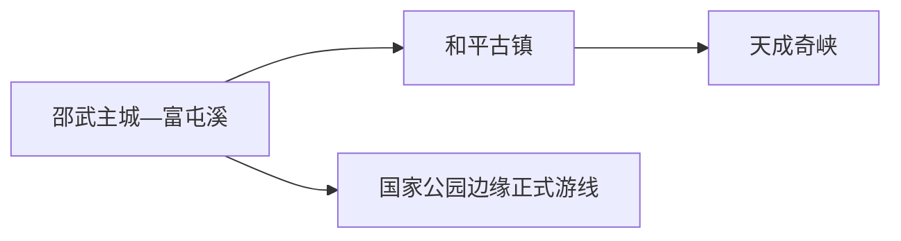
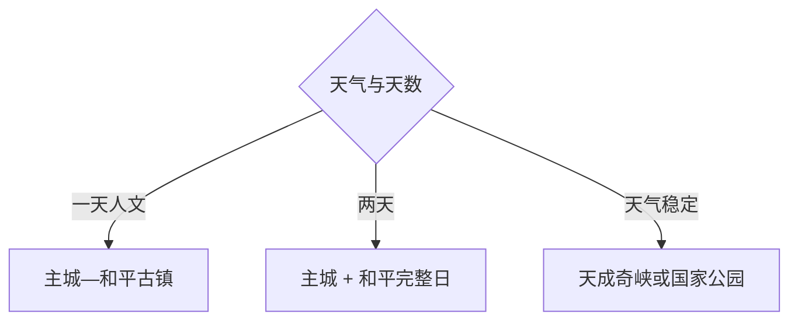

# 邵武旅行指南

邵武适合把富屯溪主城作为交通和住宿基地，再从和平古镇、天成奇峡或武夷山国家公园边缘的正式游线中选一条完整日。首访优先“主城半日 + 和平古镇一日”；峡谷和国家公园方向受降雨、森林防火和道路影响更大，适合作为天气良好时的替换项。

> 建议停留：主城 1 天；和平古镇或自然远线各另留 1 天 
> 旅行关键词：富屯溪、和平古镇、古驿道、天成奇峡、闽北民俗、武夷山国家公园 
> 主要体力：主城低至中等；古镇中等；峡谷和山地高 
> 最近研究：2026-08-13

## 城市速览

| 项目 | 旅行信息 |
|---|---|
| 主要旅行价值 | 从富屯溪山城进入和平古镇的古驿与民俗，再用峡谷森林认识闽北山地 |
| 建议停留 | 1 天主城或和平；2 天完成二者；3 天再选天成奇峡或国家公园边缘正式线路 |
| 较舒适季节 | 春秋较适合；春夏暴雨频繁，盛夏湿热，秋冬关注森林火险 |
| 预算特点 | 主城中低；古镇、峡谷车辆、景交与山地住宿增加预算 |
| 步行强度 | 主城可分段步行，古镇石板和峡谷台阶累积体力 |
| 主要天气风险 | 暴雨、山洪、滑坡、雷电、台风外围影响、高温与森林火险 |
| 独行旅行 | 主城与和平较容易；山地优先正规接驳与明确返程 |
| 亲子旅行 | 主城文博、和平古镇短线和低强度自然教育可选 |
| 长者与低体力旅行 | 一馆一街、车辆到古镇核心，峡谷路线按体力取舍 |
| 无障碍信息 | 城市场馆可咨询，古镇、古驿道与峡谷的设施连续性需向官方确认 |

## 城市格局与游览区域

邵武市是南平市代管的县级市，法定代码 `350781`。固定 GeoNames `1795857` 是主城居民点，Wikidata `Q1025451` 表达法定邵武市，目前未配置 P1566；本页以固定点定位铁路和住宿，以法定代码核定和平镇、肖家坊及国家公园相关边界。

| 区域 | 主要内容 | 怎么安排 | 与其他区域的关系 |
|---|---|---|---|
| 邵武主城 | 地方文博、李纲文化、富屯溪与城市服务 | 半日至一天，住宿基地 | 到各远线依赖公路 |
| 和平古镇 | 历史文化名镇、古驿道、民居与非遗 | 完整半日至一天 | 可与邻近一处短线组合 |
| 天成奇峡 | 峡谷、溪流与漂流等当期项目 | 天气稳定时独立一天 | 与和平同方向但各自用时和票务独立 |
| 国家公园边缘 | 森林、村镇与自然教育 | 只用管理方批准入口和线路 | 国家公园、风景区和行政边界不完全重合 |

武夷山国家公园福建片区涉及邵武，但邵武市域并非全部属于国家公园。游览采用访客管理部门公布的入口和线路；核心保护空间、科研监测、封闭林道、茶竹生产区和居民生产生活区按相应管理边界活动。

## 主要景点

### 主城与历史文化

| 景点 | 区域 | 类型 | 主要看点 | 建议用时 | 室内外 | 体力 | 预约风险 | 天气影响 | 优先级 |
|---|---|---|---|---:|---|---|---|---|---|
| 邵武市博物馆等地方文博 | 主城 | 地方博物馆 | 闽北城市史、地方文物与区域交通 | 1.5–2.5 小时 | 室内 | 低 | 高 | 低 | A |
| 李纲纪念馆等公开文化场馆 | 主城 | 名人纪念 | 李纲生平、宋代历史与地方文化 | 1–2 小时 | 室内 | 低 | 高 | 低 | A |
| 富屯溪城市公共空间 | 主城 | 滨水与城市生活 | 山城、河流和日常生活 | 1–2 小时 | 室外 | 低 | 低 | 高 | B |
| 熙春公园等城市休闲空间 | 主城 | 城市公园 | 主城短程休息与季节植被 | 1–2 小时 | 室外 | 低至中 | 低 | 高 | B |

### 古镇与自然远线

| 景点 | 区域 | 类型 | 主要看点 | 建议用时 | 室内外 | 体力 | 预约风险 | 天气影响 | 优先级 |
|---|---|---|---|---:|---|---|---|---|---|
| 和平古镇景区 | 和平镇 | 历史文化名镇 | 古街、古驿道、民居、祠堂与闽北民俗 | 4–6 小时 | 室外为主 | 中 | 高 | 高 | A |
| 天成奇峡景区 | 肖家坊方向 | 峡谷与水景 | 峡谷、溪流、步道及当期水上项目 | 1 天 | 室外 | 高 | 很高 | 很高 | A |
| 云灵山等正式开放山地项目 | 市域山地 | 森林与户外 | 山林、溪谷和经营性户外体验 | 1 天 | 室外 | 高 | 很高 | 很高 | B |
| 武夷山国家公园邵武片区公开访客线 | 市域西北 | 国家公园与自然教育 | 森林生态、古驿道和社区文化 | 1 天 | 室外 | 中高 | 很高 | 很高 | B |

和平古镇内各祠堂、民居、书院和街巷按一个古镇系统理解，选择当日开放的代表性建筑即可。天成奇峡的峡谷、漂流和内部体验共享同一景区，按水位、年龄与运营状态选项目。

## 美食与餐饮

邵武饮食可从游浆豆腐、和平豆腐、包糍、脚掌糍和闽北家常菜入手。古镇与山地餐饮受客流和营业日影响，主城更方便控制份量与过敏原。

| 类型 | 常见区域 | 一人份量 | 饮食提示 | 选择方法 |
|---|---|---|---|---|
| 游浆豆腐与豆腐宴 | 和平、主城 | 可点小份 | 大豆、卤水、肉汤和交叉接触 | 先问做法和是否含肉 |
| 包糍、脚掌糍等米食 | 主城、和平 | 小份 | 米粉、肉馅、笋、花生或芝麻 | 少量组合品尝 |
| 闽北笋与菌菇菜 | 正规餐馆 | 多为共享菜 | 物种、充分加热、腌制与盐分 | 选择可追溯食材 |
| 溪鱼与山地家常菜 | 和平、山地接待点 | 整鱼偏多人 | 鱼刺、时价、来源和油盐 | 一人换鱼汤或小份肉菜 |

## 经典行程

### 一日经典路线

**路线**：邵武主城出发 → 和平古镇正式入口 → 古街与代表性开放建筑 → 镇区午餐 → 返回

- **串联逻辑**：把古镇作为一个完整系统，减少在乡镇间转场。
- **预约锚点**：景区开放、代表性建筑、讲解和返程。
- **休息安排**：镇区餐厅和公共座椅。
- **时间不足时**：只走古街核心与一座开放建筑。

### 两日城市路线

**第 1 天**：市博物馆 → 李纲文化场馆 → 富屯溪短段 
**第 2 天**：和平古镇完整日

- **串联逻辑**：先看城市史，再到古镇观察闽北民居与古驿。
- **预约锚点**：场馆和古镇开放。
- **休息安排**：主城与和平镇区分别午休。
- **时间不足时**：第一天删滨水延伸，第二天保留古镇核心。

### 三日深度路线

**第 1 天**：主城 
**第 2 天**：和平古镇 
**第 3 天**：天成奇峡或国家公园邵武片区公开线二选一

- **串联逻辑**：第三天只选一个自然系统，给山路和天气留余量。
- **预约锚点**：入口、车辆、水上项目或访客管理。
- **休息安排**：游客中心和镇区补给。
- **时间不足时**：删除第三天。

### 雨天路线

**路线**：邵武市博物馆 → 坐席午餐 → 李纲纪念等室内场馆

- **适用条件**：城区交通正常的普通降雨。
- **预约锚点**：场馆开放和入馆。
- **休息安排**：室内坐席为主。
- **时间不足时**：只保留一座馆；暴雨时暂停峡谷和山地。

### 亲子与低体力路线

**亲子路线**：市博物馆 → 午休 → 和平古镇核心短段 
**低体力路线**：车辆到主城场馆 → 坐席午餐 → 富屯溪平缓短段

- **减负方式**：亲子减少古建筑连续参观；低体力路线取消峡谷和长坡。
- **预约锚点**：儿童活动、推车、轮椅、卫生间与下客点。
- **休息安排**：馆内与餐厅。
- **时间不足时**：两条路线均保留一馆。

### 山地一日路线

**路线**：邵武或和平住宿点 → 天成奇峡或国家公园公开线二选一 → 正式服务点午餐 → 返回

- **适用条件**：无暴雨、雷电、山洪或森林封控，车辆和返程明确。
- **预约锚点**：景区票务、漂流年龄、访客线路、停车与末班。
- **休息安排**：游客中心和镇区。
- **时间不足时**：改和平古镇，不压缩峡谷完整游线。

## 住宿区域

| 区域 | 优点 | 取舍 | 适合人群 | 交通特点 |
|---|---|---|---|---|
| 邵武主城 | 铁路、餐饮、医疗与多方向交通集中 | 到古镇和峡谷有车程 | 首访与多日游 | 默认基地 |
| 和平镇区 | 便于古镇慢游与次日山地 | 夜间服务少于主城 | 人文摄影和两日南线 | 先锁定返程或次日车辆 |
| 正规山地接待点 | 便于清晨自然线 | 天气、网络、医疗和退改差异大 | 山地专题 | 核对道路、防火与应急方式 |

## 市内交通

| 场景 | 建议与取舍 | 行前核对 |
|---|---|---|
| 铁路抵达 | 邵武站等按票面进入主城 | 车次、站口、公交和夜间接驳 |
| 主城内部 | 公交、步行和短程出租 | 末班、施工、停车与共享单车范围 |
| 和平古镇 | 正规客运、出租或合规包车 | 上下车点、景区入口和返程 |
| 峡谷与国家公园 | 按运营方或管理方公布路线进入 | 山路、景交、天气、防火和救援 |

## 不同旅行者须知

| 旅行者 | 怎么选 | 主要取舍 | 额外核对 |
|---|---|---|---|
| 独行 | 主城—和平单线 | 山地晚返和弱通信 | 车辆、末班、住宿和紧急联系人 |
| 亲子 | 文博、古镇短线和自然教育 | 漂流、峡谷和长步道按年龄选择 | 儿童票、护具、推车和卫生间 |
| 长者或低体力 | 一馆一街、车辆点到点 | 石板、门槛和峡谷台阶 | 轮椅、座椅、坡道和下客点 |
| 摄影 | 富屯溪、古镇和山地 | 居民、文物、林地和航拍边界 | 三脚架、无人机、日出车辆和商业拍摄 |
| 预算有限 | 主城加和平古镇 | 山地车辆和安全项目保留预算 | 联票、接驳、停车和退改 |

## 行前核对

| 事项 | 何时核对 | 官方入口 | 怎么处理 |
|---|---|---|---|
| 和平古镇 | 出发前一周及前一日 | [福建省文旅厅和平村资料](https://wlt.fujian.gov.cn/zwgk/ztzl/fjsjplyc/npsswshpc/201908/t20190808_5294516.htm) | 按开放建筑和活动组合 |
| 峡谷与山地 | 订车前、前三日及当天 | [福建省文化和旅游厅](https://wlt.fujian.gov.cn/) | 暴雨或封控时改古镇与主城 |
| 国家公园 | 排路线前及当天 | [武夷山国家公园](https://wysgjgy.fujian.gov.cn/) | 只选批准访客入口和线路 |
| 铁路 | 购票时及当天 | [中国铁路 12306](https://www.12306.cn/) | 按票面站名和末班接驳 |

## 来源与更新记录

### 主要来源

| 来源 | 类型 | 支持内容 | 核验日期 |
|---|---|---|---|
| [福建省文旅厅：和平村](https://wlt.fujian.gov.cn/zwgk/ztzl/fjsjplyc/npsswshpc/201908/t20190808_5294516.htm) | 省级文旅部门 | 和平古镇、非遗、天成奇峡与游览关系 | 2026-08-13 |
| [福建省文旅厅：武夷山国家森林步道旅游专项规划](https://wlt.fujian.gov.cn/zwgk/wlyw/zykf/202112/t20211231_5805761.htm) | 省级文旅规划 | 邵武在森林步道文旅带中的位置，以及和平古镇、天成奇峡等方向的区域串联 | 2026-08-13 |
| [福建省政府：邵武旅游公路](https://www.fujian.gov.cn/zwgk/ztzl/sxzygwzxsgzx/flsxkmh/202603/t20260321_7114267.htm) | 省政府 | 和平古镇、云灵山与市域旅游交通 | 2026-08-13 |
| [武夷山国家公园简介](https://wysgjgy.fujian.gov.cn/gygk/gyjj/) | 国家公园管理机构 | 邵武片区及保护管理边界 | 2026-08-13 |
| [GeoNames 1795857](https://www.geonames.org/1795857/) | 开放地理数据 | 固定主城点 | 2026-08-13 |
| [Wikidata Q1025451](https://www.wikidata.org/wiki/Q1025451) | 开放结构化数据 | 法定邵武市实体 | 2026-08-13 |

### 更新记录

| 日期 | 更新内容 |
|---|---|
| 2026-08-13 | 首次完成邵武独立旅行研究，建立主城、和平古镇、天成奇峡与国家公园边缘的选择框架，并补充山洪、森林与生产生活边界 |
