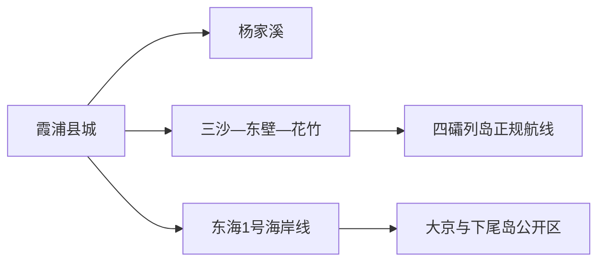
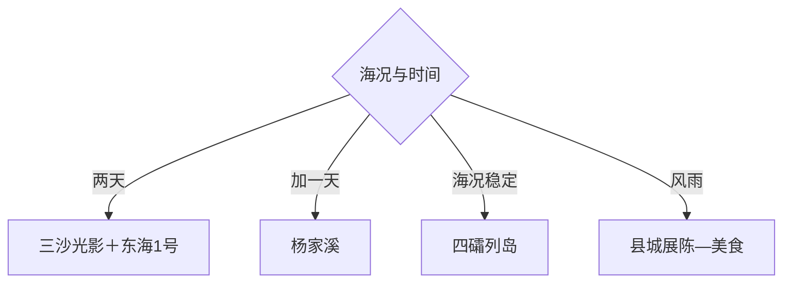

# 霞浦旅行指南

霞浦适合围绕海岸光影、滩涂生产景观与离岛航线慢行：三沙—东壁—花竹是一条日出日落线，东海1号串联大京、下尾岛等南部海岸，杨家溪看榕枫与溪谷，四礵列岛需单独服从船班和海况。三天较适合首次到访。

## 城市速览

| 项目 | 信息 |
|---|---|
| 主线 | 松城城区—杨家溪—三沙东壁—花竹—东海1号—四礵列岛 |
| 停留 | 海岸摄影2天；增加离岛共3–4天 |
| 住宿 | 县城交通稳定，东壁适合日落，三沙适合海岸与离岛接驳 |
| 交通 | 高铁到霞浦站，县内用旅游专线、公交、预约车；离岛乘正规客运船 |
| 风险 | 台风大风、潮汐、海雾、礁石湿滑、停航与滩涂养殖作业 |
| 边界 | 军事与港口区域、养殖滩涂、无人岛保护区、航道和封闭海岸按许可进入 |

## 城市格局与游览区域

固定 `Songcheng / GeoNames 1794060` 对应霞浦县城松城片区，本页以法定霞浦县 `Q241877` 组织。北部三沙、南部东海1号和离岛是三套行程，日出日落点随季节、潮汐和天气选择。

## 主要景点

| 景点 | 区域 | 类型 | 核心体验 | 用时 | 环境 | 体力 | 预约风险 | 天气影响 | 优先级 |
|---|---|---|---|---:|---|---|---|---|---|
| 东壁村与光影步道 | 三沙镇 | 海岸村落 | 海上日落、民宿与崖岸步道 | 3–6小时 | 室外 | 中 | 很高 | 极高 | A |
| 花竹村公开观景点 | 三沙镇 | 海岸摄影 | 海上日出与岛屿远眺 | 2–4小时 | 室外 | 中 | 高 | 极高 | A |
| 杨家溪榕枫公园公开区 | 牙城镇 | 溪谷生态 | 古榕、枫林、溪流与村落 | 3–6小时 | 室外 | 中 | 很高 | 很高 | A |
| 东海1号风景观光道 | 长春镇等 | 海岸公路 | 沙滩、渔村、海蚀地貌与观景台 | 1天 | 室外 | 中 | 高 | 极高 | A |
| 大京沙滩公开区 | 长春镇 | 海滩 | 沙岸、海湾与滨海休闲 | 3–6小时 | 室外 | 中 | 高 | 极高 | B |
| 下尾岛当期开放区 | 长春镇 | 海蚀地貌 | 海蚀洞、礁岩与潮间带观察 | 2–4小时 | 室外 | 中高 | 极高 | 极高 | B |
| 四礵列岛正规开放岛线 | 海岛乡 | 离岛 | 海岛草坡、海蚀崖与航海体验 | 1天 | 室外 | 高 | 极高 | 极高 | A |
| 霞浦县博物馆或温麻文化展陈 | 县城 | 地方文博 | 海洋县史、温麻文化与民俗 | 1.5–3小时 | 室内 | 低 | 很高 | 低 | B |

## 美食与餐饮

可按季节选择海蛎、紫菜、海带、黄鱼、蛏、剑蛏和本地小海鲜，先问活鲜重量、时价和加工方式。摄影早出可提前约早餐；海岛和海岸日自备饮水，生食与来源不明贝类按食品安全信息取舍。

## 经典行程

### 一日经典线
**路线**：三沙花竹日出—休息—东壁步道与日落。**逻辑**：在同一北部走廊完成两种光线。**预约锚点**：天气、接驳与住宿。**休息**：三沙镇。**删除条件**：低能见度时只保留村落慢游。

### 三日海岸线
**路线**：首日杨家溪—东壁；次日东海1号；三日县城或四礵列岛。**逻辑**：溪谷、陆岸与海岛逐层展开。**预约锚点**：车辆、船票和住宿。**休息**：县城与三沙。**删除条件**：海况不稳时第三日留县城。

### 摄影光影线
**路线**：花竹日出—小皓或公开滩涂观景点—东壁日落。**逻辑**：按太阳方位和潮汐选点。**预约锚点**：潮汐、云量、正规机位与交通。**休息**：三沙。**删除条件**：大雾台风或封控时取消。

### 东海1号线
**路线**：高罗或大京—海岸观景台—下尾岛当期开放区。**逻辑**：沿南部海岸单向移动。**预约锚点**：道路、潮汐和各点开放。**休息**：大京。**删除条件**：高潮、大浪或礁岸关闭时跳过下尾岛。

### 四礵列岛线
**路线**：正规码头—客运船—开放岛屿导览—当日返航或许可住宿。**逻辑**：船班决定全部节奏。**预约锚点**：实名船票、海况、救生装备和返航。**休息**：客船与岛上服务点。**删除条件**：停航、大风或名额不足时取消。

### 亲子自然线
**路线**：县级展陈—杨家溪短段—县城海鲜餐。**逻辑**：用室内认知配合安全溪谷步行。**预约锚点**：展馆、景区交通与儿童设施。**休息**：杨家溪。**删除条件**：暴雨时只留展陈。

### 低体力线
**路线**：县级展陈—车辆走东壁观景点—三沙午休。**逻辑**：以落客点和短步道替代长海岸线。**预约锚点**：停车、座椅和无障碍。**休息**：东壁民宿区。**删除条件**：拥堵时留县城。

## 住宿区域

霞浦县城适合高铁、餐饮和多方向换线；东壁适合日落与清晨海岸；三沙适合花竹和正规离岛航线；东海1号沿线住宿适合南部慢游。海景民宿关注真实视野、停车、隔音和台风停航退改。

## 市内交通

高铁站到县城和三沙可查询当期旅游专线。摄影点跨度大，包车应明确合法营运、等待时长与返程；离岛只走公布码头和客运航线。潮汐会改变礁岸与滩涂可达性，路线以安全开放为准。

## 不同旅行者须知

摄影者先看潮汐云量再选机位；海岛旅行者保留机动日；亲子家庭优先杨家溪和沙滩公开区；低体力者用车辆观景。养殖滩涂、渔排生产区、军事设施、未开放无人岛、航道和高潮封闭礁岸保留明确限制。

## 行前核对

- 核对台风、大风、海雾、潮汐、船班、旅游专线和海岸道路。
- 核对杨家溪、下尾岛、四礵列岛及博物馆的开放、预约与退改。
- 海岸穿防滑鞋，船上穿救生衣，拍摄尊重养殖生产和村民生活。

## 来源与更新记录

| 来源 | 支持内容 | 核验日期 |
|---|---|---|
| [福建省政府：霞浦海岸文旅](https://www.fujian.gov.cn/zwgk/ztzl/sxzygwzxsgzx/flsxkmh/202508/t20250825_6995045.htm) | 东壁、东海1号、花竹与海上项目 | 2026-09-01 |
| [福建省政府：霞浦海岛旅游](https://www.fj.gov.cn/xwdt/mszx/202602/t20260215_7099368.htm) | 高铁接驳、杨家溪、东壁、东海1号与海岛线 | 2026-09-01 |
| [GeoNames 1794060](https://www.geonames.org/1794060/) | Songcheng 固定县城点 | 2026-09-01 |
| [Wikidata Q241877](https://www.wikidata.org/wiki/Q241877) | 霞浦县实体与跨库标识 | 2026-09-01 |

| 日期 | 更新 |
|---|---|
| 2026-09-01 | 首次完成霞浦旅行研究，按北部光影、南部海岸、溪谷与离岛组织。 |
