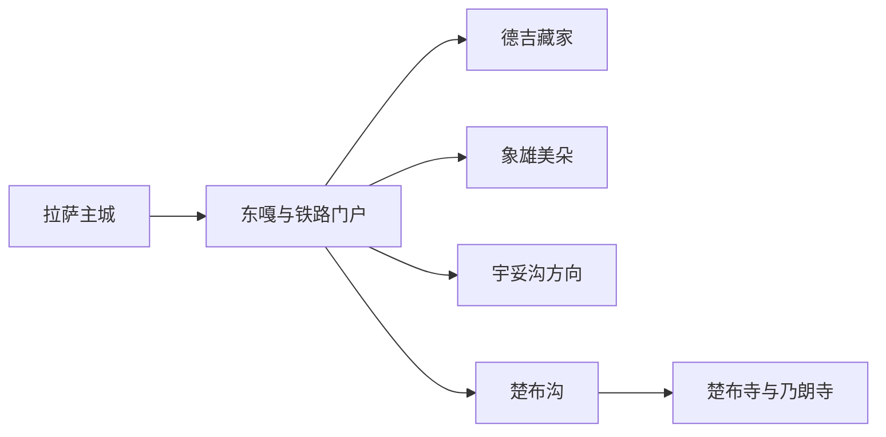
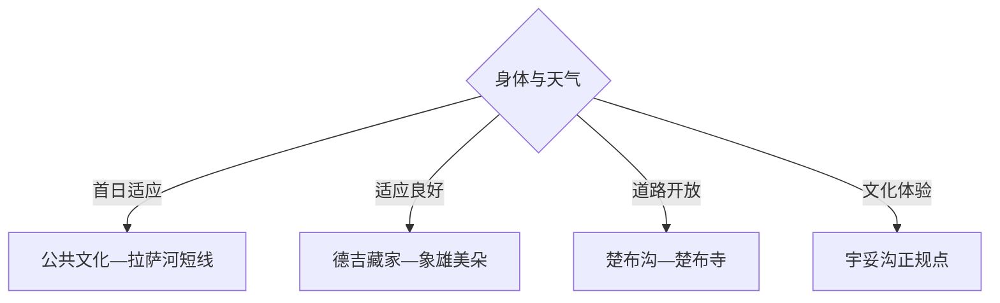

# 堆龙德庆旅行指南

堆龙德庆位于拉萨主城西部，铁路门户、新城与楚布沟高原河谷构成两种截然不同的旅行尺度。首日适合低强度适应与乡村文化，楚布寺、乃朗寺和沟谷活动则在身体适应、道路与宗教开放均确认后单独成日。

## 城市速览

| 项目 | 信息 |
|---|---|
| 主线 | 拉萨西站—东嘎新城—德吉藏家—象雄美朵—楚布沟 |
| 停留 | 适应与乡村1天；楚布沟宗教山地另加1天 |
| 住宿 | 东嘎靠近拉萨主城和铁路，乡村住宿适合已适应高原者 |
| 交通 | 拉萨主城公路接入，楚布沟用合规车辆并预留长时段 |
| 风险 | 高原反应、紫外线、雷雪、山洪、落石和宗教活动调整 |
| 边界 | 寺院宗教空间、牧场农田、山地生态区和铁路作业区按开放规则进入 |

## 城市格局与游览区域

固定 `Doilungdêqên / GeoNames 6559683` 对应堆龙德庆城市点，本页以法定堆龙德庆区 `Q1012430` 组织。东部与拉萨建成区相连，楚布沟向西北深入高原河谷，交通、海拔和服务条件差异明显。

## 主要景点

| 景点 | 区域 | 类型 | 核心体验 | 用时 | 环境 | 体力 | 预约风险 | 天气影响 | 优先级 |
|---|---|---|---|---:|---|---|---|---|---|
| 楚布寺 | 楚布沟 | 宗教与文物 | 噶玛噶举历史、寺院建筑与河谷环境 | 半日至1天 | 室内外 | 中高 | 极高 | 极高 | A |
| 乃朗寺当期开放区 | 楚布沟 | 宗教建筑 | 沟谷寺院、地方宗教与山地聚落 | 2–4小时 | 室内外 | 中高 | 极高 | 极高 | B |
| 楚布沟公开游线 | 古荣方向 | 高原河谷 | 河谷、村落、山地骑行或徒步主题 | 1天 | 室外 | 高 | 极高 | 极高 | A |
| 德吉藏家正规接待点 | 区内乡村 | 乡村文化 | 藏式民居、餐饮与社区旅游 | 2–5小时 | 室内外 | 低中 | 极高 | 中 | A |
| 象雄美朵生态文化园当期开放区 | 区内 | 生态与文化 | 高原园林、文化活动和家庭休闲 | 半日 | 室外为主 | 低中 | 很高 | 高 | B |
| 宇妥沟藏医药体验正规点 | 区内 | 藏医药文化 | 宇妥文化、药材知识与养生展示 | 2–4小时 | 室内外 | 低中 | 极高 | 中 | B |
| 堆龙德庆区公共文化场馆 | 东嘎 | 公共文化 | 区史、非遗与当期活动 | 1.5–3小时 | 室内 | 低 | 极高 | 低 | B |
| 拉萨河堆龙段公共空间 | 东部 | 河谷城市 | 拉萨河、城市西拓与高原日常 | 1–3小时 | 室外 | 低 | 中 | 高 | C |

## 美食与餐饮

可在东嘎和正规乡村接待点尝藏面、甜茶、糌粑、牦牛肉、酥油茶和藏式家常菜。初到高原以清淡、少量和充分补水为主；乳制品、酥油和青稞需结合个人消化情况，乡村餐饮提前预约并确认价格。

## 经典行程

### 一日适应线
**路线**：区级公共文化场馆—东嘎午餐—拉萨河公共空间短段。**逻辑**：低强度建立方位并观察身体反应。**预约锚点**：场馆开放。**休息**：东嘎。**删除条件**：出现明显不适时返回住宿并就医评估。

### 两日文化线
**路线**：首日适应；次日德吉藏家—象雄美朵或宇妥沟二选一。**逻辑**：在近距离活动后再增加乡村体验。**预约锚点**：正规接待、供餐和车辆。**休息**：接待点。**删除条件**：身体未适应时保留东嘎短线。

### 三日楚布沟线
**路线**：前两日适应；第三日楚布沟—楚布寺—乃朗寺当期开放点。**逻辑**：高海拔长线放在适应后。**预约锚点**：寺院、道路、天气与返程。**休息**：沟内正规服务点。**删除条件**：雷雪、山洪、落石或宗教活动调整时整段取消。

### 雨雪天文化线
**路线**：区级公共文化场馆—正规藏医药展陈—东嘎用餐。**逻辑**：减少山路和室外停留。**预约锚点**：两处接待。**休息**：东嘎。**删除条件**：交通预警时留在住宿附近。

### 亲子乡村线
**路线**：德吉藏家—象雄美朵短线—返回东嘎。**逻辑**：以生活文化和开放园区替代高强度山地。**预约锚点**：儿童接待、餐饮和活动。**休息**：乡村接待点。**删除条件**：儿童出现高原不适时立即结束。

### 楚布沟宗教线
**路线**：东嘎—楚布寺—沟谷公开村落—原路返回。**逻辑**：以一座核心寺院和河谷地理为主。**预约锚点**：寺院开放、礼仪、车辆和返程。**休息**：楚布寺服务区。**删除条件**：不具备高原适应或道路条件时取消。

### 低体力线
**路线**：车辆到公共文化场馆—德吉藏家主要接待空间—午休。**逻辑**：用车辆和室内活动控制强度。**预约锚点**：落客、座椅与供氧医疗信息。**休息**：东嘎。**删除条件**：不适持续时停止游览。

## 住宿区域

东嘎与拉萨主城西部适合铁路抵离、医疗与成熟餐饮；德吉藏家等乡村住宿适合已适应高原且接待确认的旅行者；楚布沟住宿需核对供暖、供氧、通信和夜间交通。初到高原优先选择服务完善的低强度基地。

## 市内交通

拉萨站位于堆龙德庆区，但站名服务整个拉萨城市圈。东部可公交、出租车和网约车组合，楚布沟需使用合规车辆，给检查、道路和天气留足缓冲。夜间与恶劣天气减少山路移动。

## 不同旅行者须知

初到高原者先安排适应日；宗教文化旅行者提前了解礼仪；亲子与长者使用近城区短线；骑行和徒步者需具备高原经验与保障。寺院内殿、宗教仪式、牧场农田、铁路作业区和山地生态敏感区保留明确限制。

## 行前核对

- 核对楚布寺、乃朗寺、楚布沟、德吉藏家、象雄美朵与宇妥沟接待。
- 核对高原健康、雷雪山洪、落石、道路、通信、供氧与返程车辆。
- 宗教场所遵守衣着、摄影和仪式秩序；出现急性高原反应症状及时就医并下降海拔。

## 来源与更新记录

| 来源 | 支持内容 | 核验日期 |
|---|---|---|
| [堆龙德庆区政府：乡村文旅融合](https://www.dldqq.gov.cn/dldqqrmzf/dldqyw/202011/f2320f88fbb34a8ca503b1ac83b82a58.shtml) | 德吉藏家、象雄美朵、宇妥沟与楚布沟活动 | 2026-09-01 |
| [堆龙德庆区政府：楚布沟](https://www.dldqq.gov.cn/dldqqrmzf/jdjs/202509/242bb3350be04194922f32a8b881f196.shtml) | 楚布寺、乃朗寺与沟谷关系 | 2026-09-01 |
| [GeoNames 6559683](https://www.geonames.org/6559683/) | Doilungdêqên 固定城市点 | 2026-09-01 |
| [Wikidata Q1012430](https://www.wikidata.org/wiki/Q1012430) | 堆龙德庆区实体与跨库标识 | 2026-09-01 |

| 日期 | 更新 |
|---|---|
| 2026-09-01 | 首次完成堆龙德庆旅行研究，按适应、乡村文化与楚布沟宗教山地组织。 |
