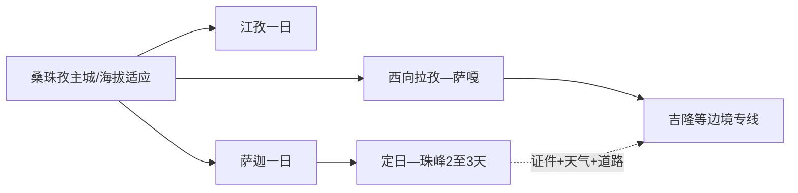
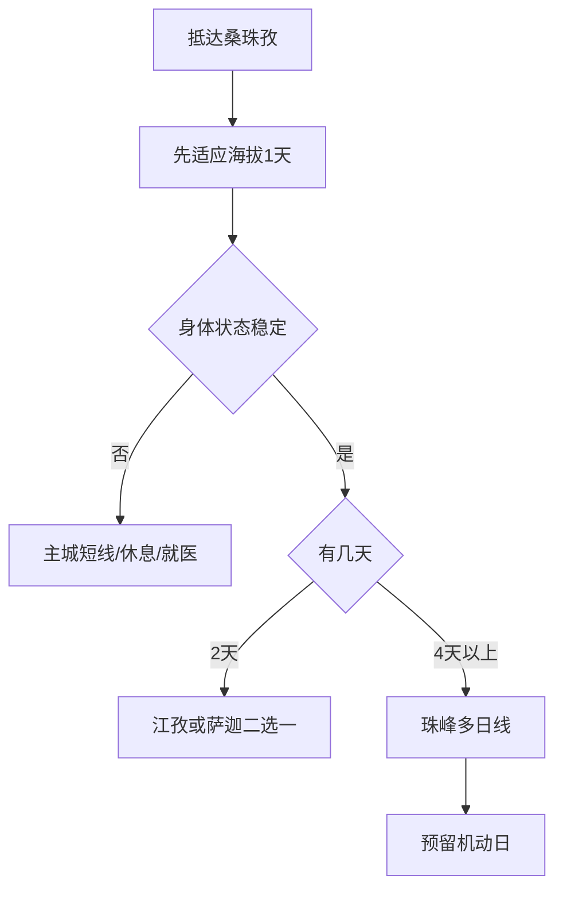

# 日喀则旅行指南

日喀则市域横跨雅鲁藏布江谷地、喜马拉雅山脉和多个边境县，旅行时应先把桑珠孜主城、江孜—白朗、萨迦、珠峰—定日和吉隆/亚东等边境方向拆开。首次到访用主城完成海拔适应和文化背景，再逐日向更远、更高的方向推进；证件、天气和道路是路线的一部分，不是出发后的附加事项。

> 建议停留：桑珠孜 1–2 天；江孜或萨迦各另留 1 天；珠峰方向通常 2–3 天以上  
> 旅行关键词：扎什伦布寺、桑珠孜宗堡、萨迦寺、白居寺、珠穆朗玛峰、雅鲁藏布江谷地  
> 主要体力：主城中等；高海拔寺院、山口和珠峰方向为高  
> 最近研究：2026-08-13

## 城市速览

| 项目 | 旅行信息 |
|---|---|
| 主要旅行价值 | 在桑珠孜认识后藏历史与城市生活，在江孜、萨迦理解寺院与城镇格局，再以充分准备进入珠峰及其他高海拔远线 |
| 建议停留 | 1 天只做主城；2–3 天加入江孜或萨迦；珠峰和边境方向另算交通、证件与机动日 |
| 较舒适季节 | 温暖季道路通常更友好；雨雪、强风和结冰全年可能改变山口与景区，珠峰售票和道路按实时公告 |
| 预算特点 | 主城住宿餐饮较可控；远线车辆、司机、证件办理、边境住宿和氧气医疗保障是主要变量 |
| 步行强度 | 主城寺院和宗堡有台阶与坡度；高海拔远线即使车游也会因缺氧增加负担 |
| 主要天气风险 | 高原缺氧、强紫外线、低温、大风、暴雪、道路结冰、落石、泥石流和突发封路 |
| 独行旅行 | 主城可自行安排；边境和珠峰路线优先使用资质、证件和应急方案清楚的交通服务 |
| 亲子旅行 | 先完成海拔适应，减少连续长车程；儿童高原反应和保暖由监护人持续观察 |
| 长者与低体力旅行 | 以桑珠孜主城短线、车辆接驳和单一寺院为主，高海拔远线先咨询医生 |
| 无障碍信息 | 主城新设施可逐点咨询；古建、寺院、宗堡、高原景区和车辆之间的设施连续性需向官方确认 |

## 城市格局与游览区域

日喀则市是法定代码 `540200` 的地级市。GeoNames `1279715` 是桑珠孜主城 `PPLA2` 城市点；Wikidata `Q1211183` 表达日喀则地级市，并同时关联城市点 `1279715` 与行政记录 `1279714`。桑珠孜区另有实体 `Q116656`。本页用城市点识别主城门户，用地级市实体和行政代码覆盖各县区，绝不以一个坐标代替辽阔市域。

| 区域 | 主要内容 | 怎么安排 | 关键条件 |
|---|---|---|---|
| 桑珠孜主城 | 扎什伦布寺、宗堡、博物馆与城市生活 | 1–2 天适应海拔和完成核心 | 场馆、寺院礼仪与步行体力 |
| 江孜—白朗 | 白居寺、宗山、帕拉庄园和河谷农业 | 一整日或过夜 | 路况、场馆与返程 |
| 萨迦方向 | 萨迦寺、古城与周边文保 | 一整日或与珠峰线顺序组合 | 开放、讲解和高海拔 |
| 定日—珠峰 | 珠峰景区、绒布寺方向与高海拔公路 | 通常 2–3 天以上 | 证件、售票、天气、车辆、住宿 |
| 吉隆—樟木—亚东等边境县 | 峡谷、口岸与边境城镇 | 专门多日线 | 边防证、口岸政策、道路与住宿 |
| 拉孜—昂仁—萨嘎西向通道 | 西行交通、雅江与高原县城 | 阿里或吉隆转场的一部分 | 油料、医疗、通信和长车程 |

珠峰景区是定日县内的完整高海拔目的地；游客通过正式售票、检查和景区交通进入，不把沿线村庄、保护区域、登山营地或未开放山口拆成自由景点。寺院和庄园也是宗教、文保或社区空间，开放院落、摄影与参观礼仪分别遵守现场规则。

## 主要景点

### 桑珠孜主城

| 景点 | 区域 | 类型 | 主要看点 | 建议用时 | 室内外 | 体力 | 预约风险 | 天气影响 | 优先级 |
|---|---|---|---|---:|---|---|---|---|---|
| 扎什伦布寺 | 桑珠孜区 | 全国重点文保、寺院 | 后藏宗教历史、建筑与当期开放殿堂 | 3–5 小时 | 混合 | 中高 | 高 | 中 | A |
| 桑珠孜宗堡公开区域 | 桑珠孜区 | 城市历史、宗堡 | 山城格局与公共展陈 | 2–3 小时 | 混合 | 中高 | 高 | 高 | A |
| 日喀则市博物馆或当期公共展览 | 桑珠孜区 | 公共文化 | 市域历史、艺术与多县区背景 | 2–3 小时 | 室内 | 低 | 高 | 低 | B |
| 夏鲁寺 | 桑珠孜区乡村方向 | 寺院、文保 | 壁画、建筑和地方佛教史 | 2–4 小时含往返 | 混合 | 中 | 很高 | 高 | B |

### 江孜、萨迦与河谷

| 景点 | 区域 | 类型 | 主要看点 | 建议用时 | 室内外 | 体力 | 预约风险 | 天气影响 | 优先级 |
|---|---|---|---|---:|---|---|---|---|---|
| 白居寺—十万佛塔 | 江孜县 | 寺院、文保 | 寺院建筑、佛塔与壁画 | 2–4 小时 | 混合 | 中高 | 高 | 中 | A |
| 江孜宗山公开区域 | 江孜县 | 城堡、纪念空间 | 宗堡地形与地方历史 | 2–3 小时 | 室外为主 | 高 | 高 | 很高 | B |
| 帕拉庄园 | 江孜县 | 庄园、社会史 | 后藏庄园建筑与生活史展陈 | 1.5–2.5 小时 | 混合 | 中 | 高 | 中 | B |
| 萨迦寺 | 萨迦县 | 全国重点文保、寺院 | 建筑、壁画、典籍与萨迦历史 | 3–5 小时 | 混合 | 中 | 高 | 中 | A |

### 珠峰与高海拔远线

| 景点 | 区域 | 类型 | 主要看点 | 建议用时 | 室内外 | 体力 | 预约风险 | 天气影响 | 优先级 |
|---|---|---|---|---:|---|---|---|---|---|
| 珠穆朗玛峰景区正式游览区 | 定日县 | 5A、高海拔自然景区 | 珠峰景观、正式观景与景区交通 | 2–3 天含往返 | 室外 | 高 | 很高 | 很高 | A |
| 绒布寺当期开放区域 | 定日县 | 高海拔寺院 | 珠峰北麓宗教与地理环境 | 随景区线路 | 混合 | 高 | 很高 | 很高 | B |
| 吉隆沟或亚东具名开放点 | 边境县 | 峡谷、森林与边境城镇 | 喜马拉雅南北坡地貌与社区 | 多日 | 室外为主 | 高 | 很高 | 很高 | C |

## 美食与餐饮

| 类型 | 适合区域 | 份量与选择 | 饮食提醒 | 怎么选 |
|---|---|---|---|---|
| 藏面、甜茶与藏式包子 | 桑珠孜主城 | 单人友好 | 汤底可能含牛羊肉，甜茶含乳制品和糖 | 先用熟悉、温热、少量食物适应 |
| 糌粑、酥油茶与青稞制品 | 主城、县城正规餐馆 | 小份试用 | 乳制品、盐、油脂和吞咽干度需留意 | 让店家示范吃法，按身体反应增量 |
| 牦牛肉与羊肉 | 城区、县城 | 多人共享较常见 | 高脂、高盐，肉干较硬 | 选择全熟、来源清楚的菜 |
| 土豆、萝卜与家常炖菜 | 各县城 | 单人或多人均可 | 高原食欲下降时优先清淡 | 与主食、热水搭配，避免一次过量 |
| 边境县餐食 | 定日、萨嘎、吉隆等 | 套餐与团餐常见 | 选择少、营业受天气与客流影响 | 随车备水和简单食物，不依赖深夜补给 |

酒精、剧烈运动和过量进食会增加高原不适风险。旅行者应根据医生建议和个人病史决定是否进入高海拔远线；氧气、药物和商业宣传不能替代医疗评估。

## 经典行程

### 一日经典路线

**路线**：扎什伦布寺 → 主城午餐与长休 → 桑珠孜宗堡公共区域或博物馆二选一 → 返回住宿地。

- **串联逻辑**：先看宗教与后藏历史，再用城市展陈补背景。
- **适用条件**：已在相近海拔适应，身体状态稳定。
- **预约锚点**：寺院与场馆开放、摄影和讲解规则。
- **休息安排**：午间至少 1–2 小时，步行放慢。
- **时间不足时**：保留扎什伦布寺，第二站改为就近短停。

### 两日城市路线

**第 1 天**：桑珠孜主城。  
**第 2 天**：江孜白居寺 → 午休 → 宗山或帕拉庄园二选一 → 返回/住江孜。

- **串联逻辑**：先适应海拔，再进入河谷县城，不立即冲向珠峰。
- **适用条件**：身体稳定、道路与车辆明确。
- **预约锚点**：江孜场馆和返程。
- **休息安排**：江孜县城完整午休。
- **时间不足时**：第二天只留白居寺与县城，不加两处远点。

### 三日深度路线

**第 1 天**：桑珠孜。  
**第 2 天**：江孜。  
**第 3 天**：萨迦寺与萨迦县城。

- **串联逻辑**：三天用主城、江孜和萨迦建立后藏文化框架。
- **适用条件**：适合文化主题，不等同于珠峰快线。
- **预约锚点**：萨迦寺开放、车辆和住宿。
- **休息安排**：每天只设一个主寺院并留长休。
- **时间不足时**：江孜和萨迦二选一。

### 雨雪或大风路线

**路线**：住宿地休整 → 日喀则市博物馆/当期室内展览 → 午餐 → 扎什伦布寺低强度开放段（条件允许时）。

- **串联逻辑**：减少跨县和山口移动，把行程留在主城。
- **适用条件**：城区交通正常；高等级预警按官方要求留在安全地点。
- **预约锚点**：场馆、寺院和道路公告。
- **休息安排**：室内长休并保持饮水。
- **时间不足时**：只保留休息和一座室内场馆。

### 亲子或低体力路线

**亲子方案**：主城博物馆精选展 → 午餐 → 扎什伦布寺短段。  
**低体力方案**：车辆落客一座场馆/寺院 → 长休 → 返回住宿。

- **串联逻辑**：一天一个主点，减少台阶与连续车程。
- **适用条件**：海拔适应良好并完成医疗风险评估。
- **预约锚点**：落客、座席、卫生间和紧急医疗点。
- **休息安排**：每 45–60 分钟检查身体状态。
- **时间不足时**：删除第二站。

### 珠峰多日路线

**第 1 天**：桑珠孜 → 萨迦或拉孜方向过夜。  
**第 2 天**：定日检查与景区正式入口 → 珠峰景区 → 合规住宿。  
**第 3 天**：按天气返程，并保留道路机动时间。

- **串联逻辑**：分段升高并设置过夜，不把主城—珠峰压成超长往返。
- **适用条件**：证件、车辆、司机、住宿、身体状态和景区售票全部明确。
- **预约锚点**：边防证、景区票、车辆、住宿与退改。
- **休息安排**：沿线县城和景区正式服务点；不在无人道路随意停留。
- **时间不足时**：整条珠峰线顺延，改做江孜或萨迦文化线。

## 住宿区域

| 区域 | 优点 | 取舍 | 适合人群 | 交通提示 |
|---|---|---|---|---|
| 桑珠孜主城区 | 医疗、餐饮、交通和住宿最集中 | 去珠峰仍是长途 | 首访、适应海拔、多方向行程 | 优先选供暖、热水、氧气与退改说明清楚的住宿 |
| 江孜县城 | 方便白居寺、宗山和庄园 | 夜间服务少于桑珠孜 | 江孜深度、拉萨—日喀则中段 | 确认次日车辆和行李安排 |
| 萨迦/拉孜县城 | 便于西行分段 | 医疗和住宿选择有限 | 珠峰或阿里转场 | 预留取消和道路机动 |
| 定日及珠峰正式住宿 | 减少景区当天超长往返 | 高海拔、天气和停水停电影响更大 | 已完成风险评估的珠峰旅行者 | 只订合规住宿并确认供氧、供暖和返程 |

## 市内交通

| 场景 | 建议方式 | 怎么做 | 动态核对 |
|---|---|---|---|
| 跨城抵达 | 铁路、公路、合规车辆 | 以日喀则站和票面信息为准 | 车次、安检、行李、接站 |
| 桑珠孜主城 | 出租/网约、公交、短步行 | 一次只组合相近点 | 高峰、寺院落客和步行坡度 |
| 江孜/萨迦 | 合规包车、道路客运或团队车 | 先定住宿和返程 | 道路、检查、末班、司机工时 |
| 珠峰/边境县 | 符合当地要求的车辆与司机 | 证件、景区、住宿同步预订 | 边防证、售票、天气、道路和油料 |

## 不同旅行者须知

| 旅行者 | 优先选择 | 需要确认 | 备选方案 |
|---|---|---|---|
| 首次高原旅行者 | 桑珠孜适应日 | 既往病史、保险、医疗点 | 延长主城休息 |
| 独行者 | 主城与成熟县城 | 车辆资质、司机、通信、分享行程 | 参加合规小团 |
| 亲子家庭 | 主城短线 | 儿童高原反应、保暖、饮水 | 博物馆加休息 |
| 长者与慢病旅行者 | 医疗可达的主城 | 医生意见、氧饱和度、药物和撤退 | 不进入更高远线 |
| 摄影旅行者 | 正式观景点 | 边境摄影、无人机、寺院摄影规则 | 公共城市景观 |

安全、法律和边境边界保持明确：边防证、外国游客管理、口岸和保护区规则按当期主管部门执行；无人机、卫星通信、专业测绘和边境摄影不得凭普通旅行经验推定；出现持续头痛、气促、意识异常等高原警示症状时停止升高并尽快就医。

## 行前核对

- 在[西藏自治区文化和旅游厅](https://wlt.xizang.gov.cn/)和日喀则市官方渠道查看景区、道路与活动。
- 珠峰确认售票、景区交通、道路、住宿和恢复/暂停公告。
- 提前办理适用证件，并让承运方复核路线涉及县区。
- 查看气象、交通、交警、应急和自然资源部门预警。
- 通过 12306 与正规客运渠道确认到发。
- 准备保暖、防晒、饮水和个人药物，远线留机动日。
- 无障碍旅行逐段确认车站、车辆、寺院、场馆、住宿和卫生间。

## 来源与更新记录

### 主要来源

| 来源 | 机构 | 支持内容 | 核验日期 |
|---|---|---|---|
| [日喀则旅游资源普查成果](https://wlt.xizang.gov.cn/xccx/lytg/202507/t20250728_492064.html) | 西藏自治区文化和旅游厅 | 市域资源、扎什伦布寺、萨迦寺与珠峰主题 | 2026-08-13 |
| [西藏文旅线路资料](https://wlt.xizang.gov.cn/xccx/lytg/202607/t20260729_551713.html) | 西藏自治区文化和旅游厅 | 桑珠孜、江孜、萨迦和珠峰路线关系 | 2026-08-13 |
| [珠峰恢复售票公告](https://wlt.xizang.gov.cn/xccx/lytg/202605/t20260509_539319.html) | 西藏自治区文化和旅游厅/定日县文旅局 | 景区售票、积雪结冰和动态开放 | 2026-08-13 |
| [日喀则珠峰文化旅游环线](https://swt.xizang.gov.cn/xxgk/zzqwj/202505/W020250512593477495771.pdf) | 西藏自治区人民政府相关部门 | 桑珠孜、萨迦、珠峰和江孜空间串联 | 2026-08-13 |
| [日喀则文旅情况新闻发布](https://www.xizang.gov.cn/zwgk/xxfb/xwfbh/xzjxxwfbhjsrkzdsjjzfwhlyjxgqk/202607/t20260717_550426.html) | 西藏自治区人民政府 | 近期公共文化与旅游资源概况 | 2026-08-13 |
| [GeoNames 1279715](https://sws.geonames.org/1279715/about.rdf) | GeoNames | 桑珠孜主城固定点与 PPLA2 属性 | 2026-08-13 |
| [Wikidata Q1211183](https://www.wikidata.org/wiki/Q1211183) | Wikidata | 日喀则地级市与双 GeoNames 记录 | 2026-08-13 |
| [民政部行政区划代码服务](https://dmfw.mca.gov.cn/xzqh/getList?code=540200&trimCode=false&maxLevel=3) | 民政部 | 日喀则市法定代码和县区层级 | 2026-08-13 |
| [西藏自治区气象局](http://xz.cma.gov.cn/) | 气象主管部门 | 高原天气与预警 | 2026-08-13 |
| [中国铁路 12306](https://www.12306.cn/) | 铁路运营方 | 日喀则到发动态核对 | 2026-08-13 |

### 更新记录

| 日期 | 更新内容 |
|---|---|
| 2026-08-13 | 建立研究版；区分桑珠孜城市点、区实体和日喀则地级市；按主城、江孜、萨迦、珠峰与边境多日线组织，并强化海拔、证件、边境和动态开放决策。 |
