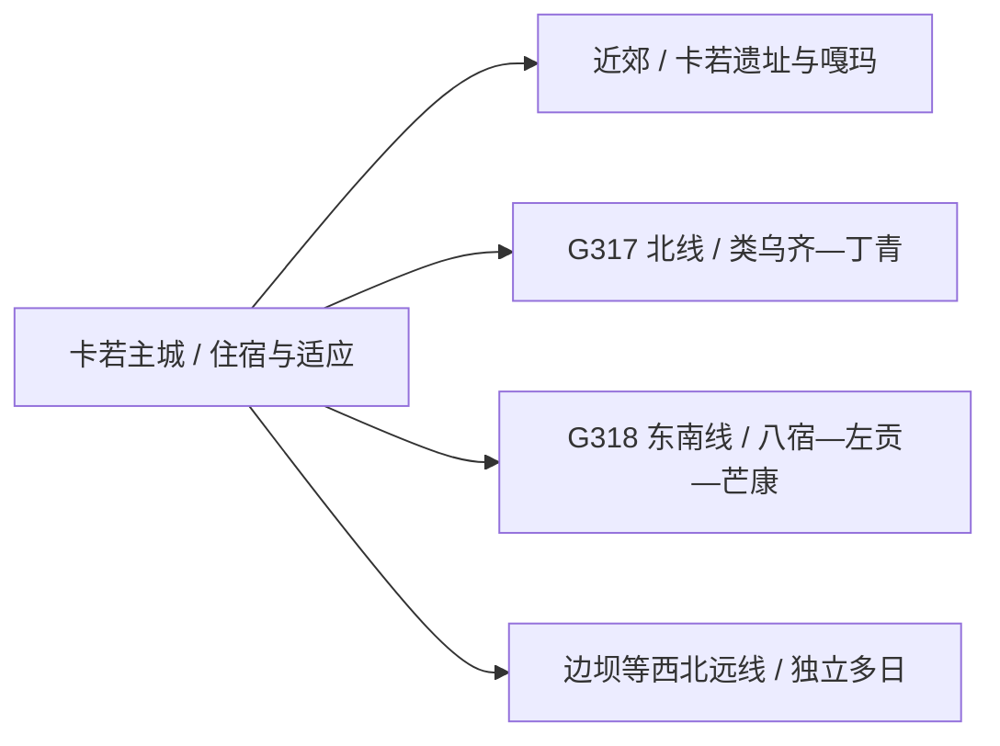
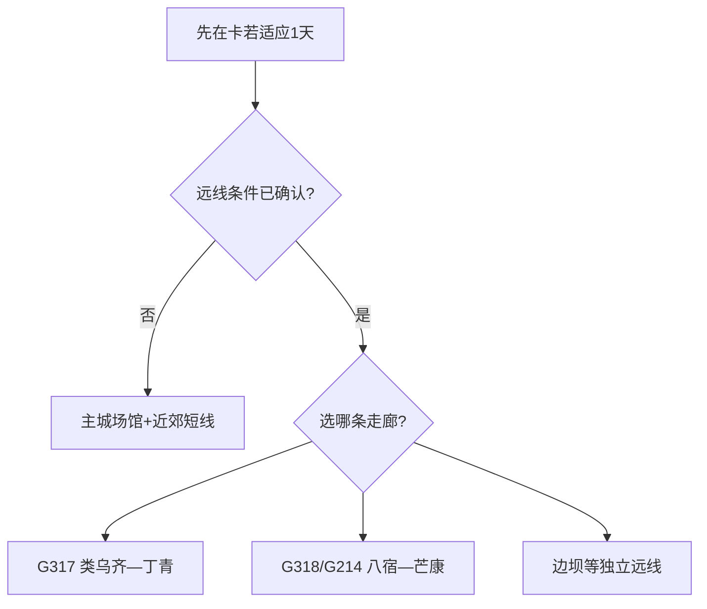

# 昌都旅行指南

昌都适合先用卡若主城适应海拔、认识茶马古道与康巴文化，再沿一条国道走向安排县域长线。卡若、八宿、芒康、丁青等地相隔数小时至数日，选定方向比罗列景点更重要。

> 建议停留：卡若主城 1–2 天；加入一条县域走廊为 4–7 天起 
> 旅行关键词：三江上游、茶马古道、康巴文化、卡若遗址、横断山公路 
> 无障碍说明：主城现代场馆可优先询问电梯与轮椅；寺院、遗址、高山步道和长途公路节点的设施连续性需向官方确认

## 城市速览

| 项目 | 旅行信息 |
|---|---|
| 主要旅行价值 | 卡若主城的人文场馆、强巴林寺与茶马古道线索，以及 G317、G318、G214 三条高原走廊 |
| 建议停留 | 主城 1–2 天；每增加一条远线至少增加 2–4 天 |
| 舒适季节 | 主城春秋较舒适；雨季和冬季公路条件决定远线可行性 |
| 预算特点 | 主城支出较稳定；长途车辆、跨县住宿、景区接驳和行程缓冲是主要增量 |
| 步行强度 | 主城中等；寺院、遗址与高山景区中高至高 |
| 天气风险 | 高海拔反应、昼夜温差、强紫外线、雷雨、落石、泥石流、冰雪和低能见度 |
| 独行旅行 | 主城可独行；远线宜把每日目的地、住宿和联络方式留给可信联系人 |
| 亲子旅行 | 先选博物馆与主城短线，高海拔远线按年龄和健康情况评估 |
| 长者与低体力 | 抵达首日只安排场馆或短距离街区，保留完整适应日 |
| 行前重点 | 海拔适应、道路与景区开放、车辆资质、住宿供氧与医疗位置 |

## 城市格局与游览区域

昌都是法定地级市，代码 `540300`，辖卡若区和江达、贡觉、类乌齐、丁青、察雅、八宿、左贡、芒康、洛隆、边坝十县。旅行服务最集中在卡若主城；其他县域沿不同国道展开，路线应按走廊组织。

| 区域 | 适合安排 | 怎么选择 | 时间尺度 |
|---|---|---|---|
| 卡若主城 | 市博物馆、革命历史博物馆、强巴林寺、城市河谷 | 作为抵离与适应基地，场馆和寺院分段安排 | 1–2 天 |
| 卡若近郊 | 卡若遗址、嘎玛藏艺谷等正式开放点 | 先确认开放与车辆，再做半日至一日往返 | 1 天 |
| G317 北线 | 类乌齐、丁青及沿线自然人文点 | 每天控制车程，按县城换宿 | 2–4 天起 |
| G318—G214 线 | 八宿然乌、左贡、芒康盐井方向 | 先锁道路、天气和住宿，适合连续公路旅行 | 3–6 天起 |
| 边坝等远县 | 三色湖等高山目的地 | 单独规划进出，不与主城短线拼接 | 2–4 天起 |

GeoNames `1280281` 是固定快照中的昌都城市点；法定昌都市采用 Wikidata `Q1012419` 和代码 `540300`，该实体的 `P1566=1280280` 指向行政记录。城市点用于定位卡若主城，行政记录用于表达地级市范围。

## 主要景点

### 卡若主城与近郊

| 景点 | 区域 | 类型 | 主要看点 | 建议用时 | 室内外 | 体力 | 预约风险 | 天气影响 | 优先级 |
|---|---|---|---|---:|---|---|---|---|---|
| 昌都市博物馆 | 卡若主城 | 综合博物馆 | 昌都历史、三江流域与地方文化 | 2–3 小时 | 室内 | 低 | 中高 | 低 | A |
| 昌都市革命历史博物馆 | 卡若主城 | 红色主题场馆 | 近现代地方史与昌都解放相关展陈 | 1.5–2.5 小时 | 室内 | 低 | 中高 | 低 | A |
| 强巴林寺开放区域 | 卡若主城 | 宗教建筑 | 康巴地区寺院格局与宗教文化 | 2–3 小时 | 混合 | 中高 | 高 | 中高 | A |
| 茶马城及城市公共街区 | 卡若主城 | 城市文化 | 茶马古道主题、河谷城市生活与公共空间 | 2–4 小时 | 混合 | 中 | 中 | 中高 | B |
| 卡若遗址正式开放区域 | 卡若区近郊 | 考古遗址 | 新石器时代遗存与藏东早期聚落 | 2–4 小时 | 室外为主 | 中 | 高 | 高 | A |
| 嘎玛藏艺谷当期开放点 | 卡若区嘎玛乡方向 | 传统工艺、乡村 | 唐卡与手工艺、河谷村落 | 半日至 1 天 | 混合 | 中 | 高 | 高 | B |

### 县域长线

| 景点 | 区域 | 类型 | 主要看点 | 建议用时 | 室内外 | 体力 | 预约风险 | 天气影响 | 优先级 |
|---|---|---|---|---:|---|---|---|---|---|
| 然乌湖—来古冰川正式游览单元 | 八宿县 | 湖泊、冰川 | 高原湖泊、冰川地貌与公路景观 | 1–2 天 | 室外 | 高 | 高 | 很高 | A |
| 芒康盐井古盐田景区 | 芒康县 | 生产遗产、民俗 | 澜沧江河谷井盐晒制技艺与盐田景观 | 1 天 | 室外 | 高 | 高 | 很高 | A |
| 天穹孜珠景区 | 丁青县 | 宗教、山岳 | 高山寺院与峡谷地貌 | 1 天 | 室外为主 | 很高 | 高 | 很高 | B |
| 查杰玛大殿及属地开放点 | 类乌齐县 | 宗教建筑 | 康巴建筑、壁画与地方历史 | 半日至 1 天 | 混合 | 中高 | 高 | 高 | B |
| 三色湖正式开放区域 | 边坝县 | 高山湖泊 | 湖群与山地生态 | 1 天 | 室外 | 高 | 高 | 很高 | C |

强巴林寺按一处寺院组织，殿堂不重复拆点；然乌湖与来古冰川按实际运营入口分别核对，但路线中作为八宿同一长线安排。盐田既是文化景观也是生产空间，只从正式景区入口参观。

## 美食与餐饮

| 类型 | 怎么点 | 份量与过敏原 | 选择建议 |
|---|---|---|---|
| 藏面与面片 | 一人一碗，搭配小菜 | 含小麦，汤底可能含牛羊肉与乳制品 | 抵达首日选清淡小份，先问辣度和汤底 |
| 牦牛肉菜肴 | 2–4 人共享更方便 | 牛肉、油脂和辛香料较集中 | 看清计价方式，长途驾驶前控制份量 |
| 酥油茶、甜茶与奶制品 | 先点小壶或小杯 | 含乳制品，酥油茶盐度较高 | 乳糖不耐受者先少量尝试，可改普通热饮 |
| 糌粑与藏式点心 | 适合早餐或补充能量 | 青稞为主，制作环境可能接触小麦与乳制品 | 高原行车日随身另备熟悉的干粮和饮水 |

## 经典行程

### 一日经典路线

**路线**：昌都市博物馆 → 午餐与休息 → 强巴林寺开放区域 → 茶马城或河谷公共街区

- **适用条件**：已完成基本海拔适应，主城道路与场馆正常开放。
- **串联逻辑**：先用室内展陈建立背景，下午进入宗教与城市空间。
- **预约锚点**：两座场馆闭馆日、强巴林寺参观时段与摄影规则。
- **休息安排**：博物馆后安排完整午休，寺院参观前补水。
- **时间不足时**：保留市博物馆和强巴林寺，街区缩成短段。

### 两日城市路线

**第 1 天**：市博物馆 → 革命历史博物馆 → 茶马城 
**第 2 天**：卡若遗址或嘎玛藏艺谷二选一 → 返回主城

- **适用条件**：近郊点开放且已落实往返车辆。
- **串联逻辑**：首日留在主城适应，第二日再增加海拔和公路移动。
- **预约锚点**：近郊开放范围、讲解和返程时间。
- **休息安排**：第二日午餐与休息放在正式服务点或主城。
- **时间不足时**：取消近郊，第二日改为强巴林寺与主城慢游。

### 三日深度路线

**第 1 天**：卡若主城适应与场馆 
**第 2 天**：强巴林寺 → 卡若遗址 
**第 3 天**：嘎玛藏艺谷当期开放点 → 主城休整

- **适用条件**：身体状态稳定，三处开放和交通已确认。
- **串联逻辑**：从城市通识、遗址到传统工艺逐步展开，车程递增。
- **预约锚点**：场馆、遗址、嘎玛接待与车辆。
- **休息安排**：每天只设一个高体力段，下午回主城恢复。
- **时间不足时**：第三天改为主城自由活动，优先保持前两天完整。

### 雨雪天路线

**路线**：市博物馆 → 午休 → 革命历史博物馆或当期室内展览

- **适用条件**：主城道路正常，场馆开放；强降雪或地灾预警时服从交通安排。
- **串联逻辑**：集中室内项目，降低山路、台阶和临水暴露。
- **预约锚点**：场馆临时闭馆、城市公交与叫车范围。
- **休息安排**：每馆之间回到可取暖、可补水的公共区域。
- **时间不足时**：只保留市博物馆。

### 亲子与低体力路线

**亲子路线**：市博物馆重点展厅 → 午休 → 茶马城短段 
**低体力路线**：车辆到市博物馆 → 午休 → 强巴林寺最近合规落客点后短游

- **减负方式**：首日留在主城适应，寺院只走开放主线。
- **预约锚点**：电梯、轮椅、卫生间、落客点和医疗协助。
- **休息安排**：住宿地午休，下午只保留一个点。
- **时间不足时**：保留市博物馆，其他项目改为车览或取消。

### 远郊路线

**路线**：在 G317 北线、G318—G214 东南线和边坝远线中选择一条，按县城连续换宿

- **适用条件**：道路、天气、车辆、住宿和健康状况均已确认。
- **串联逻辑**：一条走廊内顺向移动，避免每日返回卡若。
- **预约锚点**：景区入口、道路管制、住宿供氧、司机资质和返程节点。
- **休息安排**：每日设置县城住宿和机动半日，不连续赶夜路。
- **时间不足时**：整条远线取消，保留卡若主城与一个近郊点。

## 住宿区域

| 区域 | 优点 | 取舍 | 适合人群 |
|---|---|---|---|
| 卡若主城 | 餐饮、医院、交通与住宿选择集中 | 前往远县仍是长途 | 首访、适应、公共交通旅行 |
| 卡若近郊 | 接近遗址或乡村项目 | 生活服务与叫车选择较少 | 已落实车辆的专题旅行 |
| 八宿或然乌镇 | 便于完成然乌—来古线 | 海拔、天气和旺季房量波动明显 | G318 连续旅行 |
| 芒康、丁青、类乌齐或边坝县城 | 可把长途拆成合理日程 | 各方向互不替代，返程选择有限 | 单一走廊深度旅行 |

## 市内交通

- 昌都邦达机场距卡若主城较远，航班到达后仍需长距离公路接驳；先确认航班、接送、夜间到店与天气备降方案。
- 主城用公交、出租车和合规网约或包车分段；寺院与场馆的最近落客点需现场确认。
- 三条国道是市域旅行主轴，但“国道可通行”不等于景区支路、垭口和县乡道路同步开放。
- 远线优先使用资质明确的车辆和熟悉高原路况的司机，控制每日驾驶时长并保留机动日。

## 不同旅行者须知

| 情况 | 怎么安排 | 重点核对 |
|---|---|---|
| 初到高原 | 首日住卡若，只做低强度活动 | 既往病史、药物、血氧不替代医学判断、就医位置 |
| 亲子 | 场馆与短街区为主，远线逐日评估 | 年龄、海拔、饮食、保暖和车辆安全座椅 |
| 长者与低体力 | 一天一处主景点，车辆分段 | 台阶、落客点、供氧、卫生间和中途退出 |
| 摄影与无人机 | 从公共开放区域拍摄 | 寺院、边境、机场、军事敏感区、自然保护地与无人机规则 |
| 自驾 | 一条走廊顺向推进 | 路况、油电补给、落石、涉水、冰雪、司机休息和救援距离 |

安全与保护边界：寺院依现场礼仪和摄影规则参观；冰川、河谷、自然保护地、未开放山口、施工便道和地灾封控段按公告行动。出现明显高原不适时，减少活动并及时寻求专业医疗帮助。

## 行前核对

| 项目 | 何时核对 | 官方入口 |
|---|---|---|
| 场馆、寺院与遗址开放 | 排行程时、到访前一日 | [昌都市文化和旅游局](https://lyfz.changdu.gov.cn/)及属地公告 |
| 国道、县道与景区支路 | 出发前三日、前一晚和当天 | [昌都文旅“行在昌都”](https://lyfz.changdu.gov.cn/cdslyj4/c101235/new_common_list.shtml)及交通、交警公告 |
| 航班与机场接驳 | 购票时、起飞前一日 | 航司、机场与民航主管部门 |
| 高原天气与灾害预警 | 出发前三日起每日 | [中国气象局](https://www.cma.gov.cn/)及西藏、昌都应急信息 |
| 无障碍与供氧 | 订房、预约和用车时 | 场馆、景区、酒店与承运方 |

## 来源与更新记录

| 来源 | 支持内容 | 核验日期 |
|---|---|---|
| [昌都市人民政府](https://www.changdu.gov.cn/) | 市情、公共服务和动态公告入口 | 2026-08-13 |
| [昌都市文化和旅游局](https://lyfz.changdu.gov.cn/) | 景点、道路、旅游服务与安全信息入口 | 2026-08-13 |
| [昌都旅游攻略](https://lyfz.changdu.gov.cn/cdslyj4/c101234/202105/dc006eb7627b4a7c9b17e1246e6a3856.shtml) | G317、G318、G214 景点走廊与县域分布 | 2026-08-13 |
| [昌都市政府：三条国道沿线景点](https://www.changdu.gov.cn/cdrmzf/c100359/202311/d15008d4e51e4e59a734e7a9ffd4ea05.shtml) | 盐井、然乌、孜珠、茶马城等属地与线路 | 2026-08-13 |
| [昌都市文旅局部门预算](https://www.changdu.gov.cn/cdrmzf/c103315/202604/3fc817b6c6d44bce8c43065e889cb763.shtml) | 市博物馆、革命历史博物馆及公共文化职能 | 2026-08-13 |
| [民政部行政区划查询](https://dmfw.mca.gov.cn/xzqh/getList?code=54&trimCode=true&maxLevel=3) | `540300` 及所辖县区层级 | 2026-08-13 |
| [GeoNames 1280281](https://www.geonames.org/1280281/qamdo.html) | 固定快照中的昌都城市点 | 2026-08-13 |
| [Wikidata Q1012419](https://www.wikidata.org/wiki/Q1012419) | 法定昌都市实体与 `P1566=1280280` | 2026-08-13 |

| 日期 | 更新 |
|---|---|
| 2026-08-13 | 首次完成昌都市指南；建立卡若主城、近郊与三条高原走廊，补齐高海拔、公路、宗教场所、自然保护和标识粒度。 |
