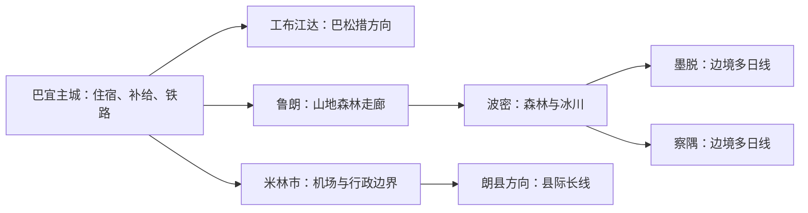
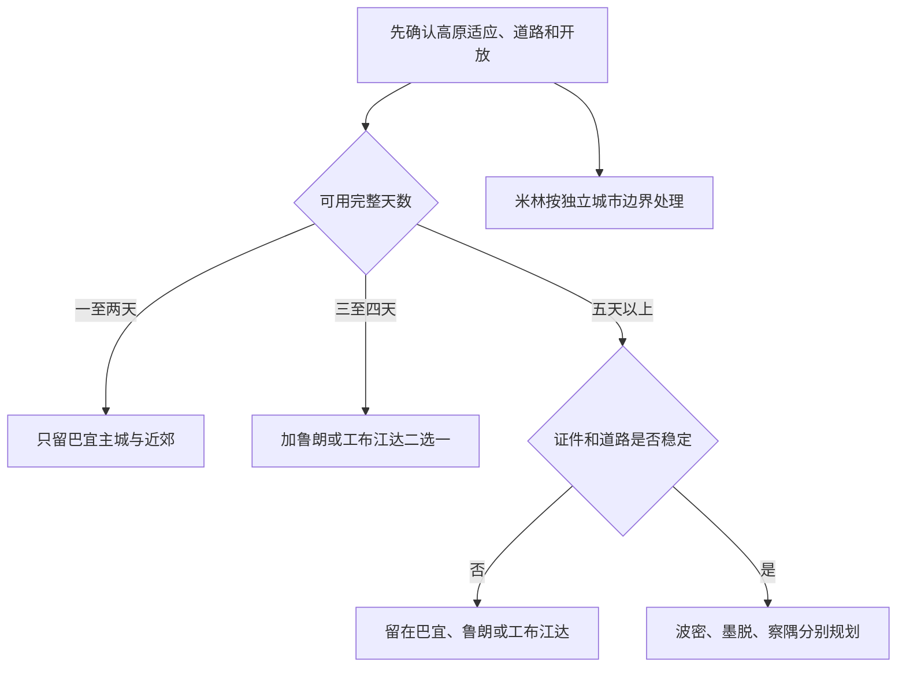

# 林芝旅行指南

林芝最容易被低估的不是景点数量，而是旅行尺度。巴宜区主城适合抵达、休整和补给；鲁朗已经是一段山地公路行程，工布江达县的巴松措、波密县的森林与冰川、墨脱和察隅的边境远线都需要独立核算过夜、道路、证件和天气。把“林芝市”当成一座可当天往返的城区，会在雨季地灾、高海拔适应和长距离驾驶上留下危险余量。

> 建议停留：3–5 天；波密、墨脱、察隅等广域远线另计 
> 旅行关键词：巴宜主城、尼洋河谷、鲁朗、森林、湖泊、冰川、边境远线 
> 主要体力：中至高；高海拔、长途公路和景区步道会叠加负担 
> 最近研究：2026-08-12

## 城市速览

| 项目 | 旅行信息 |
|---|---|
| 主要旅行价值 | 以巴宜主城为交通与补给基地，逐层进入尼洋河谷、鲁朗林海、工布江达湖区以及波密森林冰川景观；不同海拔和植被带来的变化比“打卡数量”更值得留时间 |
| 建议停留 | 1–2 天只安排巴宜主城与近郊；3–5 天可加入鲁朗或工布江达其中一条方向。波密宜另留多日，墨脱和察隅需再增加证件、道路与机动日 |
| 较舒适季节 | 春秋常适合河谷和森林游览，但花期、叶色、积雪与道路并不按固定日期出现；夏季植被繁盛，同时是强降雨、滑坡和泥石流风险较高的时期，冬春还需防雪、冰与森林火险管控 |
| 预算特点 | 巴宜日常餐饮与住宿选择较集中；县际车辆、远线过夜、临时改线和旺季房价是主要成本，不能只按门票估算 |
| 步行强度 | 主城场馆可低强度游览；大柏树、苯日、卡定沟和鲁朗以步道为主，措木及日、巴松措、冰川方向还叠加更高海拔、坡度和长途乘车 |
| 主要天气风险 | 强紫外线、昼夜温差、低云和降雨；主汛期强降水可能引发山洪、滑坡、泥石流、落石和道路临时管制，冬春山区可能积雪结冰或发生雪崩风险 |
| 独行旅行 | 巴宜主城较便于独自住宿、用餐和打车；县际远线不应依赖没有合同、资质与返程保障的临时拼车，边境线路还需先确认本人证件和接待条件 |
| 亲子旅行 | 博物馆、短段河谷和有明确步道的景区较容易减量；儿童同样可能高原不适，临水、林地、长途乘车和连续换住宿会增加看护负担 |
| 长者与低体力旅行 | 以巴宜连续住宿、每半天一个锚点、车辆接送并保留午休较可行；年龄或平时体能不能保证高原适应，更高湖区和冰川远线不作为默认项目 |
| 无障碍信息 | 现代场馆可优先逐处询问，但公开资料不足以证明落客点、入口、展厅、步道和卫生间全程连续可达；设施连续性需向官方确认 |

## 城市格局与游览区域

林芝市政府驻地在巴宜区，主城海拔约 3000 米，住宿、餐饮、铁路客运、医疗和大多数换乘服务集中在这里。全市平均海拔约 3100 米，但这个平均数不能代表每段路线：从河谷进入措木及日、色季拉山一线或更远县域时，海拔、降水、植被和道路条件都会快速变化。

| 区域 | 主要内容 | 游览特点 | 与其他区域的关系 |
|---|---|---|---|
| 巴宜主城 | 尼洋阁—藏东南文化遗产博物馆、住宿、餐饮、医疗与城市服务 | 适合抵达日、适应日和天气变化时休整；城区移动可结合步行与车辆 | 是全市最稳妥的落脚基地，但“住在林芝”不等于已经靠近各县远点 |
| 巴宜近郊与尼洋河谷 | 大柏树、苯日、嘎拉村、卡定沟、措木及日 | 同属巴宜区，所需时间却从短访到完整一日不等；花期、高海拔和景区交通需分别核对 | 可与主城组成 1–2 天路线；措木及日不与抵达日或其他高海拔点硬拼 |
| 鲁朗方向 | 鲁朗风景区、色季拉山公路走廊及沿线服务 | 从巴宜向东进入山地、森林与牧业生产空间，天气和道路比主城更敏感 | 可作条件稳定时的专日或过夜；继续向东才进入波密方向 |
| 工布江达县方向 | 巴松措、秀巴古堡及尼洋河上游 | 位于巴宜以西，往返和景区内部交通足以占用长日，宜在工布江达或景区合法住宿处分段 | 不与鲁朗、波密安排在同一天；前往拉萨方向可顺路，但仍需先核对开放和道路 |
| 波密县方向 | 岗云杉林、米堆冰川、波密红楼及县城补给 | 需翻越山地并连续公路移动，主汛期、降雪和道路事件会显著改变用时 | 宜以波密县城独立住 2 晚以上；不是巴宜的一日近郊 |
| 墨脱县与察隅县方向 | 果果塘、英雄坡及边境县域道路 | 证件、检查、道路、季节、通信和救援条件可能同时构成门槛 | 各自按多日远线规划，不相互拼接，也不以地图导航替代通行许可 |
| 米林市边界 | 林芝米林机场、拉萨—林芝铁路沿线及米林市域 | 米林已是法定县级市；机场虽名为“林芝”，并不位于巴宜主城 | 本页只说明抵离和边界，不收录雅鲁藏布大峡谷、南伊沟等米林景点的完整路线与住宿所有权 |
| 朗县方向 | 雅鲁藏布江沿线县域与长距离公路 | 与巴宜、米林之间需按县际移动和道路条件计算 | 不是主城近郊；若以朗县为目的地，应另查当地开放、住宿和交通 |

这张关系图只表示规划分支，不表示固定车程或道路必然开放。鲁朗、波密、墨脱和察隅是逐级增加不确定性的长线；米林则是独立县级市边界，不应因为机场名称而并入巴宜城区。

**行政与地名数据说明：** 这份指南对应法定地级林芝市，行政区划代码为 `540400`，结构化标识采用该实体的 Wikidata ID `Q1012465`。截至核验日，`Q1012465` 的 GeoNames 属性为 `1280390`，对应较广的行政地名记录；本页固定采用的 `13512708` 是巴宜驻地附近的 `PPLA2` 居民点记录。两条 GeoNames 记录粒度不同：前者用于核对行政实体，后者用作城市落脚点索引，不能互相替换。

2023 年经批准撤销米林县、设立县级米林市，行政区划代码为 `540481`，由西藏自治区直辖、林芝市代管。其 Wikidata 实体为 `Q955403`，截至核验日的 GeoNames 属性为 `1280642`。因此，本页可以说明位于米林市的机场和铁路换乘，却不把米林市的景点、住宿和路线提前写成林芝主城内容。

## 主要景点

优先级用于安排时间，不代表绝对排名：**A** 为首访核心，**B** 为按兴趣补充，**C** 为远郊、季节性或通常需要独立半天以上的目的地。车站、公路垭口和临时观景停车点只作路线节点；同一景区及其内部展厅、步道或观景台按一个完整游览单元安排。

### 巴宜主城与近郊

| 景点 | 区域 | 类型 | 主要看点 | 建议用时 | 室内外 | 体力 | 预约风险 | 天气影响 | 优先级 |
|---|---|---|---|---:|---|---|---|---|---|
| 尼洋阁—藏东南文化遗产博物馆 | 巴宜主城 | 城市展馆与文化博物馆 | 林芝历史、非遗、自然与区域文化展陈；相邻展陈内容合并安排，不拆成多个打卡点 | 3–4 小时 | 室内为主 | 低至中 | 中 | 低 | A |
| 大柏树景区 | 巴宜区 | 古树与森林生态 | 巨柏群、林下步道与藏东南森林生态 | 1.5–2.5 小时 | 室外 | 中 | 中 | 高 | A |
| 苯日景区 | 巴宜区尼洋河沿线 | 河谷、湿地与文化景观 | 尼洋河与雅鲁藏布江交汇方向、公共栈道和河谷视野 | 2–4 小时 | 室外 | 中 | 中 | 高 | B |
| 嘎拉村桃花景观 | 巴宜区嘎拉村 | 季节性乡村景观 | 野生桃树、村落与河谷春季景观 | 1.5–3 小时 | 室外 | 中 | 高 | 极高 | C |
| 卡定沟景区 | 巴宜区 | 峡谷、瀑布与森林 | 峡谷瀑布、岩壁和林下步道 | 2–3 小时 | 室外 | 中至高 | 中 | 极高 | B |
| 措木及日景区 | 巴宜区 | 高山湖泊与森林 | 从河谷进入高山湖泊的垂直景观变化；湖口海拔约 4100 米 | 1 天 | 室外 | 高 | 高 | 极高 | C |

嘎拉村首先是村民生活和农业生产空间，桃花盛期也不能进入果园、踩踏农地或要求居民配合拍摄；花期与临时交通组织以当年公告为准。措木及日虽属巴宜区，却不是主城低强度景点，景区接驳、海拔变化和天气足以占用一整天。

### 鲁朗与工布江达方向

| 景点 | 区域 | 类型 | 主要看点 | 建议用时 | 室内外 | 体力 | 预约风险 | 天气影响 | 优先级 |
|---|---|---|---|---:|---|---|---|---|---|
| 鲁朗风景区 | 巴宜区鲁朗镇方向 | 森林、牧场与山地景观 | 林海、河谷、村镇公共空间及季节性山景 | 1 天 | 室外 | 中至高 | 中 | 极高 | A |
| 巴松措景区 | 工布江达县 | 高山湖泊与森林 | 湖泊、岛屿、森林和景区步道形成的完整游览单元 | 1 天以上 | 室外为主 | 中至高 | 高 | 极高 | A |
| 秀巴古堡景区 | 工布江达县 | 历史遗址与村落景观 | 古堡遗存、村落环境和工布地区历史线索 | 2–3 小时 | 室外为主 | 中 | 中 | 高 | B |

鲁朗及沿线草甸、牧场和林地仍有生产、放牧与保护功能，只使用明确开放的道路、停车区和步道，不把私人院落、草场或林间小路视作公共景区。巴松措与秀巴古堡可以在工布江达方向分日组合，不应为了“顺路”再叠加鲁朗或波密。

### 波密及边境远线

| 景点 | 区域 | 类型 | 主要看点 | 建议用时 | 室内外 | 体力 | 预约风险 | 天气影响 | 优先级 |
|---|---|---|---|---:|---|---|---|---|---|
| 波密红楼红色景区 | 波密县城 | 历史建筑与主题展陈 | 波密历史建筑、地方历史与公共展陈 | 1.5–2.5 小时 | 混合 | 低至中 | 中 | 中 | B |
| 岗云杉林景区 | 波密县 | 原始森林与步道 | 云杉林、河谷和林下生态；仅按开放步道游览 | 3–5 小时 | 室外 | 中至高 | 中至高 | 极高 | B |
| 米堆冰川景区 | 波密县 | 冰川与山地景观 | 通过景区交通、步道和正式观景区观察冰川及山谷 | 0.5–1 天 | 室外 | 高 | 高 | 极高 | C |
| 果果塘景区 | 墨脱县 | 河谷与江湾景观 | 雅鲁藏布江大拐弯及墨脱峡谷地貌 | 多日线路中的半日 | 室外 | 高 | 极高 | 极高 | C |
| 英雄坡景区 | 察隅县 | 历史纪念与边境远线节点 | 公共纪念空间及察隅方向历史线索 | 多日线路中的 1–2 小时 | 混合 | 中至高 | 极高 | 极高 | C |

波密、墨脱和察隅表内用时只指现场，不含从巴宜出发的县际交通。米堆冰川只从正式游客线路和观景区观察，不接近冰体、不翻越围栏、不攀登，也不采用“野冰川”“无人区”推荐。墨脱和察隅只有在本人旅行资格、边境证件、检查要求、道路和景区开放均已确认后才进入计划；地图能导航不等于允许通行。

### 峡谷、冰川、森林与生产空间的共同边界

自然保护地并非默认向旅游者全部开放。核心保护区原则上禁止人为活动；一般控制区允许的活动仍受法律、规划和主管部门规则约束。景区开放只覆盖其公告的游客中心、道路、接驳、步道和观景区，不自动延伸到附近峡谷、林地、冰川、河滩或无人区。遇到封闭、巡护、施工、防火、野生动物活动或地灾提示时，应原路退出，不绕行卡口或翻越围栏。

村庄、果园、茶园、牧场和采集地首先是生产生活空间。未经同意不进入、不采摘、不放飞无人机追拍，也不自行采集松茸、药材、花木和石块。林区按当期防火命令登记、收存火源或停止进入；禁火期不吸烟、不野炊、不使用明火。垃圾全部带离，河流、湖岸和冰川区不留下食物、洗涤剂或排泄物。

## 美食与餐饮

巴宜主城最适合解决稳定热食和补给，鲁朗、工布江达与波密的餐饮则更依赖当天营业和团队人数。当地特色可以尝，但高原适应日更重要的是规律进食、补水、不过量饮酒，也不要为一家热门店延误返程。

| 菜品或餐饮类型 | 常见区域 | 一个人用餐与常见份量 | 风味、过敏原与饮食限制 | 排队风险与替代方法 |
|---|---|---|---|---|
| 鲁朗石锅鸡 | 鲁朗镇、巴宜主城的同类餐馆 | 多为多人共享锅，单人先问小锅、按位套餐或是否可拼桌 | 鸡肉汤底常配掌参，可能加入松茸等菌类；需确认食用菌、药食同源材料、盐、辣椒及共用锅具 | 鲁朗正餐时段可能排队，改选明码标价的鸡汤、面饭或家常菜，不为等位压缩返程 |
| 藏面、甜茶与肉饼 | 巴宜主城、县城社区餐饮 | 藏面通常一人一碗，肉饼可按个添加，甜茶先点杯装或小壶 | 面点含小麦，汤底常含肉类，甜茶含乳制品与糖 | 早餐和下午茶时段可能拥挤，同一区域普通茶馆通常可替代 |
| 牦牛肉菜与藏式火锅 | 巴宜主城、鲁朗和县城餐馆 | 炒菜可配饭，火锅多适合分享；单人先问盖饭、面或小锅 | 可能含牛肉、乳制品、辣椒、花椒、芝麻、坚果和大豆 | 改选清汤面、米饭配小菜或普通家常餐，不把“特色套餐”当成必选 |
| 松茸及其他食用菌菜 | 巴宜、鲁朗和波密，供应随季节变化 | 炒菜、汤或石锅配料常适合分享，先问品种、克重和价格 | 菌类可能引起过敏或消化不适；只吃可追溯、彻底煮熟的正规餐饮产品，不自行采食野生菌 | 非产季或价格不透明时直接换普通蔬菜、鸡汤或肉菜，不追逐路边无标识产品 |
| 藏香猪与家常肉菜 | 巴宜、波密及县城餐馆，以当日菜单为准 | 常按盘分享，单人确认半份或套餐 | 需确认猪肉、动物油、辣椒和交叉接触；有宗教或饮食限制应先说明 | 选择能说明原料、份量和价格的餐馆，改点鸡蛋、蔬菜或普通面饭 |
| 糌粑、酥油茶与奶制品 | 藏餐馆、茶馆 | 少量糌粑已较饱腹，酥油茶和酸奶先点小份 | 青稞含麸质，酥油茶和奶制品含乳；配料可能有糖、蜂蜜和坚果 | 不适应油脂或乳制品时换热水、普通茶、米饭或清汤面 |
| 苹果、桃及季节水果 | 巴宜、波密的市场与合规销售点 | 适合作补给，购买可携带的小份即可 | 清洗后食用；花期观赏不等于可以进入果园采摘 | 以市场或经营者明码标价商品为准，不在村庄和路边自行采摘 |

严重食物过敏者应直接向餐厅确认原料、汤底、蘸料和共用器具；“素菜”“不辣”或“野生天然”都不能替代逐项确认。远线出发前准备密封食物和饮水，但不以路边野炊解决热食，也不在保护地、林地或河岸使用明火。

## 经典行程

### 一日经典路线

**路线**：尼洋阁—藏东南文化遗产博物馆 → 巴宜主城午餐与休息 → 大柏树景区 → 返回巴宜住宿地

- **串联逻辑**：上午用室内展陈建立林芝自然与文化背景，午后只加一处巴宜近郊森林景区；全日不跨县，也不进入更高湖区。
- **预约锚点**：先确认博物馆开放、入馆和讲解规则，再核对大柏树景区当日开放、售票与最后入场。
- **休息安排**：午间在巴宜主城坐下用餐并休息；进入林地前再次评估头痛、恶心、异常疲劳和天气。
- **时间不足时**：先删大柏树，保留博物馆与主城休整；若场馆闭馆，不临时改去措木及日或鲁朗。

### 两日城市路线

**第 1 天**：抵达巴宜 → 尼洋阁—藏东南文化遗产博物馆 → 主城休息 
**第 2 天**：卡定沟景区 → 巴宜午餐与长休息 → 大柏树景区 → 返回住宿地

- **串联逻辑**：第 1 天只做低强度适应，第 2 天在巴宜区内连接峡谷与森林，两晚不更换住宿。
- **预约锚点**：第 1 天以博物馆开放为锚点；第 2 天先锁定卡定沟和大柏树的开放、景区交通与最后入场。
- **休息安排**：抵达日不追加远点；第 2 天必须回到或经过主城完成热食和午休，再决定是否继续大柏树。
- **时间不足时**：第 2 天先删大柏树；若卡定沟受降雨或地灾影响，整段户外路线取消，不以其他峡谷替换。

### 三日深度路线

**第 1 天**：抵达巴宜 → 尼洋阁—藏东南文化遗产博物馆 → 主城休息 
**第 2 天**：大柏树景区 → 巴宜午餐与休息 → 苯日景区明确开放的公共区域 → 返回巴宜 
**第 3 天**：巴宜 → 鲁朗风景区正式游客线路 → 鲁朗镇午餐与休息 → 原路返回巴宜

- **串联逻辑**：前两天留在巴宜观察高原适应，第 3 天才进入鲁朗山地公路；每一天只处理一个空间方向。
- **预约锚点**：博物馆、大柏树和苯日的当日开放是前两天锚点；第 3 天以往返车辆、鲁朗开放及沿线路况为锚点。
- **休息安排**：第 2 天午间回主城，第 3 天在鲁朗镇明确营业的服务点完成热食和坐下休息，返程不依赖夜间赶路。
- **时间不足时**：整段删除第 3 天；第 2 天若体力不足则在大柏树后返回，不把鲁朗压缩进半天。

### 雨天路线

**路线**：尼洋阁—藏东南文化遗产博物馆 → 巴宜主城午餐与长休息 → 天气和交通允许时短段城市公共空间 → 返回住宿地

- **适用条件**：只适用于普通降雨且场馆、城区道路和公共交通正常；强降雨、雷暴、山洪或地灾预警时停止外出并遵从主管部门指示。
- **串联逻辑**：以室内场馆为唯一内容锚点，下午只保留主城短距离活动；不在降雨天临时改去峡谷、森林、湖泊、冰川或县际公路。
- **预约锚点**：博物馆当日开放、临时闭馆和入馆规则。
- **休息安排**：午后留在可取暖、可进食且通信稳定的室内空间，持续查看气象和交通信息。
- **时间不足时**：删城市公共空间，只保留博物馆；若官方发布严重预警，则整条路线取消。

### 亲子或低体力路线

#### 亲子路线

**路线**：尼洋阁—藏东南文化遗产博物馆 → 巴宜午餐与休息 → 大柏树景区短段开放步道 → 返回住宿地

- **适用条件**：儿童已经完成初步高原适应，场馆儿童入馆和景区步道规则已确认，天气稳定且不安排推车无法通过的长段。
- **串联逻辑**：室内展陈承担主要内容，下午只在一处有明确游客步道的林地短访，不加入高山湖泊或长途公路。
- **预约锚点**：确认儿童预约、讲解、推车和卫生间规则，以及大柏树景区开放和最后入场。
- **休息安排**：午间回主城休息；儿童出现头痛、恶心、食欲下降、异常疲倦或行为改变时停止游览并寻求医疗评估。
- **时间不足时**：删大柏树，只保留博物馆；不以卡定沟或措木及日替代。

#### 低体力路线

**路线**：车辆抵达尼洋阁—藏东南文化遗产博物馆 → 巴宜午餐与长休息 → 仅在落客和步道确认后短访苯日公共区域 → 返回住宿地

- **适用条件**：逐处确认落客、坡道或电梯、座椅、卫生间和陪同条件，且当天没有明显高原不适。
- **串联逻辑**：全日只保留一处现代场馆和一处可选河谷公共区域，取消峡谷上升、林地长步道和县际移动。
- **预约锚点**：博物馆无障碍入口与展厅开放是主锚点；苯日只有在停车、接驳和短段连续通行得到确认后保留。
- **休息安排**：每段之间回到可坐下、可取暖或避晒的室内空间，不用车内短暂停靠代替午休。
- **时间不足时**：只保留博物馆；苯日、大柏树、鲁朗和措木及日按此顺序全部删除。

### 远郊一日路线

**路线**：巴宜出发 → 鲁朗风景区正式游客区域 → 鲁朗镇午餐与休息 → 原路返回巴宜

- **适用条件**：已在巴宜完成至少一天适应，没有继续加重的高原不适，沿线无强降雨、降雪、结冰、地灾或交通管制，并有合规车辆和明确返程。
- **串联逻辑**：鲁朗本身及往返山地公路足以占据一日，不再加入波密、工布江达或巴宜其他景点。
- **预约锚点**：鲁朗开放范围、停车或接驳、沿线路况和往返车辆合同。
- **休息安排**：在鲁朗镇明确营业的餐饮或服务点坐下休息，返程前检查天气、道路、身体和车辆状态。
- **时间不足时**：整段取消并留在巴宜，不采用夜间赶路、林间小路或临时越野线路压缩时间。

### 广域远线的最小安排

| 方向 | 最小时间框架 | 先决条件 | 不应怎样压缩 |
|---|---|---|---|
| 工布江达—巴松措 | 至少 1 夜 2 日更稳妥 | 景区开放、往返道路、合法住宿与天气稳定 | 不与鲁朗或波密同日拼接，不把景区内部交通当作几分钟停靠 |
| 波密 | 至少 2 夜 3 日 | 山地公路稳定、波密住宿和返程明确，冰川与森林景区开放 | 不从巴宜当天往返，不同时承诺多个冰川和森林长步道 |
| 墨脱 | 独立多日并留道路机动日 | 本人旅行资格、边境证件、检查、道路、景区、住宿和返程全部确认 | 不与察隅串成固定环线，不绕行检查点，不依据旧攻略判断季节通行 |
| 察隅 | 独立多日并留道路机动日 | 本人旅行资格、边境证件、道路、天气、住宿、通信和救援均有明确答案 | 不把英雄坡等现场用时误写成从巴宜的一日行程 |
| 米林市 | 按独立县级市另做行程 | 机场或铁路换乘与米林市内目的地分别核对 | 不因“林芝米林机场”名称而把米林景点并入巴宜路线 |

## 住宿区域

| 区域 | 优点 | 缺点 | 适合人群 | 交通特点 |
|---|---|---|---|---|
| 巴宜中心城区 | 餐饮、商店、医疗、叫车和日常补给相对集中，便于午间回房 | 旺季房价和道路施工会影响落客，去远线仍需长途车辆 | 首访、独行、亲子、长者、低体力及连续住多晚者 | 是主城和近郊基地，前往各县仍按独立公路行程准备 |
| 尼洋河—苯日方向的合法住宿 | 河谷环境较安静，靠近部分公共景区 | 餐饮、夜间车辆、医疗和步行连续性不如中心城区稳定 | 已确认接送、希望减少城市活动者 | 预订前确认准确位置、合法营业、道路、落客和回城车辆 |
| 林芝站—经开区一带 | 铁路抵离和大件行李换乘较方便，现代住宿选择相对集中 | 与巴宜传统餐饮和部分景点仍需乘车，站区建设可能改变动线 | 晚到、早走、铁路换乘或只住一晚者 | 以 12306 车次和当期站前交通为准，不假设可步行到主城核心 |
| 鲁朗镇 | 可把山地公路和游览分开，减少当天往返压力 | 天气、季节营业、供暖供氧、餐饮和夜间医疗需逐家确认 | 已适应高原、明确游览鲁朗或次日继续向东者 | 次日去巴宜或波密方向不同，车辆和道路均需提前锁定 |
| 工布江达县城或巴松措合法住宿 | 便于完整游览巴松措，不必从巴宜赶夜路 | 住宿数量、景区内外位置、餐饮和接驳差异明显 | 将工布江达安排为独立 1–2 夜者 | 先确认住宿是否位于允许进入的区域、景区门票和接驳如何衔接 |
| 波密县城 | 适合作为岗云杉林、米堆冰川等方向的补给和分段基地 | 距巴宜远，主汛期或雪情可能延误抵离 | 有 2 晚以上、已确认道路并接受改线者 | 不把县城住宿当作冰川入口；每个景区仍需独立交通和开放确认 |
| 墨脱或察隅的合法住宿 | 在证件和道路条件满足时承担边境远线过夜 | 服务、通信、供电、医疗和季节营业不应凭平台页面推定 | 资格、许可、车辆、道路和返程都已确认者 | 付款前确认接待资格、准确地址、夜间响应和取消条件 |
| 米林市机场周边 | 早班机、晚到或航空转公路时可减少换乘压力 | 不在巴宜主城，也不能作为林芝各县景点的统一基地 | 仅为航班衔接而住宿者 | 机场、米林市区、林芝站和巴宜是不同节点，预订前确认接送终点 |

住宿页面写有“供氧”“弥散氧”或血氧监测时，应向经营方确认设备性质、使用时段、维护和夜间响应。这些设施不能证明可以继续升高，也不能替代医学建议、急救、就医或下撤。

## 市内交通

林芝市域广阔，“市内交通”只适合描述巴宜城区；一旦前往鲁朗、工布江达、波密、墨脱、察隅或朗县，就应按县际长途公路准备。正文不固定车次、票价、班车或末班时间。

| 场景 | 建议与取舍 | 行前需要重查的内容 |
|---|---|---|
| 林芝米林机场抵达 | 机场海拔约 2949 米，位于米林市，距巴宜主城约 50 公里；可按当期机场巴士、出租车或合规接送前往巴宜 | 航班、航站楼、机场巴士始发终到、班次、末班、行李、天气和道路；机场巴士城市端曾调整至林芝客运站，不能当作永久不变 |
| 林芝站抵达 | 林芝站位于巴宜区，是拉萨—林芝铁路终点；到住宿地仍需公交、出租车或合规接送 | 以 12306 核对车次、到发站和实名购票；站前建设、落客、公交和夜间车辆以当期公告为准 |
| 巴宜城区移动 | 可结合公交、出租车和短段步行；高原适应期不必为省一次车延长步行 | 公交线路与首末班、出租车服务、道路施工、临时交通和景区接驳 |
| 巴宜近郊 | 大柏树、苯日、卡定沟和措木及日所需车辆及景区内部交通不同，宜逐处确认 | 落客、停车、景区车、最后入场、返程和天气；不要把地图直线距离当作步行距离 |
| 鲁朗与波密方向 | 优先使用有资质、合同、保险、明确司机休息与返程的车辆；预留天气和道路机动日 | 国省干线实时路况、降雨降雪、地灾、交通管制、加油充电、通信和救援 |
| 工布江达—巴松措方向 | 可从巴宜或拉萨方向进入，但景区内部交通和过夜位置需独立核对 | 景区入口、预约、停车或接驳、道路、返程、合法住宿及当日天气 |
| 墨脱与察隅方向 | 只有在证件、检查、道路、天气和接待条件全部明确时出发；不依据旧游记承诺固定环线 | 边境通行、交通管制、道路水毁或雪情、车辆适用性、通信、救援、住宿和返程 |
| 自驾 | 巴宜城区并非必须自驾；远线驾驶需熟悉高原山路、湿滑路面、落石、浓雾和长距离疲劳管理 | 驾驶证件、租车合同、保险救援、限行停车、轮胎、防滑、封路和司机轮换 |

主汛期强降雨可能在短时间内同时影响峡谷、桥梁、边坡和通信，冬春则要防积雪、结冰和雪崩风险。出发前查看交通主管部门、气象、交警和景区信息；遇到封路或检查时原地调整，不夜间抢行、不跟随陌生车辆绕行，也不把“本地车能过”理解为对游客开放。

## 不同旅行者须知

| 旅行维度 | 可行条件 | 主要取舍 | 需额外核对 |
|---|---|---|---|
| 独行旅行 | 巴宜主城、博物馆和近郊可独立安排，日常用餐较方便 | 远线不依赖无合同拼车，身体不适时要有住宿、司机或亲友作为求助联系人 | 车辆资质、合同、返程、通信、住宿夜间响应和医疗入口 |
| 亲子旅行 | 博物馆、短段河谷和有明确游客步道的景区较易控制 | 儿童同样可能高原不适，林地、临水、长途车程和频繁换住宿增加看护负担 | 儿童预约、推车、卫生间、安全护栏、急诊入口和出发前医学建议 |
| 长者或低体力旅行 | 连住巴宜、每半天一个锚点、车辆接送和午间回房能明显减负 | 日常体能、年龄或过去一次顺利经历不能保证本次适应；湖区、垭口和冰川优先删除 | 台阶、座椅、落客、陪同、住宿设备和出发前医学建议 |
| 无障碍需求 | 先询问现代场馆，再用车辆连接片区 | 历史建筑、林地栈道、碎石、坡地和景区换乘可能中断路线 | 入口、电梯或坡道、无障碍卫生间、轮椅借用、陪同和落客；设施连续性需向官方确认 |
| 摄影旅行 | 只在公共道路、正式观景区和明确允许拍摄的空间安排 | 低云、强风和器材负重会增加体力；居民、宗教活动、边境设施和生产空间不是无条件题材 | 禁拍、三脚架、商业拍摄、无人机、机场空域、景区和边境规定 |
| 预算有限 | 连住巴宜、使用城区公共交通、控制县际方向数量较能省钱 | 低价远线拼车可能牺牲资质、保险、司机休息和返程保障；远住会增加接送成本 | 门票优惠、公交、车辆合同是否含停车、等候、住宿和退改 |
| 晚出发或紧凑行程 | 只保留博物馆、主城或一处巴宜近郊 | 下午不临时加入鲁朗、巴松措、措木及日、波密或边境县，不用夜路补项目 | 最晚入场、返程车辆、天气、道路和住宿落客 |
| 雨季、雪季与森林火险期 | 每日滚动查看气象、道路、地灾、景区和防火公告 | 预警、管制或禁火检查可能要求缩短、改线或整段取消 | 西藏气象、交通主管部门、交警、林草和景区现场公告 |

### 高海拔健康边界

巴宜主城约 3000 米，未适应者已经可能发生高原不适；措木及日湖口约 4100 米，前往鲁朗、巴松措、波密和边境远线也可能经过更高路段。体能好、年轻、乘火车抵达或此前去过高原，都不能保证本次没有风险。抵达最初一至两天以低强度活动为主，不饮酒，不在出现症状时继续升高或前往更高睡眠海拔。

近期上升后出现头痛，并伴随恶心、眩晕、食欲下降或异常疲劳，可能符合急性高原病表现，也可能由脱水、感染等其他原因造成。不要仅凭旅行资料自行诊断或选择处方药；停止继续上升，休息并寻求专业医疗评估。症状在同一海拔持续加重时，应在专业人员协助下尽快下撤。

意识混乱、异常嗜睡、走路不稳或无法走直线、静息时明显气短、呼吸困难加重、咳嗽迅速恶化或口唇发青属于危险信号。应立即联系当地急救或医疗机构，按专业人员指示供氧和下撤，不让患者独自行走或独处。便携小罐氧气的短暂缓解不能证明可以继续登高，血氧读数也不能替代症状评估和就医。

有心肺疾病、贫血、睡眠呼吸暂停、妊娠或其他重要健康状况者，以及计划带儿童进入更高地区者，应在订不可退票和车辆前咨询熟悉高海拔医学的专业人员。预防或治疗高原病的处方药存在适应证、禁忌证和相互作用，本指南不提供药名或剂量方案。

### 边境地区、证件与旅行资格

不是整个林芝市都要求边境地区通行证，但墨脱、察隅及其他具体边境管理区域可能要求有效证件和许可。中国公民可通过“移民局 12367”微信小程序或公安机关公布的受理渠道查询、申请，能否电子办理、所需材料、有效路线和期限以本人证件及当期答复为准。应在订不可退交通和住宿前完成核对；没有有效证件时不得进入边境管理区、特定管理区或其他禁止游客进入的区域，也不得绕行检查站。

来华签证、免签或中国境内居留资格不能自动回答在西藏和特定地区旅行所需的全部许可、接待与旅行社条件。非中国公民及持其他证件者应按国籍、居留身份、具体路线和当期规定，向国家移民管理部门、有关主管部门及具备资质的接待机构确认。不要根据住宿平台“可预订”、地图“可导航”或旧游记推断本人可以进入。

### 自然保护、森林防火与无人机

峡谷、森林、冰川和湿地只在正式开放范围内游览。森林防火检查可能要求登记、收存火源或临时禁止进入；以当期自治区、林草主管部门、保护地和景区命令为准。无人机应按民航现行规定在 UOM 平台完成适用的实名登记、空域查询和飞行活动申请，并同时遵守机场、边境、保护地、景区、村庄和临时管制；任何一项不允许就不飞。林芝米林机场周边尤其不能凭消费级应用显示“可起飞”判断合法。

## 行前核对

| 核对事项 | 为什么需要重查 | 建议核对时间 | 官方入口 |
|---|---|---|---|
| 巴宜展馆与近郊景区 | 博物馆闭馆日、讲解、票务、景区交通、最后入场和维修会变化 | 排入路线前、到访前一日及当天 | [林芝市人民政府](https://www.linzhi.gov.cn/)；[西藏自治区文化和旅游厅](https://wlt.xizang.gov.cn/) |
| 嘎拉村桃花与季节活动 | 花期受当年温度、降水影响，节庆、预约、停车和村庄交通会临时组织 | 不可退预订前；出发前一周开始滚动核对 | [林芝市人民政府](https://www.linzhi.gov.cn/)；巴宜区主管部门公告 |
| 鲁朗与沿线山地公路 | 低云、降雨、降雪、结冰、地灾和活动可能改变开放与交通 | 出发前三日、前一晚和当天清晨 | [西藏自治区交通运输厅出行服务](https://jtt.xizang.gov.cn/bsfw/cxfw/)；[西藏自治区气象局](http://xz.cma.gov.cn/) |
| 巴松措与工布江达方向 | 票务、景区接驳、住宿、活动和道路不是长期固定信息 | 订房订车前、出发前一日及当天 | [林芝市人民政府](https://www.linzhi.gov.cn/)；[西藏自治区文化和旅游厅](https://wlt.xizang.gov.cn/) |
| 波密森林与米堆冰川 | 开放步道、观光交通、冰川保护、降雨降雪和道路事件会变化 | 订房订车前；每天滚动核对 | [林芝市人民政府](https://www.linzhi.gov.cn/)；波密县、景区和交通主管部门公告 |
| 墨脱、察隅及其他边境线路 | 证件、检查、接待、道路、天气、住宿和救援条件可能同时改变 | 订任何不可退项目之前、出发前一周及当天 | [国家移民管理局政务服务平台](https://s.nia.gov.cn/)；有关公安机关、主管部门和具备资质的接待机构 |
| 强降雨、山洪与地质灾害 | 主汛期降雨可触发滑坡、泥石流、落石和临时封路 | 远线出发前三日开始，每日及途中持续查看 | [西藏自治区气象局](http://xz.cma.gov.cn/)；[西藏自治区交通运输厅出行服务](https://jtt.xizang.gov.cn/bsfw/cxfw/) |
| 林芝米林机场与城市接驳 | 航班、航站楼、机场巴士起终点、班次和道路会调整 | 购票时、出发前一周和当天 | [中国民航局机场信息](https://www.caac.gov.cn/PHONE/GYMH/MHGK/MYJC/index_7.html)；航空公司、机场和林芝市交通主管部门官方渠道 |
| 拉萨—林芝铁路与林芝站 | 车次、停站、实名购票、站前施工、公交和落客会变化 | 购票时、出发前一周及当天 | [中国铁路 12306](https://www.12306.cn/)；[西藏自治区交通运输厅](https://jtt.xizang.gov.cn/) |
| 自然保护地、冰川与森林防火 | 保护范围、开放步道、火源检查、禁火与临时封闭具有时效性 | 排入路线前、入山入林前及现场 | [国家林业和草原局](https://www.forestry.gov.cn/)；[西藏自治区森林草原火源管理公告](https://www.xizang.gov.cn/xwzx_406/bmkx/202607/t20260724_551171.html)；景区现场公告 |
| 高海拔健康与医疗 | 个体疾病、儿童、妊娠、用药和上升计划需要专业评估，急救入口也会随位置变化 | 订不可退项目之前；抵达后持续自查 | 出发地医疗机构；当地医疗和急救渠道；[CDC 高海拔旅行指南](https://www.cdc.gov/yellow-book/hcp/environmental-hazards-risks/high-altitude-travel-and-altitude-illness.html) |
| 无障碍、陪同与住宿设备 | 单一设施不代表落客、入口、全程步道和卫生间连续可达，供氧设备性质也不同 | 预约、订房和订车前逐处联系 | 场馆、景区、住宿和承运方官方渠道或服务电话 |
| 无人机与商业拍摄 | 实名登记、空域、机场、边境、保护地、景区和活动临时管制可能叠加 | 携带器材前及每次起飞前 | [民用无人驾驶航空器综合管理平台 UOM](https://uom.caac.gov.cn/)；当地主管部门和现场公告 |

## 来源与更新记录

### 主要来源

| 来源 | 类型 | 支持内容 | 核验日期 |
|---|---|---|---|
| [林芝市人民政府：走进林芝](https://linzhi.gov.cn/linzhi/zmlz/201812/619ee1659dfe4e499dae551b7add7d0e.shtml) | 政府 | 林芝市行政范围、面积、平均海拔、巴宜驻地、自然地理和主要旅游资源 | 2026-08-12 |
| [林芝市国土空间总体规划（2021—2035 年）](https://linzhi.gov.cn/linzhi/zwgk/202412/ade9da17bf6943c399c6e26f6780653f.shtml) | 政府规划 | 高山峡谷与河谷地形、垂直气候、巴宜—米林关系和生态保护边界 | 2026-08-12 |
| [林芝市 2025 年国民经济和社会发展统计公报](https://www.linzhi.gov.cn/zfxxgkpt/c105932/202605/97e18ef19bcf4a5b8c365c96077632dc.shtml) | 政府统计 | 当前营业景区数量、A级景区名录、住宿接待和交通基础信息 | 2026-08-12 |
| [西藏自治区人民政府：撤销米林县设立县级米林市](https://www.xizang.gov.cn/zwgk/xxfb/gsgg_428/202304/t20230403_349021.html) | 政府公告 | 米林市的法定县级市地位、原行政区域、直属与代管关系 | 2026-08-12 |
| [西藏自治区文化和旅游厅：2026 林芝旅行资源介绍](https://wlt.xizang.gov.cn/xccx/lytg/202607/t20260714_549909.html) | 文旅主管部门 | 巴松措、秀巴古堡、卡定沟、尼洋阁、大柏树、苯日、鲁朗等空间属性和当前公共游览线索 | 2026-08-12 |
| [西藏自治区文化和旅游厅：藏东南文化遗产博物馆公益讲解](https://wlt.xizang.gov.cn/xccx/lytg/202606/t20260618_546176.html) | 文旅主管部门 | 博物馆公共文化职能、展陈与活动开放的动态边界 | 2026-08-12 |
| [林芝市人民政府：尼洋阁、藏东南文化遗产博物馆与巴宜景区](https://linzhi.gov.cn/linzhi/zmlz/202012/a5ba8ef28cc04fd5914b9deec26bafca.shtml) | 政府文旅信息 | 尼洋阁与博物馆、苯日、卡定沟等巴宜景点的位置和内容关系 | 2026-08-12 |
| [巴宜区人民政府：2026 年政府工作报告](https://www.bayiqu.gov.cn/byq/c105977/202603/ff0c95651ad24caa85d6f611695ff712.shtml) | 政府 | 措木及日、苯日、比日森林、桃花谷等巴宜区旅游资源和当前建设边界 | 2026-08-12 |
| [巴宜区人民政府：措木及日](https://www.bayiqu.gov.cn/byq/zjby/202005/aa7c438d09824f688d63e3c0efca45d8.shtml) | 政府文旅信息 | 措木及日景观走廊、湖口约 4100 米及其高山湖泊尺度 | 2026-08-12 |
| [林芝市人民政府：嘎拉村](https://linzhi.gov.cn/linzhi/xwzx/202507/021a8b2c754b44b38258e7b86de2c194.shtml) | 政府 | 嘎拉村野生桃树、距主城关系及村民生产生活属性 | 2026-08-12 |
| [西藏自治区文化和旅游厅：鲁朗 2026 年公共活动](https://wlt.xizang.gov.cn/xwzx_69/wlyw/dsdt/202605/t20260521_541278.html) | 文旅主管部门 | 鲁朗公共步行活动、地方饮食、牧业生产和当前运营线索 | 2026-08-12 |
| [林芝市人民政府：巴松措保护与运营](https://www.linzhi.gov.cn/linzhi/xwzx/202606/9fe1c7140ce34f5684e69452c7e5d17b.shtml) | 政府 | 巴松措位于工布江达县、生态保护和景区运营边界 | 2026-08-12 |
| [西藏自治区人民政府：米堆冰川公共游览与保护](https://www.xizang.gov.cn/xwzx_406/qxxw/202405/t20240509_415536.html) | 政府 | 米堆冰川景区游客接驳、正式观景区、社区参与和冰川保护 | 2026-08-12 |
| [西藏自治区人民政府：落实冰川保护条例](https://www.xizang.gov.cn/xwzx_406/bmkx/202410/t20241002_439204.html) | 政府与生态环境主管部门 | 冰川保护条例实施、米堆冰川监测和涉冰川活动监管 | 2026-08-12 |
| [国家林业和草原局：中华人民共和国自然保护区条例](https://www.forestry.gov.cn/c/www/gkxzfg/659973.jhtml) | 国家主管部门与法规 | 自然保护区核心保护和一般控制规则，不把未开放区域视作旅游空间 | 2026-08-12 |
| [西藏自治区人民政府：林芝森林草原防火检查](https://www.xizang.gov.cn/xwzx_406/bmkx/202607/t20260724_551171.html) | 政府 | 林区入山登记、火源收存和防火期动态管理 | 2026-08-12 |
| [林芝市人民政府：林芝米林机场](https://www.linzhi.gov.cn/linzhi/zmlz/201812/960b90a6bba94ec98886aa736ce5febe.shtml) | 政府与交通信息 | 机场位于米林、海拔约 2949 米、距巴宜主城约 50 公里及机场公路关系 | 2026-08-12 |
| [西藏自治区文化和旅游厅：林芝机场巴士城市端调整](https://wlt.xizang.gov.cn/xwzx_69/tzgg/202507/t20250705_487942.html) | 文旅主管部门转发交通信息 | 机场巴士城市始发点曾调整至林芝客运站，说明接驳需动态重查 | 2026-08-12 |
| [林芝市人民政府：拉萨—林芝铁路](https://www.linzhi.gov.cn/linzhi/zmlz/201812/8b6357d795ad449584115b7d28ede187.shtml) | 政府与交通信息 | 林芝站位于巴宜、线路经过米林及铁路空间关系 | 2026-08-12 |
| [西藏自治区交通运输厅：林芝站综合交通枢纽工程](https://jtt.xizang.gov.cn/xxgk/fdzdgknr/zbgg/202606/t20260603_543496.html) | 交通主管部门 | 2026 年站区交通工程及站前接驳可能变化 | 2026-08-12 |
| [西藏自治区交通运输厅：公路出行服务](https://jtt.xizang.gov.cn/bsfw/cxfw/202601/t20260119_519604.html) | 交通主管部门 | 国省干线路况、临时管制和出行提示的动态核对入口 | 2026-08-12 |
| [西藏自治区人民政府：2026 年林芝雨雪与地灾风险提示](https://www.xizang.gov.cn/zmhd/hygq/202605/t20260506_538510.html) | 政府与气象信息 | 南部林芝强降雨、山洪地灾、波密与墨脱雨雪、湿滑和低能见度风险 | 2026-08-12 |
| [国家移民管理局：边境管理区通行证政务服务](https://s.nia.gov.cn/mps/bszy/dzbjtxz/blzy/202604/t20260414_1001.html) | 国家主管部门 | 边境管理区通行证法律依据、电子政务服务和受理边界 | 2026-08-12 |
| [国家移民管理局：林芝边境管理区证件答复](https://www.nia.gov.cn/Enquiry/publish/showQuestion.jsp?MZ=KkoNtthkr7HQsqqKim5acw%3D%3D) | 国家主管部门 | 前往林芝边境管理区时向县级公安机关申请、可在西藏办理的官方答复 | 2026-08-12 |
| [西藏自治区公安厅：边境地区安全管理禁令](https://gat.xizang.gov.cn/xwzx_3233/gsgg_205/202104/t20210408_198934.html) | 公安主管部门 | 无证不得进入边境管理区、特定管理区和禁止游客进入区域，不得绕行检查 | 2026-08-12 |
| [西藏自治区文化和旅游厅：2026 进藏旅游提示](https://wlt.xizang.gov.cn/xwzx_69/tzgg/202607/t20260706_548816.html) | 文旅主管部门 | 通过移民局 12367 核对边境证件、高原适应、旅行社资质与合同 | 2026-08-12 |
| [林芝地方标准：鲁朗石锅鸡](https://wlt.xizang.gov.cn/xwzx_69/xydt/202207/t20220705_312854.html) | 文旅主管部门与地方标准信息 | 石锅鸡以鸡肉和掌参为基本原料、可配松茸等食用菌及多人共享属性 | 2026-08-12 |
| [CDC Yellow Book：High-Altitude Travel and Altitude Illness](https://www.cdc.gov/yellow-book/hcp/environmental-hazards-risks/high-altitude-travel-and-altitude-illness.html) | 官方公共卫生指南 | 高原病风险、适应、早期症状、危险信号、不继续上升与紧急下撤原则 | 2026-08-12 |
| [民用无人驾驶航空器综合管理平台 UOM](https://uom.caac.gov.cn/) | 民航主管平台 | 无人机实名登记、空域查询和飞行活动申请入口 | 2026-08-12 |
| [民政部行政区划代码服务](https://dmfw.mca.gov.cn/xzqh/getList?code=54&maxLevel=3) | 国家主管部门开放数据 | 林芝市法定地级市代码 `540400` 与米林市县级市代码 `540481` | 2026-08-12 |
| [GeoNames：Nyingchi 居民点记录 `13512708`](https://www.geonames.org/13512708/nyingchi.html) | 开放地名数据 | 本页固定采用的巴宜驻地附近 `PPLA2` 居民点标识 | 2026-08-12 |
| [GeoNames：Nyingchi 行政地名记录 `1280390`](https://www.geonames.org/1280390/nyingchi-prefecture.html) | 开放地名数据 | Wikidata 当前链接的较广行政地名记录及其与居民点记录的粒度差异 | 2026-08-12 |
| [Wikidata：Nyingchi `Q1012465`](https://www.wikidata.org/wiki/Q1012465) | CC0 结构化数据 | 林芝市法定实体、行政区划代码及其 GeoNames 属性 `1280390` | 2026-08-12 |
| [Wikidata：Mainling `Q955403`](https://www.wikidata.org/wiki/Q955403) | CC0 结构化数据 | 米林市实体、行政区划代码及其 GeoNames 属性 `1280642` | 2026-08-12 |

### 更新记录

| 日期 | 更新内容 |
|---|---|
| 2026-08-12 | 首次整理巴宜主城、鲁朗、工布江达、波密及边境远线的空间边界，补充景点、饮食、可删减路线、住宿、交通、高海拔健康、保护地、证件、无人机与动态核对信息，并说明居民点和行政地名标识的粒度差异 |
