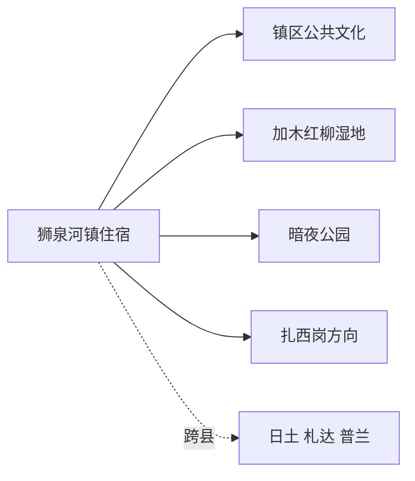
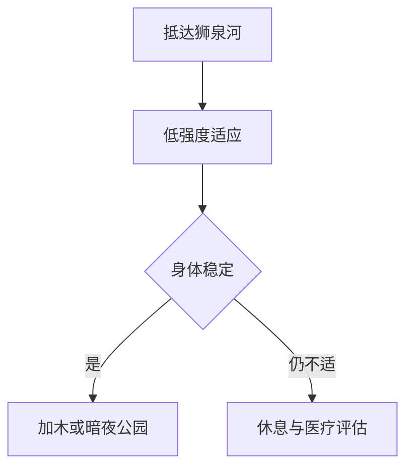

# 狮泉河旅行指南

狮泉河是噶尔县城和阿里地区行署驻地，也是 G219 与 G317 的高原补给节点。最实用的安排是先在镇区休息适应，再把加木红柳湿地、暗夜公园或扎西岗方向各自作为半日至一日；神山圣湖、札达土林、班公湖分别属于其他县域和更长线路，需要重新核对证件、车辆与住宿。

## 城市速览

| 项目 | 信息 |
|---|---|
| 核心价值 | 阿里高原适应、地区文化、狮泉河城市生活与噶尔近郊 |
| 建议停留 | 镇区 1–2 天；每条噶尔县远线另留半日至 1 天 |
| 海拔 | 镇区约 4300 米，先休息、低强度活动并观察身体反应 |
| 住宿 | 镇区公共服务集中；跨县线路按下一夜住宿地重新选择 |
| 交通 | 阿里昆莎机场、公路车辆与镇内短途用车 |
| 证件 | 按身份、线路和当期规定确认边境通行与接待要求 |
| 边界 | 天文台科研区、边境管理区、湿地草场、军警与通信设施按管理范围进入 |
| 无障碍 | 镇区部分公共空间可安排；高海拔、坡地与远线设施连续性需确认 |

## 城市格局与游览区域

| 区域 | 适合内容 | 怎么选 |
|---|---|---|
| 镇区 | 适应、补给、河岸公共空间与地区文化 | 抵达首日只安排轻量活动 |
| 加木方向 | 红柳湿地与近郊民俗 | 身体稳定后安排半日 |
| 狮泉河达坂方向 | 暗夜公园与天文科普 | 预约合规接待并配置夜间返程 |
| 扎西岗方向 | 湿地、寺院与遗址线索 | 依据开放、道路和证件选择完整远线 |

## 主要景点

| 景点 | 区域 | 类型 | 核心体验 | 用时 | 环境 | 体力 | 研究价值 | 拥挤 | 优先级 |
|---|---|---|---|---:|---|---|---|---|---|
| 狮泉河镇城市与河岸公共空间 | 镇区 | 高原城市 | 观察阿里行政中心、河谷与生活节奏 | 1–3 小时 | 混合 | 低 | 中高 | 低 | A |
| 阿里地区公共文化场馆 | 镇区 | 文博文化 | 建立阿里历史、地理与多民族文化框架 | 2–4 小时 | 室内 | 低 | 高 | 低 | A |
| 加木红柳湿地公园 | 近郊 | 湿地生态 | 红柳、水草与高原休闲文化 | 2–4 小时 | 室外 | 低至中 | 中高 | 中 | A |
| 阿里暗夜公园 | 狮泉河达坂 | 天文科普 | 合规平台观星与暗夜环境 | 4–8 小时含夜间 | 混合 | 中 | 高 | 中 | B |
| 万岁山正式步道与观景点 | 镇北 | 城市地标 | 俯瞰河谷城镇 | 1–2 小时 | 室外 | 中高 | 中 | 低 | B |
| 扎西岗当期开放文化生态点 | 县域远线 | 湿地与人文 | 噶尔县河谷、寺院和遗址关系 | 半日至 1 天 | 室外为主 | 中 | 高 | 低 | C |

天文台是科研设施，暗夜公园的接待范围与科研台址分开；湿地、草场、遗址和寺院只进入正式开放部分。跨到日土、札达、普兰、革吉等县后，按对应属地重新计算路线。

## 美食与餐饮

| 选择 | 怎么点 | 适合场景 |
|---|---|---|
| 藏式面食、饺子与甜茶 | 先选小份，询问牦牛肉、酥油和乳制品 | 适应日与早餐 |
| 川菜与清真餐 | 选择少油少辣的热菜和汤，尊重清真餐饮习惯 | 多人晚餐与补给 |
| 路餐 | 水、主食、易保存食品分日装袋 | 跨县公路与夜间观星 |

## 经典行程

### 一日镇区适应线
**路线**：住宿 → 镇区公共文化 → 河岸短段。**逻辑**：把首日体力留给适应。**预约锚点**：场馆开放。**休息**：午后长休。**删除条件**：症状加重时停止活动并就医。

### 两日镇区与加木
**路线**：适应日 → 加木红柳湿地 → 镇区。**逻辑**：近郊距离适中。**预约锚点**：道路和开放范围。**休息**：车内分段。**删除条件**：大风、湿地管制或身体不适时保留镇区。

### 两日暗夜科普线
**路线**：白天休息 → 暗夜公园 → 夜间返镇。**逻辑**：为夜间高海拔活动预留睡眠。**预约锚点**：接待、天气和车辆。**休息**：观测前后留在室内。**删除条件**：云量、大风或运营取消时整段删除。

### 三日噶尔县线
**路线**：镇区 → 加木 → 暗夜公园 → 扎西岗择一。**逻辑**：每天只走一个方向。**预约锚点**：证件、属地接待和连续车辆。**休息**：每天午后回撤。**删除条件**：道路或体力不稳时删除最远一日。

### 亲子文化线
**路线**：公共文化场馆 → 河岸短段 → 加木近入口。**逻辑**：以室内科普和短户外为主。**预约锚点**：儿童证件、卫生间、供氧与场馆。**休息**：每小时回到休息点。**删除条件**：儿童出现头痛、呕吐或精神状态变化时立即求助。

### 长者低体力线
**路线**：住宿休息 → 车辆观城 → 室内场馆。**逻辑**：降低爬坡与暴露时间。**预约锚点**：电梯、供氧与落客。**休息**：以住宿地为中心。**删除条件**：基础疾病或不适由专业医疗意见决定后续。

### 跨县出发准备线
**路线**：镇区补给 → 车辆与证件核对 → 次日驶向一个县域。**逻辑**：把准备本身作为半日任务。**预约锚点**：下一夜住宿、油料与检查站要求。**休息**：出发前充分睡眠。**删除条件**：任何关键证件、车辆或住宿未落实时推迟远线。

## 住宿区域

镇中心适合首访与补给，选择时询问供暖、热水、供氧方式、电梯、夜间医疗交通和停车。前往札达、普兰或日土时，按当天可安全抵达的下一座县城重新订房，避免用狮泉河住宿倒推超长往返。

## 市内交通

镇内使用步行与短途车辆；机场位于噶尔县昆莎方向，需要预留高原道路和安检时间。县域及跨县行程使用证照、保险与救援方案明确的车辆，司机工作时长与夜间驾驶纳入路线取舍。

## 不同旅行者须知

| 旅行者 | 怎么安排 |
|---|---|
| 初到高原者 | 抵达首日轻量活动，避免赶路和高强度爬升 |
| 独行者 | 将每日路线、车牌、司机和住宿发给固定联系人 |
| 外籍与特殊证件持有人 | 依据国籍、证件与具体线路向主管部门和合规接待机构确认资格 |
| 摄影者 | 使用正式道路与观景区，边境、军警、机场和天文科研设施遵守拍摄限制 |

## 行前核对

- 核对高原健康准备、医疗点、保险承保与紧急转运条件。
- 核对边境通行证件、检查站、接待单位和每条县域线路的当期要求。
- 核对 G219、G317、机场接驳、大风降雪和夜间道路状态。
- 湿地、草场、遗址、天文科研与边境管理空间使用正式开放入口。

## 来源与更新记录

| 来源 | 支持内容 | 核验日期 |
|---|---|---|
| [阿里地区行署：狮泉河镇](https://www.al.gov.cn/info/1178/129307.htm) | 狮泉河驻地、海拔、交通枢纽与噶尔县资源 | 2026-09-01 |
| [阿里地区文旅局：噶尔县 G219 旅行](https://lyfz.al.gov.cn/info/1772/19541.htm) | 镇区、加木、暗夜公园、扎西岗与行前要求 | 2026-09-01 |
| [噶尔县政府：阿里暗夜公园](https://gaer.gov.cn/info/1026/2044.htm) | 公园位置、功能与天文科普 | 2026-09-01 |
| [噶尔县人民政府](https://www.gaer.gov.cn/) | 属地政务、道路与临时公告入口 | 2026-09-01 |
| [GeoNames 1280003](https://www.geonames.org/1280003/) | 狮泉河固定居民点 | 2026-09-01 |
| [Wikidata Q2279283](https://www.wikidata.org/wiki/Q2279283) | 狮泉河镇实体与行政代码 | 2026-09-01 |

| 日期 | 更新 |
|---|---|
| 2026-09-01 | 首次完成狮泉河旅行研究；明确镇区适应、噶尔县近郊与阿里跨县边界 |
