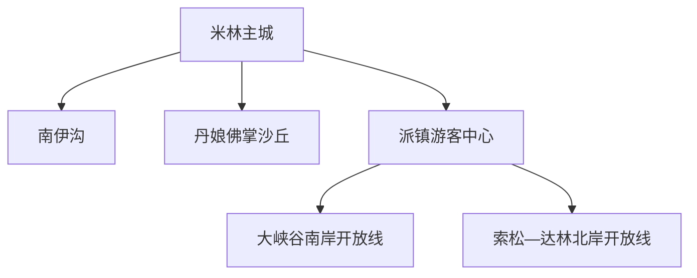
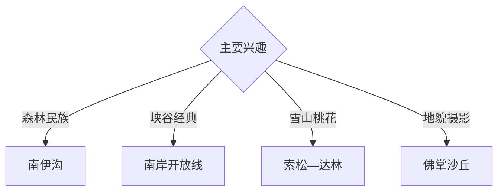

# 米林旅行指南

米林位于雅鲁藏布江中游和喜马拉雅北麓，以南伊沟、雅鲁藏布大峡谷米林段、南迦巴瓦峰、索松村、丹娘佛掌沙丘与珞巴族文化形成高山峡谷路线。固定快照中的 **Mainling / GeoNames 8045774** 对应米林主城；大峡谷南北岸、南伊沟和主城分属不同游览单元。

## 城市速览

| 项目 | 信息 |
|---|---|
| 主线 | 米林主城—南伊沟—大峡谷—索松—佛掌沙丘 |
| 停留 | 主城1天；南伊沟1天；大峡谷2天以上 |
| 住宿 | 主城适合交通与适应，派镇—索松适合峡谷慢游 |
| 交通 | 铁路、航空、公路进入，景区使用正规接驳 |
| 季节 | 春季桃花、夏秋山谷；全年关注高原天气和地灾 |
| 预算 | 景区交通、车辆、换宿与高原应急冗余较高 |

## 城市格局与游览区域

主城与米林站隔雅鲁藏布江相连，承担交通和补给；南伊沟位于另一山谷，派镇是大峡谷入口，索松位于北岸。雅鲁藏布大峡谷国家级自然保护区只在批准线路和正式开放区域提供游览服务，江岸、森林、冰川、高山与边境管理空间分别遵循保护和安全边界。

## 主要景点

| 景点 | 区域 | 类型 | 核心体验 | 用时 | 环境 | 体力 | 研究价值 | 拥挤 | 优先级 |
|---|---|---|---|---:|---|---|---|---|---|
| 南伊沟景区 | 南伊珞巴民族乡 | 森林与民族 | 高山森林、藏医药文化与珞巴文化 | 1天 | 室外 | 中 | 很高 | 旺季中 | A |
| 雅鲁藏布大峡谷南岸开放线 | 派镇方向 | 峡谷与地质 | 峡谷、江流、村落与南迦巴瓦观景 | 1天 | 室外 | 中 | 很高 | 旺季高 | A |
| 索松—达林北岸开放线 | 大峡谷北岸 | 雪山与村落 | 南迦巴瓦、桃花村落和峡谷观景 | 1–2天 | 室外 | 中 | 很高 | 桃花季高 | A |
| 丹娘佛掌沙丘公开点 | 丹娘方向 | 风沙与河谷 | 沙丘、雅鲁藏布江与雪山同框 | 半天 | 室外 | 中 | 高 | 旺季中 | B |
| 米林公共文化空间 | 主城 | 城市史与民族 | 米林、工布与珞巴文化背景 | 2小时 | 室内 | 低 | 高 | 低 | B |
| 雅鲁藏布江主城公开滨水 | 主城 | 河流与城市 | 高原河谷、桥梁与城市格局 | 2小时 | 室外 | 低 | 高 | 低 | B |
| 桃花村落正规游览区 | 大峡谷方向 | 季节与乡村 | 春季桃花、农牧生活和雪山 | 半天 | 室外 | 低中 | 高 | 桃花季高 | B |

## 美食与餐饮

可体验藏面、牦牛肉、酥油茶、青稞食品、石锅菜和林芝菌菇风味。峡谷与山谷路线在正规餐馆、民宿和游客中心补给；野生菌选择正规餐饮并确保充分烹熟。

## 经典行程

### 主城适应线
**路线**：公共文化空间—雅鲁藏布江公开滨水—主城休整。**逻辑**：抵达日适应海拔并建立区域背景。**预约锚点**：身体状态与场馆。**休息**：主城多次安排。**删除条件**：明显不适时直接休息或就医。

### 南伊沟一日线
**路线**：主城—南伊沟正式入口—开放栈道与文化点—返城。**逻辑**：以完整一天观察森林和珞巴文化。**预约锚点**：景区开放、证件和天气。**休息**：游客中心。**删除条件**：封闭、暴雨或道路管制时顺延。

### 大峡谷南岸线
**路线**：派镇游客中心—正规观光车—南岸批准线路—返程。**逻辑**：使用景区服务完整观察峡谷。**预约锚点**：门票、观光车和开放。**休息**：游客中心与正式停靠点。**删除条件**：地灾、火险或景区管制时取消。

### 索松北岸线
**路线**：派镇—索松—达林开放段—正规住宿。**逻辑**：以换宿获得雪山晨昏和村落慢游。**预约锚点**：道路、住宿和北岸开放。**休息**：正规民宿。**删除条件**：道路或北岸关闭时改南岸线。

### 佛掌沙丘线
**路线**：主城或派镇—丹娘公开观察点—雅江河谷—返程。**逻辑**：用半天观察风沙与河流地貌。**预约锚点**：道路、风力和开放。**休息**：正规服务点。**删除条件**：大风、沙尘或临时封控时取消。

### 桃花季村落线
**路线**：主城—正式开放桃花村落—公共观景点—返程。**逻辑**：在花期选择一组村落慢游。**预约锚点**：花期、交通和村落接待。**休息**：正规接待点。**删除条件**：错过花期时改峡谷地质线。

### 四日组合线
**路线**：首日主城适应；次日南伊沟；第三日大峡谷南岸；第四日索松或佛掌沙丘。**逻辑**：森林、峡谷和雪山分日。**预约锚点**：天气、景区、车辆与住宿。**休息**：主城和派镇方向分段住宿。**删除条件**：三天时删第四日。

## 住宿区域

米林主城适合铁路、机场接驳和高原适应；派镇及索松正规住宿便于大峡谷晨昏游览。订房核对资质、供暖、热水、停车、氧气服务与道路取消后的退改，桃花季提前安排。

## 市内交通

米林站、林芝米林机场和公路服务市域，到发点并不在同一位置，按车次航班预留接驳。南伊沟、派镇—索松、佛掌沙丘分属不同方向；雨季按滑坡、落石、山洪和抢险管制调整，景区内部使用批准观光线路。

## 不同旅行者须知

初到高原者先在主城适应；自然旅行者分日安排南伊沟与大峡谷；亲子与长者选择景区观光车和低强度停靠点；摄影者按天气选择索松与佛掌沙丘。自然保护区未开放区域、冰川高山、江中与陡岸、森林防火区、边境管理空间、居民住宅和农牧生产地保留明确限制。

## 行前核对

- 核对南伊沟、大峡谷南北岸与佛掌沙丘开放。
- 核对高反、降雨、地灾、森林防火与江水情况。
- 核对证件、景区观光车、正规车辆和住宿退改。
- 核对米林站、机场、派镇和索松之间的实际接驳。

## 来源与更新记录

| 来源 | 支持内容 | 核验日期 |
|---|---|---|
| [林芝市人民政府：西藏米林的春天](https://www.linzhi.gov.cn/linzhi/xwzx/202504/33e2a5543f11435e84ad1c744cb38918.shtml) | 米林景点体系、铁路与城市空间 | 2026-09-03 |
| [西藏文旅厅：雅鲁藏布大峡谷开放边界公告](https://wlt.xizang.gov.cn/xccx/lytg/202512/t20251209_513221.html) | 大峡谷南北岸批准线路与保护边界 | 2026-09-03 |
| [GeoNames 8045774](https://www.geonames.org/8045774/) | Mainling 固定人口点与米林主城位置 | 2026-09-03 |
