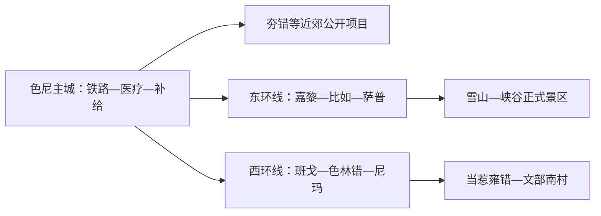
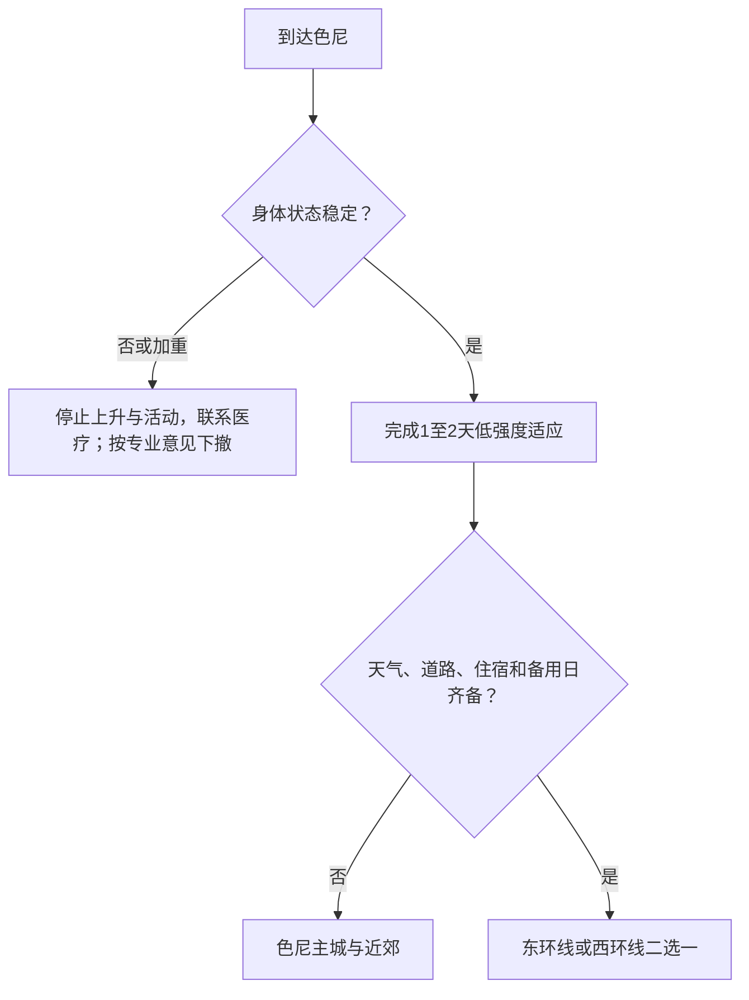

# 那曲旅行指南

那曲是以色尼主城为交通和医疗补给中心、向羌塘高原数十万平方公里展开的高海拔地级市。城市周边适合先安排适应与文化体验，纳木错北岸、色林错、当惹雍错、萨普和嘉黎峡谷属于不同县域的长途项目，需要按数日公路旅行而非市区景点处理。

## 城市速览

| 项目 | 信息 |
|---|---|
| 旅行主线 | 色尼主城、羌塘文化与锅庄、夯错湿地星空，以及按条件选择的东西环线 |
| 建议停留 | 到达与适应 1–2 天；主城周边 2–3 天；远环线 5–8 天以上 |
| 住宿基地 | 色尼主城用于铁路、医疗和补给；远线在县城或合规经营点分段住宿 |
| 步行强度 | 动作本身多为低至中，但平均海拔超过 4500 米会显著提高负担 |
| 主要天气 | 缺氧、强紫外线、严寒、大风、雷暴、冰雹、暴雪、冻土道路与昼夜温差 |
| 预约核心 | 医疗适宜性、住宿供氧条件、车辆、景区开放、保护地与返程 |
| 边界重点 | 羌塘保护地、野生动物栖息地、湖岸、牧场、寺院和边境区域分别管理 |
| 无障碍 | 高海拔本身是主要门槛；场馆、住宿供氧与车辆落客须逐项确认 |

## 城市格局与游览区域

那曲市法定代码 `540600`，市政府驻色尼区；GeoNames `1280517` 与 Wikidata `Q1012460` 对应那曲城市实体。旅行空间分为色尼主城、主城近郊、东部嘉黎—比如方向与西部班戈—申扎—尼玛方向。远线单日车程长、海拔高、补给稀疏，应按环线项目设置备用日。

| 区域 | 旅行价值 | 怎么安排 |
|---|---|---|
| 色尼主城 | 到达适应、文化、补给、医疗与交通 | 先留 1–2 个低强度日 |
| 主城近郊 | 羌塘草原、夯错湿地与星空正式项目 | 身体与天气稳定时半日至一日 |
| 东环线 | 嘉黎峡谷、比如萨普与唐蕃古道方向 | 5 天以上分段公路旅行 |
| 西环线 | 纳木错北岸、色林错、尼玛与当惹雍错 | 5–8 天以上并设置备用日 |

## 主要景点

| 景点 | 所在区域 | 类型 | 核心看点 | 建议用时 | 室内/室外 | 体力 | 预约难度 | 天气敏感度 | 适合旅程 |
|---|---|---|---|---|---|---|---|---|---|
| 色尼主城文化场馆与公共空间 | 色尼区 | 城市文化 | 羌塘文化、地方历史与主城生活 | 半日至 1 天 | 混合 | 低 | 中高 | 中 | A |
| 夯错暗夜星空湿地公园当期开放区 | 色尼近郊 | 湿地与星空 | 湿地鸟类、草原与暗夜环境 | 半日至 1 天 | 室外 | 中 | 高 | 极高 | B |
| 纳木错圣象天门正式景区 | 班戈县 | 高原湖泊 | 纳木错北岸、湖山关系与地质景观 | 1 天含长途 | 室外 | 中至高 | 极高 | 极高 | B |
| 色林错公开观察点 | 班戈—申扎方向 | 湖泊与湿地 | 大型高原湖泊、鸟类与开阔地貌 | 1 天含长途 | 室外 | 中 | 极高 | 极高 | B |
| 萨普景区 | 比如县 | 雪山与冰川 | 雪山群、冰川湖与高山地貌 | 1–2 天含接驳 | 室外 | 高 | 极高 | 极高 | C |
| 当惹雍错—文部南村正式游览区 | 尼玛县 | 湖泊与村落 | 高原湖泊、村落文化与古象雄线索 | 1–2 天含接驳 | 室外为主 | 中至高 | 极高 | 极高 | C |

那曲远线穿过自然保护地、野生动物栖息地和牧业生产空间。观景使用国省干道、正式景区、公共观察点与合规住宿；与野生动物保持距离，给迁徙和繁殖活动让行。湖岸冰面、湿地滩涂、无人区便道和未开放冰川不作为自由进入路线。

## 美食与餐饮

| 类型 | 适合场景 | 份量 | 过敏与饮食提示 | 怎么选 |
|---|---|---|---|---|
| 藏面与汤类 | 主城早餐或简餐 | 一人份 | 麸质、肉汤、葱蒜和盐 | 先选清淡小份，保持规律进食 |
| 牦牛肉菜肴 | 主城正餐 | 一人或共享 | 牛肉、乳制品和较高盐分 | 选熟制、来源清楚的餐馆 |
| 糌粑与酥油茶 | 文化体验与补给 | 小份试食 | 青稞、乳制品和咖啡因 | 先少量尝试，按个人耐受选择 |
| 远线简餐 | 县城或合规住宿点 | 一人份 | 脱水食品、高盐与食物保存 | 以热食、清洁饮水和包装食品为主 |

## 经典行程

### 到达适应一日路线

**路线**：住宿办理 → 充分休息 → 近距离用餐 → 色尼主城低强度公共空间

- **串联逻辑**：把第一天用于观察身体反应和建立补给点。
- **预约锚点**：住宿供氧条件、当地医疗点与次日车辆。
- **休息安排**：以室内休息为主，减少负重和快速行走。
- **时间不足时**：删除游览，仅完成休息与补给。

### 两日色尼路线

**第 1 天**：到达—休息—主城短段 
**第 2 天**：一处文化场馆—午休—天气允许时近郊公开项目

- **串联逻辑**：先适应再增加活动，始终保留返回主城的余量。
- **预约锚点**：场馆、近郊项目、车辆和医疗联系。
- **休息安排**：每日午后长休，不连续赶场。
- **时间不足时**：第二天只保留主城场馆。

### 羌塘文化路线

**路线**：色尼文化场馆 → 午餐 → 当期开放的锅庄、赛马或格萨尔文化活动

- **适用条件**：活动正式发布且个人身体状态稳定。
- **预约锚点**：活动时间、实名规则、交通与座席。
- **休息安排**：观看为主，参与运动量按身体反应调整。
- **时间不足时**：保留一座场馆或一场活动。

### 风雪天气路线

**路线**：住宿地 → 近距离室内场馆 → 午餐 → 返回休息

- **适用条件**：城市交通正常；暴雪、大风或道路预警时留在安全室内。
- **预约锚点**：场馆临时开放、供暖、交通和退改。
- **休息安排**：减少户外等候和夜间移动。
- **时间不足时**：只保留住宿休息。

### 亲子路线

**路线**：在专业医疗意见支持且完成适应后，选择色尼一座文化场馆 → 午休 → 住宿附近短段

- **串联逻辑**：把儿童健康、保暖与休息置于景点数量之前。
- **预约锚点**：医疗适宜性、住宿供氧、场馆和车辆儿童安全。
- **休息安排**：上午短时活动，午后返回住宿。
- **时间不足时**：只保留休息，不加入近郊。

### 低体力路线

**路线**：车辆门到门到达一座主城场馆 → 午餐长休 → 返回住宿

- **适用条件**：专业医疗意见支持高海拔旅行，身体状态稳定。
- **预约锚点**：供氧、轮椅、落客、急救联系和退改。
- **休息安排**：全日只有一个参观点。
- **时间不足时**：改为住宿内休息。

### 东西环线延伸路线

**路线**：色尼补给 → 选择东环线或西环线之一 → 县城和合规住宿分段 → 返回色尼或规划出口

- **适用条件**：至少 5–8 天、专业车辆、备用日、身体适应、天气与保护地规则全部落实。
- **预约锚点**：逐日住宿、燃油、景区、道路、通信和救援方案。
- **休息安排**：每日单一主目的地，天黑前到店。
- **时间不足时**：整条环线取消，改为色尼主城与近郊。

## 住宿区域

| 区域 | 优点 | 取舍 | 适合人群 | 核对项 |
|---|---|---|---|---|
| 色尼主城 | 医疗、补给、铁路和通信相对完整 | 高海拔仍是核心风险 | 所有首访者、适应日 | 供氧、供暖、楼层、电梯、急救和退改 |
| 县城正规住宿 | 支撑远环线分段 | 服务与医疗能力差异大 | 有组织远线旅行 | 海拔、供氧、供暖、餐饮、通信和停车 |
| 景区合规住宿 | 接近日出或远端景区 | 天气和补给容错低 | 专业车辆与深度游 | 合法经营、救援、燃油、保暖和退改 |

## 市内交通

| 场景 | 怎么做 | 行前核对 |
|---|---|---|
| 铁路到达 | 那曲站转车辆到色尼住宿，首日不直接赶远线 | 车次、站前接驳、住宿供氧和夜间到达 |
| 色尼主城 | 出租或正规车辆门到门，步行保持缓慢 | 叫车、供暖、道路和医疗点 |
| 东西环线 | 使用熟悉高原道路的正规车辆，逐日规划补给 | 路况、燃油、备胎、通信、救援和驾驶时长 |
| 冬季与肩季 | 增加备用日并缩短单日里程 | 暴雪、结冰、大风、道路封闭和住宿停运 |

严重头痛、静息呼吸困难、意识异常、行走不稳或症状持续加重时，应立即停止活动并寻求医疗帮助；下撤、吸氧和后续处置按专业人员意见执行。便携氧气与药物不能替代逐步适应、医疗评估和及时下撤。

## 不同旅行者须知

| 旅行者 | 推荐做法 | 重点核对 |
|---|---|---|
| 独行 | 以色尼为基地并共享每日计划 | 医疗联系、通信、车辆、住宿与回报机制 |
| 亲子 | 出发前获得专业医疗意见，主城低强度慢游 | 年龄健康、供氧、保暖、儿童座椅和退改 |
| 长者与慢病旅行者 | 由专业医疗人员评估适宜性，保留可随时下撤方案 | 心肺状况、药物、供氧、急救与保险 |
| 摄影 | 选择正式观察点并减少负重 | 强紫外线、严寒电池、无人机、野生动物和边境 |
| 自驾 | 结伴、白天行驶、每日单一方向 | 高原驾驶经验、燃油、备胎、通信和救援 |

## 行前核对

- 那曲文旅与景区：东西环线、活动、景区开放、住宿与道路。
- 医疗机构与专业人员：个人高海拔适宜性、慢病用药和应急方案。
- 西藏气象、交通、林草与应急信息：暴雪、大风、雷暴、道路和保护地。
- 中国铁路 12306：那曲站车次、携带物品和退改。

## 来源与更新记录

| 来源 | 支持内容 | 核验日期 |
|---|---|---|
| [西藏文旅厅：极地那曲](https://wlt.xizang.gov.cn/xccx/lytg/202606/t20260624_546772.html) | 平均海拔、色尼交通与主要旅游资源 | 2026-09-01 |
| [西藏自治区政府：那曲东西环线](https://www.xizang.gov.cn/xwzx_406/dsdt/202509/t20250907_498859.html) | 东西环线空间、萨普、色林错与当惹雍错 | 2026-09-01 |
| [西藏自治区文化和旅游厅：高原反应应对](https://wlt.xizang.gov.cn/xccx/lytg/202607/t20260708_549151.html) | 高原适应、症状识别与及时医疗处置 | 2026-09-01 |
| [Wikidata Q1012460](https://www.wikidata.org/wiki/Q1012460) | 那曲市实体对齐 | 2026-09-01 |
| [GeoNames 1280517](https://www.geonames.org/1280517/) | 固定那曲城市点 | 2026-09-01 |
| [西藏自治区气象局](http://xz.cma.gov.cn/) | 气象预警 | 2026-09-01 |

| 日期 | 更新 |
|---|---|
| 2026-09-01 | 首次完成色尼适应日、羌塘文化和东西环线研究，并建立高海拔健康、保护地与长途公路边界。 |
