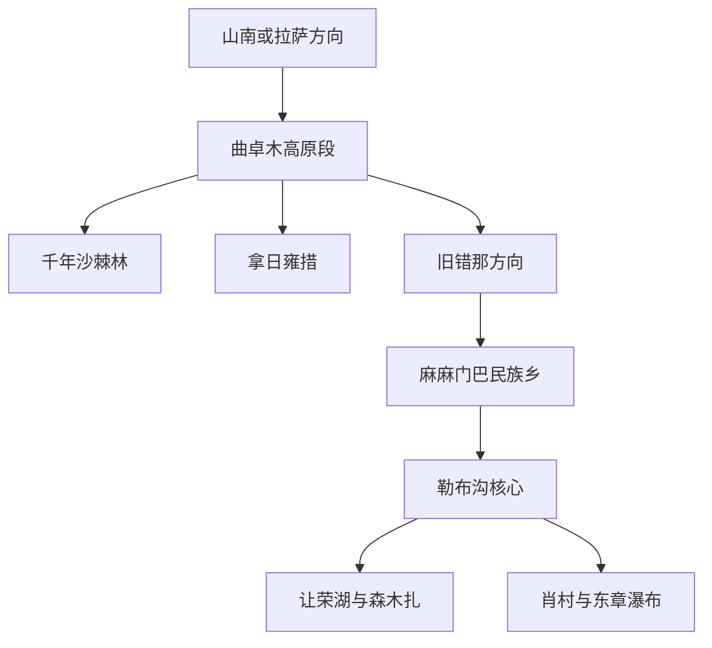
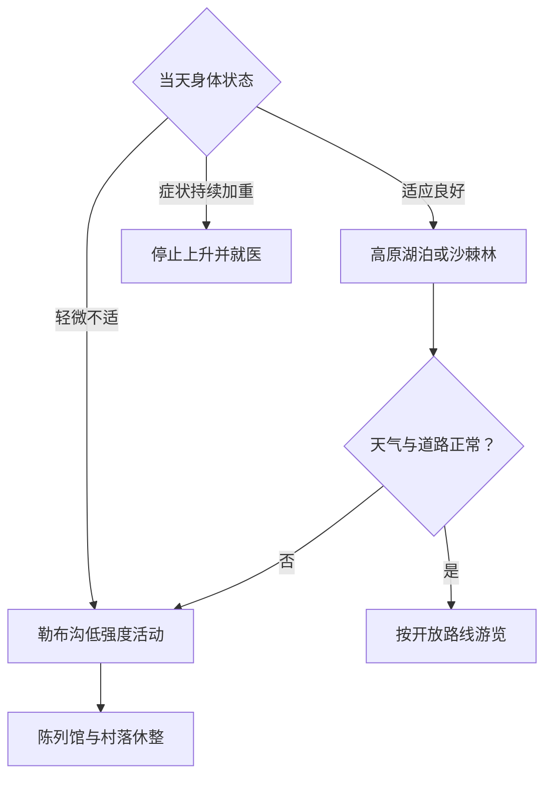

# 错那旅行指南

错那是山南市代管的边境县级市，行政区域从北部高海拔湖泊、沙棘林和旧错那方向跨越山地，延伸到以麻麻门巴民族乡为政府驻地的勒布沟。旅行应先办妥适用于本人证件和线路的边境手续，再按海拔把北部高原与较低海拔的勒布沟分日。固定快照中的 **Xoixar / GeoNames 8059273** 保留“错那县”旧称；2023 年撤县设市后原行政区域整体承接为错那市，因此该点可审计映射到现行县级市。

> 建议停留：3–4 天，另计往返山南或拉萨时间  
> 旅行关键词：勒布沟、门巴文化、高原湖谷  
> 主要体力：中等步行，高海拔段体感可显著增加  
> 最近研究：2026-09-03

## 城市速览

| 项目 | 旅行信息 |
|---|---|
| 主要旅行价值 | 在同一县级市内观察高原湖泊、沙棘林、亚高山峡谷和门巴族社区的垂直变化 |
| 建议停留 | 3 天覆盖曲卓木—拿日雍措、勒布沟核心与一条瀑布线；4 天可放慢高原适应和社区参观 |
| 较舒适季节 | 春末至秋初更适合道路旅行和峡谷植被观察，具体花期、降雨和道路状态逐次核对 |
| 预算特点 | 中高；合规车辆、边境手续、远距离公路和有限住宿是主要成本 |
| 步行强度 | 中等；栈道、石阶与短徒步并存，高海拔让同等距离更费力 |
| 主要天气风险 | 高原反应、低温、大风、强紫外线、暴雪、强降雨、落石和道路中断 |
| 独行旅行 | 适合通过合规接待与正规车辆完成，行程、证件和住宿提前闭合 |
| 亲子旅行 | 以勒布沟村落、陈列馆和短段瀑布线为主，北部高海拔湖区按儿童适应情况取舍 |
| 长者与低体力旅行 | 先在较低海拔勒布沟停留，以车辆观景和短段步道替代连续爬升 |
| 无障碍信息 | 山地村落、瀑布步道和高原自然点设施差异大，连续通行需向接待单位逐点确认 |

## 城市格局与游览区域

2023 年错那撤县设市后，原错那县行政区域整体承接，市政府驻麻麻门巴民族乡。北部曲卓木、拿日雍措等点位海拔较高，勒布沟的麻麻、勒、贡日、吉巴等门巴民族乡沿峡谷分布，植被和体感明显不同。两部分通过山地公路连接，适合在勒布沟连续住宿两晚，把到达日和返程日都留出道路缓冲。

| 区域 | 主要内容 | 游览特点 | 与其他区域的关系 |
|---|---|---|---|
| 曲卓木高原段 | 千年沙棘林、温泉项目与山地公路 | 海拔高，适合作为进出错那的半日段 | 与拿日雍措组合后再进入勒布沟 |
| 拿日雍措方向 | 高原湖泊、雪山与草地 | 风大、海拔高、停留时间受身体反应影响 | 放在适应状态较好且天气稳定的白天 |
| 旧错那方向 | 高原城镇、湿地与道路补给 | 连接北部高原和勒布沟 | 关注新旧驻地、住宿和服务位置变化 |
| 麻麻—勒布沟核心 | 市政府驻地、村落、陈列馆和峡谷 | 海拔相对较低，住宿与餐饮较集中 | 适合作为连续两晚住宿基点 |
| 让荣—森木扎方向 | 湖泊、瀑布、栈道与森林 | 徒步段和湿滑路面较多 | 从麻麻往返，安排完整白天 |
| 肖村—东章方向 | 村落、山谷和瀑布 | 边境管理与道路条件优先 | 适合作为最后一日的确认开放路线 |

错那市的法定范围与游客可进入范围是两个层次。边境管理、军事设施、未开发线路、自然保护地核心区和现场封控区域保留明确限制；所有移动使用开放道路与获准游线。

## 主要景点

优先级用于安排时间：**A** 为首访核心，**B** 为按兴趣补充，**C** 为高海拔、远线或开放条件更强的目的地。同一景区内部瀑布和栈道以路线节点记录。

### 高原北部与勒布沟

| 景点 | 区域 | 类型 | 主要看点 | 建议用时 | 室内外 | 体力 | 预约风险 | 天气影响 | 优先级 |
|---|---|---|---|---:|---|---|---|---|---|
| 勒布沟景区公开游线 | 麻麻—勒布沟 | 峡谷与社区 | 森林、溪流、门巴村落和垂直气候 | 1–2 天 | 室外 | 中 | 高 | 高 | A |
| 门巴民俗陈列馆 | 勒布沟 | 文化展陈 | 门巴族历史、生活与地方文化 | 1–2 小时 | 室内 | 低 | 中 | 低 | A |
| 让荣湖公开游览区 | 勒布沟 | 湖泊与山谷 | 湖面、森林与峡谷环境 | 2–3 小时 | 室外 | 中 | 中高 | 高 | B |
| 岗亭瀑布公开步道 | 勒布沟 | 瀑布与森林 | 溪谷、瀑布和木栈道 | 1.5–3 小时 | 室外 | 中 | 中 | 高 | B |
| 森木扎景区公开段 | 勒布沟 | 森林与溪谷 | 河谷植被、滨水步道和山景 | 2–4 小时 | 室外 | 中 | 中 | 高 | A |
| 张国华将军前线指挥部旧址公开区 | 勒布沟 | 历史与红色遗址 | 边防历史和当代国门文化 | 1–2 小时 | 混合 | 低中 | 中 | 中 | B |
| 仓央嘉措行宫相关公开参观点 | 勒布沟 | 历史与文化 | 地方历史叙事和建筑环境 | 1–2 小时 | 混合 | 低中 | 中 | 中 | B |
| 曲卓木千年沙棘林景区 | 曲卓木 | 森林与高原生态 | 高海拔沙棘林、河谷和生态观察 | 2–4 小时 | 室外 | 中 | 中 | 高 | A |
| 拿日雍措开放观景点 | 北部高原 | 高原湖泊 | 湖面、雪山与高原尺度 | 2–4 小时 | 室外 | 中高 | 高 | 很高 | C |
| 东章瀑布确认开放游线 | 肖村方向 | 瀑布与山谷 | 高差瀑布和边境村落环境 | 半天 | 室外 | 中 | 高 | 高 | C |

门巴村落是居民生活和文化传承空间。通过当地公开活动、陈列馆和正式接待理解具体社区，拍摄人物、住宅、仪式和手工艺过程前先征得同意；服饰体验与表演以社区自愿和公开经营为前提。

## 美食与餐饮

勒布沟的正规民宿、农家乐和餐馆适合寻找门巴家常菜、藏餐、勒布茶与本地食材；北部高原路段餐饮点更少，可提前准备水、易消化食物和保温用品。具体菜单随接待条件变化，点餐时说明辣度、肉类、乳制品和过敏原需求。

| 菜品或餐饮类型 | 常见区域 | 一个人用餐与常见份量 | 风味、过敏原与饮食限制 | 排队风险与替代方法 |
|---|---|---|---|---|
| 门巴家常菜 | 勒布沟正规接待点 | 常按桌配餐，独行提前沟通小份 | 肉类、菌菇和调味方式按当天食材变化 | 预订住宿时一并确认用餐 |
| 藏式汤面或面食 | 麻麻、沿线餐馆 | 一人份友好 | 面筋、肉汤和香料可询问 | 作为抵达日快捷正餐 |
| 酥油茶与奶茶 | 村落和住宿点 | 小份试饮更容易适应 | 含乳制品，咸甜与浓度有差异 | 可改选勒布茶或热水 |
| 糌粑等谷物主食 | 藏餐接待点 | 适合补充能量 | 青稞、乳制品或糖的搭配需确认 | 与汤面、米饭互为替代 |
| 勒布茶与本地茶饮 | 勒布沟 | 适合作为文化体验和伴手礼 | 购买时看产地、包装和保存说明 | 在正规商店或合作社选择 |

## 经典行程

### 一日经典路线

**路线**：麻麻门巴民族乡 → 门巴民俗陈列馆 → 勒布沟公开村落 → 森木扎短段。

- **串联逻辑**：一天集中在勒布沟核心，以较低海拔住宿地为起点，先理解文化语境，再进入峡谷自然段。
- **预约锚点**：边境手续、陈列馆开放和景区接待。
- **休息安排**：麻麻的正规住宿、餐饮和游客服务点。
- **时间不足时**：保留陈列馆与一个村落公共区，森木扎缩短或删除。

### 两日城市路线

**第 1 天**：曲卓木沙棘林 → 拿日雍措开放观景点 → 进入勒布沟住宿。  
**第 2 天**：门巴民俗陈列馆 → 让荣湖 → 岗亭瀑布或森木扎。

- **串联逻辑**：第一天从高原北部向较低海拔峡谷移动，第二天留在勒布沟，形成清晰的垂直景观变化。
- **预约锚点**：车辆、道路、拿日雍措开放和勒布沟住宿。
- **休息安排**：第一天每个高海拔点短停观察身体反应，第二天回麻麻午休。
- **时间不足时**：拿日雍措与沙棘林二选一；第二天保留陈列馆和森木扎。

### 三日深度路线

**第 1 天**：山南方向抵达 → 曲卓木沙棘林 → 勒布沟。  
**第 2 天**：让荣湖 → 历史旧址 → 门巴民俗陈列馆 → 森木扎。  
**第 3 天**：肖村公开区 → 东章瀑布确认开放段 → 返程或继续住宿。

- **串联逻辑**：把高原公路、勒布沟核心和边境村落分日，给证件、天气和身体状态留出调整空间。
- **预约锚点**：第三日边境管理、道路与开放游线。
- **休息安排**：勒布沟连续住宿两晚，第二天下午安排长休息。
- **时间不足时**：删除第三日整条远线，第二日保留文化与森林核心。

### 雨雪天气路线

**路线**：住宿地休整 → 门巴民俗陈列馆 → 正规室内文化活动 → 就近餐饮。

- **适用条件**：仅在主管部门确认道路和场馆正常时采用；暴雪、强降雨、落石或道路管制时原地避险并服从交通安排。
- **预约锚点**：道路、场馆、供电通信和住宿延住。
- **休息安排**：整日围绕同一住宿点活动。
- **时间不足时**：保留陈列馆，所有跨沟移动延后。

### 亲子或低体力路线

**亲子路线**：麻麻村公共区 → 门巴民俗陈列馆 → 森木扎平缓短段 → 住宿休息。  
**低体力路线**：车辆到达陈列馆 → 村落公共区短段 → 公开观景点 → 返回住宿。

- **减负方式**：亲子线减少临水和连续台阶，把北部高海拔湖区作为可选项；低体力线用车辆连接节点，并以海拔反应决定停留时长。
- **预约锚点**：接待单位、车辆、步道开放与医疗点位置。
- **休息安排**：麻麻连续住宿，午间回房休息。
- **时间不足时**：两条路线都保留陈列馆和村落短段。

### 勒布沟自然一日路线

**路线**：麻麻 → 让荣湖公开区 → 岗亭瀑布 → 森木扎 → 返回麻麻。

- **适用条件**：天气稳定、步道开放且前一晚休息良好时执行。
- **预约锚点**：景区开放、车辆和每段步道状况。
- **休息安排**：游客服务点、正规餐饮和沿线许可休息区。
- **时间不足时**：在岗亭瀑布与森木扎中选择一处完整游览。

### 曲卓木与高原湖泊路线

**路线**：北部进城方向 → 曲卓木沙棘林 → 拿日雍措开放观景点 → 旧错那方向补给 → 勒布沟住宿。

- **适用条件**：已完成必要适应、无明显高原不适，且道路、风雪和湖区开放状态稳定。
- **预约锚点**：边境手续、车辆、道路和拿日雍措开放范围。
- **休息安排**：沙棘林与旧错那方向的正规服务点，湖边停留控制在身体可承受范围。
- **时间不足时**：优先沙棘林，拿日雍措整段删除并直接进入勒布沟。

## 住宿区域

| 区域 | 优点 | 缺点 | 适合人群 | 交通特点 |
|---|---|---|---|---|
| 麻麻门巴民族乡 | 市政府驻地，进入勒布沟各线方便 | 旺季床位有限，服务仍在发展 | 首访、多日旅行和低海拔休整者 | 适合连续住两晚，减少行李搬运 |
| 勒布沟正规民宿区 | 接近森林、村落和地方餐饮 | 隔音、供暖、热水和网络条件需逐家确认 | 社区文化、摄影和慢旅行者 | 预订时同步确认车辆到达与停车 |
| 曲卓木方向 | 便于北部高原景点和温泉项目 | 海拔较高，接待点与医疗条件较少 | 已适应高海拔且需分段行车者 | 作为过渡住宿而非默认首晚 |
| 山南泽当 | 医疗、补给和交通选择更多 | 往返错那需要长距离公路 | 需要前后缓冲和高原适应者 | 出发前后各留一晚更稳妥 |

## 市内交通

| 场景 | 建议与取舍 | 行前需要重查的内容 |
|---|---|---|
| 从山南或拉萨抵达 | 采用合规旅行接待、正规包车或当期公共交通，白天完成长距离山路 | 证件、班次、检查点、道路和住宿确认 |
| 北部高原到勒布沟 | 预留海拔变化、检查和天气缓冲 | 风雪、落石、施工、加油与通信 |
| 勒布沟内部 | 车辆连接村落和景点，公开步道分段游览 | 步道开放、桥涵、水位与返程时间 |
| 边境村落方向 | 出发前向主管部门或接待单位确认线路许可 | 可达村落、摄影、检查与临时封控 |
| 自驾 | 由熟悉高原和边境规则的合规人员驾驶，准备应急物资 | 车辆手续、燃油、备胎、救援和夜间限行 |

## 不同旅行者须知

| 旅行维度 | 可行条件 | 主要取舍 | 需额外核对 |
|---|---|---|---|
| 独行旅行 | 通过有资质接待方闭合证件、车辆和住宿 | 临时拼车与改变路线的弹性较小 | 接待资质、紧急联系人和每日签到 |
| 亲子旅行 | 以勒布沟低强度文化与自然路线为主 | 高海拔、临水和山路增加照护压力 | 儿童证件、医疗建议和安全设施 |
| 长者或低体力旅行 | 在勒布沟慢住，以车辆观景替代连续徒步 | 长时间公路和海拔变化仍有负担 | 血氧、用药、落客点和供氧条件 |
| 无障碍需求 | 选择陈列馆、新建服务点和车辆可达位置 | 村落、瀑布和自然步道连续通行有限 | 无障碍卫生间、坡道和陪同安排 |
| 摄影旅行 | 在获准公共区域拍摄峡谷、村落和高原湖泊 | 边境、军事和居民隐私边界明确 | 无人机、长焦、三脚架与商业拍摄规则 |
| 预算有限 | 通过小团共享合规车辆并连续住宿 | 证件与长距离交通仍是基础成本 | 费用包含项、取消和道路中断退改 |
| 晚出发或紧凑行程 | 抵达后只做住宿地短段活动 | 山路不适合压缩为夜间赶路 | 日落、检查点、道路和住宿保留时间 |
| 特殊天气或自然条件 | 延住同一住宿地，按预警调整路线 | 风雪、暴雨和地灾可能造成多日变化 | 气象、交通、应急与接待方通报 |

## 行前核对

| 核对事项 | 为什么需要重查 | 建议核对时间 | 官方入口 |
|---|---|---|---|
| 边境旅行手续 | 国籍、证件、居住身份和具体线路决定所需材料 | 订交通前及出发前 | [国家移民管理局](https://www.nia.gov.cn/)、[错那市人民政府](https://www.cuona.gov.cn/) |
| 景区和村落开放 | 勒布沟、湖泊、瀑布和边境村落可能分区管理 | 确定路线后及出发前一日 | [西藏自治区文化和旅游厅](https://wlt.xizang.gov.cn/)、[山南市人民政府](https://www.shannan.gov.cn/) |
| 道路与车辆 | 长距离高原道路受施工、风雪、落石和检查影响 | 出发前三日及当天 | [西藏自治区交通运输厅](https://jtt.xizang.gov.cn/) |
| 高原健康 | 个人基础病、上升速度和症状变化影响行程 | 订行程前及每天出发前 | [西藏自治区卫生健康委员会](https://wjw.xizang.gov.cn/) |
| 天气与地质风险 | 高原天气、暴雪、强降雨和道路灾害具有时效性 | 出发前三日及当天 | [西藏自治区气象局](http://xz.cma.gov.cn/)、[西藏自治区应急管理厅](https://yjt.xizang.gov.cn/) |

## 来源与更新记录

### 主要来源

| 来源 | 类型 | 支持内容 | 核验日期 |
|---|---|---|---|
| [西藏自治区民政厅：米林、错那撤县设市公告](https://mzt.xizang.gov.cn/zxzx/mzyw/202304/t20230404_349269.html) | 自治区主管部门 | 原行政区域承接、县级市身份和麻麻门巴民族乡驻地 | 2026-09-03 |
| [山南市政府：错那旅游名县建设发布会](https://www.shannan.gov.cn/zwgk/xwfbh/202512/t20251225_162069.html) | 地级市政府 | 勒布沟核心、曲卓木沙棘林、浪坡与当前接待设施 | 2026-09-03 |
| [西藏自治区文化和旅游厅：错那旅行攻略](https://wlt.xizang.gov.cn/xwzx_69/wlyw/dsdt/202207/t20220719_314636.html) | 自治区文旅部门 | 曲卓木、拿日雍措、勒布沟景点、食宿和边境安全 | 2026-09-03 |
| [西藏自治区文化旅游产业发展规划（2025—2035 年）](https://swt.xizang.gov.cn/xxgk/zzqwj/202505/W020250512593477495771.pdf) | 自治区规划 | G219 与错那市勒布沟在自治区旅游廊道中的位置 | 2026-09-03 |
| [GeoNames 8059273](https://www.geonames.org/8059273/) | 固定开放数据 | Xoixar／错那县旧名人口点与现行市域映射锚点 | 2026-09-03 |

### 更新记录

| 日期 | 更新内容 |
|---|---|
| 2026-09-03 | 首次完成错那撤县设市映射、资料研究与路线整理 |
