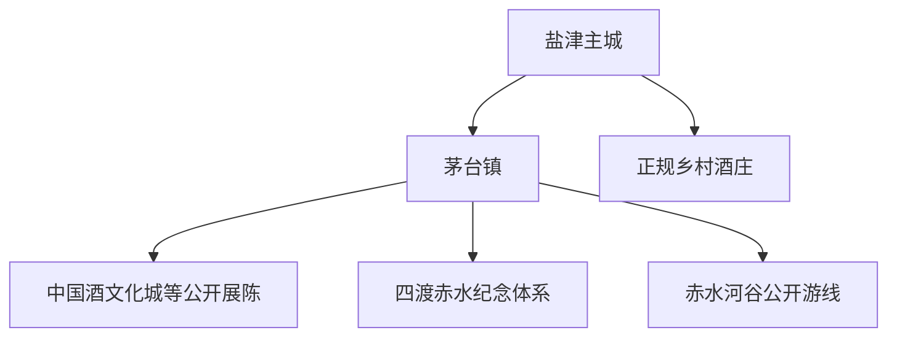
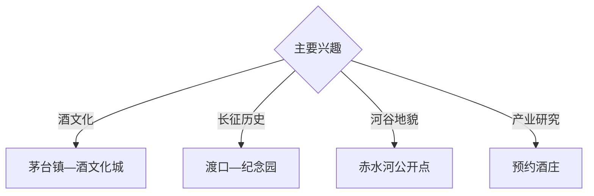

# 仁怀旅行指南

仁怀位于赤水河中游，以盐津主城、茅台镇酱香酒文化、红军四渡赤水遗址、赤水河谷和乡村酒庄形成酒旅、红色历史与河谷旅行体系。固定快照中的 **Renhuai / GeoNames 11608592** 对应现行县级市；茅台镇与盐津主城是两个住宿和游览单元。

## 城市速览

| 项目 | 信息 |
|---|---|
| 主线 | 盐津主城—茅台镇—酒文化展陈—四渡赤水遗址—河谷乡村 |
| 停留 | 主城与茅台镇2天；红色或乡村酒庄另留1天 |
| 住宿 | 盐津便于综合接驳；茅台镇适合夜景与早间慢游 |
| 交通 | 遵义转公路为常用方式，河谷远线宜正规车辆 |
| 季节 | 春秋舒适；夏季关注暴雨山洪，节庆期提前订房 |
| 预算 | 车辆、讲解、演出、酒庄预约和住宿是主要增量 |

## 城市格局与游览区域

盐津承担行政、交通和综合住宿；茅台镇集中酒文化、红色遗址和赤水河夜景，乡村酒庄按预约分布。酒厂生产线、仓储区、危险化学品区域、赤水河航道与行洪空间、文物保护范围按正式接待和管理边界进入。

## 主要景点

| 景点 | 区域 | 类型 | 核心体验 | 用时 | 环境 | 体力 | 研究价值 | 拥挤 | 优先级 |
|---|---|---|---|---:|---|---|---|---|---|
| 茅台镇历史文化街区公开区 | 茅台镇 | 古镇与产业 | 河谷城镇、酱香文化与夜景 | 半天 | 混合 | 中 | 很高 | 节假日高 | A |
| 中国酒文化城等公开展陈 | 茅台镇 | 博物馆与工业文化 | 酿造历史、工艺知识和行业发展 | 2–3小时 | 室内 | 低 | 很高 | 预约制 | A |
| 红军四渡赤水纪念园公开区 | 茅台镇 | 红色与历史 | 渡口、长征史和河谷地形 | 2–3小时 | 混合 | 中 | 很高 | 节假日中高 | A |
| 杨柳湾等公开街巷 | 茅台镇 | 街巷与城市 | 老街、地方生活和建筑肌理 | 1–2小时 | 室外 | 中 | 高 | 晚间高 | B |
| 赤水河谷正规观景点 | 河谷 | 河流与地貌 | 峡谷、水文、桥梁和酒镇格局 | 半天 | 室外 | 中 | 高 | 中 | A |
| 预约制正规酒庄 | 市域乡镇 | 产业与品鉴 | 酿造展陈、品牌故事和合规品鉴 | 半天 | 混合 | 低 | 高 | 预约制 | B |
| 盐津主城公共文化空间 | 盐津 | 城市与文博 | 地方史、城市生活与综合休整 | 2–3小时 | 混合 | 低 | 中 | 中 | B |

## 美食与餐饮

茅台镇酱香酒文化可与合马羊肉、豆花、黔北家常菜和盐菜风味组合。品鉴安排由非饮酒同行或正规车辆承接返程；选择明码标价、来源清晰的酒类商品和餐饮场所。

## 经典行程

### 茅台镇经典线
**路线**：街区—酒文化公开展陈—赤水河观景点—夜景。**逻辑**：用一天建立酒镇历史和空间框架。**预约锚点**：展馆与交通。**休息**：镇区游客服务点。**删除条件**：高温时把街巷移至傍晚。

### 酒文化深度线
**路线**：酒文化城—正规酒庄展厅—合规品鉴—返程。**逻辑**：从历史、工艺到产业形成完整认识。**预约锚点**：酒庄接待。**休息**：展馆或正规餐饮。**删除条件**：企业无接待时保留公共展陈。

### 四渡赤水线
**路线**：纪念园—渡口公开区—红色文化展陈—河谷观察。**逻辑**：以史料和地形理解长征行动。**预约锚点**：场馆开放。**休息**：纪念园服务点。**删除条件**：高水位或岸线管制时保留室内展陈。

### 赤水河谷线
**路线**：茅台镇—正规观景点—乡镇公共空间—返程。**逻辑**：以车辆串联河谷地貌和聚落。**预约锚点**：道路与天气。**休息**：正规服务点。**删除条件**：暴雨、山洪、落石或道路管制时取消。

### 盐津主城线
**路线**：公共文化空间—主城餐饮—城市公园。**逻辑**：用半天补充仁怀城市日常。**预约锚点**：场馆开放。**休息**：盐津。**删除条件**：时间有限时优先茅台镇。

### 低酒精参与线
**路线**：酒文化展陈—红色纪念园—河谷观景—黔北餐饮。**逻辑**：以历史和地貌替代品鉴环节。**预约锚点**：展馆。**休息**：游客中心。**删除条件**：雨天压缩户外段。

### 三日组合线
**路线**：首日盐津与茅台镇；次日酒文化和红色历史；第三日河谷或酒庄。**逻辑**：城市、历史和产业分日。**预约锚点**：酒庄与第三日道路。**休息**：茅台镇连续住宿。**删除条件**：两天时删第三日。

## 住宿区域

盐津主城适合长途抵离和计划调整；茅台镇适合夜景、早间街巷与步行参观。订房核对坡地步行、停车、消防、节庆交通、酒后返程与天气退改。

## 市内交通

仁怀以公路接驳为主，常从遵义机场、高铁站或周边城市转入。盐津与茅台镇之间预留堵车时间；河谷和乡村酒庄选择正规车辆，饮酒行程提前锁定司机。

## 不同旅行者须知

酒文化旅行者提前预约正规展厅；历史旅行者优先四渡赤水纪念体系；亲子和非饮酒者以博物馆、红色历史与河谷地貌为主；长者关注坡地步行。酒厂生产线、仓储和危化区域、赤水河行洪空间、非开放渡口与文物本体保留明确限制。

## 行前核对

- 核对酒文化场馆、纪念园、演出与酒庄预约。
- 核对茅台镇交通管制、停车、住宿和返程车辆。
- 核对酒类消费凭证、品鉴安排与驾驶分工。
- 核对暴雨、山洪、赤水河水位、落石和高温预警。

## 来源与更新记录

| 来源 | 支持内容 | 核验日期 |
|---|---|---|
| [贵州省政协：仁怀全域旅游](https://www.gzszx.gov.cn/gzzxb/web/doc/detail/2448/B2) | 茅台镇、酒文化、红色与乡村旅游格局 | 2026-09-03 |
| [华声报：仁怀酒旅与红色旅游](https://szb.eyesnews.cn/pc/att/202210/17/de6e329b-b3e3-40b7-9c63-69b6ce01711a.pdf) | 酒文化城、杨柳湾、四渡赤水纪念园与赤水河谷 | 2026-09-03 |
| [GeoNames 11608592](https://www.geonames.org/11608592/) | Renhuai 固定人口点与现行县级市映射 | 2026-09-03 |

