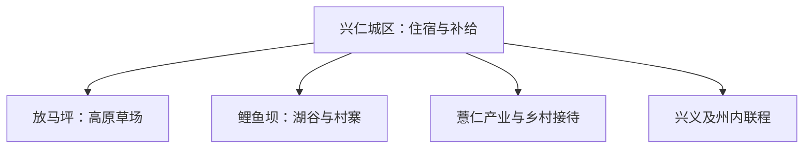

# 兴仁旅行指南

兴仁适合以城区为基地，在放马坪高原草场、鲤鱼坝—鲤鱼湖和薏仁产业乡村之间择一到两条线路。山地天气变化快，各景区分属不同乡镇；把每天的远线控制为一个方向，体验会更完整。

> 建议停留：2 天；加入第二条远线为 3 天<br>
> 旅行关键词：放马坪、鲤鱼坝、薏仁米、高原草场、苗族村寨、山地避暑<br>
> 主要体力：城区低至中等；草场与村寨为中等<br>
> 最近研究：2026-08-13

## 城市速览

| 项目 | 旅行信息 |
|---|---|
| 主要旅行价值 | 从高原草场、湖谷村寨和薏仁产业认识黔西南山地县级市 |
| 建议停留 | 1 天可选放马坪；2 天增加城区和鲤鱼坝；3 天再选一条乡村线 |
| 较舒适季节 | 春秋和夏季避暑各有特点，草场、花期和水景状态随季节变化 |
| 预算特点 | 城区住宿中等，远线车辆和景区项目是主要支出 |
| 步行强度 | 草场、湖岸和村寨有坡度，适合分段而非连续赶路 |
| 主要天气风险 | 雷暴、短时强降雨、山洪、雾、强风和冬季低温 |
| 独行旅行 | 城区生活便利，远线提前锁定正规车辆与返程 |
| 亲子旅行 | 草场和村寨可选短线，先核骑乘、游乐与水边年龄规则 |
| 长者与低体力旅行 | 选择车辆可达观景点，减少草坡和临水长距离步行 |
| 无障碍信息 | 城区新建空间相对易调整；草场、村寨和湖岸资料有限，设施连续性需向官方确认 |

## 城市格局与游览区域

兴仁市是黔西南布依族苗族自治州代管的县级市，法定代码 **522302**。固定 GeoNames `1788944` 是兴仁主城点；法定实体 `Q1200646` 的 P1566 连接行政记录 `1788939`。前者用于固定队列和定位城区，后者与法定代码用于确定市域范围；兴义、安龙、贞丰等州内县市分别安排。



| 区域 | 主要内容 | 游览特点 | 与其他区域的关系 |
|---|---|---|---|
| 兴仁城区 | 住宿、餐饮、公共文化与交通 | 适合抵达日和雨天 | 是各远线的基地 |
| 放马坪方向 | 高原草场、正式景区项目 | 风、雾、雷雨和坡度影响明显 | 适合完整一日或大半日 |
| 屯脚—鲤鱼坝方向 | 鲤鱼湖、苗寨和乡村景观 | 水边与村落生活并存 | 与放马坪分日安排 |
| 薏仁产业与其他乡村方向 | 正式展示、种植文化和乡村接待 | 项目季节性、预约性较强 | 每次选择一个明确开放点 |

## 主要景点

### 草场、湖谷与城区

| 景点 | 区域 | 类型 | 主要看点 | 建议用时 | 室内外 | 体力 | 预约风险 | 天气影响 | 优先级 |
|---|---|---|---|---:|---|---|---|---|---|
| 放马坪高原草场景区 | 潘家庄—下山方向 | 草场、山地休闲 | 高原草甸、正式观景与当期运营项目 | 5–8 小时 | 室外 | 中 | 高 | 极高 | A |
| 鲤鱼坝—鲤鱼湖景区 | 屯脚镇 | 湖谷、村寨 | 湖泊、苗寨文化和正式生态游览空间 | 4–7 小时 | 室外为主 | 中 | 高 | 高 | A |
| 兴仁市公共文化场馆 | 城区 | 文化馆、展陈 | 地方历史、民族文化与公共展览 | 1.5–3 小时 | 室内 | 低 | 中 | 低 | B |
| 城区公共公园与生活街区 | 城区 | 城市休闲 | 日常生活、薏仁餐饮和低强度步行 | 1–2 小时 | 室外为主 | 低 | 低 | 中 | B |

### 乡村与产业方向

| 景点 | 区域 | 类型 | 主要看点 | 建议用时 | 室内外 | 体力 | 预约风险 | 天气影响 | 优先级 |
|---|---|---|---|---:|---|---|---|---|---|
| 薏品田园或正式薏仁展示空间 | 城区近郊或产业片区 | 农业、产业 | 薏仁米种植加工与当期展陈 | 2–4 小时 | 混合 | 低至中 | 高 | 中 | B |
| 绿荫河等正式乡村旅游点 | 市域乡村 | 村寨、乡村 | 有明确接待范围的村寨文化与田园 | 半天至 1 天 | 室外 | 中 | 高 | 高 | C |
| 海河红色文化公开展示点 | 市域乡镇 | 历史、纪念 | 正式开放的战斗遗址纪念与讲解 | 2–4 小时 | 混合 | 中 | 高 | 高 | C |

草场风电设施、光伏电站、矿区、水库工程、农田生产道路和村民生活空间各有管理边界；旅行选择景区入口、公共道路和明确接待区域。村寨展演是当期文化活动，不概括所有社区的日常生活。

## 美食与餐饮

| 菜品或餐饮类型 | 常见区域 | 一个人用餐与常见份量 | 风味、过敏原与饮食限制 | 排队风险与替代方法 |
|---|---|---|---|---|
| 薏仁米饭、粥或饮品 | 城区及正规餐饮 | 一碗或一份适合独食 | 配方可能含糖、奶、坚果或其他谷物，不宣称治疗作用 | 选择配料清楚的小份产品 |
| 黔西南酸辣家常菜 | 城区 | 小炒可单点，多人更易组合 | 辣椒、发酵酸汤、大豆和花生需询问 | 让店家降低辣度或改清汤菜 |
| 羊肉粉、牛肉粉 | 城区早餐 | 一碗适合独食 | 汤底含肉，辣椒、花生和大豆调料常见 | 早餐高峰换同类粉店 |
| 苗乡饭菜 | 鲤鱼坝等正式接待点 | 套餐多适合分享 | 腌制、酒、猪肉和辣味较常见 | 提前说明忌口并确认明码标价 |

## 经典行程

```mermaid
flowchart TD
    S["先看天气与交通"] --> F{ "草场条件良好" }
    F -->|是| P["放马坪完整一日"]
    F -->|否| C["城区文化与餐饮"]
    P --> D{ "再有一天" }
    C --> D
    D -->|是| L["鲤鱼坝或一条乡村线"]
    D -->|否| X["城区返程"]
```

### 一日经典路线

**路线**：兴仁城区 → 放马坪高原草场 → 景区正式休息区 → 城区

- **串联逻辑**：把交通和天气门槛最高的草场作为唯一主项目，避免跨向鲤鱼坝。
- **预约锚点**：开放、门票、景区交通、风雨预警和返程车辆。
- **休息安排**：在游客中心或正式餐饮区完成午餐，草坡活动分段。
- **时间不足时**：缩短景区内部项目，保留主观景段。

### 两日城市路线

**第 1 天**：放马坪；**第 2 天**：城区文化 → 鲤鱼坝—鲤鱼湖。

- **串联逻辑**：草场与湖谷分日，第二天用城区作为补给转换点。
- **预约锚点**：两景区开放、车辆、村寨活动和住宿。
- **休息安排**：第二天午间在城区或屯脚正式餐饮点休息。
- **时间不足时**：第二天只留城区文化或鲤鱼坝之一。

### 三日深度路线

**第 1 天**：城区；**第 2 天**：放马坪；**第 3 天**：鲤鱼坝或一处正式乡村接待点。

- **串联逻辑**：先了解城市和薏仁产业，再把两个山地方向分开。
- **预约锚点**：场馆、景区、乡村接待、车辆和天气。
- **休息安排**：每天回城区住宿，远线日不安排夜间山路。
- **时间不足时**：先删第 3 天乡村线。

### 雨天路线

**路线**：城区公共文化场馆 → 午餐 → 薏仁主题室内展陈

- **适用条件**：普通降雨且城区道路正常；雷暴、山洪或地灾预警时暂停山地远线。
- **预约锚点**：场馆公告、积水、客运和预警。
- **休息安排**：两处室内空间之间短车接驳。
- **时间不足时**：只留一处确认开放的场馆。

### 亲子或低体力路线

**亲子路线**：城区文化场馆 → 午休 → 放马坪低强度正式项目<br>
**低体力路线**：城区公园 → 薏仁主题展陈 → 坐席晚餐

- **减负方式**：亲子线避开长草坡和高风险项目；低体力线不安排湖岸与村寨长走。
- **预约锚点**：儿童规则、车辆上下客、场馆电梯和项目开放。
- **休息安排**：午间回城区，两条路线都保留提前返程方案。
- **时间不足时**：只保留城区段。

### 远郊一日路线

**路线**：城区 → 鲤鱼坝—鲤鱼湖或一个正式乡村接待点 → 城区

- **适用条件**：道路、接待、天气和返程均已确认；两方向择一。
- **预约锚点**：运营方、村寨接待、车辆、餐饮和山洪预警。
- **休息安排**：在正式服务点午休，天黑前回城区。
- **时间不足时**：整段改为城区文化与餐饮。

## 住宿区域

| 区域 | 优点 | 缺点 | 适合人群 | 交通特点 |
|---|---|---|---|---|
| 兴仁城区 | 餐饮、补给和多方向用车方便 | 到草场、湖谷仍需公路 | 首访、无车与多日旅行者 | 适合连续住宿 |
| 放马坪附近正规住宿 | 靠近草场，可保留早晚时段 | 天气、餐饮和夜间交通更受限 | 草场主题、自驾者 | 先核道路、供暖、停车和退改 |
| 鲤鱼坝正式乡村住宿 | 便于湖谷与村寨体验 | 房量、隔音和设施差异较大 | 乡村慢游者 | 确认消防、热水、夜间前台和返程 |

## 市内交通

| 场景 | 建议与取舍 | 行前需要重查的内容 |
|---|---|---|
| 从铁路或机场进入 | 常经兴义方向铁路或机场再转公路，具体组合按当日班次 | 到发站、机场巴士、跨城客运和末班 |
| 城区移动 | 公交、出租或网约车覆盖生活区 | 线路调整、夜间叫车和施工 |
| 前往放马坪与鲤鱼坝 | 县域客运、景区接驳或正规预约车辆 | 上下客点、返程、司机资质和山路 |
| 自驾 | 适合分散景区 | 雾、强降雨、停车、充电和疲劳驾驶 |

## 不同旅行者须知

| 旅行维度 | 可行条件 | 主要取舍 | 需额外核对 |
|---|---|---|---|
| 独行旅行 | 城区生活与正规车辆可闭环 | 远线留足返程余量 | 末班与运营联系方式 |
| 亲子旅行 | 选短草场线和有服务点的项目 | 临水、骑乘和山地活动增加照看 | 年龄、护具和保险 |
| 长者或低体力旅行 | 车辆到达核心观景点，城区午休 | 草坡、湖岸和村寨石路仍有负担 | 接驳、座椅和入口坡度 |
| 无障碍需求 | 优先城区新建场馆 | 草场、村寨与湖岸连续动线资料不足 | 设施连续性需向官方确认 |
| 摄影旅行 | 草场、湖谷与村寨可分主题 | 无人机、商业拍摄和社区肖像需遵守规则 | 天气、日出时段和许可 |
| 特殊天气 | 城区室内路线可替代 | 雷暴、雾和山洪影响远线 | 气象、地灾与景区公告 |

## 行前核对

| 核对事项 | 为什么需要重查 | 建议核对时间 | 官方入口 |
|---|---|---|---|
| 放马坪与鲤鱼坝开放 | 项目、交通和季节活动会调整 | 购票前及到访前一日 | [兴仁市人民政府](https://www.gzxr.gov.cn/) |
| 跨城与县域交通 | 兴义门户和远线末班影响行程 | 出发前一周及当天 | [黔西南州人民政府](https://www.qxn.gov.cn/) |
| 天气与地灾 | 山地雷暴、雾和强降雨具有时效性 | 出发前三日及当天 | [贵州省气象局](http://gz.cma.gov.cn/) |
| 乡村接待 | 活动、讲解、餐饮和住宿并非每日固定 | 排入路线前 | [兴仁市人民政府](https://www.gzxr.gov.cn/) |

## 来源与更新记录

### 主要来源

| 来源 | 类型 | 支持内容 | 核验日期 |
|---|---|---|---|
| [兴仁市人民政府](https://www.gzxr.gov.cn/) | 市政府 | 属地公告、景区、交通与公共服务入口 | 2026-08-13 |
| [黔西南州人民政府](https://www.qxn.gov.cn/) | 州政府 | 兴仁与州内城市边界、区域交通和文旅入口 | 2026-08-13 |
| [贵州广播电视台兴仁旅行资料](https://www.gzstv.com/a/8c51eba07bd44a6db3279980b8c400ac) | 省级媒体 | 放马坪、鲤鱼坝和薏仁主题旅行线索 | 2026-08-13 |
| [贵州省生态环境厅项目资料](https://sthj.guizhou.gov.cn/zwgk/zdlyxx/hjpj/jsxmslgs/202505/P020250609566353372956.pdf) | 省级政府资料 | 鲤鱼湖、放马坪和矿业项目之间的空间边界 | 2026-08-13 |
| [民政部行政区划查询](https://dmfw.mca.gov.cn/xzqh/getList?code=52&trimCode=true&maxLevel=3) | 政府开放接口 | 兴仁市代码 `522302` 与黔西南州关系 | 2026-08-13 |
| [GeoNames 1788944](https://www.geonames.org/1788944/xingren.html) | 开放地理数据 | 固定主城点坐标与 PPLA3 分类 | 2026-08-13 |
| [Wikidata Q1200646](https://www.wikidata.org/wiki/Q1200646) | 开放知识图谱 | 法定兴仁市实体、代码与行政记录 | 2026-08-13 |
| [中国铁路 12306](https://www.12306.cn/) | 铁路运营方 | 当前站名、车次与售票核对入口 | 2026-08-13 |

### 更新记录

| 日期 | 更新内容 |
|---|---|
| 2026-08-13 | 首次完成兴仁独立旅行研究；贵州省与兴义页仅保留州内行政关系和换城边界。 |
