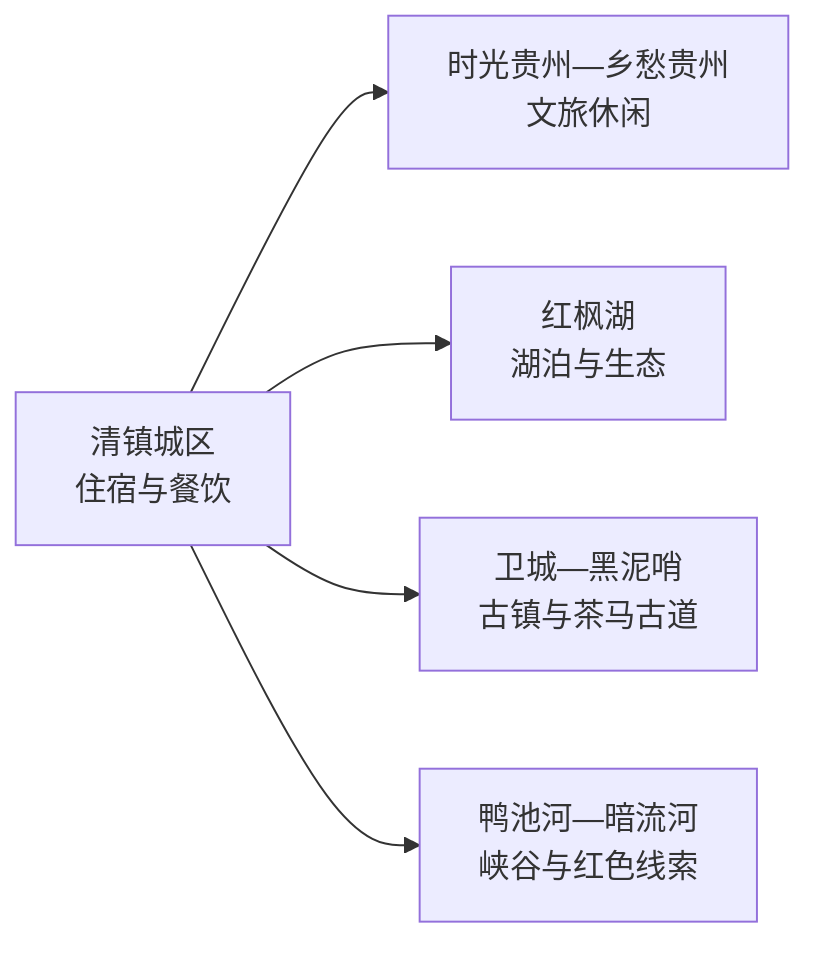
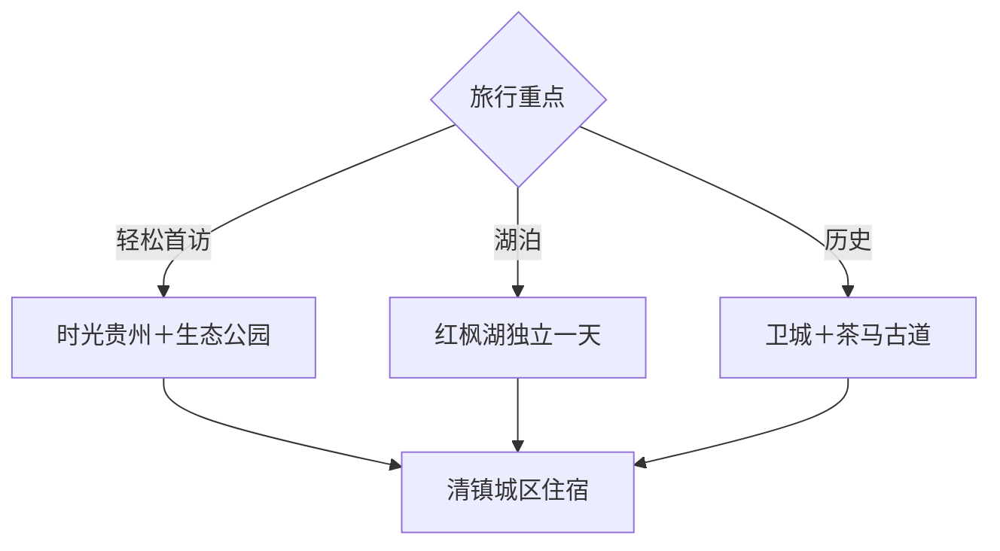

# 清镇旅行指南

清镇位于贵阳西部，红枫湖、百花湖之间的湖城格局，配合时光贵州、乡愁贵州、茶马古道和苗族非遗，适合安排 1–2 天。城区与时光贵州交通较方便，湖区、卫城和鸭池河方向更分散；先选湖城休闲或历史乡村主题，再安排车辆。

本页绑定法定清镇市的 GeoNames 行政记录 **1797609**。该记录位于固定 `cities500` 快照外，只计入法定县级市覆盖。

## 城市速览

| 项目 | 信息 |
|---|---|
| 主线 | 红枫湖—时光贵州—乡愁贵州—茶马古道—苗族非遗 |
| 停留 | 1 天看城区与文旅小镇；2 天加入湖区或卫城乡村 |
| 住宿 | 清镇城区方便餐饮和贵阳联程；湖区住宿重视交通与退改 |
| 交通 | 贵阳方向可公路或市域公共交通接驳，远点以预约车辆为主 |
| 季节 | 春季赏花、夏季避暑、秋季户外舒适；雨季核对水情和地灾 |
| 预算 | 公共街区成本较低，湖区车辆、温泉和活动体验增加支出 |

## 城市格局与游览区域

红枫湖横跨较大水域且兼具风景名胜、水源和生态功能，旅行使用正式景区、村寨和公共岸线。百花湖部分区域属于贵阳市其他行政区，跨区联程按实际入口判断；贵阳中心城区不是清镇市内景点。

## 主要景点

| 景点 | 区域 | 类型 | 核心体验 | 用时 | 环境 | 体力 | 预约风险 | 天气影响 | 优先级 |
|---|---|---|---|---:|---|---|---|---|---|
| 红枫湖风景名胜区正式开放区 | 红枫湖镇 | 湖泊与风景名胜 | 高原湖泊、岛岸景观和生态观察 | 半天至1天 | 室外 | 低中 | 高 | 很高 | A |
| 时光贵州 | 城区东部 | 文化旅游街区 | 屯堡意象、地方文化和夜间休闲 | 2–4小时 | 混合 | 低 | 活动时中 | 中 | A |
| 乡愁贵州 | 红枫湖—百花湖之间 | 乡村与文化景区 | 乡愁主题、田园和当期活动 | 2–4小时 | 混合 | 低中 | 高 | 中高 | B |
| 四季贵州 | 城区周边 | 温泉与家庭休闲 | 温泉、水上或季节娱乐项目 | 半天 | 室内外 | 低 | 很高 | 中 | C |
| 清镇红枫生态体育公园 | 城区湖岸 | 公园与运动 | 湖城公共空间、慢行和赛事 | 1.5–2小时 | 室外 | 低 | 低 | 高 | B |
| 黑泥哨茶马古道公开段 | 市域古道 | 古道与文物 | 茶马古道、山地交通史和村落 | 2–3小时 | 室外 | 中 | 很高 | 很高 | A |
| 卫城古镇公开街区 | 卫城镇 | 古镇与屯堡 | 威清卫、镇西卫历史和街巷生活 | 2–3小时 | 混合 | 低中 | 中 | 中 | B |
| 鸭池红军渡口遗址 | 鸭池河方向 | 红色遗址 | 长征历史、峡谷交通和纪念空间 | 2小时 | 室外为主 | 中 | 高 | 很高 | B |
| 大冲村或湖区乡村 | 红枫湖镇 | 乡村与湖岸 | 湖区村落、农业和正式接待体验 | 半天 | 室外为主 | 低中 | 高 | 高 | C |
| 苗族非遗公开活动 | 麦格、流长等方向 | 民族文化 | 古歌、服饰、祭鼓和当期节庆 | 2–4小时 | 混合 | 低 | 很高 | 中 | B |

## 美食与餐饮

清镇可寻找黄粑、辣子鸡、丝娃娃、豆腐圆子、酸汤和贵州米粉。城区一人点粉面方便，辣子鸡与酸汤适合共享；辣椒、折耳根、花生、豆制品、肉类和麸质需求在点餐时说明。

## 经典行程

### 湖城一日线
**路线**：红枫生态体育公园—午餐—时光贵州—夜间街区。**逻辑**：公共湖岸与文化休闲相连。**预约锚点**：活动。**休息**：时光贵州。**删除条件**：降雨时缩短公园段。

### 红枫湖一日线
**路线**：城区—红枫湖正式开放区—湖区午餐—返城。**逻辑**：湖泊作为完整主题。**预约锚点**：入口、游船和车辆。**休息**：正式服务点。**删除条件**：大风、水情或雷雨时取消水上内容。

### 卫城古道线
**路线**：卫城古镇—午餐—黑泥哨茶马古道公开段。**逻辑**：从卫所历史进入古代交通。**预约锚点**：古道开放与车辆。**休息**：卫城镇。**删除条件**：雨天或体力不足时只保留古镇。

### 苗族文化线
**路线**：官方活动场地—非遗展示—村寨餐饮。**逻辑**：按真实节庆和传承活动体验。**预约锚点**：日期与接待。**休息**：正式活动区。**删除条件**：没有当期活动时改时光贵州。

### 雨天休闲线
**路线**：时光贵州室内单元—地方餐饮—四季贵州当期室内项目。**逻辑**：降低户外暴露。**预约锚点**：营业和票务。**休息**：场馆。**删除条件**：暴雨地灾预警时按属地安排暂停出行。

### 亲子低体力线
**路线**：生态体育公园短线—午餐—时光贵州。**逻辑**：步行平缓、退出方便。**预约锚点**：儿童活动。**休息**：街区。**删除条件**：高温时只保留傍晚活动。

### 两日完整线
**路线**：首日湖城—时光贵州，次日红枫湖或卫城古道。**逻辑**：城市休闲与远点主题分日。**预约锚点**：第二日交通和开放。**休息**：连续住城区。**删除条件**：只有一天时保留首日。

## 住宿区域

清镇城区适合贵阳联程、餐饮和叫车。时光贵州周边适合夜间休闲，选择时核对噪声；红枫湖周边住宿适合湖景和乡村体验，并需确认道路、水情、餐饮和退改。

## 市内交通

从贵阳出发按实际铁路、公路或公交入口计算总耗时。红枫湖、卫城、鸭池河和苗族乡村方向分散，预约车辆更稳定。水源保护区、湖面禁航区、古道修缮区、峡谷地灾封控区和工业生产区执行明确限制。

## 不同旅行者须知

湖泊旅行者优先红枫湖正式游线；历史爱好者选卫城和黑泥哨；亲子与低体力旅行者采用公园加时光贵州；民族文化旅行者按活动日预约。雨季把水情、地灾和道路预警作为路线前提。

## 行前核对

- 通过清镇市、贵阳市和贵州文旅渠道核对红枫湖、文旅小镇与古道开放。
- 核对贵阳—清镇公共交通、远点车辆和末班返程。
- 湖区核对水位、大风、雷雨、游船与水源保护要求。
- 苗族节庆、温泉和乡村体验按日期、接待、价格和儿童规则预约。

## 来源与更新记录

| 来源 | 支持内容 | 核验日期 |
|---|---|---|
| [贵州省民政厅：清镇地名故事](https://mzt.guizhou.gov.cn/ztzl/rdzt/gzdmgs/202501/t20250103_86449502.html) | 湖城格局、红枫湖、茶马古道、遗址与文旅景点 | 2026-09-04 |
| [贵州省林业局：红枫湖总体规划](https://lyj.guizhou.gov.cn/xwzx/tzgg/202201/P020220107602929758983.pdf) | 风景名胜区、水域保护与游览规划 | 2026-09-04 |
| [GeoNames 1797609](https://www.geonames.org/1797609/) | 清镇市行政记录与范围 | 2026-09-04 |

