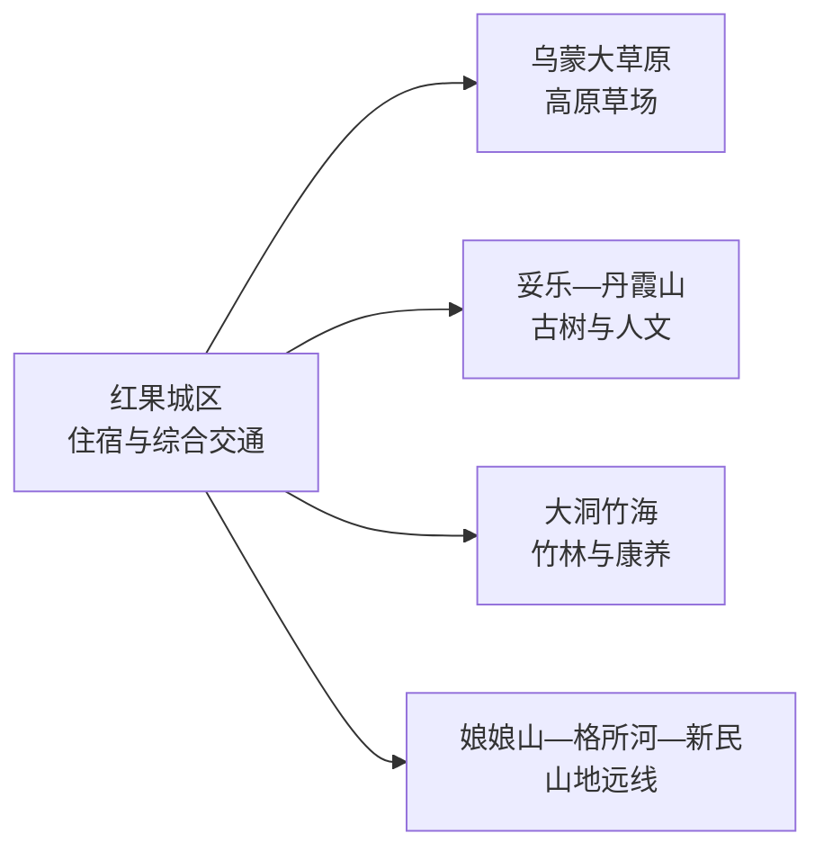
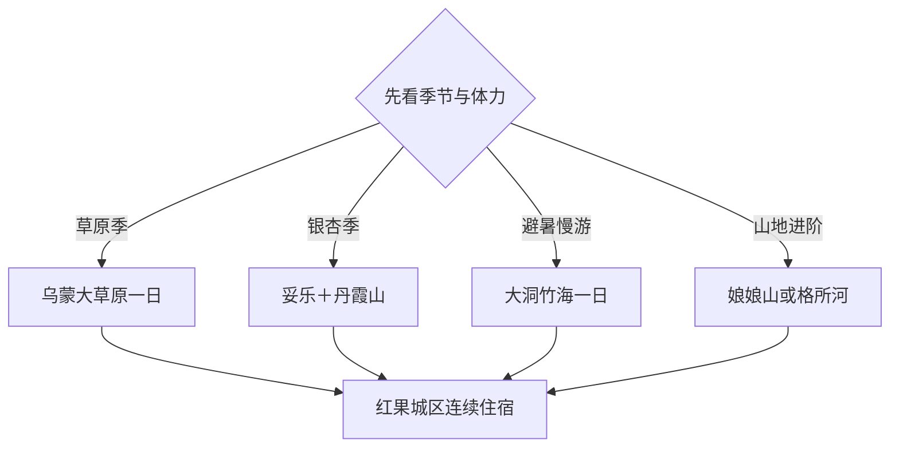

# 盘州旅行指南

盘州位于贵州西部、滇黔交界，旅行资源从红果城区延伸到乌蒙大草原、妥乐古银杏、丹霞山和大洞竹海。各方向之间距离较长，适合住 2–4 天，每天选择一条山地或人文主题线；先看季节与天气，再决定草原、银杏或竹海。

本页绑定法定盘州市的 GeoNames 城市点 **1799007**。该记录位于固定 `cities500` 快照外，只计入法定县级市覆盖。

## 城市速览

| 项目 | 信息 |
|---|---|
| 主线 | 红果城区—乌蒙大草原—妥乐古银杏—丹霞山—大洞竹海 |
| 停留 | 首访 2–3 天；加入娘娘山、格所河或新民梯田共 4 天 |
| 住宿 | 红果城区适合多方向换乘；景区住宿适合日出、避暑或季节景观 |
| 交通 | 盘州站、盘州高铁站与红果城区承担到达；远点以景区接驳或预约车辆为主 |
| 季节 | 春夏看草原，秋季看银杏，夏季竹海避暑；雨雾、凝冻会改变山路条件 |
| 预算 | 城区餐饮较灵活，远点车辆、景区交通和旺季住宿是主要增量 |

## 城市格局与游览区域

红果城区适合作为连续住宿基点。乌蒙大草原、妥乐—丹霞山和大洞竹海分属不同方向，分别安排一天更稳妥；娘娘山、格所河和新民梯田也按实际入口、道路与接待条件单独取舍。草场、林地、峡谷、梯田和矿业生产区域均以正式开放游线为活动范围。

## 主要景点

| 景点 | 区域 | 类型 | 核心体验 | 用时 | 环境 | 体力 | 预约风险 | 天气影响 | 优先级 |
|---|---|---|---|---:|---|---|---|---|---|
| 乌蒙大草原正式开放区 | 乌蒙镇—坪地乡方向 | 高原草场 | 草场、山脊、云海与季节花期 | 1天 | 室外 | 中 | 高 | 很高 | A |
| 妥乐古银杏景区 | 石桥镇 | 古树与村落 | 古银杏群、村落和秋季景观 | 半天至1天 | 室外为主 | 中 | 很高 | 高 | A |
| 丹霞山护国寺公开游线 | 丹霞镇 | 山岳与人文 | 山地景观、寺院和地方历史 | 半天 | 室外为主 | 中高 | 高 | 很高 | B |
| 大洞竹海正式游线 | 竹海镇 | 竹林与乡村 | 大片竹林、竹产业与避暑 | 半天至1天 | 室外 | 中 | 高 | 高 | A |
| 娘娘山景区 | 普古乡方向 | 山地与湿地 | 高原山地、生态景观和康养 | 1天 | 室外 | 中高 | 很高 | 很高 | B |
| 格所河峡谷开放区 | 保基乡方向 | 峡谷与地貌 | 峡谷、河流与山地地貌 | 1天 | 室外 | 高 | 很高 | 很高 | B |
| 新民万亩梯田公开观景点 | 新民镇 | 农业景观 | 梯田、村落与农时变化 | 半天至1天 | 室外 | 中 | 高 | 很高 | B |
| 沙淤景区或乡村公开接待点 | 胜境街道方向 | 乡村休闲 | 花田、村落和季节活动 | 2–4小时 | 室外为主 | 低中 | 高 | 高 | C |
| 盘州三线文化公开展陈 | 红果及周边 | 工业与地方史 | 三线建设、交通和城市发展 | 2–3小时 | 室内为主 | 低 | 高 | 低 | B |
| 红果城区公共空间 | 亦资街道等 | 城市休闲 | 城市生活、餐饮和行程缓冲 | 2–3小时 | 混合 | 低 | 低 | 中 | C |

## 美食与餐饮

盘州可寻找火腿、刺梨制品、羊肉粉、烙锅、荞饭、酸汤和竹笋菜。城区适合安排粉面与小吃，景区方向适合提前确认午餐；火腿和腌制品关注盐分，酸辣度、折耳根、花生及肉类需求在点餐时说明。

## 经典行程

### 乌蒙草原线
**路线**：红果城区—乌蒙大草原正式入口—核心游线—返城。**逻辑**：把高原草场留作完整一天。**预约锚点**：门票、内部交通和车辆。**休息**：游客服务区。**删除条件**：雷暴、大雾、结冰或景区分区关闭时改城区线。

### 妥乐丹霞线
**路线**：妥乐古银杏—村落午餐—丹霞山公开游线。**逻辑**：古树村落与山地人文同向组合。**预约锚点**：银杏季票务、丹霞山开放和车辆。**休息**：妥乐服务点。**删除条件**：旺季交通拥堵时只保留妥乐。

### 大洞竹海线
**路线**：城区—大洞竹海—竹产业或乡村接待点—返城。**逻辑**：用竹林与地方产业组成慢节奏一天。**预约锚点**：入口、体验和午餐。**休息**：正式接待点。**删除条件**：强降雨、山路预警或森林火险管控时改城市活动。

### 娘娘山康养线
**路线**：城区—娘娘山正式入口—景区游线—返城。**逻辑**：高海拔山地单独安排，保留天气余量。**预约锚点**：开放、景区交通和车辆。**休息**：游客中心。**删除条件**：低能见度或体力不足时换沙淤短线。

### 格所河地貌线
**路线**：城区—格所河峡谷开放区—观景游线—返城。**逻辑**：峡谷与地貌集中体验。**预约锚点**：入口、步道和往返车辆。**休息**：景区服务点。**删除条件**：强降雨、山洪或地灾预警时取消。

### 低体力缓冲线
**路线**：红果城区公共空间—地方餐饮—三线文化公开展陈。**逻辑**：减少山路和长距离步行。**预约锚点**：场馆或展陈开放。**休息**：城区商业区。**删除条件**：场馆闭馆时改为城市餐饮与公园短线。

### 三日完整线
**路线**：首日乌蒙大草原，次日妥乐—丹霞山，第三日大洞竹海或城区文化。**逻辑**：三个方向分日，住宿保持在红果城区。**预约锚点**：三天车辆、重点景区和退改。**休息**：每天返城。**删除条件**：压缩为两天时按季节删除一条远线。

## 住宿区域

红果城区适合铁路到达、多方向包车和晚间餐饮。乌蒙大草原周边住宿适合日出、云海和避暑，选择时核对供暖、热水、海拔适应与退改；妥乐及竹海周边适合慢游，餐饮和返程车辆宜提前确认。

## 市内交通

铁路到站后先确认车站到红果城区及住宿地的接驳。草原、古银杏、竹海、娘娘山、峡谷与梯田方向跨度较大，包车或正式景区接驳更适合分日出行。雨季山洪和地灾、冬季凝冻、大雾、森林防火以及矿区运输共同影响道路；景区封控、生产道路和生态保护边界执行属地规则。

## 不同旅行者须知

首次到访者优先乌蒙大草原与妥乐，摄影旅行者按花期、云海和银杏叶色选时段，亲子与低体力旅行者选择竹海短线或城区展陈。山地徒步者把海拔、补给、返程时间和天气窗口一起纳入行程；工业主题参观只进入正式开放的三线展陈或遗产空间。

## 行前核对

- 通过盘州市政府及景区渠道核对乌蒙大草原、妥乐、丹霞山和大洞竹海开放。
- 核对到达车站、城区住宿、景区接驳、包车资质与返程时间。
- 山地方向同步查看雷暴、大雾、凝冻、山洪、地灾和森林火险信息。
- 银杏叶色、草原花期、梯田农时和乡村活动按当年实际状态选择。

## 来源与更新记录

| 来源 | 支持内容 | 核验日期 |
|---|---|---|
| [盘州市旅游与乡村项目资料](https://www.panzhou.gov.cn/zwgk/zcwj/zfwj/202211/t20221122_83614614.html) | 乌蒙大草原旅游节点、相关乡镇与乡村道路背景 | 2026-09-04 |
| [盘州市国土空间总体规划资料](https://www.panzhou.gov.cn/IGI/upload/file/2023/02/03/20230203042111491dog.pdf) | 一城一环、两带六区及妥乐—丹霞山、大洞竹海等空间关系 | 2026-09-04 |
| [GeoNames 1799007](https://www.geonames.org/1799007/) | 盘州市城市点 | 2026-09-04 |
